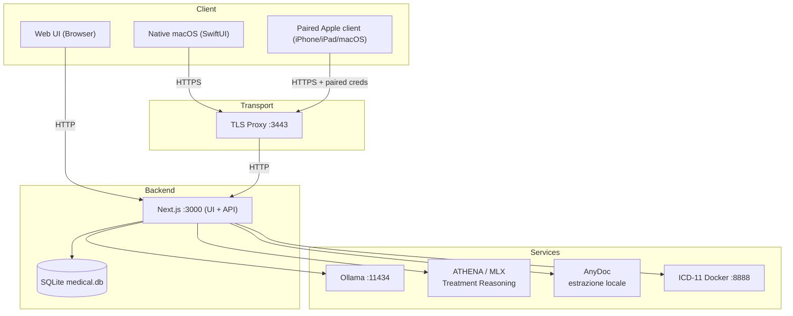

# ARCHITECTURE: MediFlow

Questo documento descrive l'**architettura stabile ad alto livello** di MediFlow.
Deve cambiare raramente: qui ci sono i confini, non i dettagli di implementazione.
Per il resto:

- [docs/walkthrough.md](./docs/walkthrough.md) (end-to-end, web + native)
- [docs/STATE_OF_THE_SYSTEM.md](./docs/STATE_OF_THE_SYSTEM.md) (lettura completa dello stato corrente)
- [docs/topologia-dati-flussi.md](./docs/topologia-dati-flussi.md) (topologia dati + percorsi digitali end-to-end)
- [docs/ARCHITETTURA.md](./docs/ARCHITETTURA.md) e [docs/system_architecture.md](./docs/system_architecture.md) (deep dive)
- [docs/adr/](./docs/adr/README.md) (decisioni architetturali)
- [docs/README.md](./docs/README.md) e [docs/markdown-index.md](./docs/markdown-index.md) (mappa canonica + inventario completo)

---

## 🎯 Obiettivi

- **Local-first / offline-first** di default.
- **Privacy-by-design**: nessuna uscita verso cloud (telemetria, sync, chiamate AI) se non esplicitamente implementata e documentata.
- **Cifratura clinica per campo a riposo**: i campi sensibili devono essere
  cifrati lato client con AES-256-GCM. Il file SQLite, gli identificativi,
  alcuni metadati e i backup non sono tutti coperti da un perimetro
  whole-database verificato.
- **Manutenibilità**: diff minimi, codice chiaro, contratti espliciti.

## ⚠️ Non-obiettivi (per ora)

- Sync completa via internet.
- Modalità server multi-tenant.
- Telemetria/analytics in background.

---

## 🧱 Panoramica del sistema

MediFlow è un **sistema ibrido locale**:

- L'app Next.js fornisce:
  - web UI
  - route API locali
  - overview/stato operativo del nodo locale
  - accesso al database SQLite locale
  - contratto versionato `/api/v1/*`, inclusa la slice `network` paired con read pazienti, write profilo/status e primi read/write diario clinico, terapie, checkup e osservazioni
- Servizi locali opzionali:
  - Ollama per Patient Insight, Smart Import e Document Synthesis
  - ATHENA-R1-Qwen3-8B su MLX per Treatment Reasoning
  - AnyDoc come unica estrazione automatica locale e deterministica degli
    allegati
  - ICD-11 Docker API per ricerca diagnosi (localhost)
  - sidecar locale OpenMed per redaction shadow/benchmark (localhost, non client-facing)
- Strategia client Apple:
  - la web app sul Mac resta la superficie primaria di oggi
  - il bundle macOS Apple/home-base e la base nativa attiva e include il runtime web packaged
  - i client iPhone/iPad paired condividono `MediFlowAppleShared` e il boundary `home-base + /api/v1`, senza accesso diretto al database del Mac
  - `MediFlowCore` e verificato su macOS, Linux e Windows, ma non equivale a tre app desktop complete
- Le integrazioni regionali (`SISS`, `FSE`) restano dentro un boundary esplicito:
  handoff contestuale e percorsi `webapp-assisted` finché non esiste un canale
  qualificato `SSI/A2A` documentato e sostenibile.

Il default resta **local-only sul singolo computer**. Se l'operatore attiva la
modalita `network-home-base`, lo stesso nodo espone anche `/api/v1/network/*`
con pairing esplicito, data plane pazienti read-only-first e write limitati a
lifecycle/profilo paziente, moduli clinici non-AI, prestazioni, protesica e
create documentale manuale per client trusted su LAN.

### Porte locali (default)

| Componente | Default | Note |
| --- | --- | --- |
| Next.js (UI + API) | `http://127.0.0.1:3000` | solo locale |
| TLS proxy (trasporto native) | `https://127.0.0.1:3443` | inoltra verso :3000 |
| Ollama (AI generativa generale) | `http://127.0.0.1:11434` | opzionale; non esegue OCR nel percorso allegati 0.8.5 |
| ATHENA su MLX | processo locale bounded | opzionale; solo Treatment Reasoning, con runner e modello locali configurati |
| AnyDoc | processo figlio locale bounded | unica estrazione automatica degli allegati; nessuna rete e nessun OCR |
| ICD-11 (Docker) | `http://127.0.0.1:8888` | opzionale |
| OpenMed redaction (shadow) | `http://127.0.0.1:18080` | opzionale, non client-facing |

---

## 🔒 Confini di fiducia e modello di sicurezza

### Dati a riposo

- Lo storage autorevole è un **singolo file SQLite** (`medical.db`).
- I campi sensibili sono cifrati **lato client** (browser / client native) prima della scrittura su disco.
- Il file SQLite non è cifrato integralmente: il PIN non viene persistito, ma
  questo non equivale a zero-knowledge sull'intero database.
- Anche gli artifact documentali (`attachments.summarySnapshot`,
  `attachments.parseEvidenceArtifactSnapshot`) sono trattati come dati clinici e
  persistiti cifrati.
- I valori cifrati sono salvati come stringhe nel formato:

```
ENC:<iv_b64>:<cipher_b64>
```

### Confini di autenticazione

MediFlow espone due superfici API:

- **Web API** (`/api/*`):
  - usata dalla UI browser
  - protetta da sessione server
- **Native API** (`/api/v1/*`):
  - usata dai client native
  - deve essere versionata e stabile
  - protetta da **token locale** (trasporto su HTTPS locale via TLS proxy)
- **Network API** (`/api/v1/network/*`):
  - si attiva solo in modalita `network-home-base`
  - resta read-only-first, con write versionati su ciclo di vita paziente (creazione, cestino, ripristino), profilo/status, diario clinico, terapie, checkup, osservazioni, prestazioni e protesica, piu mappatura export-only v0 in un Bundle FHIR R4 `collection` generato lato client (nodo keyless), pre-check FSE locale, guardia di revisione e discovery capabilities/identity/node in dual-auth; nessun claim di conformità completa a profili o ingestione di terze parti
  - i cataloghi (farmaci, esenzioni, terminologia, prestazioni) sono esposti in sola lettura
  - il dominio documentale consente lettura e create manuale cifrato, riferimenti allegato sigillati e compute deterministici senza persistenza; restano esclusi PUT/DELETE paired degli allegati, artifact document-derived, invocazione AI, hard delete remoto, sync e write offline (ADR 0076)
  - disattivare la modalita non revoca i pairing: i token dei client paired
    diventano inerti e il data plane risponde `403 NETWORK_MODE_DISABLED`
    finche la modalita non viene riattivata
  - richiede pairing esplicito del device + sessione operatore valida

> Obiettivo: i client native non devono dipendere da scraping HTML o dettagli interni React/Next.

### Proxy verso servizi locali

Ogni endpoint proxy verso servizi locali deve:
- essere **allowlisted** (solo localhost)
- evitare SSRF e target remoti
- trattare ogni risposta come input non fidato

### Application Services, Fabric e Headless 0.8.5

Gli Application Services host-owned sono gli unici owner delle regole di
dominio, della currentness, dei conflitti, delle transazioni e dell'accesso a
SQLite. Le route Web, i client e gli adapter Headless non accedono direttamente
al database e non duplicano la logica applicativa.

Il candidato sorgente locale 0.8.5 collega quattro capability generative al
Fabric end-to-end:

- Patient Insight;
- Smart Import;
- Document Synthesis;
- Treatment Reasoning.

Gli stati di scope sono espliciti:

| Stato | Perimetro 0.8.5 |
| --- | --- |
| `INCLUDED` | Quattro path Fabric proposal-only; AnyDoc per testo estraibile; route OCR legacy autenticate in `410`; disclosure provider read-only. |
| `VERIFIED_LOCAL` | Evidenza mirata presente nel tree per contratti, production root e crosswalk; la suite integrata finale resta separata. |
| `RELEASE_SCOPE_EXCLUDED` | DeepSeek-OCR 2, provider cloud/configurazione credenziali, modello provider F7 completo e integrazione con host intelligente. |

Ogni caller usa una route autenticata e riceve una proposta con receipt,
provenienza e currentness. Il caller non sceglie provider, modello, endpoint,
venue, prompt o fallback e non può richiedere apply. Il production root
host-owned risolve questi elementi e mantiene lo stadio massimo
`proposal_only`.

Quando configurati, Ollama serve le prime tre capability e ATHENA su MLX serve
soltanto Treatment Reasoning. I due provider hanno lifecycle host-owned
separati e non ereditano stato, grant o fallback l'uno dall'altro. I provider
cloud restano disabilitati.

ATHENA è inclusa solo quando l'host configura sia l'artifact del modello sia un
runner locale. `MEDIFLOW_ATHENA_MLX_GENERATE_BIN` può indicare soltanto un
eseguibile assoluto `mlx_lm.generate`, senza argomenti o shell. In assenza
dell'override, il launcher `uvx` resta offline e fallisce chiuso se la cache
necessaria non è già disponibile. Questo percorso non implica readiness
universale di ATHENA o del runtime MLX generico.

La disclosure provider implementata elenca Ollama e ATHENA come provider
locali. Elenca OpenAI e Anthropic soltanto come righe informative con esecuzione
disabilitata. Il modello provider F7 completo è un requisito post-0.8.5 non
implementato e `RELEASE_SCOPE_EXCLUDED`. Un contratto futuro deve separare
almeno:

- tipo e istanza del provider;
- autenticazione e modello;
- capability, gruppi, binding e allowlist delle funzioni;
- classi di credenziale `local_model`, `api_key`, `provider_oauth` ufficiale e
  `host_subscription`.

Un login consumer o un abbonamento a un prodotto host non costituisce accesso
API o autorizzazione all'inferenza. OpenAI e Anthropic restano non eseguibili
finché non esistono contratto ufficiale, egress esplicito e credenziali
autorizzate. Non sono ammessi OAuth privati o ricostruiti.

La foundation Headless 0.8.5 non espone un runtime agentico generale esterno,
un listener o accesso diretto al database. L'unica eccezione di scrittura
accettata è `mediflow.clinical_diary.append_soap.v1`, con policy
`clinician_confirmed_single_use.v1`. Anche questa operazione passa
dall'Application Service e dal suo owner transazionale; non trasferisce
authority alle altre capability.

Questa architettura distingue due modalità:

1. **Provider dentro MediFlow.** Il Fabric sceglie un provider per una
   capability applicativa MediFlow. I quattro path locali 0.8.5 appartengono a
   questa modalità.
2. **MediFlow dentro un host intelligente.** Un host può, in futuro, invocare
   Application Services governati attraverso un adapter MCP, App o Headless.
   Questa modalità è `RELEASE_SCOPE_EXCLUDED`: il candidato non promette server
   MCP, installer, onboarding o accesso agentico generale.

---

## 🗄️ Flusso dati (alto livello)



---

## 📚 Struttura repository (mappa mentale)

| Path | Responsabilità |
| --- | --- |
| `app/` | pagine Next.js + route handlers |
| `components/` | componenti UI, logica client |
| `lib/` | cifratura, strato DB, Application Services, Fabric, AnyDoc, ICD e auth/session server |
| `drizzle/` | migrazioni SQLite |
| `scripts/` | script avvio, TLS proxy, helper native |
| `native/` | app SwiftUI macOS/iPhone/iPad e core Swift condiviso tri-OS |

---

## 🔌 Contratti che devono restare stabili

- Formato di cifratura e mapping dei campi cifrati (lato client).
- Contratto **native API** (`/api/v1/*`):
  - versionato
  - documentato
  - retrocompatibile all'interno della stessa major
- `local-only` come default e `network-home-base` come opt-in paired/read-only-first con write versionati e capability-scoped; le eccezioni documentali seguono ADR 0076.
- Cancellazione clinica reversibile: il DELETE di pazienti e delle
  sotto-risorse cliniche e un tombstone soft-delete version-guarded; la
  cancellazione fisica passa solo da strumenti amministrativi espliciti e
  audited (vedi [ADR 0066](./docs/adr/0066-patient-soft-delete-lifecycle.md)).
- `patients.documentInsights` puo convivere con artifact documentali piu ricchi, ma gli artifact persistiti restano locali e cifrati.
- La root web `/` apre direttamente il cockpit Kree8 come unica shell ufficiale su
  `main` (vedi [ADR 0060](./docs/adr/0060-kree8-cockpit-live-root-entry.md)); Graphite resta
  riferimento storico per il principio no-selector e nuove sperimentazioni non
  diventano selector runtime persistiti senza workstream e decisione espliciti.
- Principio local-only: nessuna dipendenza cloud di default.
- Boundary SISS/FSE: oggi coordinamento contestuale + percorsi ufficiali; niente claim
  di integrazione regionale nativa certificata fuori dal perimetro documentato.
- Boundary documentale 0.8.5: AnyDoc è l'unica estrazione automatica locale per
  testo estraibile. Immagini e scansioni falliscono chiuse verso review manuale
  e le route OCR legacy, dopo l'autenticazione, rispondono `410`.
  DeepSeek-OCR 2 è `RELEASE_SCOPE_EXCLUDED`: mancano adapter, E2E, benchmark
  sintetico italiano, soglie e ricomposizione verificata con provenienza, hash
  e qualità per pagina. Apple Vision non rientra nel target.
- Boundary Fabric: le quattro capability generative restano
  `proposal_only`; receipt e provenienza non autorizzano apply.
- Boundary Headless: nessun adapter accede direttamente a SQLite. La sola
  append SOAP con policy `clinician_confirmed_single_use.v1` è un'eccezione
  stretta e non crea un canale di scrittura generale.

---

## 🧭 Come si cambiano le scelte architetturali

- Per ogni modifica non banale, scrivi un ADR in `docs/adr/`.
- Mantieni gli ADR brevi e concreti (problema -> opzioni -> trade-off -> decisione -> thin slice).
- Aggiorna:
  - [ARCHITECTURE.md](./ARCHITECTURE.md) solo se cambiano visione stabile o confini
  - [docs/walkthrough.md](./docs/walkthrough.md) se cambia il flusso reale end-to-end
  - [docs/topologia-dati-flussi.md](./docs/topologia-dati-flussi.md) se cambiano percorsi dati, trust boundaries o superfici API
  - [docs/README.md](./docs/README.md) e [docs/markdown-index.md](./docs/markdown-index.md) quando cambiano ownership o mappa documentale
