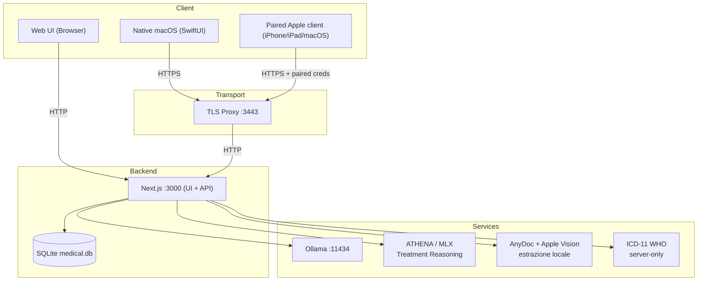

# ARCHITECTURE: MediFlow

L’architettura di MediFlow parte da una scelta: il lavoro ordinario deve
rimanere possibile sulla postazione locale, anche senza intelligenza
artificiale. Dati, servizi applicativi e strumenti opzionali hanno quindi
responsabilità separate. La modularità serve a poter aggiungere una funzione
senza trasferirle il controllo della cartella o rendere necessarie tutte le
altre.

Questo documento conserva i **confini stabili ad alto livello** e deve cambiare
raramente. I dettagli e le prove appartengono ai riferimenti pertinenti:
[walkthrough](./docs/walkthrough.md) per i flussi web e nativi,
[stato del sistema](./docs/STATE_OF_THE_SYSTEM.md) per implementazione e verifiche,
[topologia dei dati](./docs/topologia-dati-flussi.md) per il percorso delle
informazioni. Gli approfondimenti sono in [docs/ARCHITETTURA.md](./docs/ARCHITETTURA.md)
e [docs/system_architecture.md](./docs/system_architecture.md); le decisioni
negli [ADR](./docs/adr/README.md), la mappa in [docs/README.md](./docs/README.md)
e l’inventario in [docs/markdown-index.md](./docs/markdown-index.md).

---

## 🎯 Obiettivi

Il funzionamento **local-first / offline-first** è il punto di partenza, non
una promessa di sincronizzazione o continuità offline universali. Nessuna
uscita verso servizi esterni — telemetria, sincronizzazione o chiamate AI —
può essere introdotta senza implementazione e documentazione esplicite.

I campi clinici sensibili devono essere cifrati lato client con AES-256-GCM
prima della persistenza. Questa protezione per campo non copre integralmente
il file SQLite, gli identificativi, alcuni metadati e tutti i backup con un
perimetro whole-database verificato. La manutenibilità richiede codice chiaro,
contratti espliciti e modifiche circoscritte, che si possano riesaminare.

## ⚠️ Non-obiettivi (per ora)

Non rientrano nel disegno corrente una sincronizzazione completa via internet,
un server multi-tenant o telemetria e analytics eseguiti in background.

---

## 🧱 Panoramica del sistema

MediFlow è un sistema locale ibrido: l’app Next.js fornisce interfaccia web,
route API, stato operativo del nodo e accesso al database SQLite. Il contratto
versionato `/api/v1/*` permette ai client di usare servizi espliciti senza
dipendere dai dettagli della UI. La sua parte `network`, accessibile dopo
pairing, comprende lettura dei pazienti e scritture versionate di
profilo/status, diario clinico, terapie, checkup e osservazioni.

La cartella non dipende dai modelli. Quando configurati, Ollama può servire
Patient Insight, Smart Import e Document Synthesis; ATHENA-R1-Qwen3-8B su MLX
è riservata a Treatment Reasoning. Gli allegati iniziano invece da AnyDoc,
un passaggio deterministico locale: Apple Vision prosegue soltanto sulle
pagine PDF supportate `needsOcr`. Il servizio ICD-11 WHO è un Application
Service accessibile solo dal server, con sidecar locale opzionale nel percorso
0.8.6; OpenMed è un sidecar locale per oscuramento dei dati identificativi (redaction) in shadow/benchmark, non
esposto ai client.

La web app sul Mac è la superficie primaria del perimetro distribuito come
sorgente 0.8.6. Il lavoro sul bundle macOS Apple/home-base comprende il runtime
web confezionato nell’app, ma rimane un seguito nativo separato, non un
installer firmato o notarizzato incluso nella release. I client iPhone/iPad
paired condividono `MediFlowAppleShared` e il contratto `home-base + /api/v1`,
mai un accesso diretto al database del Mac. Le prove di `MediFlowCore` su
macOS, Linux e Windows non equivalgono a tre app desktop complete.

Il default resta **local-only sul singolo computer**. Attivando esplicitamente
`network-home-base`, l’operatore può esporre `/api/v1/network/*` sulla LAN a
client fidati e associati. Il perimetro parte dalla lettura e ammette soltanto
le scritture documentate: ciclo di vita e profilo paziente, moduli clinici
non-AI, prestazioni, protesica e creazione documentale manuale. Cache,
esportazioni e backup seguono i propri percorsi espliciti.

Per `SISS` e `FSE` il confine rimane il passaggio contestuale verso i servizi
ufficiali e i percorsi `webapp-assisted`, finché non esista un canale
`SSI/A2A` qualificato, documentato e sostenibile.

### Porte locali (default)

| Componente | Default | Note |
| --- | --- | --- |
| Next.js (UI + API) | `http://127.0.0.1:3000` | Solo locale. |
| TLS proxy (trasporto native) | `https://127.0.0.1:3443` | Inoltra verso :3000. |
| Ollama (AI generativa generale) | `http://127.0.0.1:11434` | Opzionale; non esegue OCR nel percorso allegati 0.8.5. |
| ATHENA su MLX | processo locale bounded | Opzionale, solo Treatment Reasoning; richiede runner e modello locali configurati. |
| AnyDoc + Apple Vision | processi locali bounded | AnyDoc esegue il primo passaggio; Apple Vision continua soltanto le pagine PDF `needsOcr`, senza rete. |
| ICD-11 WHO | Loopback fisso, solo dal server | Sidecar locale opt-in; il provisioning manuale non è attestato da questa architettura. |
| OpenMed redaction (shadow) | `http://127.0.0.1:18080` | Opzionale, non accessibile dai client. |

---

## 🔒 Confini di fiducia e modello di sicurezza

### Dati a riposo

Il dato autorevole vive in un singolo file SQLite, `medical.db`. Browser e
client nativi cifrano i campi sensibili prima della scrittura su disco; lo
stesso vale per gli artifact documentali `attachments.summarySnapshot` e
`attachments.parseEvidenceArtifactSnapshot`, che sono dati clinici e non
semplici metadati tecnici.

Il PIN non viene persistito, ma il file SQLite non è cifrato integralmente:
non se ne può dedurre una proprietà zero-knowledge dell’intero database.
I valori protetti vengono salvati in questo formato:

```
ENC:<iv_b64>:<cipher_b64>
```


### Confini di autenticazione

Le superfici API hanno tre ruoli distinti. La **Web API** (`/api/*`) serve il
browser e richiede una sessione server. La **Native API** (`/api/v1/*`) serve i
client nativi, deve restare versionata e stabile e richiede un token locale,
trasportato su HTTPS locale tramite TLS proxy.

La **Network API** (`/api/v1/network/*`) esiste operativamente soltanto in
modalità `network-home-base` e richiede sia il pairing esplicito del dispositivo
sia una sessione operatore valida. La lettura resta il punto di partenza;
le scritture versionate sono limitate a creazione, cestino e ripristino del
paziente, profilo/status, diario, terapie, checkup, osservazioni, prestazioni
e protesica.

Il nodo resta privo delle chiavi cliniche. Il client genera un Bundle FHIR R4
`collection` attraverso la mappatura export-only v0, che non attesta la conformità
completa ai profili o l’ingestione da parte di terzi. Completano il perimetro
il pre-check FSE locale, la guardia di revisione e la discovery di capability,
identità e nodo in doppia autenticazione. Farmaci, esenzioni, terminologia e
prestazioni sono cataloghi in sola lettura.

Per i documenti sono ammessi lettura, creazione manuale cifrata, riferimenti
sigillati agli allegati e calcoli deterministici senza persistenza. Restano
esclusi PUT/DELETE paired degli allegati, artifact derivati dai documenti,
invocazione AI, cancellazione fisica remota, sincronizzazione e scritture
offline (ADR 0076). Spegnere la modalità di rete non revoca i pairing:
i token diventano inerti e il data plane risponde `403 NETWORK_MODE_DISABLED`
finché la modalità non viene riattivata.

I client nativi non devono dipendere da scraping HTML o dettagli interni di
React/Next: usano questi contratti, non scorciatoie verso la UI o il database.

### Proxy verso servizi locali

Un proxy non rende fidata la risposta di un servizio. Ogni endpoint deve
ammettere soltanto destinazioni localhost in allowlist, impedire SSRF e target
remoti e trattare ogni risposta come input non fidato.

### Application Services, Fabric e Headless 0.8.5

Le regole di dominio devono avere un responsabile riconoscibile. Nel perimetro
Fabric/Headless 0.8.5 sono i punti di composizione di produzione, o
*production root*, e gli Application Services dell’host a possedere controlli
sulla validità del contesto, conflitti, transazioni e accesso a SQLite. Route
sottili e adapter headless non duplicano queste regole e non aprono il database.
Alcune route Web storiche importano ancora `dbServer`: restano fuori da questa
affermazione generale e non ne costituiscono una prova.

La Fabric è l’impalcatura che rende possibile usare le funzioni intelligenti
solo dove servano. Nel sorgente locale 0.8.5 i quattro percorsi end-to-end sono
Patient Insight, Smart Import, Document Synthesis e Treatment Reasoning.
La tabella conserva il perimetro di quella fase, non lo stato della successiva
pubblicazione 0.8.6.

| Stato | Perimetro 0.8.5 |
| --- | --- |
| `INCLUDED` | Quattro percorsi Fabric con sole proposte; AnyDoc e Apple Vision locale sulle pagine PDF `needsOcr`; selettore guidato e associazione atomica; provider v2 e prova amministrativa `default OFF`; Supervisor locale con figli Web e MCP; planner in sola lettura collegato; F10 end-to-end; registrazione Apple sul dispositivo, con revisione. |
| `VERIFIED_LOCAL` | Evidenze mirate nel tree per contratti, production root e crosswalk; la suite integrata finale resta una prova separata. |
| `NOT_READY` | Credenziali o rete cloud live; installer, onboarding e compatibilità con host MCP esterni; microfono reale e validazione clinica della registrazione; prova terminale sul tree finale di quella fase. |
| `OUT_OF_SCOPE_FOR_0.8.5_NON_BLOCKING` | DeepSeek-OCR 2/CUDA, benchmark di qualifica e disponibilità OCR universale. |

Il chiamante entra da una route autenticata e riceve una proposta con ricevuta,
provenienza e controllo di validità del contesto. Il livello massimo resta
`proposal_only`: provider, endpoint, sede di esecuzione, prompt, fallback e
applicazione non sono scelte libere del chiamante. Per il modello, ADR0129
ammette soltanto preferenze e override opachi risolti contro il catalogo
corrente dell’host; non trasforma il browser in un configuratore arbitrario.

Ollama serve, quando configurato, i primi tre percorsi; ATHENA su MLX soltanto
Treatment Reasoning. I loro cicli di vita sono separati e non si trasferiscono
stato, autorizzazioni o fallback. OpenAI e Anthropic restano `default OFF` e
non sono destinazioni alternative implicite.

ATHENA è inclusa soltanto quando l’host configura sia l’artifact del modello
sia un runner locale. `MEDIFLOW_ATHENA_MLX_GENERATE_BIN` può indicare solo un
eseguibile assoluto `mlx_lm.generate`, senza argomenti o shell. Senza override,
il launcher `uvx` rimane offline e si blocca se la cache necessaria manca.
Questo percorso non attesta disponibilità universale di ATHENA o del runtime
MLX generico.

Provider v2 distingue tipo e istanza del provider, autenticazione e modello,
capability, gruppi, binding e allowlist delle funzioni. Separa inoltre le
classi di credenziale `local_model`, `api_key`, `provider_oauth` ufficiale e
`host_subscription`. OpenAI Responses e Anthropic Messages mantengono i nomi
delle rispettive API: i loro adapter HTTPS ufficiali e la prova amministrativa
Document Synthesis non sono l’integrazione consumer ChatGPT.

Quella prova è riservata agli amministratori e richiede l’intento esatto
`run_synthetic_nonclinical_probe`. Il default resta `OFF`; ogni composizione
richiede ciclo di vita attivo, istanza dell’host, riferimento al segreto e
politiche esplicite di uscita e conservazione. I test usano trasporti simulati,
non attestano credenziali, rete live, account o retention. Login consumer e
abbonamento dell’host non costituiscono accesso API; OAuth privati o ricostruiti
restano vietati. Il canale ChatGPT successivo mantiene i controlli distinti
di ADR0134, senza una nuova qualifica live consumer sul candidato finale.

Il selettore Fabric lavora sulle cinque capability nominate. La discovery
mostra solo profili compatibili; lo smoke usa fixture sintetiche; il binding
si attiva in modo atomico, versionato e reversibile. Scoprire un profilo o
superare uno smoke non qualifica il runtime e non persiste segreti.

Il Supervisor Node locale è il processo padre fidato: avvia Web standalone e
MCP come figli distinti su un canale IPC privato ereditato, mantenendo contesto,
finalità, ambito, durata dei permessi (*lease*), revoca e audit. MCP `stdio` e
Mini condividono catalogo, ricerca terminologica, lettura delle Open Loops
nel paziente autorizzato, proposta follow-up `proposal_only` e interrogazione
semantica circoscritta in sola lettura. Mini nella 0.8.5 era una base CLI
senza callsite del Supervisor di produzione; WUL-696 aggiunge quel raccordo
nelle revisioni successive, senza attestare il completamento clinico generale.
Gli adapter non importano SQLite, non accettano autorità dal chiamante e non
aprono listener propri. Non si dichiarano installer, onboarding universale o
compatibilità con host MCP esterni.

F10 espone via MCP soltanto l’anteprima della transizione
`pending -> completed|cancelled`. La UI Web fidata rilegge la risorsa e richiede
ruolo medico attivo, step-up e gesto specifico per l’operazione; il commit
mantiene CAS, idempotenza, audit e ricevuta atomici. La prova autorizzativa e
la scrittura non attraversano MCP e non sono delegate all’agente.

Restano quindi due modalità: **un provider dentro MediFlow**, scelto dalla
Fabric per una funzione applicativa, e **MediFlow dentro un host intelligente**,
che raggiunge soltanto le operazioni nominate via MCP `stdio` o Mini su AIP
RPC ereditato. Condividere il contratto non attribuisce a un agente l’autorità
dell’host né promette compatibilità con qualunque client.

Il pianificatore semantico, collegato al Supervisor, compone al massimo due
operazioni ammesse fra ricerca terminologica e Open Loops del paziente, entro
budget limitati. Non produce SQL libero, non scrive dati e non accede
direttamente a SQLite.

Su macOS 26 o successivo, la shell comprende cattura e trascrizione italiana
con API Apple sul dispositivo. Occorrono consenso esplicito e revisione prima
di trasferire il testo alla bozza; l’audio rimane limitato alla RAM. Non sono
eseguite scritture cliniche automatiche. Microfono reale e validazione clinica
restano fuori dalle prove dichiarate per quel candidato.

---

## 🗄️ Flusso dati (alto livello)

Il diagramma mostra come si collegano componenti e contratti. Non attesta la
distribuzione delle app native o l’attivazione dei servizi opzionali.




---

## 📚 Struttura repository (mappa mentale)

| Path | Responsabilità |
| --- | --- |
| `app/` | Pagine Next.js e gestori delle route. |
| `components/` | Componenti dell’interfaccia e logica client. |
| `lib/` | Cifratura, accesso DB, Application Services, Fabric, AnyDoc, ICD e autenticazione/sessioni server. |
| `drizzle/` | Migrazioni SQLite. |
| `scripts/` | Avvio, TLS proxy e strumenti di supporto nativi. |
| `native/` | App SwiftUI macOS/iPhone/iPad e core Swift condiviso fra i tre sistemi. |

---

## 🔌 Contratti che devono restare stabili

Il formato di cifratura e il mapping dei campi protetti lato client non si
cambiano implicitamente. Il contratto **native API** (`/api/v1/*`) deve restare
versionato, documentato e retrocompatibile nella stessa major. Il default è
`local-only`; `network-home-base` rimane opt-in, paired e centrato sulla lettura,
con scritture versionate limitate alle funzioni ammesse. Le eccezioni
documentali seguono ADR 0076.

La cancellazione ordinaria del paziente e delle sotto-risorse cliniche resta
reversibile: DELETE scrive un tombstone con controllo di versione. La
cancellazione fisica passa solo da strumenti amministrativi espliciti e
registrati in audit, secondo [ADR 0066](./docs/adr/0066-patient-soft-delete-lifecycle.md).
`patients.documentInsights` può convivere con artifact documentali più ricchi,
ma gli artifact persistiti rimangono locali e cifrati.

La root web `/` apre direttamente il cockpit Kree8, unica shell ufficiale su
`main`, come stabilito da [ADR 0060](./docs/adr/0060-kree8-cockpit-live-root-entry.md).
Graphite è un riferimento storico del principio no-selector. Nuove
sperimentazioni non diventano selettori runtime persistiti senza un filone
di lavoro e una decisione espliciti. Il selettore Fabric riguarda invece il
binding delle funzioni: discovery compatibile, smoke sintetico e attivazione
atomica con rollback non cambiano la shell e non qualificano il runtime.

Il principio locale esclude dipendenze cloud predefinite. SISS/FSE resta
coordinamento contestuale verso percorsi ufficiali, senza affermazioni di
integrazione regionale nativa certificata fuori dal contratto documentato.

Nel percorso documentale 0.8.5 AnyDoc è il primo passaggio automatico locale.
Solo le pagine PDF supportate `needsOcr` raggiungono materializzazione,
rendering e Apple Vision. La ricomposizione conserva ordine e provenienza e
si blocca se la fonte non è più corrente o il motore non è disponibile.
DeepSeek-OCR 2/CUDA conserva lo stato
`OUT_OF_SCOPE_FOR_0.8.5_NON_BLOCKING`; le route OCR legacy rispondono `410`
dopo l’autenticazione.

Le preferenze Fabric seguono [ADR 0129](./docs/adr/0129-function-model-catalog-preferences.md):
default durevole e override di richiesta provengono da un catalogo sigillato
dell’host. Il servizio nominato non ammette provider e non ripara implicitamente
binding non validi. I quattro percorsi generativi restano `proposal_only`:
ricevuta e provenienza non autorizzano l’applicazione.

Nell’accesso headless nessun adapter apre SQLite. MCP/Mini raggiungono soltanto
Application Services nominati via AIP RPC ereditato dal Supervisor locale.
Installer, onboarding e compatibilità con host MCP esterni richiedono evidenze
separate, non si deducono da questo contratto.

---

## 🧭 Come si cambiano le scelte architetturali

Per ogni modifica non banale, scrivi un ADR in `docs/adr/`, breve e concreto:
problema, opzioni, compromessi, decisione e primo intervento circoscritto.
Aggiorna [ARCHITECTURE.md](./ARCHITECTURE.md) solo quando cambino la visione
stabile o i confini; il [walkthrough](./docs/walkthrough.md) quando cambi il
flusso reale end-to-end; la [topologia dei dati](./docs/topologia-dati-flussi.md)
quando cambino percorsi, confini di fiducia o superfici API.

Se cambia chi governa un tema o dove trovarne il contratto, riallinea
[docs/README.md](./docs/README.md) e [docs/markdown-index.md](./docs/markdown-index.md).
