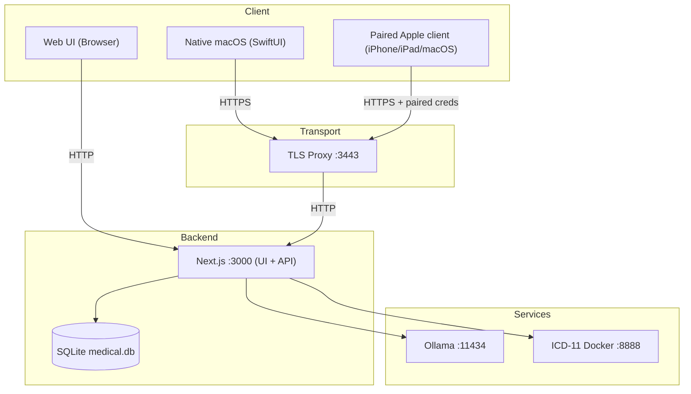

# ARCHITECTURE — MediFlow

Questo documento descrive l'**architettura stabile ad alto livello** di MediFlow.
Deve cambiare raramente: qui ci sono i confini, non i dettagli di implementazione.
Per il resto:

- [docs/walkthrough.md](./docs/walkthrough.md) (end-to-end, web + native)
- [docs/topologia-dati-flussi.md](./docs/topologia-dati-flussi.md) (topologia dati + percorsi digitali end-to-end)
- [docs/ARCHITETTURA.md](./docs/ARCHITETTURA.md) e [docs/system_architecture.md](./docs/system_architecture.md) (deep dive)
- [docs/adr/](./docs/adr/README.md) (decisioni architetturali)
- [docs/README.md](./docs/README.md) e [docs/markdown-index.md](./docs/markdown-index.md) (mappa canonica + inventario completo)

---

## Obiettivi

- **Local-first / offline-first** di default.
- **Privacy-by-design**: nessuna uscita verso cloud (telemetria, sync, chiamate AI) se non esplicitamente implementata e documentata.
- **Zero-knowledge a riposo**: il database SQLite deve essere illeggibile senza il PIN utente.
- **Manutenibilità**: diff minimi, codice chiaro, contratti espliciti.

## Non-obiettivi (per ora)

- Sync completa via internet.
- Modalità server multi-tenant.
- Telemetria/analytics in background.

---

## Panoramica del sistema

MediFlow è un **sistema ibrido locale**:

- L'app Next.js fornisce:
  - web UI
  - route API locali
  - overview/stato operativo del nodo locale
  - accesso al database SQLite locale
  - contratto versionato `/api/v1/*`, inclusa la first slice `network` read-only
- Servizi locali opzionali:
  - Ollama per AI/OCR (localhost)
  - ICD-11 Docker API per ricerca diagnosi (localhost)
  - sidecar locale OpenMed per redaction shadow/benchmark (localhost, non client-facing)
- Strategia client Apple:
  - la web app sul Mac resta la superficie primaria di oggi
  - la shell nativa macOS esistente resta uno snapshot da preservare, non il ramo da stratificare
  - i futuri client iPadOS/iPhone condividono lo stesso boundary `home-base + /api/v1`, non un accesso diretto al database remoto
- Le integrazioni regionali (`SISS`, `FSE`) restano dentro un boundary esplicito:
  handoff contestuale e percorsi `webapp-assisted` finché non esiste un canale
  qualificato `SSI/A2A` documentato e sostenibile.

Il default resta **local-only sul singolo computer**. Se l'operatore attiva la
modalita `network-home-base`, lo stesso nodo espone anche `/api/v1/network/*`
con pairing esplicito e primo data plane read-only per client trusted su LAN.

### Porte locali (default)

| Componente | Default | Note |
| --- | --- | --- |
| Next.js (UI + API) | `http://127.0.0.1:3000` | solo locale |
| TLS proxy (trasporto native) | `https://127.0.0.1:3443` | inoltra verso :3000 |
| Ollama (AI/OCR) | `http://127.0.0.1:11434` | opzionale |
| ICD-11 (Docker) | `http://127.0.0.1:8888` | opzionale |
| OpenMed redaction (shadow) | `http://127.0.0.1:18080` | opzionale, non client-facing |

---

## Confini di fiducia e modello di sicurezza

### Dati a riposo

- Lo storage autorevole è un **singolo file SQLite** (`medical.db`).
- I campi sensibili sono cifrati **lato client** (browser / client native) prima della scrittura su disco.
- Anche gli artifact documentali (`attachments.summarySnapshot`,
  `attachments.parseEvidenceArtifactSnapshot`) sono trattati come dati clinici e
  persistiti cifrati.
- I valori cifrati sono salvati come stringhe nel formato:

```
ENC:<iv_b64>:<cipher_b64>
```

### Confini di autenticazione

MediFlow espone due superfici API:

- **Web API** (`/api/*`):
  - usata dalla UI browser
  - protetta da sessione server
- **Native API** (`/api/v1/*`):
  - usata dai client native
  - deve essere versionata e stabile
  - protetta da **token locale** (trasporto su HTTPS locale via TLS proxy)
- **Network API** (`/api/v1/network/*`):
  - si attiva solo in modalita `network-home-base`
  - resta read-only nella first thin slice
  - richiede pairing esplicito del device + sessione operatore valida

> Obiettivo: i client native non devono dipendere da scraping HTML o dettagli interni React/Next.

### Proxy verso servizi locali

Ogni endpoint proxy verso servizi locali deve:
- essere **allowlisted** (solo localhost)
- evitare SSRF e target remoti
- trattare ogni risposta come input non fidato

---

## Flusso dati (alto livello)



---

## Struttura repository (mappa mentale)

| Path | Responsabilità |
| --- | --- |
| `app/` | pagine Next.js + route handlers |
| `components/` | componenti UI, logica client |
| `lib/` | cifratura, strato DB, servizi (AI/OCR/ICD), auth/session server |
| `drizzle/` | migrazioni SQLite |
| `scripts/` | script avvio, TLS proxy, helper native |
| `native/` | client macOS SwiftUI |

---

## Contratti che devono restare stabili

- Formato di cifratura e mapping dei campi cifrati (lato client).
- Contratto **native API** (`/api/v1/*`):
  - versionato
  - documentato
  - retrocompatibile all'interno della stessa major
- `local-only` come default e `network-home-base` come opt-in paired/read-only-first.
- `patients.documentInsights` puo convivere con artifact documentali piu ricchi, ma gli artifact persistiti restano locali e cifrati.
- Principio local-only: nessuna dipendenza cloud di default.
- Boundary SISS/FSE: oggi coordinamento contestuale + percorsi ufficiali; niente claim
  di integrazione regionale nativa certificata fuori dal perimetro documentato.

---

## Come si cambiano le scelte architetturali

- Per ogni modifica non banale, scrivi un ADR in `docs/adr/`.
- Mantieni gli ADR brevi e concreti (problema -> opzioni -> trade-off -> decisione -> thin slice).
- Aggiorna:
  - [ARCHITECTURE.md](./ARCHITECTURE.md) solo se cambiano visione stabile o confini
  - [docs/walkthrough.md](./docs/walkthrough.md) se cambia il flusso reale end-to-end
  - [docs/topologia-dati-flussi.md](./docs/topologia-dati-flussi.md) se cambiano percorsi dati, trust boundaries o superfici API
  - [docs/README.md](./docs/README.md) e [docs/markdown-index.md](./docs/markdown-index.md) quando cambiano ownership o mappa documentale
