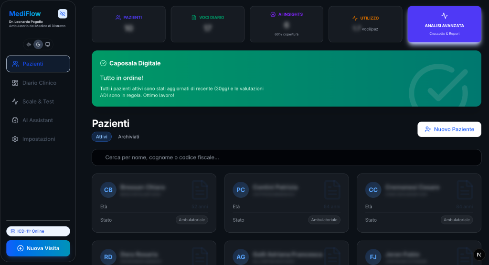

# 🏥 MediFlow v0.2.0

> **⚠️ ATTENZIONE: BREAKING CHANGE CRITICO - "Brain Transplant"**
> Questa versione rappresenta una riscrittura completa del core dell'applicazione.
> **L'aggiornamento COMPORTA LA PERDITA TOTALE dei dati salvati nelle versioni precedenti (v0.1.x basate su Dexie.js).**

---

## 🏗️ Il Cambio di Paradigma: Perché un "Brain Transplant"?

Nelle prime versioni, MediFlow operava come una semplice Web App confinata nel browser (IndexedDB). Sebbene funzionale, questo approccio limitava fortemente le capacità di evoluzione, sicurezza e integrazione con l'AI.

Abbiamo deciso di **ricostruire le fondamenta** passando da un'architettura puramente browser-based a una **Architettura Ibrida (Native + Docker)**.

### Cosa è cambiato?

| Caratteristica | v0.1.x (Vecchio Cervello) | v0.2.0 (Nuovo Cervello) |
| --- | --- | --- |
| **Storage Dati** | `Dexie.js` (IndexedDB nel Browser) | **SQLite + Drizzle ORM** (File locale su disco) |
| **Persistenza** | Volatile (dipende dalla cache browser) | **Robusta** (File `.db` fisico e backuppabile) |
| **Intelligenza Artificiale** | Simulazione / API Mock | **Local LLM Reale** (Ollama/MLX con MedGemma) |
| **Motore Diagnosi** | ICD-9 statico (JSON) | **ICD-11 Ufficiale WHO** (Docker Container) |
| **Performance** | Limitate dal thread JS | **Multiprocesso** (Node.js + Python + Go) |

### 💾 La Questione Dati: Perché abbiamo ricominciato da zero?

La decisione di abbandonare i dati vecchi non è stata presa alla leggera. Il passaggio a **SQLite** criptato ("Zero-Knowledge") ha reso tecnicamente impossibile la migrazione sicura dei vecchi dati IndexedDB per tre motivi:

1. **Schema Rigido vs NoSQL**: Siamo passati da documenti JSON liberi a uno schema relazionale rigoroso per garantire l'integrità clinica.
2. **Crittografia at-Rest**: Il nuovo sistema cifra i dati *prima* che tocchino il disco. I vecchi dati erano in chiaro o usavano metodi di offuscamento deboli non compatibili con i nuovi standard AES-256-GCM.
3. **Integrità Referenziale**: Il nuovo DB impone relazioni strette tra Pazienti, Visite e Terapie che i vecchi dati, spesso incompleti, non avrebbero soddisfatto, rischiando di creare un database "corrotto" in partenza.

> *Abbiamo scelto la stabilità futura a discapito della compatibilità passata.*

### 🛠️ Nuovi Strumenti di Diagnostica

Con la maggiore complessità (3 motori che girano in parallelo: App, AI, ICD), "funziona tutto?" non è più una domanda da Sì/No.
Abbiamo introdotto una **Dashboard Diagnostica** nelle Impostazioni per darti il controllo totale:

* **🚦 Semàfori di Sistema**: Monitoraggio in tempo reale dello stato di Next.js, Ollama e Docker ICD.
* **🧠 AI Brain Monitor**: Visualizza quale modello è caricato in memoria e quanta VRAM sta usando.
* **🔗 Connectivity Check**: Verifica che le porte 3000, 11434 e 8888 siano aperte e comunicanti.
* **🔥 Self-Healing**: Script automatici che tentano di riavviare i servizi docker o i processi python se rilevano un crash.

---

## 👋 Ciao! Mi chiamo Leo

Sono un medico italiano e lavoro nell'Assistenza Primaria. L'idea di gestire dati dei pazienti, terapie e note cliniche senza dipendere da connessione internet o servizi cloud di terze parti è ciò che mi ha portato a creare **MediFlow**.

MediFlow è un sistema completo di cartella clinica **local-first** progettato per **affidabilità**, **privacy** e **velocità**. Potenzia i professionisti medici e permette di spostare il focus dalla gestione dei problemi IT alla cura del paziente.

Il software "base" è in italiano, ma sentitevi liberi di creare branch, modificare, suggerire e molto altro. Sono un novizio nel mondo dello sviluppo e sono sempre aperto a imparare e migliorare. Non dimenticate che questa applicazione è fatta dal punto di vista italiano (AIFA per i farmaci, ecc.) e molte funzionalità e cambiamenti futuri sono legati alla mia pratica clinica quotidiana. Tuttavia questo prodotto è fatto pensando alla modularità. Contattatemi per qualsiasi suggerimento! Open Source for the win!



---

## 🚀 Guida all'Installazione (Scegli il tuo profilo)

### 🟢 Utente Standard (Voglio solo usare l'app)

1. **Prerequisito Unico**: Installa **Docker Desktop** sul tuo Mac.
    * Scaricalo dal sito ufficiale.
    * Aprilo e aspetta che si avvii (l'icona della balena in alto deve smettere di muoversi).
2. **Avvio**:
    * Fai doppio click sul file `Start_MediFlow.command`.
    * Aspetta qualche minuto (solo la prima volta deve scaricare un po' di cose).
    * Si aprirà da solo il browser.
3. **Finito!** Ora puoi creare il tuo profilo e inserire i dati.

### 🤓 Smanettoni (Voglio capire cosa succede)

**Tech Stack:**

* **App:** Next.js 15 (React 19), TailwindCSS v4.
* **Database:** SQLite + Drizzle ORM (Cifrato AES-256).
* **AI:** Ollama (default container) o Apple MLX (nativo).
* **ICD:** WHO ICD-API (container locale).

**Workflow di Avvio:**
Lo script di avvio esegue un `docker-compose up -d` che orchestra tre container:

1. `app`: L'interfaccia web (porta 3000).
2. `icd-api`: Il server per le codifiche diagnosi (porta 8888).
3. `ollama`: Il server LLM (porta 11434).

**Comandi Manuali:**

```bash
# Avvio (da root del progetto)
docker-compose up -d

# Log streaming
docker-compose logs -f app

# Spegnimento
docker-compose down
```

**Configurazione Avanzata (AI):**
Se possiedi un Mac Apple Silicon (M1/M2/M3), puoi usare **MLX** dalle impostazioni per performance native (Metal GPU).

---

## 🔒 Sicurezza e Privacy

* **Local-First**: I dati risiedono *esclusivamente* sul tuo dispositivo (file `medical.db`).
* **Cifratura**: Utilizziamo cifratura AES-GCM. I dati sensibili (note, diario) vengono cifrati con una chiave derivata dal tuo PIN prima di essere salvati su disco ("Zero-Knowledge").
* **AI Privacy**: L'AI gira in locale. Nessun dato paziente viene inviato a cloud esterni (OpenAI, Google, ecc.).

## ⚖️ Compliance & GDPR (Work in Progress)

Questa applicazione è progettata seguendo i principi di **Privacy by Design** e **Data Minimization**, implementando best practice tecniche all'avanguardia per la protezione dei dati (Crittografia AES-256, Local-First, Zero-Knowledge Storage).

Tuttavia, la piena conformità al **GDPR** (Regolamento Ue 2016/679) è un processo complesso che va oltre la sola tecnologia e coinvolge aspetti legali e organizzativi.
Attualmente, l'adesione agli standard GDPR è da considerarsi un **obiettivo in corso d'opera (Best Effort)**.

* L'utilizzo professionale in ambito sanitario richiede una validazione giuridica specifica da parte del Titolare del Trattamento (il Medico/Struttura).
* Il progetto punta a fornire tutti gli strumenti tecnici necessari (Audit Log, Export, Cancellazione Sicura) per facilitare questa compliance, ma non sostituisce la consulenza legale specializzata.

## Risoluzione Problemi Comuni

* **"Errore connessione ICD"**: Assicurati che Docker sia acceso. Se è la prima volta, il download dell'immagine da 300MB potrebbe richiedere tempo.
* **"Schermata Bianca"**: Prova a ricaricare la pagina con `Cmd + R`.
* **"Pin Smarrito"**: Purtroppo non è recuperabile. I dati cifrati andranno persi (feature di sicurezza by design).

---

> Consulta il file `docs/architecture_preview.html` incluso nella documentazione per esplorare visivamente i nuovi flussi di dati e sicurezza.
