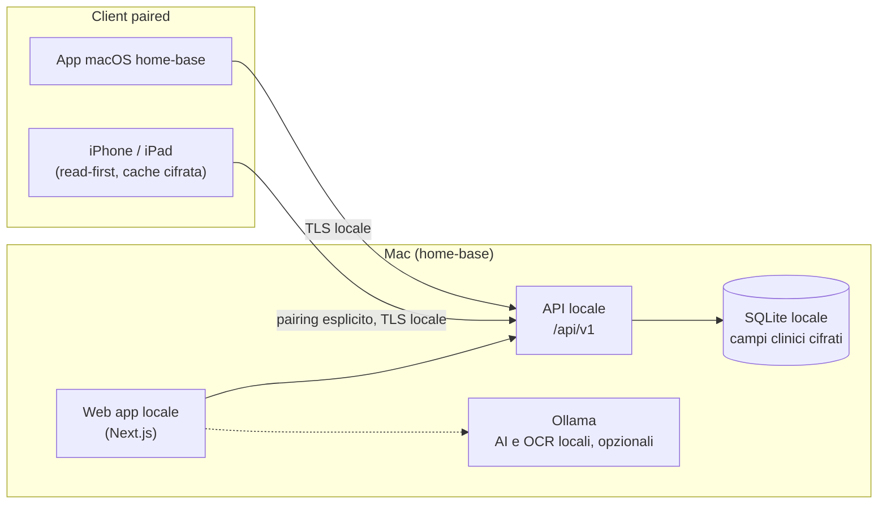

<div align="center">

# MediFlow

_by Ordito & Concilio_

**Cartella clinica territoriale local-first.**

Dati vicini al medico, flusso rapido, privacy come impostazione di base.

[](./CHANGELOG.md)
[](./LICENSE)
[](#confini-dichiarati)
[](#la-071-in-breve)

[](https://claude.com/claude-code)
[](https://openai.com/codex)

[Perché](#perché-mediflow) · [Screenshot](#come-si-presenta) · [Architettura](#come-è-fatto) · [0.7.2](#la-072-in-breve) · [Confini](#confini-dichiarati) · [Avvio](#avvio-rapido) · [AI e trasparenza](#come-è-stato-costruito)

</div>

## Perché MediFlow

MediFlow nasce dal lavoro reale con i pazienti, non da un esercizio teorico.

Una cartella clinica deve aiutare chi cura a ritrovare informazioni, seguire
terapie, annotare decisioni, conservare documenti e mantenere continuità, senza
trasformare ogni gesto in burocrazia digitale.

Nel contesto territoriale italiano questo bisogno è ancora più evidente: il
tempo è poco, i dati sono sensibili, i percorsi sono spesso frammentati e gli
strumenti disponibili non sempre rispettano il modo in cui il lavoro clinico
viene davvero svolto.

MediFlow prova a rispondere a questo spazio: una base locale, leggibile,
prudente e modulare per la gestione quotidiana dei pazienti. La priorità non è
fare scena, ma ridurre attrito: aprire la scheda, capire dove si è, rivedere una
fonte, distinguere una terapia da una prestazione prescritta, preparare il
passaggio giusto senza confondere supporto operativo e integrazione
istituzionale.

Non nasce per sostituire i canali istituzionali, né per promettere integrazioni
che non sono ancora dimostrate. Nasce per dare ordine, continuità e controllo al
lavoro clinico di tutti i giorni.

## Repository canonica

Lo sviluppo di MediFlow avviene interamente in questa repository pubblica.
Branch, pull request, issue, tag e release fanno capo a
[`Wulfgardr/mediflow`](https://github.com/Wulfgardr/mediflow); la precedente
repository privata e archiviata e non costituisce piu una fonte operativa.
Gli artefatti sensibili o locali restano fuori da Git secondo
[`SECURITY.md`](./SECURITY.md) e
[`docs/repository-topology.md`](./docs/repository-topology.md).

## Come si presenta


_Render reali dell'interfaccia attuale, catturati con dati dimostrativi sintetici: nessun dato paziente reale._

<details>
<summary><b>Altri screenshot</b> (Scheda paziente, quadro clinico, revisione documenti, sicurezza)</summary>
<p>

</p>
<p>

</p>
<p>

</p>
<p>

</p>
</details>

## L'idea

MediFlow è una web app locale per gestire dati clinici, terapie, note e documenti.

Il principio guida è **local-first**: il dato resta vicino a chi lo produce e lo
usa. Il cloud non è un requisito per lavorare, e l'architettura è pensata per
ridurre al minimo la dipendenza da servizi esterni.

La direzione è quella di uno strumento:

- sobrio nell'interfaccia;
- esplicito nei confini;
- prudente nell'uso dell'AI;
- rispettoso della privacy;
- adatto a crescere senza diventare opaco.

## Come è fatto

Il Mac è il nodo autorevole (`home-base`): ospita il database e la web app.
Gli altri dispositivi non parlano mai col database: parlano con l'API locale,
dopo un pairing esplicito.


```mermaid
flowchart LR
    subgraph mac["Mac (home-base)"]
        web["Web app locale<br/>(Next.js)"]
        api["API locale<br/>/api/v1"]
        db[("SQLite locale<br/>campi clinici cifrati")]
        ai["Ollama<br/>AI e OCR locali, opzionali"]
        web --> api --> db
        web -.-> ai
    end
    subgraph paired["Client paired"]
        native["App macOS home-base"]
        mobile["iPhone / iPad<br/>(read-first, cache cifrata)"]
    end
    native -- "TLS locale" --> api
    mobile -- "pairing esplicito, TLS locale" --> api
```

Il cloud non compare nel diagramma: nessun egress di default, il percorso resta local-first.

## La 0.7.2 in breve

La `0.7.2` chiude la parità del boundary paired: il client Apple raggiunge la web
app sul ciclo di vita del paziente e sulle famiglie cliniche mancanti
(prestazioni, protesica, export FHIR), sempre entro i confini local-first e senza
hard delete remoto. Restano le fondamenta della `0.7.1`, che ha portato il ramo
Apple/native sul mainline con macOS come fronte più avanzato e iPhone e iPad come
client paired sul modello `home-base`.

- **ciclo di vita paziente sul boundary paired**: creazione, cestino con soft-delete e ripristino dal client Apple, con concorrenza ottimistica e senza accesso diretto al database;
- **prestazioni, protesica ed export FHIR sul client paired**: nuove famiglie cliniche sul boundary con concorrenza ottimistica, e bundle FHIR generato on-device con pre-check di validazione FSE;
- **web app locale** come superficie primaria di lavoro sul Mac;
- **Kree8 cockpit** come root web live, con una direzione visuale unica e senza selector persistiti: copy asciutto, palette semantica sobria, dark mode completa e flusso a un clic verso la Scheda paziente;
- **database SQLite cifrato**, con approccio zero-knowledge;
- **backup, audit e contratto `/api/v1`** resi più chiari ed espliciti;
- **AI locale** per insight e OCR, senza egress di default;
- **import documentale reviewable**, con Smart Import prudente, artifact `parse/evidence`, ancore fonte e benchmark di assorbimento evidenza;
- **prescrizioni di prestazione** separate dalle terapie farmacologiche, con item codificabili e matching repertorio preparato in modo bounded;
- **app Apple/native** con macOS come fronte più maturo, shell home-base, core Swift condiviso e target iPhone/iPad paired senza accesso diretto al DB;
- **core tri-OS** costruito e testato su macOS, Linux e Windows: oggi prova di portabilità del core, non promessa di app desktop complete su ogni piattaforma;
- **runtime cross-platform**: launcher per macOS, Windows e Linux, scheduler di backup adattivo (launchd, Task Scheduler, systemd/cron) e degradazione esplicita delle funzioni solo-Mac;
- **boundary SISS/FSE realistico**: handoff contestuale e percorso prescrittivo `webapp-assisted`, non integrazione regionale nativa già risolta.

Il dettaglio completo è nel [CHANGELOG](./CHANGELOG.md).

## Confini dichiarati

MediFlow non vuole raccontare più di quanto possa dimostrare.

- **Nessun cloud obbligatorio**: il default resta locale.
- **Nessuna app iPad/iPhone dichiarata come già completa**: la direzione multi-device esiste, ma il perimetro operativo attuale è `home-base + paired client`, con approccio read-only-first, cache cifrata e write online limitati a profilo/status, diario, terapie, checkup e osservazioni.
- **Nessuna parity Windows/Linux dichiarata oggi**: la 0.7.2 prova il core tri-OS e il runtime di base, non app complete su ogni piattaforma.
- **Nessuna integrazione SISS/FSE certificata dichiarata senza prove**: il percorso attuale è contestuale e `webapp-assisted`, usando i canali ufficiali; MediFlow non dichiara sincronizzazione FSE, writeback regionale o invio prescrittivo diretto.
- **Nessuna delega cieca all'AI**: l'AI locale può aiutare, ma non sostituisce revisione, giudizio clinico e responsabilità professionale.

## Perché open source

MediFlow nasce come progetto personale, ma ha senso solo se può diventare una
base aperta, verificabile e migliorabile.

Open source, in questo caso, significa soprattutto:

- codice leggibile;
- documentazione chiara;
- confini dichiarati;
- nessuna promessa vaga;
- possibilità di controllo da parte di chi usa lo strumento.

## Documentazione

| Documento | Cosa contiene |
| :-- | :-- |
| [FAQ](./docs/FAQ.md) | Risposte rapide alle domande più comuni |
| [Stato del sistema](./docs/STATE_OF_THE_SYSTEM.md) | La fotografia completa e aggiornata |
| [Roadmap](./docs/ROADMAP.md) | Dove sta andando il progetto |
| [Compliance](./docs/COMPLIANCE.md) | Privacy, GDPR e confini regolatori |
| [Crediti](./CREDITS.md) | Fonti, modelli, librerie e ispirazioni con licenze |
| [Document map](./docs/README.md) | La mappa di tutta la documentazione |

## Avvio rapido

```bash
git clone https://github.com/Wulfgardr/mediflow
cd mediflow
npm install
```

Poi il launcher della tua piattaforma:

| OS | Comando |
| :-- | :-- |
| macOS | `./Start_MediFlow.command` |
| Windows | `powershell -ExecutionPolicy Bypass -File .\Start-MediFlow.ps1` |
| Linux | `./scripts/start-mediflow.sh` |

Apri `http://localhost:3000`. Ollama, Docker e ICD-11 sono opzionali: senza,
MediFlow resta usabile con funzionalità ridotte.

## Fonti e attribuzioni

MediFlow dichiara in chiaro le sue fonti.

[](https://www.kree8.studio/)
[](https://github.com/mims-harvard/ATHENA)
[](https://github.com/altic-dev/FluidVoice)
[](./CREDITS.md)

Il **look** del cockpit è derivato da [Kree8](https://www.kree8.studio/),
ispirazione esterna resa in una implementazione clinica originale. Il ragionamento
terapeutico review-only usa il modello [ATHENA](https://github.com/mims-harvard/ATHENA)
(mims-harvard, licenza MIT). Il motore della visita registrabile prende a
riferimento l'ecosistema Fluid.

Modelli, librerie, runtime e ispirazioni con URL e licenze:
**[CREDITS.md](./CREDITS.md)**.

## Come è stato costruito

Scrivo MediFlow da medico, con un aiuto sostanziale e dichiarato di strumenti di sviluppo assistito da AI.

Due copiloti, ruoli distinti. **Codex** (OpenAI) è la mia corsia principale di implementazione e verifica; **Claude Code** (Anthropic) è la seconda corsia: review, coordinamento e i controlli che decidono cosa entra nel codice. Chi scrive non è chi approva.

Aggiornato al 9 luglio 2026, tengo il conto dai log locali delle sessioni: **circa 20 miliardi di token** per MediFlow, 16,4 con Codex e 4,0 con Claude Code. Sono token di sessione, quindi in gran parte contesto riletto a ogni passaggio: misurano il volume del lavoro assistito, non quanto ho scritto.


### Lo stack

Il metodo conta più del volume.

- **Review incrociata tra modelli.** Un modello propone, un altro prova a smontarlo. Le due corsie si controllano a vicenda invece di darsi ragione.
- **Verifica con prove.** Prima di chiudere un lavoro giro davvero i test e i controlli in locale. Niente "fatto" sulla parola del modello.
- **Diagnosi in parallelo.** Per bug e regressioni, più letture in sola lettura sullo stesso codice da angoli diversi.
- **Guard automatici in CI.** Bloccano il merge se rientrano regressioni di sicurezza o affermazioni non dimostrate.
- **Il modello giusto per il compito.** Lavoro meccanico ai modelli economici, giudizio e architettura a quelli capaci.

Gli strumenti, in chiaro:

- **[Codex CLI](https://openai.com/codex)** (OpenAI) e **[Claude Code](https://claude.com/claude-code)** (Anthropic): i due copiloti.
- **[Repo Prompt CE](https://github.com/repoprompt/repoprompt-ce)** (Eric Provencher): lo spazio di contesto, open source. Serve a costruire il contesto giusto da dare agli agenti, quali file, quali diff, quale struttura del repo, prima che agiscano, e a far dialogare più modelli sullo stesso problema senza sprecare contesto.
- **[CodexBar](https://github.com/steipete/CodexBar)** (Peter Steinberger): il conteggio d'uso da cui vengono i numeri qui sopra.
- Parte del flusso di review deriva da **[steipete/agent-scripts](https://github.com/steipete/agent-scripts)** (MIT).

L'AI scrive, ma non decide. La responsabilità di MediFlow resta mia.

## Licenza

MIT License.

---

Progettato in Italia.
