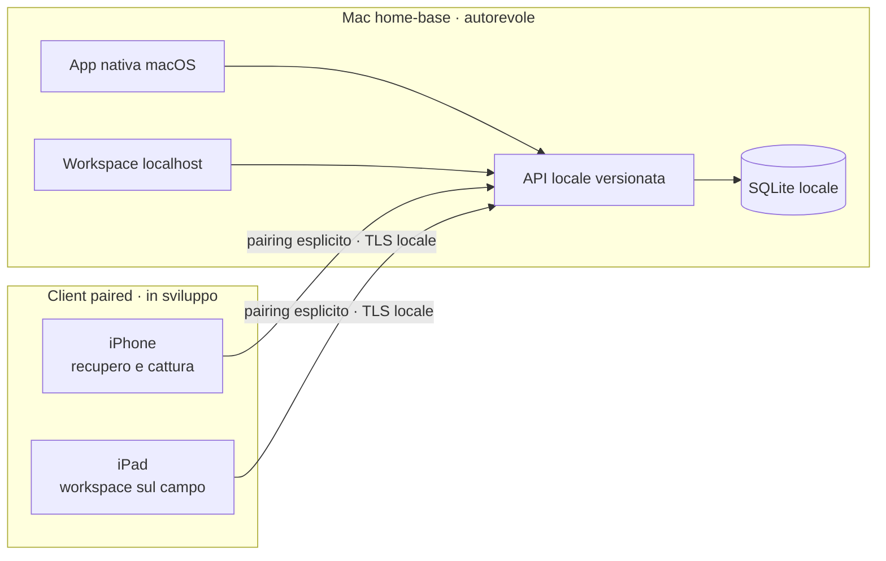
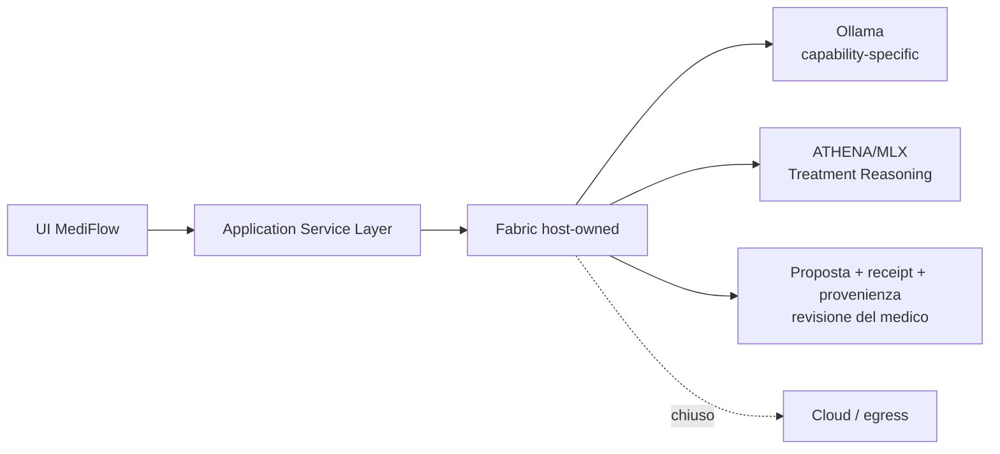

<div align="center">

<picture>
  <source media="(prefers-color-scheme: dark)" srcset="./docs/design/lume/icona/mediflow-icon-grafite.svg">
  <source media="(prefers-color-scheme: light)" srcset="./docs/design/lume/icona/mediflow-icon-giorno.svg">
  
</picture>

# MediFlow

<a href="https://claude.com/claude-code"></a>
<a href="https://openai.com/codex"></a>

_by Ordito & Concilio_

**Cartella clinica territoriale local-first, open source e libera da usare.**

**Porta l'informazione giusta nel momento giusto.**

[](#candidato-sorgente-locale-085)
[](./CHANGELOG.md)
[](./LICENSE)
[](#confini-dichiarati)
[](#candidato-sorgente-locale-085)

[In breve](#mediflow-in-breve) · [Uso attuale](#come-si-usa-oggi) · [Architettura](#come-collaborano-le-app) · [Schermate](#come-si-presenta) · [Stato](#candidato-sorgente-locale-085) · [Avvio](#avvio-rapido) · [Sviluppo](#sviluppo-assistito)

</div>

## MediFlow, in breve

MediFlow nasce dalle difficoltà operative reali dei medici. È un workspace
clinico open source e libero da usare. Aiuta a trovare un paziente, leggere la
sua storia, seguire terapie, controlli e documenti e preparare il passaggio
successivo. Non promette una pratica clinica senza attrito. Riduce l'attrito
evitabile senza nascondere complessità, provenienza, privacy e responsabilità
professionale.

Il prodotto è information-first, question-first e convenience-first. Non è
AI-first. Dati clinici, terminologie, reference data, ricerca, navigazione e
workflow deterministici restano funzioni di prima classe anche quando ogni
provider AI è disabilitato.

Il cloud non è un requisito per lavorare. Nel candidato locale `0.8.5`, Ollama
e ATHENA/MLX servono solo le capability locali assegnate. Quattro percorsi
Fabric preparano proposte con receipt e provenienza visibili. Nessuna preview
aggiunge diagnosi, terapie o altri dati clinici strutturati.

Nel contesto territoriale italiano, MediFlow aiuta ad aprire la scheda giusta,
ritrovare la fonte, distinguere una terapia da una prestazione prescritta e
preparare la decisione successiva. Il medico verifica le evidenze e decide.
MediFlow non prescrive, non formula diagnosi autonome e non sostituisce il
giudizio clinico.

MediFlow non sostituisce SISS, FSE o gli altri canali ufficiali. Sta accanto al
lavoro clinico quotidiano, con confini dichiarati e verificabili.

Lo sviluppo avviene nella repository pubblica
[`Wulfgardr/mediflow`](https://github.com/Wulfgardr/mediflow). Database, dati
sanitari, credenziali e altri artefatti locali restano fuori da Git secondo
[`SECURITY.md`](./SECURITY.md) e
[`docs/repository-topology.md`](./docs/repository-topology.md).

## Come si usa oggi

La superficie operativa principale è il workspace web su localhost, avviato sul
Mac home-base. Qui MediFlow offre i flussi più estesi per pazienti, diario,
agenda, documenti, impostazioni e amministrazione locale. Il database resta sul
Mac.

L'app nativa macOS appartiene allo stesso home-base e offre un accesso desktop
coerente con il prodotto. iPhone e iPad sono client paired in sviluppo. Hanno
già una base funzionale consolidata, ma richiedono ancora lavoro prima dell'uso
operativo quotidiano.

## Come collaborano le app

Il Mac è il nodo autorevole (`home-base`). Ospita il database, l'app nativa e il
workspace web locale. iPhone e iPad usano l'API locale versionata dopo un
pairing esplicito. Localhost è oggi la superficie operativa principale. iPhone
privilegia consultazione e cattura rapide; iPad è progettato come workspace sul
campo. I dispositivi paired non accedono direttamente a SQLite.


```mermaid
flowchart LR
    subgraph paired["Client paired · in sviluppo"]
        iphone["iPhone<br/>recupero e cattura"]
        ipad["iPad<br/>workspace sul campo"]
    end
    subgraph mac["Mac home-base · autorevole"]
        native["App nativa macOS"]
        web["Workspace localhost"]
        api["API locale versionata"]
        db[("SQLite locale")]
        native --> api
        web --> api
        api --> db
    end
    iphone -- "pairing esplicito · TLS locale" --> api
    ipad -- "pairing esplicito · TLS locale" --> api
```

Le app condividono capacità e significato clinico, non la stessa disposizione
pixel per pixel. Trasporto, pairing e limiti del data plane sono documentati in
[`docs/topologia-dati-flussi.md`](./docs/topologia-dati-flussi.md).

### Intelligence Fabric nel candidato locale 0.8.5

> **Candidato sorgente locale. Non è una release e non prova CI remota o
> disponibilità su un altro host.**

L'Intelligence Fabric collega quattro attività nominate alla sede di esecuzione
consentita dalla policy: `AI Patient Insight`, Smart Import, Document Synthesis
e Treatment Reasoning. Ogni percorso ha un ingresso applicativo distinto,
routing host-owned e disposition `proposal_only`.


```mermaid
flowchart LR
    ui["UI MediFlow"] --> services["Application Service Layer"]
    services --> fabric["Fabric host-owned"]
    fabric --> ollama["Ollama<br/>capability-specific"]
    fabric --> athena["ATHENA/MLX<br/>Treatment Reasoning"]
    fabric --> review["Proposta + receipt + provenienza<br/>revisione del medico"]
    fabric -. "chiuso" .-> cloud["Cloud / egress"]
```

Non esiste fallback silenzioso verso il cloud. Receipt, provenienza e
currentness restano visibili, ma non sono grant e non autorizzano apply.
MediFlow resta utile quando tutti i provider AI sono disabilitati.

AnyDoc è una corsia separata e deterministica per l'estrazione locale degli
allegati supportati. Non è OCR né un provider Fabric. Immagini e PDF
scansionati senza text layer falliscono chiusi e richiedono revisione manuale;
le route OCR legacy rispondono `410`.

## Come si presenta

### Workspace operativo su localhost


### App nativa macOS


### Client iPad in sviluppo

<table>
<tr>
<td></td>
<td></td>
</tr>
</table>

<p align="center"></p>

### Client iPhone in sviluppo

<table>
<tr>
<td></td>
<td></td>
<td></td>
</tr>
</table>

_Catture reali della candidata Apple e della build web di produzione. La
galleria presenta prima le superfici del Mac home-base e poi i client paired in
sviluppo. Le viste cliniche usano soltanto fixture sintetiche, deterministiche
e versionate nel repository. Nessun dato paziente reale. Le viste web ristrette
a dimensioni telefono o tablet restano evidenze di test e non fanno parte
della galleria. Il [manifest media 0.8](./screenshots/0.8/manifest.json)
registra dispositivo, runtime, scena, commit sorgente e hash._

## Candidato sorgente locale 0.8.5

Il tree usa la versione `0.8.5`. È un candidato locale: non dichiara CI remota
sulla stessa SHA, tag, GitHub Release, distribuzione, App Store o release
readiness.

Quattro percorsi Fabric sono collegati end-to-end alla UI come
`proposal_only`: Patient Insight, Smart Import, Document Synthesis e Treatment
Reasoning. Le preview espongono receipt, provenienza e currentness. Nessuna
preview applica dati clinici. Il
[crosswalk runtime](./docs/capability-mapping/fabric-generative-runtime-crosswalk.v1.json)
lega ogni percorso al proprio entrypoint, production root, route ed evidenza
UI. La receipt storica `candidate_not_integrated` resta distinta e immutata.

AnyDoc è l'unica estrazione automatica locale degli allegati supportati. La
capability `ocr` è `unavailable` nel runtime corrente e le route OCR legacy
rispondono `410`. Immagini e scansioni restano in revisione manuale.

I gate F6/F7 chiudono la patch escludendo le parti non pronte:

| Gate | Incluso nel candidato | Escluso dalla 0.8.5 | Esito |
| :-- | :-- | :-- | :-- |
| F6 | AnyDoc per testo estraibile; fail-closed per immagini/scansioni | DeepSeek-OCR 2, pipeline selettiva `needsOcr`, provenienza/hash/qualità per pagina, benchmark italiano con soglie ed E2E | `RELEASE_SCOPE_EXCLUDED` |
| F7 | Ollama locale e ATHENA/MLX per le capability assegnate; disclosure OpenAI/Anthropic read-only | Esecuzione cloud, configurazione credenziali e contratto provider completo | `RELEASE_SCOPE_EXCLUDED` |

OpenAI e Anthropic sono solo righe informative: esecuzione ed egress restano
disabilitati. Un login o abbonamento consumer non costituisce accesso API. Il
contratto completo che distingue type, instance, auth, model, capabilities,
groups, bindings, allowlist e credential classes non è incluso nella patch.

ATHENA richiede un runner MLX offline pre-provisioned, indicato con un percorso
eseguibile assoluto host-owned in `MEDIFLOW_ATHENA_MLX_GENERATE_BIN`, e il
modello locale. Il commit `2574cf5fc`
ha superato TDD 6/6, typecheck ed ESLint. Uno smoke sintetico sul percorso di
produzione con modello BF16 locale ha completato in 10,6 secondi con 64 token e
211 caratteri, senza registrare il raw output. È una prova locale singola, non
readiness universale o validazione clinica.

Il candidato registra i percorsi, i contratti e questa osservazione ATHENA, non
un benchmark di release per accuratezza OCR, qualità generativa, latenza o
throughput. La suite finale del tree esatto resta un gate separato prima di ogni
claim di readiness.

Il piano Headless generale conserva 66 esiti terminali e zero operazioni
eseguibili. I 32 `GET` network osservati restano evidence candidate. La sola
eccezione stretta è la append SOAP locale server-side H1-H10, vincolata a
sessione physician active-role, currentness, revisione clinica, gesto e step-up
monouso, CAS, audit e receipt. Non abilita Mini, apply generale, authority
Fabric o un trasporto agentico.

Cloud, egress, MCP, visita registrabile, semantic query planner, SQL diretto e
invocazione AI dai client paired restano fuori scope. I limiti completi sono in
[`docs/known-limitations.md`](./docs/known-limitations.md).

### Ultima release pubblicata: 0.8.2

La release `0.8.2` distribuisce il codice sorgente verificato. Non costituisce
una pubblicazione App Store, una certificazione o una dichiarazione di
conformità completa.

La release rafforza i confini di scrittura clinica, i messaggi delle API e i
controlli di CI. Allinea anche le fixture Apple ai contratti dell'host.

La prova iPad aggiunge quattro contratti UI su Xcode 27 e iPadOS 27. I quattro
test sono passati senza fallimenti e senza skip. Le prove usano solo fixture
sintetiche.

Queste prove non dichiarano parity completa o conformità accessibilità. Il
limite VoiceOver mobile resta registrato in
[`docs/known-limitations.md`](./docs/known-limitations.md).

#### Contenuti della 0.8.2

La tranche integrata richiede una revisione umana prima di ogni scrittura
clinica proposta dall'AI. Le API non espongono messaggi grezzi delle eccezioni.

I controlli dello schema, OpenAPI e Apple sono collegati ai workflow pertinenti.
La CI distingue un job non necessario da un controllo mancante. Sul push a
`main`, la gamba iPad ha eseguito e superato i quattro contratti previsti senza
skip.

La compatibilità tra un client Apple aggiornato e un host precedente resta
aperta. WUL-546 conserva il limite e la decisione di contratto.

Il dettaglio è nel [CHANGELOG](./CHANGELOG.md). La fotografia completa vive in
[`docs/STATE_OF_THE_SYSTEM.md`](./docs/STATE_OF_THE_SYSTEM.md); la matrice
parity canonica vive in [`docs/parity-matrix.md`](./docs/parity-matrix.md).

## Confini dichiarati

MediFlow non racconta più di quanto possa dimostrare.

- **Il default è locale.** Nessun cloud obbligatorio, nessuna telemetria o
  uscita dati attiva per impostazione iniziale.
- **I fornitori esterni non sono operativi.** OpenAI e Anthropic compaiono solo
  come disclosure informative; non esistono configurazione credenziali,
  esecuzione cloud o egress nella patch.
- **I quattro percorsi Fabric sono proposal-only.** Receipt e provenienza sono
  visibili, ma nessuna preview applica dati clinici.
- **OCR non è disponibile nel runtime corrente.** AnyDoc estrae solo documenti
  locali supportati; immagini e scansioni senza text layer falliscono chiuse.
  DeepSeek-OCR 2 non è implementato, benchmarkato o incluso nella `0.8.5`.
- **Headless generale resta a zero operazioni.** La sola eccezione è la append
  SOAP H1-H10 confermata dal medico, senza trasporto agentico generale.
- **iPhone e iPad non sono app complete.** Il perimetro operativo è
  `home-base + client paired`; cache offline e alcune superfici derivate dai
  documenti restano parziali o disponibili solo sull'host.
- **Windows e Linux non hanno ancora parity applicativa.** La baseline verifica
  il core Swift condiviso e il runtime di base, non applicazioni complete su
  ogni piattaforma.
- **SISS e FSE restano un handoff assistito.** MediFlow apre il contesto giusto,
  ma non dichiara sincronizzazione FSE, writeback regionale o invio
  prescrittivo diretto.
- **L'AI resta review-first.** Può aiutare a leggere e organizzare, non
  sostituisce revisione, giudizio clinico o responsabilità professionale.
- **La inbox intelligente non è consegnata.** Le route conversazionali di base
  non costituiscono un flusso di chiarimento o conversione in record clinici.
- **MCP, visita registrabile e semantic query non sono consegnati.** Non
  esistono server/onboarding MCP, registrazione visita o planner SQL.

Delle 43 capability per cui la parity è un obiettivo, 30 sono complete e 13
parziali; altre 21 restano intenzionalmente host-only. La matrice fa fede sui
conteggi e sul significato di ciascuno stato.

## Avvio rapido

```bash
git clone https://github.com/Wulfgardr/mediflow
cd mediflow
nvm use
npm ci
```

MediFlow richiede Node.js 24.x. Installazione, build e launcher verificano anche
che il binding nativo `better-sqlite3` appartenga alla stessa ABI di Node.

Poi usa il launcher della tua piattaforma:

| OS | Comando |
| :-- | :-- |
| macOS | `./Start_MediFlow.command` |
| Windows | `powershell -ExecutionPolicy Bypass -File .\Start-MediFlow.ps1` |
| Linux | `./scripts/start-mediflow.sh` |

Apri `http://localhost:3000`. Ollama, ATHENA/MLX, Docker e ICD-11 sono
opzionali; senza, MediFlow resta usabile con funzionalità ridotte. OpenAI e
Anthropic non sono configurabili o eseguibili nel candidato `0.8.5`.

## Documentazione

| Documento | Cosa contiene |
| :-- | :-- |
| [FAQ](./docs/FAQ.md) | Risposte rapide alle domande più comuni |
| [Stato del sistema](./docs/STATE_OF_THE_SYSTEM.md) | La fotografia completa e aggiornata |
| [Roadmap](./docs/ROADMAP.md) | Dove sta andando il progetto |
| [Compliance](./docs/COMPLIANCE.md) | Privacy, GDPR e confini regolatori |
| [Crediti](./CREDITS.md) | Fonti, modelli, librerie e ispirazioni con licenze |
| [Mappa documentale](./docs/README.md) | La guida alla documentazione canonica |

## Fonti e attribuzioni

La prima lingua visiva del cockpit è derivata da
[Kree8](https://www.kree8.studio/), tradotta in un'implementazione clinica
originale. Il ragionamento terapeutico review-only usa
[ATHENA](https://github.com/mims-harvard/ATHENA) di mims-harvard, con licenza
MIT. Il lavoro sulla visita registrabile prende a riferimento l'ecosistema
Fluid, ma la visita registrabile resta fuori scope nel candidato `0.8.5`.

Modelli, runtime, librerie e ispirazioni, con URL, ruolo e licenza, sono in
**[CREDITS.md](./CREDITS.md)**.

L'icona MediFlow porta in primo piano il **Filo del diario**, la stessa geometria
che connette le voci cliniche lungo il tempo. Concetto, registri giorno/grafite
e asset sono documentati nella [specifica dell'icona](./docs/design/lume/09-icona.md).

## Sviluppo assistito

Scrivo MediFlow da medico, con un aiuto sostanziale e dichiarato di strumenti di
sviluppo assistito da AI.

[Codex](https://openai.com/codex) e
[Claude Code](https://claude.com/claude-code) hanno contribuito a progettazione,
implementazione, review e verifica. Le proposte dei modelli restano materiale da
controllare: test reali e guard automatici decidono se una modifica regge.

<!-- usage-dashboard:start -->

| Snapshot | Periodo dei log disponibili | Token di sessione | Ripartizione | Cache letta | Copertura storica |
| :-- | :-- | --: | :-- | --: | :-- |
| **11 agosto 2026** | 2026-04-20 → 2026-08-11 | **35.977.536.317** | Codex 28.202.844.089 · Claude Code 7.774.692.228 | 34.309.804.858 (95,4%) | Codex UNKNOWN · Claude Code attestata |


La fonte è **CodexBar 0.48.1**, comando locale `cost --refresh`, con una finestra massima di 365 giorni. Il conteggio usa gli aggregati disponibili per Codex e Claude Code e non è filtrato per repository. CodexBar attribuisce ogni token al processo che lo registra. Un worker OpenAI avviato da Claude Code compare quindi nel totale Claude Code. Il grafico indica lo strumento che registra i token, non il fornitore del modello.

**ATTESTATO:** i valori sono le somme esatte dei log disponibili nel periodo indicato. **STIMATO:** nessun valore. **UNKNOWN:** la completezza storica resta sconosciuta quando CodexBar non la attesta. L'attribuzione a MediFlow, a una release, a una PR o a un commit è sempre sconosciuta.

Rigenera il grafico con `npm run build:usage-dashboard`. Usa `CODEXBAR_BIN` per scegliere un eseguibile diverso e `USAGE_DASHBOARD_DAYS` per impostare una finestra da 1 a 365 giorni.

Le barre sono divise per modello e usano la stessa scala. La cache letta è una parte dell'input Codex, mentre CodexBar la espone come categoria separata per Claude Code: per questo il grafico non impila categorie di token con semantiche diverse. Sono pubblicati soltanto aggregati. Nessun prompt, contenuto di sessione, costo o percorso locale entra nel README o nell'SVG.

Il dato misura contesto elaborato. Non misura righe di codice, costo o qualità.

La responsabilità del progetto resta mia.

<!-- usage-dashboard:end -->

Lo snapshot pubblicato in precedenza (17,56 miliardi al 15 luglio 2026) usava una
pipeline di conteggio diversa e non è direttamente confrontabile con questo.

## Licenza

MIT License.

---

Progettato in Italia.
