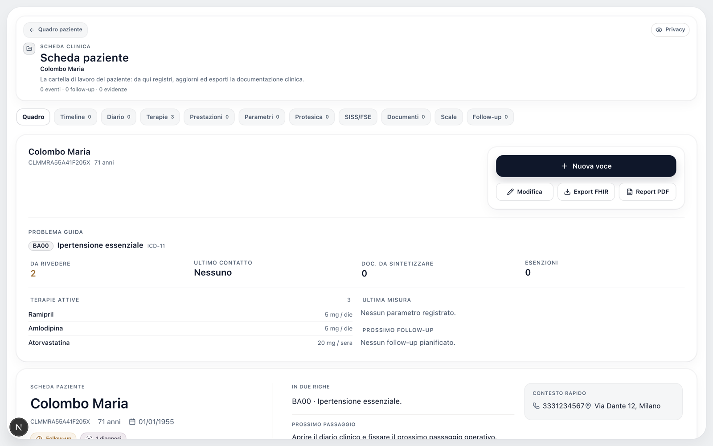
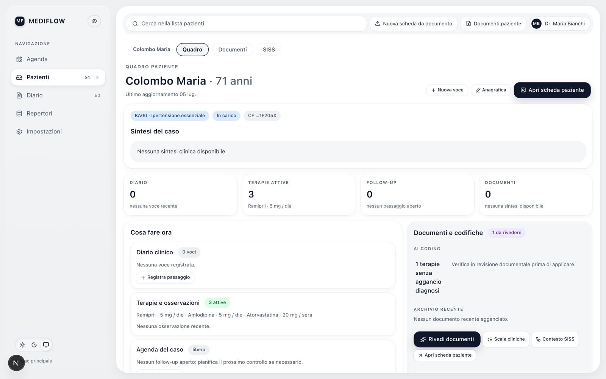
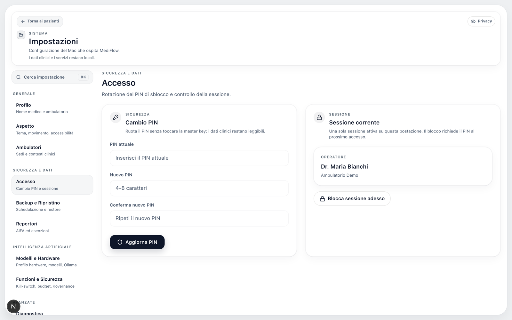
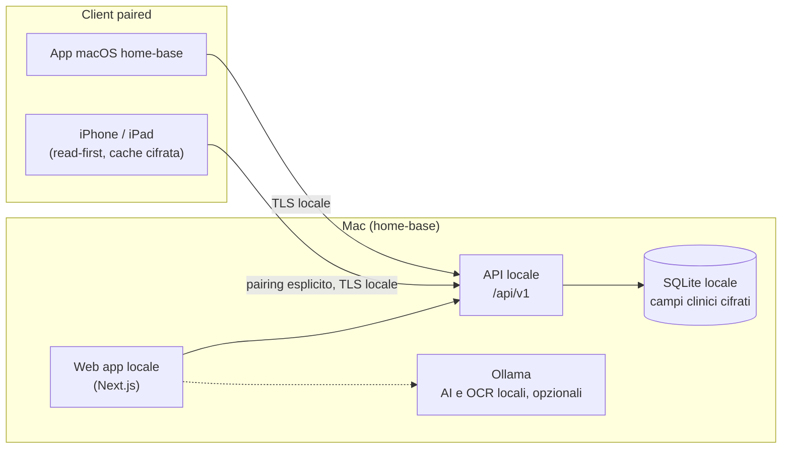

<div align="center">

# MediFlow

**Cartella clinica territoriale local-first, progettata da un medico per il lavoro di tutti i giorni.**

Dati sul tuo Mac, flusso rapido in visita, AI locale sempre rivedibile.
Il cloud non è un requisito: entra solo se scelto e documentato.

[](./CHANGELOG.md)
[](./oss-assets/LICENSE)
[](#confini-dichiarati-senza-ambiguità)
[](./docs/adr/0068-cross-platform-runtime-windows-linux.md)

[](https://claude.com/claude-code)
[](https://openai.com/codex)

Sviluppo assistito: Codex come principale copilota di implementazione e verifica; Claude Code come seconda corsia di review e supporto.

[Stato del sistema](./docs/STATE_OF_THE_SYSTEM.md) · [Changelog](./CHANGELOG.md) · [Manuale](./docs/MANUALE.md) · [Architettura](./ARCHITECTURE.md) · [Sicurezza](./SECURITY.md) · [Roadmap](./docs/ROADMAP.md)

</div>

---

## Perché esiste

Sono **Leo**, medico di distretto.
MediFlow nasce da un problema molto concreto: nel lavoro clinico quotidiano i
software sono spesso lenti, poco leggibili e troppo dipendenti da internet.

Qui l'idea è l'opposto: lavorare bene, in locale, con controllo pieno dei dati
e con una struttura abbastanza solida da crescere senza diventare opaca. Non un
gestionale che chiede al medico di adattarsi alla macchina, ma una cartella
clinica che prova a rispettare il modo reale in cui si lavora: visita, appunto,
documento, terapia, dubbio, revisione, continuità.

## Come si presenta


_Render reali dell'interfaccia attuale, catturati con dati dimostrativi sintetici: nessun dato paziente reale._

<details>
<summary><b>Altri screenshot</b> (Scheda paziente, quadro clinico, revisione documenti, sicurezza)</summary>
<p>

</p>
<p>

</p>
<p>

</p>
<p>

</p>
</details>

## Come è fatto

Il Mac è il nodo autorevole (`home-base`): ospita il database e la web app.
Gli altri dispositivi non parlano mai col database: parlano con l'API locale,
dopo un pairing esplicito.


```mermaid
flowchart LR
    subgraph mac["Mac (home-base)"]
        web["Web app locale<br/>(Next.js)"]
        api["API locale<br/>/api/v1"]
        db[("SQLite locale<br/>campi clinici cifrati")]
        ai["Ollama<br/>AI e OCR locali, opzionali"]
        web --> api --> db
        web -.-> ai
    end
    subgraph paired["Client paired"]
        native["App macOS home-base"]
        mobile["iPhone / iPad<br/>(read-first, cache cifrata)"]
    end
    native -- "TLS locale" --> api
    mobile -- "pairing esplicito, TLS locale" --> api
```

Il cloud non compare nel diagramma: nessun egress di default, il percorso resta local-first.

## Dove siamo adesso

MediFlow oggi non è solo una web app clinica con AI: è un sistema locale ibrido.
Il Mac resta il nodo autorevole, la web app resta la superficie più completa, il
contratto `/api/v1` tiene aperta la strada ai client paired e la document
intelligence cresce come evidenza rivedibile, non come automatismo opaco.

Sul mainline attuale ci sono queste cose:

- **web app locale come superficie primaria** su Mac, con SQLite locale, campi clinici sensibili cifrati lato client e flusso quotidiano più leggibile;
- **Kree8 cockpit come root web live**: la home locale apre la nuova grammatica visuale, senza selector o preview profiles persistiti; il lavoro 2026-06 porta copy più asciutto, palette semantica sobria, dark mode completa e flusso a un clic verso la Scheda paziente;
- **contratto locale `/api/v1`** più esplicito, stabile e riusabile per client nativi e superfici locali;
- **modalità `network home-base` paired**: pairing esplicito, capability discovery, lettura pazienti e write versionati per profilo/status, diario clinico, terapie, checkup e osservazioni;
- **app Apple/native in Fase 0 avanzata**: il bundle macOS usa la shell Apple/home-base, il core Swift condiviso concentra logica clinica, cifratura, contratti e SQLite locale, e i target iPhone/iPad restano client paired senza accesso diretto al database;
- **core tri-OS verificato**: la parte condivisa Swift viene costruita e testata su macOS, Linux e Windows; macOS è la superficie più matura, mentre Windows e Linux sono filoni di portabilità/core runtime ancora iniziali, non app desktop complete;
- **runtime cross-platform** (0.7.1): launcher per macOS, Windows e Linux su helper condiviso, scheduler di backup adattivo (launchd, Task Scheduler, systemd/cron) e gating esplicito delle funzioni solo-Mac come MLX e Apple Vision OCR;
- **document intelligence reviewable**: Smart Import, nuova anagrafica da documento, artifact `parse/evidence`, ancore fonte, benchmark di assorbimento evidenza e fallback OCR Apple Vision solo su macOS quando il primario locale è low-signal;
- **domini clinici più puliti**: le prestazioni prescritte hanno un dominio separato dalle terapie farmacologiche, con item figli e matching repertorio preparato ma non spacciato per invio regionale;
- **stack AI locale più governato**: benchmark separati, lane `benchmark-only` fuori dal runtime clinico e claims guard contro formulazioni troppo ampie;
- **boundary SISS/FSE onesto**: handoff contestuale e percorso prescrittivo `webapp-assisted`, senza dichiarare integrazioni regionali certificate che oggi non ci sono.

Per una lettura completa, aggiornata e navigabile dello stato reale del sistema
parti da [docs/STATE_OF_THE_SYSTEM.md](./docs/STATE_OF_THE_SYSTEM.md). È la
pagina che unisce prodotto, architettura, sicurezza, runtime, boundary SISS/FSE,
AI/document intelligence, Apple clients e split private/OSS senza costringere a
ricostruire il quadro da dieci file separati. Il racconto release per release è
nel [CHANGELOG](./CHANGELOG.md).

## Confini dichiarati, senza ambiguità

- **Local-first di default**: nessuna dipendenza cloud obbligatoria.
- **Cifratura a riposo prudente**: i campi clinici sensibili sono cifrati lato client; il PIN sblocca la sessione locale, mentre dispositivo, backup e metadati restano parte del perimetro da proteggere.
- **Apple clients**: la web app resta la superficie più solida sul Mac; il bundle macOS home-base è la nuova base runtime packaged; iPadOS e iOS rientrano nella stessa direzione `home-base + paired client`, non in un database remoto esposto.
- **Windows e Linux**: esiste una base di portabilità del core, del runtime e della CI, non una promessa di parity applicativa completa.
- **SISS/FSE**: oggi MediFlow prepara il contesto e richiama percorsi ufficiali. Non dichiara integrazione nativa regionale certificata, sincronizzazione FSE, writeback o invio prescrittivo da MediFlow.
- **Shell web ufficiale**: su `main` esiste una sola direzione live, il cockpit Kree8 sulla root locale; eventuali nuove slice sperimentali non vivono come selector runtime persistito.

---

## Documentazione

### Per il medico

- Manuale operativo: [docs/MANUALE.md](./docs/MANUALE.md)
- FAQ rapida: [docs/FAQ.md](./docs/FAQ.md)

### Per sviluppatori / contributori

Inizia da qui:

1. **Mappa canonica della documentazione**
   - [docs/STATE_OF_THE_SYSTEM.md](./docs/STATE_OF_THE_SYSTEM.md)
   - [docs/README.md](./docs/README.md)
   - [docs/markdown-index.md](./docs/markdown-index.md)

2. **Visione e confini**
   - [ARCHITECTURE.md](./ARCHITECTURE.md)
   - [SECURITY.md](./SECURITY.md)

3. **Flusso reale del sistema**
   - [docs/walkthrough.md](./docs/walkthrough.md)
   - [docs/topologia-dati-flussi.md](./docs/topologia-dati-flussi.md)
   - [docs/system_architecture.md](./docs/system_architecture.md)

4. **Roadmap e stato**
   - [docs/ROADMAP.md](./docs/ROADMAP.md)
   - [CHANGELOG.md](./CHANGELOG.md)
   - [PLANS.md](./PLANS.md)

5. **Decisioni architetturali**
   - [docs/adr/](./docs/adr/README.md)

6. **Apple clients, parity e testing**
   - [docs/NATIVE.md](./docs/NATIVE.md)
   - [docs/native-setup.md](./docs/native-setup.md)
   - [docs/native-launch.md](./docs/native-launch.md)
   - [docs/native-testing.md](./docs/native-testing.md)
   - [docs/mobile-home-base-smoke.md](./docs/mobile-home-base-smoke.md)
   - [docs/parity-smoke.md](./docs/parity-smoke.md)
   - [docs/parity-click-map-macos.md](./docs/parity-click-map-macos.md)
   - [docs/local-api-tls.md](./docs/local-api-tls.md)

7. **Compliance, terminologie e boundary regionali**
   - [docs/COMPLIANCE.md](./docs/COMPLIANCE.md)
   - [docs/FSE2-terminology-roadmap.md](./docs/FSE2-terminology-roadmap.md)
   - [docs/siss-baseline.md](./docs/siss-baseline.md)
   - [docs/siss-ssi-a2a-feasibility.md](./docs/siss-ssi-a2a-feasibility.md)
   - [docs/siss-modulo-prescrittivo-regionale.md](./docs/siss-modulo-prescrittivo-regionale.md)

---

## Direzione Apple: macOS, iPadOS, iOS

> [!IMPORTANT]
> Il progetto non sta scegliendo tra web app e app Apple: sta costruendo uno stack unico.
> La web app resta la superficie primaria di oggi; il contratto `/api/v1`, il trasporto TLS locale e il boundary `home-base` sono la base comune per il seguito.

- **macOS**: è il fronte più maturo, con bundle Apple/home-base, shell clinica condivisa, logica `MediFlowCore`, store SQLite locale e build Xcode verificabile;
- **iPadOS / iOS**: rientrano nel filone paired-client sul nodo `home-base`, con workflow non-AI online e cache cifrata degradabile;
- **Linux / Windows**: oggi servono soprattutto a provare che il core Swift condiviso e il runtime di base sono portabili; le app dedicate restano slice successive.

I documenti operativi (setup, launch, testing, parity, TLS locale) sono nel
gruppo 6 della mappa qui sopra.

---

## Installazione rapida (computer)

### Prerequisiti minimi

- Node.js **24** consigliato per lo sviluppo locale (vedi `.nvmrc`). La CI
  cross-platform verifica anche Node 20 come runtime minimo supportato, per
  coprire i binari precompilati `better-sqlite3`; con altre versioni l'install
  può ricadere su una compilazione nativa che richiede build-tools (Python e,
  su Windows, Visual Studio Build Tools).
- Docker Desktop (**opzionale**, solo per ICD-11)
- Ollama (**opzionale**, runtime AI e OCR primario locale, cross-platform)

Su macOS, MediFlow può usare Apple Vision come fallback OCR locale quando
Ollama/DeepSeek OCR restituisce testo vuoto o degenerato. Su Windows e Linux non
esiste oggi un fallback OCR platform-specific equivalente certificato: il flusso
usa l'OCR primario locale, testo già presente nel documento, oppure fallisce in
modo esplicito se non c'è testo utile.

### Avvio stack web locale

```bash
git clone https://github.com/Wulfgardr/mediflow
cd mediflow

npm install
```

Poi avvia con il launcher one-click della tua piattaforma:

- **macOS**: doppio clic su `Start_MediFlow.command` (o `./Start_MediFlow.command`)
- **Windows**: tasto destro su `Start-MediFlow.ps1` > Esegui con PowerShell. Se la Execution Policy lo blocca: `powershell -ExecutionPolicy Bypass -File .\Start-MediFlow.ps1`
- **Linux**: `./scripts/start-mediflow.sh`

In alternativa, su qualsiasi OS: `npm run dev` (sviluppo) oppure `npm run build && npm start` (produzione locale).

Apri: `http://localhost:3000`

> Il launcher avvia anche Ollama se presente e apre il browser con gli strumenti nativi della piattaforma.
> Non avvia i client Apple: macOS, iPadOS e iOS restano su un filone e su launcher separati.
> Se Ollama, Docker o ICD-11 non sono installati, MediFlow resta usabile con funzionalità ridotte.

### Matrice di supporto per piattaforma

MediFlow è local-first e gira come web app locale su tutte e tre le piattaforme. Alcune funzioni restano enhancement opzionali solo-Mac, con degradazione graziosa verso le alternative cross-platform.

| Capacità | macOS | Windows | Linux |
| --- | --- | --- | --- |
| Web app locale (Next.js + SQLite) | ✅ | ✅ | ✅ |
| Launcher one-click | `.command` | `Start-MediFlow.ps1` | `start-mediflow.sh` |
| Storage dati locale | `~/Library/Application Support/MediFlow` | `~/.mediflow` | `~/.mediflow` |
| AI / OCR primario (Ollama) | ✅ | ✅ | ✅ |
| OCR fallback Apple Vision | ✅ (solo-Mac) | non disponibile | non disponibile |
| Inferenza locale MLX | ✅ (Apple Silicon) | non disponibile | non disponibile |
| Backup notturno schedulato | `launchd` | Task Scheduler | `systemd-timer` / `cron` |
| Backup manuale + retention | ✅ | ✅ | ✅ |

> Apple Vision OCR e MLX sono opzionali e Apple-specifici: dove non ci sono, MediFlow usa Ollama come OCR/AI primario. Non viene dichiarata parità OCR certificata su Windows/Linux.
> Dettagli architetturali in [ADR 0068](./docs/adr/0068-cross-platform-runtime-windows-linux.md).

### Verifiche rapide

```bash
npm run lint
npm run build
```

> `lint`, `typecheck`, `build` e `start` sono cross-platform. Molti script di test/benchmark in `package.json` invocano `bash`: su Windows nativo richiedono WSL2 o Git Bash. Gli script della lane MLX escono come no-op fuori da macOS Apple Silicon.
> Il toolchain di test (`scripts/run-strip-types.mjs`) richiede Node 22.6 o superiore ed è l'unico runner che risolve l'alias `@/`; la suite completa è `npm run test:unit`.

---

## Come è stato costruito

Questo progetto è scritto da un medico con un aiuto sostanziale, e dichiarato,
di strumenti di sviluppo assistito da AI.

I numeri, misurati dai log locali delle sessioni e non stimati: almeno
**19,6 miliardi di token** tra Codex CLI (16,0 miliardi, febbraio-luglio 2026) e
Claude Code (3,6 miliardi, maggio-luglio 2026). È un pavimento, non un totale:
esclude gli strumenti che non lasciano log misurabili e il lavoro precedente
all'inizio della registrazione.

Il metodo conta più del volume: ogni modifica passa da review incrociata tra
modelli diversi, test locali e guard automatici in CI (claims, never-regress,
contratto OpenAPI, schema drift) che bloccano regressioni di sicurezza e
affermazioni non dimostrate. L'AI scrive, ma non decide: la responsabilità del
progetto resta umana.

Le regole operative per gli agenti sono in [AGENTS.md](./AGENTS.md); il registro
delle attribuzioni è in [docs/agent-attribution.md](./docs/agent-attribution.md);
le convenzioni di marcatura del codice sono in [CONTRIBUTING.md](./CONTRIBUTING.md).

---

## Note legali e GDPR

MediFlow è un progetto open source rilasciato con licenza MIT.

È pensato in ottica **Privacy by Design**, ma l'uso in ambiente clinico reale richiede comunque valutazioni organizzative e legali del Titolare del Trattamento.

**Per impostazione predefinita, i dati non lasciano il dispositivo.**
La garanzia tecnica è nel progetto; la conformità operativa dipende anche dal contesto in cui viene usato.

---

Progettato in Italia.
