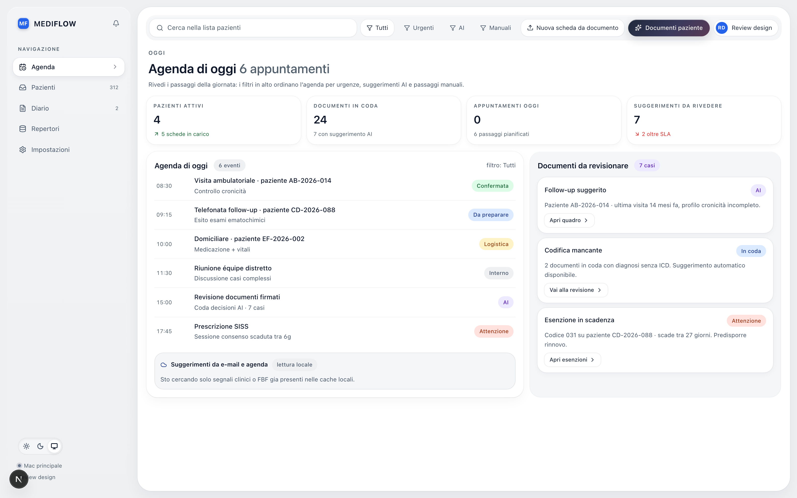

# MediFlow v0.5.0

> Cartella clinica territoriale local-first.  
> Privata per impostazione, veloce nell’uso, concreta nel metodo.



## Perché MediFlow

MediFlow nasce dal lavoro reale con i pazienti, non da un esercizio teorico.

L’idea è semplice: una cartella clinica deve aiutare chi cura a ritrovare informazioni, seguire terapie, annotare decisioni, conservare documenti e mantenere continuità, senza trasformare ogni gesto in burocrazia digitale.

Nel contesto territoriale italiano questo bisogno è ancora più evidente: il tempo è poco, i dati sono sensibili, i percorsi sono spesso frammentati e gli strumenti disponibili non sempre rispettano il modo in cui il lavoro clinico viene davvero svolto.

MediFlow prova a rispondere a questo spazio: una base locale, leggibile, prudente e modulare per la gestione quotidiana dei pazienti.

Non nasce per sostituire i canali istituzionali, né per fingere integrazioni che non esistono. Nasce per dare ordine, continuità e controllo al lavoro clinico di tutti i giorni.

## L’idea

MediFlow è una web app locale per la gestione di dati clinici, terapie, note e documenti.

Il principio guida è **local-first**: il dato resta vicino a chi lo produce e lo usa. Il cloud non è un requisito per lavorare, e l’architettura è pensata per ridurre al minimo la dipendenza da servizi esterni.

La direzione è quella di uno strumento:

- sobrio nell’interfaccia;
- esplicito nei confini;
- prudente nell’uso dell’AI;
- rispettoso della privacy;
- adatto a crescere senza diventare opaco.

## Cosa trovi oggi

In questa versione MediFlow include:

- **web app locale** come superficie primaria di lavoro;
- **database SQLite cifrato**, con approccio zero-knowledge;
- **backup, audit e contratto `/api/v1`** resi più chiari ed espliciti;
- **AI locale** per insight e OCR, senza egress di default;
- **import documentale reviewable**, con smart import prudente;
- **modalità `home-base` read-only** per client Apple paired;
- **boundary SISS/FSE dichiarato in modo realistico**: handoff contestuale e percorso prescrittivo `webapp-assisted`, non integrazione regionale nativa già risolta;
- **preview profiles locali** per provare parti sperimentali senza sporcare il checkout stabile.

## Dal lavoro clinico al codice

MediFlow è sviluppato a partire da un’esigenza pratica: costruire uno strumento che rispetti il ritmo, le responsabilità e i limiti del lavoro territoriale.

La cartella clinica non è solo un archivio. È memoria operativa, supporto decisionale, continuità narrativa e protezione del dato.

Per questo il progetto dà importanza a tre aspetti:

1. **controllo locale del dato**;
2. **chiarezza dei flussi**;
3. **prudenza sulle automazioni**.

L’obiettivo non è aggiungere complessità, ma togliere attrito dove possibile.

## Il salto da `v0.3` a `v0.5`

Per chi arriva dalla `v0.3` pubblica, il salto principale non è solo tecnico.

La `v0.5` porta:

- più struttura sul dato;
- più chiarezza sui boundary;
- più prudenza nei flussi AI;
- più direzione sul lavoro multi-device;
- una distinzione più netta tra ciò che è già operativo e ciò che è ancora in definizione.

MediFlow resta un progetto in evoluzione, ma questa versione prova a rendere più leggibile la sua traiettoria.

## Cosa MediFlow non pretende di essere

MediFlow non vuole raccontare più di quanto possa dimostrare.

Per questo è importante chiarire alcuni punti:

- **nessun cloud obbligatorio**: il default resta locale;
- **nessuna app iPad/iPhone dichiarata come già completa**: la direzione multi-device esiste, ma il perimetro operativo attuale è `home-base + paired client`, con approccio read-only-first;
- **nessuna integrazione SISS/FSE certificata dichiarata senza prove**: il percorso attuale è contestuale e `webapp-assisted`, usando i canali ufficiali;
- **nessuna delega cieca all’AI**: l’AI locale può aiutare, ma non sostituisce revisione, giudizio clinico e responsabilità professionale.

## Perché open source

MediFlow nasce come progetto personale, ma ha senso solo se può diventare una base aperta, verificabile e migliorabile.

L’ambizione è costruire un gestionale clinico territoriale essenziale, gratuito, ispezionabile e adattabile: non un prodotto chiuso da subire, ma una base comune da comprendere, discutere e far crescere.

Open source, in questo caso, significa soprattutto:

- codice leggibile;
- documentazione chiara;
- confini dichiarati;
- nessuna promessa vaga;
- possibilità di controllo da parte di chi usa lo strumento.

## Documentazione

- [FAQ](./docs/FAQ.md)
- [Roadmap](./docs/ROADMAP.md)
- [Compliance](./docs/COMPLIANCE.md)
- [Document map](./docs/README.md)

## Avvio rapido

```bash
git clone https://github.com/Wulfgardr/mediflow
cd mediflow
npm install
./Start_MediFlow.command