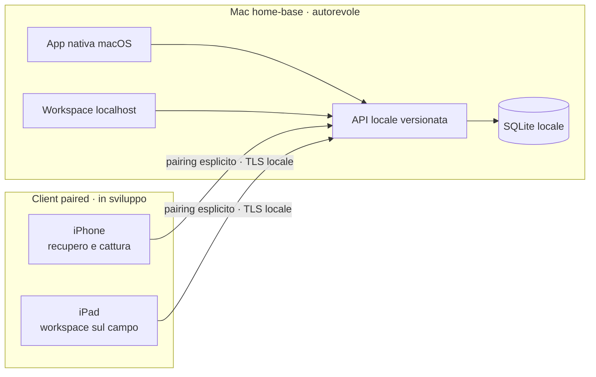
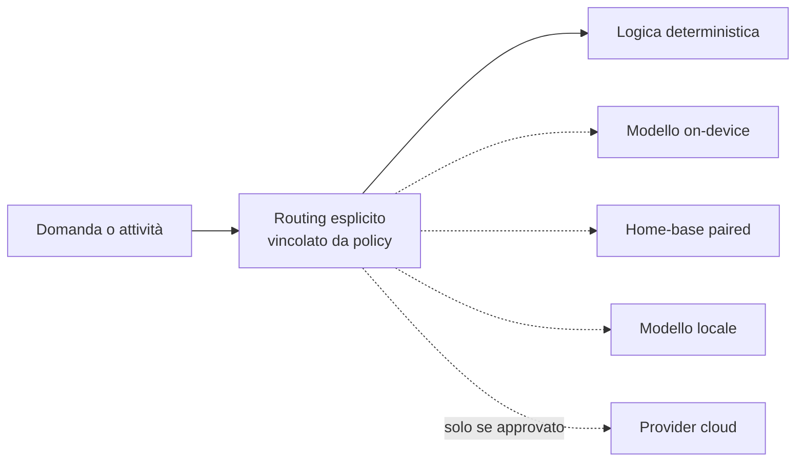
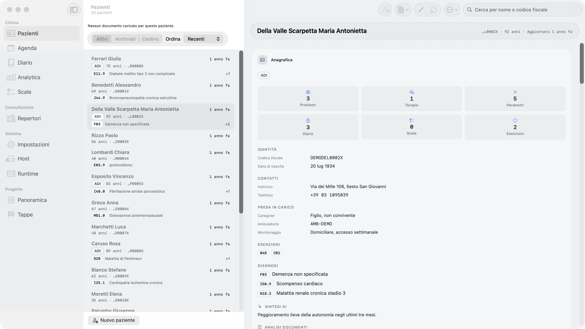
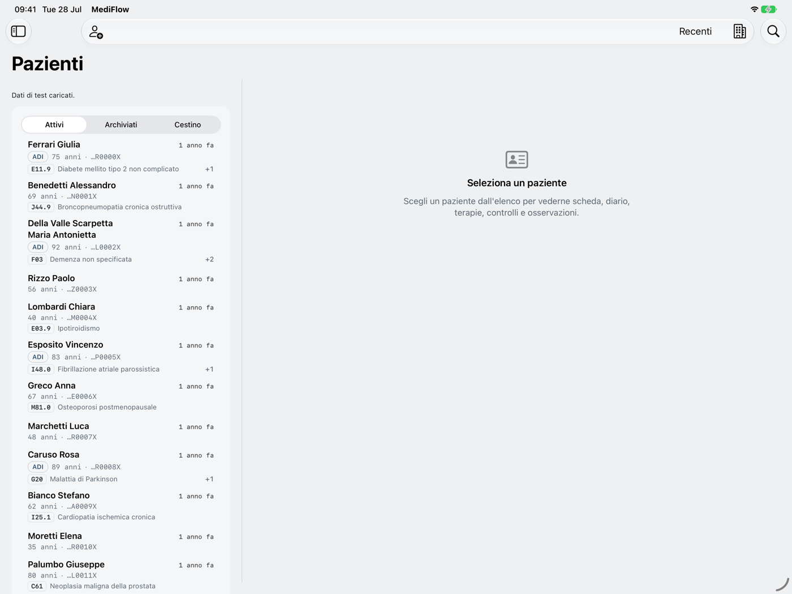
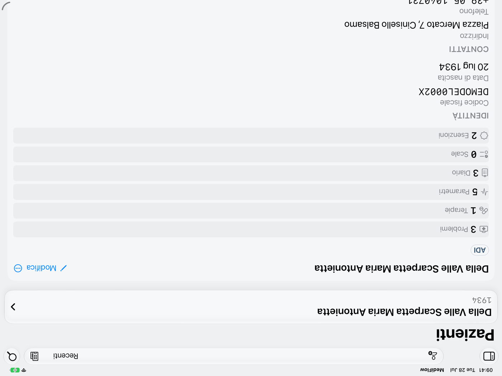
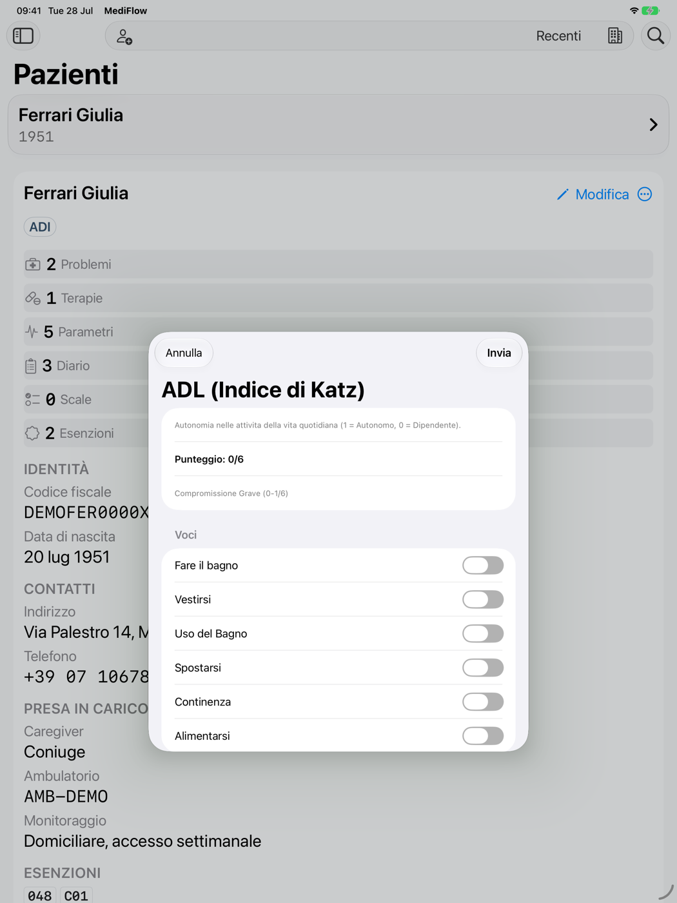
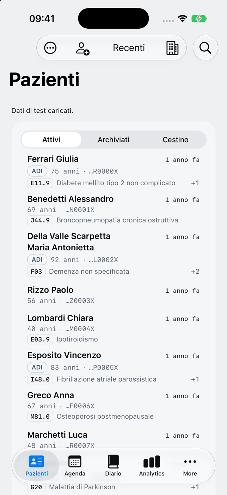
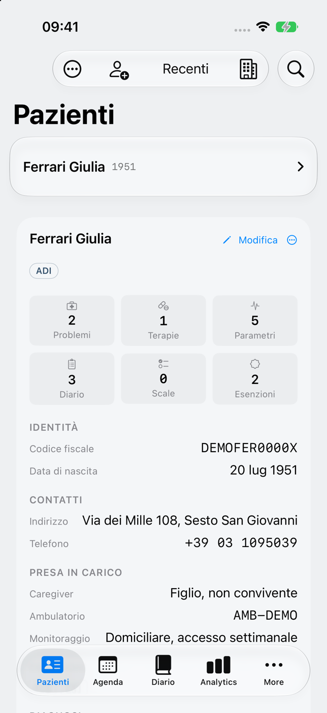
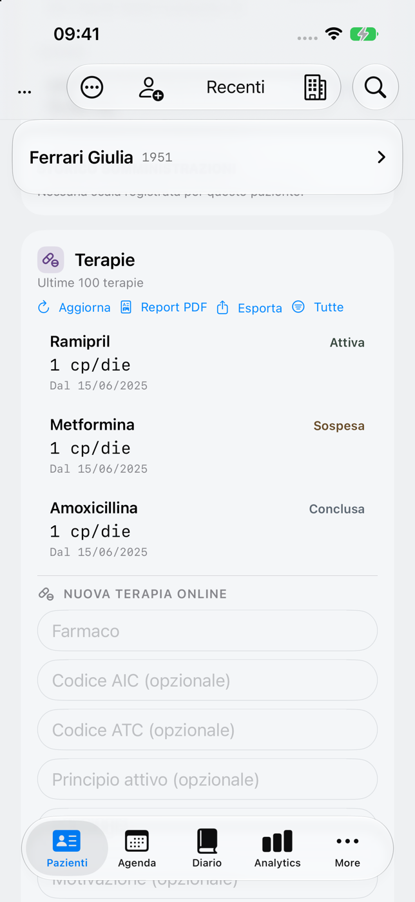

<div align="center">

<picture>
  <source media="(prefers-color-scheme: dark)" srcset="./docs/design/lume/icona/mediflow-icon-grafite.svg">
  <source media="(prefers-color-scheme: light)" srcset="./docs/design/lume/icona/mediflow-icon-giorno.svg">
  
</picture>

# MediFlow

<a href="https://claude.com/claude-code"></a>
<a href="https://openai.com/codex"></a>

_by Ordito & Concilio_

**Cartella clinica territoriale local-first, open source e libera da usare.**

**Porta l'informazione giusta nel momento giusto.**

[](./CHANGELOG.md)
[](./LICENSE)
[](#confini-dichiarati)
[](#candidata-sorgente-082)

[In breve](#mediflow-in-breve) · [Uso attuale](#come-si-usa-oggi) · [Architettura](#come-collaborano-le-app) · [Schermate](#come-si-presenta) · [Stato](#candidata-sorgente-082) · [Avvio](#avvio-rapido) · [Sviluppo](#sviluppo-assistito)

</div>

## MediFlow, in breve

MediFlow nasce dalle difficoltà operative reali dei medici. È un workspace
clinico open source e libero da usare. Aiuta a trovare un paziente, leggere la
sua storia, seguire terapie, controlli e documenti e preparare il passaggio
successivo. Non promette una pratica clinica senza attrito. Riduce l'attrito
evitabile senza nascondere complessità, provenienza, privacy e responsabilità
professionale.

Il prodotto è information-first, question-first e convenience-first. Non è
AI-first. Dati clinici, terminologie, reference data, ricerca, navigazione e
workflow deterministici restano funzioni di prima classe anche quando ogni
provider AI è disabilitato.

Il cloud non è un requisito per lavorare. Quando Ollama è configurato, alcune
funzioni locali possono preparare materiale da rivedere. Nessun output AI
aggiunge diagnosi, terapie o altri dati clinici strutturati senza un'azione
esplicita del medico.

Nel contesto territoriale italiano, MediFlow aiuta ad aprire la scheda giusta,
ritrovare la fonte, distinguere una terapia da una prestazione prescritta e
preparare la decisione successiva. Il medico verifica le evidenze e decide.
MediFlow non prescrive, non formula diagnosi autonome e non sostituisce il
giudizio clinico.

MediFlow non sostituisce SISS, FSE o gli altri canali ufficiali. Sta accanto al
lavoro clinico quotidiano, con confini dichiarati e verificabili.

Lo sviluppo avviene nella repository pubblica
[`Wulfgardr/mediflow`](https://github.com/Wulfgardr/mediflow). Database, dati
sanitari, credenziali e altri artefatti locali restano fuori da Git secondo
[`SECURITY.md`](./SECURITY.md) e
[`docs/repository-topology.md`](./docs/repository-topology.md).

## Come si usa oggi

La superficie operativa principale è il workspace web su localhost, avviato sul
Mac home-base. Qui MediFlow offre i flussi più estesi per pazienti, diario,
agenda, documenti, impostazioni e amministrazione locale. Il database resta sul
Mac.

L'app nativa macOS appartiene allo stesso home-base e offre un accesso desktop
coerente con il prodotto. iPhone e iPad sono client paired in sviluppo. Hanno
già una base funzionale consolidata, ma richiedono ancora lavoro prima dell'uso
operativo quotidiano.

## Come collaborano le app

Il Mac è il nodo autorevole (`home-base`). Ospita il database, l'app nativa e il
workspace web locale. iPhone e iPad usano l'API locale versionata dopo un
pairing esplicito. Localhost è oggi la superficie operativa principale. iPhone
privilegia consultazione e cattura rapide; iPad è progettato come workspace sul
campo. I dispositivi paired non accedono direttamente a SQLite.


```mermaid
flowchart LR
    subgraph paired["Client paired · in sviluppo"]
        iphone["iPhone<br/>recupero e cattura"]
        ipad["iPad<br/>workspace sul campo"]
    end
    subgraph mac["Mac home-base · autorevole"]
        native["App nativa macOS"]
        web["Workspace localhost"]
        api["API locale versionata"]
        db[("SQLite locale")]
        native --> api
        web --> api
        api --> db
    end
    iphone -- "pairing esplicito · TLS locale" --> api
    ipad -- "pairing esplicito · TLS locale" --> api
```

Le app condividono capacità e significato clinico, non la stessa disposizione
pixel per pixel. Trasporto, pairing e limiti del data plane sono documentati in
[`docs/topologia-dati-flussi.md`](./docs/topologia-dati-flussi.md).

### Uno sguardo oltre la 0.8: Intelligence Fabric

> **Direzione futura, non presente come funzione completa nella 0.8.**

L'Intelligence Fabric potrà collegare una domanda o attività alla sede di
esecuzione consentita dalla policy. Il routing dovrà essere esplicito,
osservabile e `fail-closed`.


```mermaid
flowchart LR
    task["Domanda o attività"] --> policy["Routing esplicito<br/>vincolato da policy"]
    policy --> deterministic["Logica deterministica"]
    policy -.-> device["Modello on-device"]
    policy -.-> paired["Home-base paired"]
    policy -.-> local["Modello locale"]
    policy -. "solo se approvato" .-> cloud["Provider cloud"]
```

Non esiste fallback silenzioso verso il cloud. MediFlow resta utile quando tutti
i provider AI sono disabilitati. Provenienza, identità del paziente, sede di
esecuzione, incertezza e revisione del medico dovranno restare visibili.

## Come si presenta

### Workspace operativo su localhost


### App nativa macOS



### Client iPad in sviluppo

<table>
<tr>
<td></td>
<td></td>
</tr>
</table>

<p align="center"></p>

### Client iPhone in sviluppo

<table>
<tr>
<td></td>
<td></td>
<td></td>
</tr>
</table>

_Catture reali della candidata Apple e della build web di produzione. La
galleria presenta prima le superfici del Mac home-base e poi i client paired in
sviluppo. Le viste cliniche usano soltanto fixture sintetiche, deterministiche
e versionate nel repository. Nessun dato paziente reale. Le viste web ristrette
a dimensioni telefono o tablet restano evidenze di test e non fanno parte
della galleria. Il [manifest media 0.8](./screenshots/0.8/manifest.json)
registra dispositivo, runtime, scena, commit sorgente e hash._

## Candidata sorgente 0.8.2

`0.8.2` è il prossimo progressivo sorgente. Questa branch prepara i metadati e
le note, ma non è una release pubblicata e non contiene ancora i commit finali
delle PR 174 e 175. Tag, GitHub Release e merge richiedono un'autorizzazione
separata.

Il delta previsto rafforza i confini di scrittura clinica, i messaggi delle API
e i controlli di CI. Allinea anche le fixture Apple ai contratti dell'host.

La prova iPad aggiunge quattro contratti UI su Xcode 27 e iPadOS 27. I quattro
test sono passati senza fallimenti e senza skip. Le prove usano solo fixture
sintetiche.

Queste prove non dichiarano parity completa o conformità accessibilità. Il
limite VoiceOver mobile resta registrato in
[`docs/known-limitations.md`](./docs/known-limitations.md).

### Stato del delta

Le modifiche già presenti su `main` richiedono una revisione umana prima di
ogni scrittura clinica proposta dall'AI. Il candidato WUL-547 impedisce alle
API di esporre messaggi grezzi delle eccezioni; resta fuori da questa branch
finché la testa revisionata non viene pubblicata e integrata tramite PR 174.

I controlli dello schema e OpenAPI sono già collegati ai workflow pertinenti.
Il candidato WUL-544 completa il percorso Apple e iPad; resta fuori da questa
branch finché la testa revisionata non viene pubblicata e integrata tramite PR
175.

La compatibilità tra un client Apple aggiornato e un host precedente resta
aperta. WUL-546 conserva il limite e la decisione di contratto.

Il dettaglio è nel [CHANGELOG](./CHANGELOG.md). La fotografia completa vive in
[`docs/STATE_OF_THE_SYSTEM.md`](./docs/STATE_OF_THE_SYSTEM.md); la matrice
parity canonica vive in [`docs/parity-matrix.md`](./docs/parity-matrix.md).

### Modelli e servizi opzionali

Le funzioni deterministiche restano disponibili senza un modello. Il percorso
AI locale usa Ollama ed è disponibile quando Ollama è configurato.
L'architettura separa il servizio applicativo dal connettore del modello. Oggi
è operativo soltanto il connettore Ollama.

Una futura modifica può aggiungere plug-in opzionali per modelli locali, LAN o
cloud. Le regole dell'organizzazione e la scelta esplicita dell'utente devono
consentire ogni attivazione.

La direzione post-0.8 prende il nome di **Intelligence Fabric**: una capability
potrà usare logica deterministica, un modello on-device, un home-base paired, un
modello locale o un provider cloud approvato. Il routing dovrà essere esplicito,
osservabile, vincolato da policy e fail-closed. Questa direzione non è una
funzione completa della 0.8.

Un fornitore esterno può offrire più capacità o ridurre alcuni tempi di
elaborazione. Non è un requisito e non implica una promessa clinica.

Prima di ogni invio servono minimizzazione, controlli verificati, registrazione
locale e abilitazione esplicita. La redazione o pseudonimizzazione deve essere
dimostrata per il flusso specifico. MediFlow non dichiara anonimizzazione
garantita.

Il controllo dell'invio esterno resta oggi chiuso. Nessun plug-in esterno accede
direttamente al database. Il flusso separa proposta, chiarimento e scrittura
autorizzata; la scrittura diretta tramite modello non è consegnata.

L'[ADR 0086](./docs/adr/0086-intelligent-scaffold-and-graded-automation-boundary.md)
definisce il contratto comune post-0.8 per Document Ops, riconciliazione
anagrafica, sunto clinico, Atena e provider. Distingue le funzioni presenti
dalla roadmap e non modifica il candidato 0.8. La futura inbox conversazionale
e l'automazione graduata non sono funzioni live della 0.8.

## Confini dichiarati

MediFlow non racconta più di quanto possa dimostrare.

- **Il default è locale.** Nessun cloud obbligatorio, nessuna telemetria o
  uscita dati attiva per impostazione iniziale.
- **I fornitori esterni non sono operativi.** L'estensione a plug-in richiede
  attivazione esplicita, registrazione locale e controlli sull'invio esterno.
- **iPhone e iPad non sono app complete.** Il perimetro operativo è
  `home-base + client paired`; cache offline e alcune superfici derivate dai
  documenti restano parziali o disponibili solo sull'host.
- **Windows e Linux non hanno ancora parity applicativa.** La release verifica il
  core Swift condiviso e il runtime di base, non applicazioni complete su ogni
  piattaforma.
- **SISS e FSE restano un handoff assistito.** MediFlow apre il contesto giusto,
  ma non dichiara sincronizzazione FSE, writeback regionale o invio
  prescrittivo diretto.
- **L'AI resta review-first.** Può aiutare a leggere e organizzare, non
  sostituisce revisione, giudizio clinico o responsabilità professionale.
- **La inbox intelligente non è consegnata.** Le route conversazionali di base
  non costituiscono un flusso di chiarimento o conversione in record clinici.

Delle 43 capability per cui la parity è un obiettivo, 30 sono complete e 13
parziali; altre 21 restano intenzionalmente host-only. La matrice fa fede sui
conteggi e sul significato di ciascuno stato.

## Avvio rapido

```bash
git clone https://github.com/Wulfgardr/mediflow
cd mediflow
nvm use
npm ci
```

MediFlow richiede Node.js 24.x. Installazione, build e launcher verificano anche
che il binding nativo `better-sqlite3` appartenga alla stessa ABI di Node.

Poi usa il launcher della tua piattaforma:

| OS | Comando |
| :-- | :-- |
| macOS | `./Start_MediFlow.command` |
| Windows | `powershell -ExecutionPolicy Bypass -File .\Start-MediFlow.ps1` |
| Linux | `./scripts/start-mediflow.sh` |

Apri `http://localhost:3000`. Ollama, Docker e ICD-11 sono opzionali; senza,
MediFlow resta usabile con funzionalità ridotte.

## Documentazione

| Documento | Cosa contiene |
| :-- | :-- |
| [FAQ](./docs/FAQ.md) | Risposte rapide alle domande più comuni |
| [Stato del sistema](./docs/STATE_OF_THE_SYSTEM.md) | La fotografia completa e aggiornata |
| [Roadmap](./docs/ROADMAP.md) | Dove sta andando il progetto |
| [Compliance](./docs/COMPLIANCE.md) | Privacy, GDPR e confini regolatori |
| [Crediti](./CREDITS.md) | Fonti, modelli, librerie e ispirazioni con licenze |
| [Mappa documentale](./docs/README.md) | La guida alla documentazione canonica |

## Fonti e attribuzioni

La prima lingua visiva del cockpit è derivata da
[Kree8](https://www.kree8.studio/), tradotta in un'implementazione clinica
originale. Il ragionamento terapeutico review-only usa
[ATHENA](https://github.com/mims-harvard/ATHENA) di mims-harvard, con licenza
MIT. Il lavoro sulla visita registrabile prende a riferimento l'ecosistema
Fluid.

Modelli, runtime, librerie e ispirazioni, con URL, ruolo e licenza, sono in
**[CREDITS.md](./CREDITS.md)**.

L'icona MediFlow porta in primo piano il **Filo del diario**, la stessa geometria
che connette le voci cliniche lungo il tempo. Concetto, registri giorno/grafite
e asset sono documentati nella [specifica dell'icona](./docs/design/lume/09-icona.md).

## Sviluppo assistito

Scrivo MediFlow da medico, con un aiuto sostanziale e dichiarato di strumenti di
sviluppo assistito da AI.

[Codex](https://openai.com/codex) e
[Claude Code](https://claude.com/claude-code) hanno contribuito a progettazione,
implementazione, review e verifica. Le proposte dei modelli restano materiale da
controllare: test reali e guard automatici decidono se una modifica regge.

<!-- usage-dashboard:start -->

| Snapshot | Periodo dei log disponibili | Token di sessione | Ripartizione | Cache letta | Copertura storica |
| :-- | :-- | --: | :-- | --: | :-- |
| **10 agosto 2026** | 2026-04-20 → 2026-08-10 | **34.402.274.768** | Codex 26.627.582.540 · Claude Code 7.774.692.228 | 32.815.994.682 (95,4%) | Codex UNKNOWN · Claude Code attestata |


La fonte è **CodexBar 0.48.1**, comando locale `cost --refresh`, con una finestra massima di 365 giorni. Il conteggio usa gli aggregati disponibili per Codex e Claude Code e non è filtrato per repository. CodexBar attribuisce ogni token al processo che lo registra. Un worker OpenAI avviato da Claude Code compare quindi nel totale Claude Code. Il grafico indica lo strumento che registra i token, non il fornitore del modello.

**ATTESTATO:** i valori sono le somme esatte dei log disponibili nel periodo indicato. **STIMATO:** nessun valore. **UNKNOWN:** la completezza storica resta sconosciuta quando CodexBar non la attesta. L'attribuzione a MediFlow, a una release, a una PR o a un commit è sempre sconosciuta.

Rigenera il grafico con `npm run build:usage-dashboard`. Usa `CODEXBAR_BIN` per scegliere un eseguibile diverso e `USAGE_DASHBOARD_DAYS` per impostare una finestra da 1 a 365 giorni.

Le barre sono divise per modello e usano la stessa scala. La cache letta è una parte dell'input Codex, mentre CodexBar la espone come categoria separata per Claude Code: per questo il grafico non impila categorie di token con semantiche diverse. Sono pubblicati soltanto aggregati. Nessun prompt, contenuto di sessione, costo o percorso locale entra nel README o nell'SVG.

Il dato misura contesto elaborato. Non misura righe di codice, costo o qualità.

La responsabilità del progetto resta mia.

<!-- usage-dashboard:end -->

Lo snapshot pubblicato in precedenza (17,56 miliardi al 15 luglio 2026) usava una
pipeline di conteggio diversa e non è direttamente confrontabile con questo.

## Licenza

MIT License.

---

Progettato in Italia.
