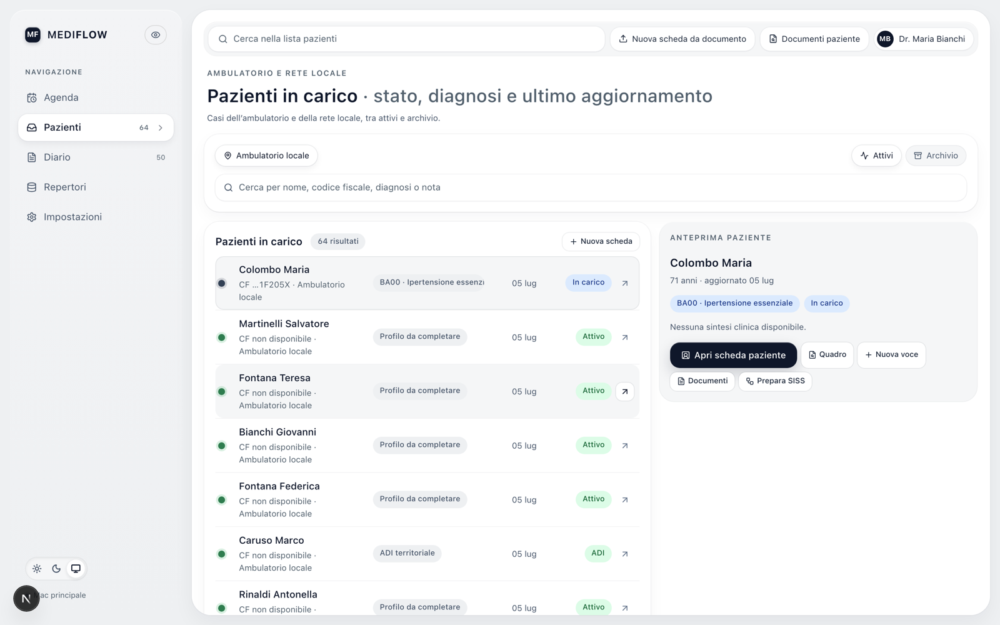
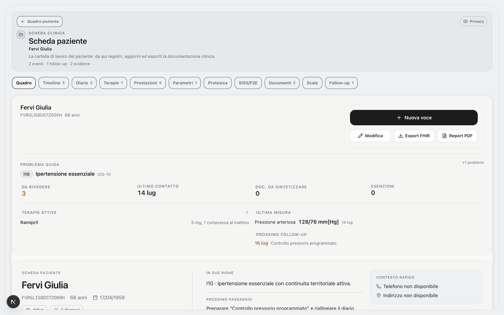
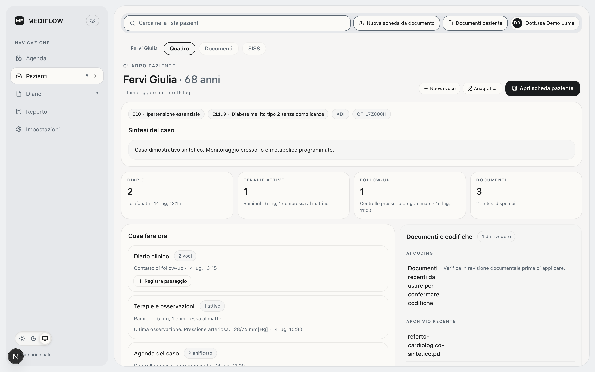
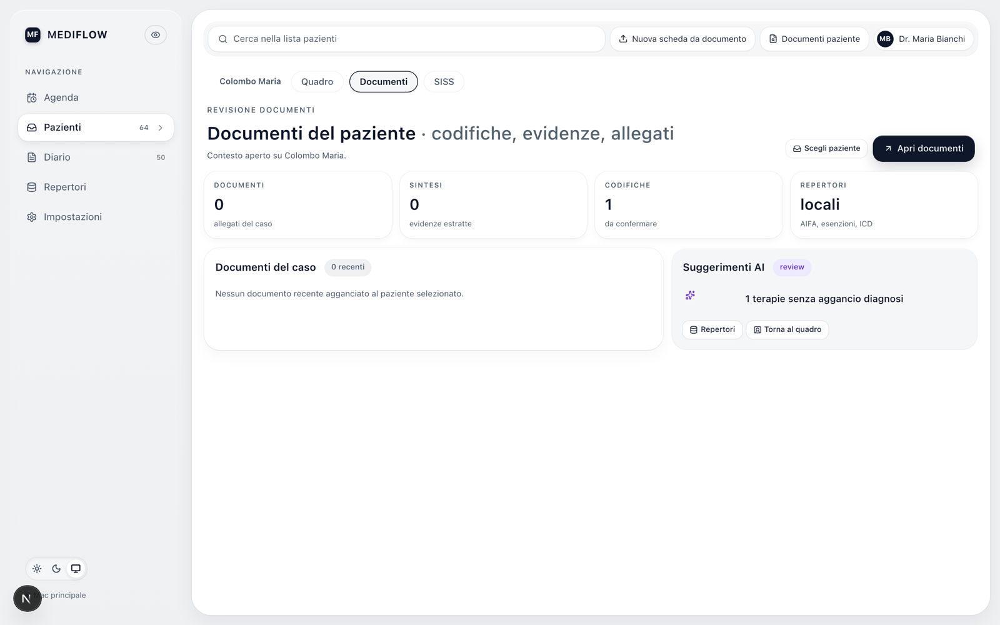
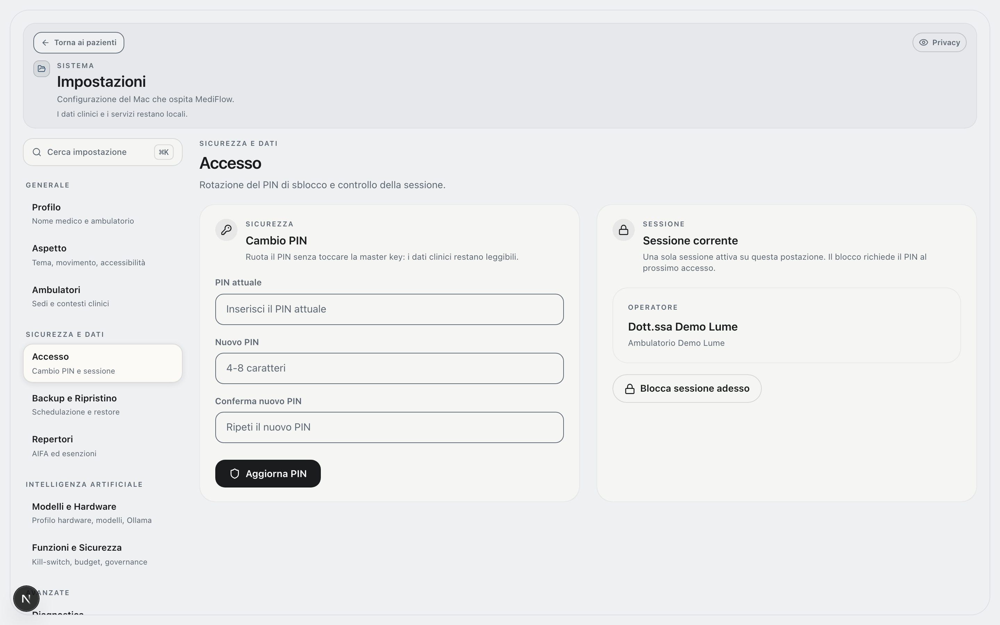
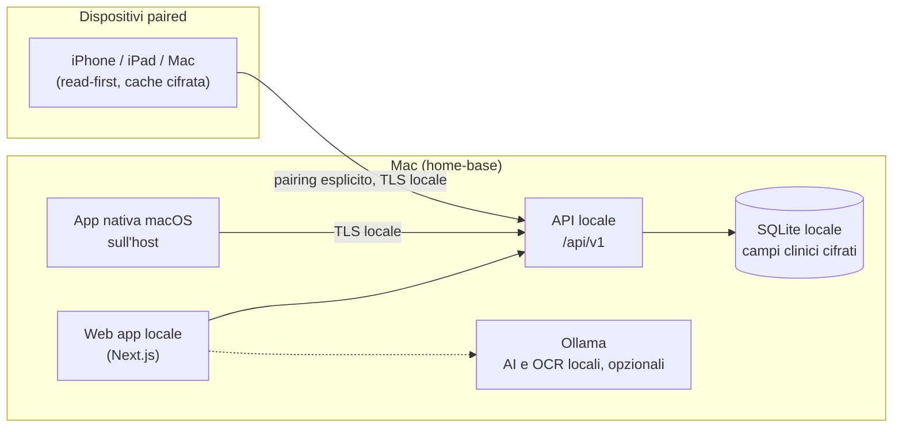
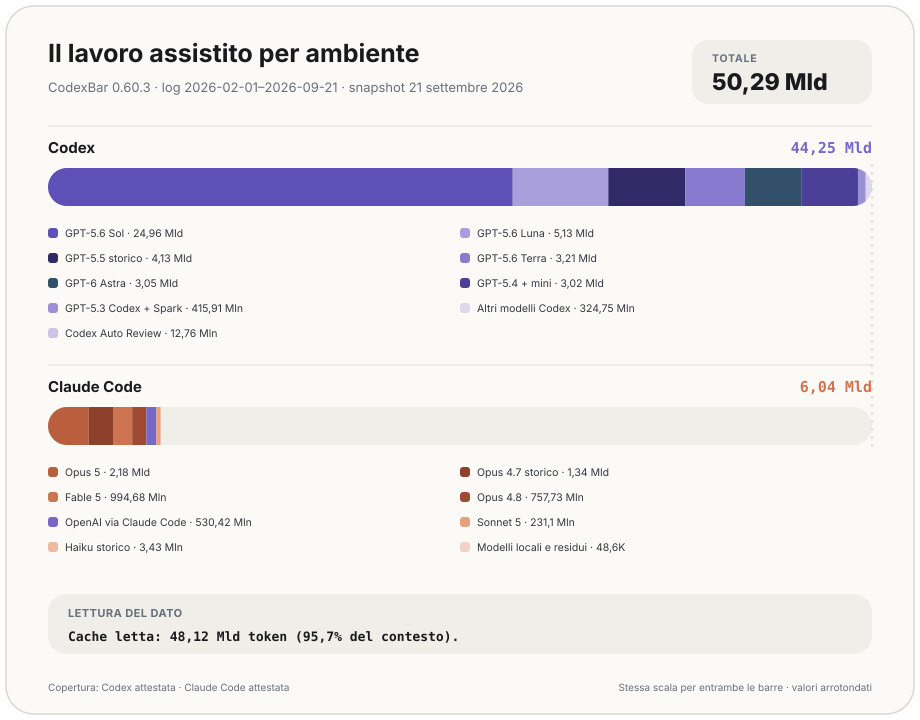

<div align="center">

# MediFlow

_by Ordito & Concilio_

**Cartella clinica territoriale local-first.**

Per ritrovare informazioni, seguire terapie e tenere il filo del lavoro clinico,
senza consegnare i dati a un cloud per poter lavorare.

[](./CHANGELOG.md)
[](./LICENSE)
[](#confini-dichiarati)
[](#stato-073)

[In breve](#mediflow-in-breve) · [Schermate](#come-si-presenta) · [Architettura](#come-è-fatto) · [Stato](#stato-073) · [Avvio](#avvio-rapido) · [Sviluppo](#sviluppo-assistito)

</div>

## MediFlow, in breve

MediFlow nasce dal lavoro reale con i pazienti. Serve a raccogliere dati
clinici, terapie, note e documenti in una scheda che resti leggibile anche
quando il percorso si allunga e le fonti si moltiplicano.

Il principio è semplice: il dato resta vicino a chi lo produce e lo usa. Il Mac
ospita la base autorevole; il cloud non è un requisito per lavorare. L'AI, quando
c'è, gira in locale e propone materiale da rivedere. Non prende decisioni e non
scrive dati clinici in autonomia.

Nel contesto territoriale italiano questo significa soprattutto togliere
attrito: aprire la scheda, capire dove si è, ritrovare una fonte, distinguere una
terapia da una prestazione prescritta e preparare il passaggio successivo senza
confondere supporto operativo e integrazione istituzionale.

MediFlow non sostituisce SISS, FSE o gli altri canali ufficiali. Sta accanto al
lavoro clinico quotidiano, con confini dichiarati e verificabili.

Lo sviluppo avviene nella repository pubblica
[`Wulfgardr/mediflow`](https://github.com/Wulfgardr/mediflow). Database, dati
sanitari, credenziali e altri artefatti locali restano fuori da Git secondo
[`SECURITY.md`](./SECURITY.md) e
[`docs/repository-topology.md`](./docs/repository-topology.md).

## Come si presenta



_Render reali delle superfici web che adottano Lume, la lingua visiva di
MediFlow. Catturati dalla build di produzione con dati dimostrativi sintetici.
Nessun dato paziente reale._

<details>
<summary><b>Altre schermate</b>: scheda paziente, quadro clinico, revisione documenti e sicurezza</summary>
<p></p>
<p></p>
<p></p>
<p></p>
</details>

## Come è fatto

Il Mac è il nodo autorevole (`home-base`): ospita database e web app. Gli altri
dispositivi non parlano direttamente con SQLite, ma con l'API locale, dopo un
pairing esplicito.


```mermaid
flowchart LR
    subgraph mac["Mac (home-base)"]
        web["Web app locale<br/>(Next.js)"]
        api["API locale<br/>/api/v1"]
        db[("SQLite locale<br/>campi clinici cifrati")]
        ai["Ollama<br/>AI e OCR locali, opzionali"]
        web --> api --> db
        web -.-> ai
        native["App nativa macOS<br/>sull'host"]
        native -- "TLS locale" --> api
    end
    subgraph paired["Dispositivi paired"]
        mobile["iPhone / iPad / Mac<br/>(read-first, cache cifrata)"]
    end
    mobile -- "pairing esplicito, TLS locale" --> api
```

Il diagramma mostra il percorso locale. Trasporto, pairing e limiti del data
plane sono documentati in
[`docs/topologia-dati-flussi.md`](./docs/topologia-dati-flussi.md).

## Stato 0.7.3

La 0.7.3 consolida il percorso local-first avviato dalla 0.7.2. Porta Lume sulle
prime superfici web e native, rende più modulare lo stack AI locale e rafforza
backup, cifratura dei campi clinici, packaging e controlli sui claim pubblici.

Restano aperti la migrazione completa dell'interfaccia, parte della parity dei
client paired e il collaudo manuale P6 sul bundle macOS. Il gate verso provider
AI esterni resta chiuso e non è consegnato alcun percorso di consenso o invio.

Il dettaglio è nel [CHANGELOG](./CHANGELOG.md). La fotografia completa vive in
[`docs/STATE_OF_THE_SYSTEM.md`](./docs/STATE_OF_THE_SYSTEM.md); la parity
versionata in [`docs/parity-matrix.md`](./docs/parity-matrix.md).

## Confini dichiarati

MediFlow non racconta più di quanto possa dimostrare.

- **Il default è locale.** Nessun cloud obbligatorio, nessuna telemetria o
  uscita dati attiva per impostazione iniziale.
- **iPhone e iPad non sono app complete.** Il perimetro operativo è
  `home-base + client paired`; cache offline e alcune superfici derivate dai
  documenti restano parziali o disponibili solo sull'host.
- **Windows e Linux non hanno ancora parity applicativa.** La 0.7.3 verifica il
  core Swift condiviso e il runtime di base, non applicazioni complete su ogni
  piattaforma.
- **SISS e FSE restano un handoff assistito.** MediFlow apre il contesto giusto,
  ma non dichiara sincronizzazione FSE, writeback regionale o invio
  prescrittivo diretto.
- **L'AI resta review-first.** Può aiutare a leggere e organizzare, non
  sostituisce revisione, giudizio clinico o responsabilità professionale.

Delle 43 capability per cui la parity è un obiettivo, 30 sono complete e 13
parziali; altre 21 restano intenzionalmente host-only. La matrice fa fede sui
conteggi e sul significato di ciascuno stato.

## Avvio rapido

```bash
git clone https://github.com/Wulfgardr/mediflow
cd mediflow
nvm use
npm ci
```

MediFlow richiede Node.js 24.x. Installazione, build e launcher verificano anche
che il binding nativo `better-sqlite3` appartenga alla stessa ABI di Node.

Poi usa il launcher della tua piattaforma:

| OS | Comando |
| :-- | :-- |
| macOS | `./Start_MediFlow.command` |
| Windows | `powershell -ExecutionPolicy Bypass -File .\Start-MediFlow.ps1` |
| Linux | `./scripts/start-mediflow.sh` |

Apri `http://localhost:3000`. Ollama, Docker e ICD-11 sono opzionali; senza,
MediFlow resta usabile con funzionalità ridotte.

## Documentazione

| Documento | Cosa contiene |
| :-- | :-- |
| [FAQ](./docs/FAQ.md) | Risposte rapide alle domande più comuni |
| [Stato del sistema](./docs/STATE_OF_THE_SYSTEM.md) | La fotografia completa e aggiornata |
| [Roadmap](./docs/ROADMAP.md) | Dove sta andando il progetto |
| [Compliance](./docs/COMPLIANCE.md) | Privacy, GDPR e confini regolatori |
| [Crediti](./CREDITS.md) | Fonti, modelli, librerie e ispirazioni con licenze |
| [Mappa documentale](./docs/README.md) | La guida alla documentazione canonica |

## Fonti e attribuzioni

La prima lingua visiva del cockpit è derivata da
[Kree8](https://www.kree8.studio/), tradotta in un'implementazione clinica
originale. Il ragionamento terapeutico review-only usa
[ATHENA](https://github.com/mims-harvard/ATHENA) di mims-harvard, con licenza
MIT. Il lavoro sulla visita registrabile prende a riferimento l'ecosistema
Fluid.

Modelli, runtime, librerie e ispirazioni, con URL, ruolo e licenza, sono in
**[CREDITS.md](./CREDITS.md)**.

## Sviluppo assistito

Scrivo MediFlow da medico, con un aiuto sostanziale e dichiarato di strumenti di
sviluppo assistito da AI.

[Codex](https://openai.com/codex) e
[Claude Code](https://claude.com/claude-code) hanno contribuito a progettazione,
implementazione, review e verifica. Le proposte dei modelli restano materiale da
controllare: test reali e guard automatici decidono se una modifica regge.

Uno snapshot dei log locali del 13 luglio 2026 conta circa **12,34 miliardi di
token di sessione**: 7,89 miliardi con Codex e 4,45 con Claude Code. Sono in gran
parte contesto riletto o recuperato dalla cache; misurano il volume del lavoro
assistito, non righe di codice o qualità.



Ogni colore corrisponde a un modello o a una famiglia vicina. Le due barre usano
la stessa scala: mostrano insieme il peso dei due ambienti e la loro composizione
interna. Non è una classifica di qualità, ma la fotografia di quali modelli hanno
assorbito più contesto durante lo sviluppo.

Per Codex i log registrano anche l'effort: `xhigh` è la quota maggiore, seguito
da `medium`, `high` e `low`. `Ultra` è mostrato a parte perché indica fan-out tra
più agenti, non un livello di ragionamento. Nei log storici di Claude Code
l'effort non è esposto in modo abbastanza uniforme; questa revisione del README
è stata eseguita con Opus 4.8 a effort `max`.

Il conteggio precedente del README usava una metodologia diversa e non è
direttamente confrontabile. La responsabilità del progetto resta mia.

## Licenza

MIT License.

---

Progettato in Italia.
