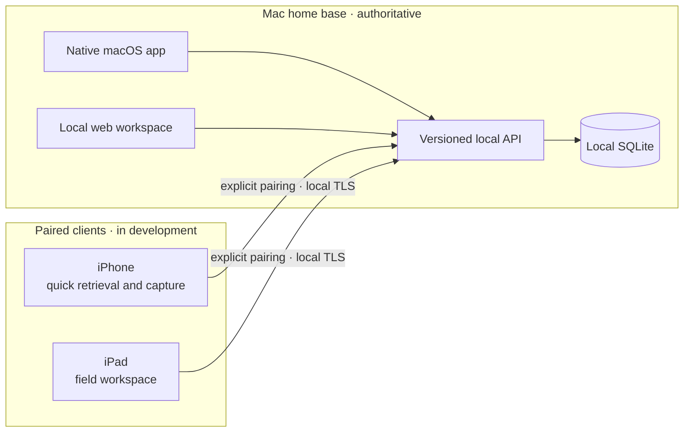
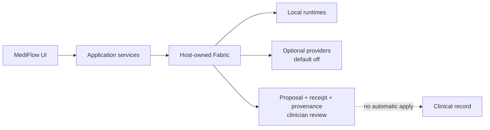

<div align="center">

<picture>
  <source media="(prefers-color-scheme: dark)" srcset="./docs/design/lume/icona/mediflow-icon-grafite.svg">
  <source media="(prefers-color-scheme: light)" srcset="./docs/design/lume/icona/mediflow-icon-giorno.svg">
  
</picture>

# MediFlow

<a href="https://claude.com/claude-code"></a>
<a href="https://openai.com/codex"></a>

_by Ordito & Concilio_

**A local-first clinical workspace for longitudinal community care.**

Keep the right information, its source, and the next decision in view.

[](https://github.com/Wulfgardr/mediflow/releases/latest)
[](./LICENSE)
[](#security-and-human-control)
[](#product-surfaces)

[Why MediFlow](#why-mediflow) · [Capabilities](#what-mediflow-does) · [Architecture](#one-authoritative-home-base) · [Intelligence](#intelligence-without-giving-up-control) · [Get started](#get-started) · [Documentation](#documentation)

</div>

## Why MediFlow

Clinical work rarely fails for lack of data. It becomes difficult when the
right detail is scattered across notes, documents, therapies, appointments,
tasks, and institutional systems just as a decision has to be made.

MediFlow brings those threads into one longitudinal workspace. It helps a
clinician find a person, understand what changed, return to the source, and
prepare the next action without pretending that clinical complexity can be
automated away.

The product is information-first and question-first, not AI-first. Records,
terminologies, source navigation, search, and deterministic workflows remain
first-class capabilities when every model provider is disabled.

## What MediFlow does

| Capability | What it is for |
| :-- | :-- |
| **Longitudinal record** | Read the clinical journal, diagnoses, therapies, measurements, exemptions, and administrative context together. |
| **Worklist and follow-up** | Keep appointments, open loops, tasks, and the next accountable action close to the record. |
| **Source-bound documents** | Import supported documents locally, preserve provenance, and return to the current source before review or use. |
| **AnyDoc extraction** | Extract supported attachments deterministically and use Apple Vision locally only for PDF pages that actually need OCR. |
| **Intelligence Fabric** | Route four named review-only lanes—Patient Insight, Smart Import, Document Synthesis, and Treatment Reasoning—through host-owned policy. |
| **Headless and MCP access** | Offer bounded terminology search, patient-scoped reads, semantic planning, and follow-up proposals without direct database access. |
| **Visit recording** | On macOS 26+, use an on-device, review-first recording and transcription path without an automatic clinical writer; real-microphone and clinical validation remain outside the current claim. |
| **Native and paired clients** | Use the Mac as the authoritative home base while iPhone and iPad evolve as explicitly paired clinical companions. |

## One authoritative home base

The Mac home base owns the local SQLite database, the versioned API, the web
workspace, and the native macOS application. Paired devices use the local API
after an explicit pairing flow; they never open the database directly.


```mermaid
flowchart LR
    subgraph clients["Paired clients · in development"]
        iphone["iPhone<br/>quick retrieval and capture"]
        ipad["iPad<br/>field workspace"]
    end
    subgraph home["Mac home base · authoritative"]
        native["Native macOS app"]
        web["Local web workspace"]
        api["Versioned local API"]
        db[("Local SQLite")]
        native --> api
        web --> api
        api --> db
    end
    iphone -- "explicit pairing · local TLS" --> api
    ipad -- "explicit pairing · local TLS" --> api
```

Each surface follows the same clinical meaning without forcing a pixel-for-pixel
copy. The detailed transport, pairing, and data-plane boundaries are documented
in [Data topology and flows](./docs/topologia-dati-flussi.md).

## Intelligence without giving up control

MediFlow's Intelligence Fabric connects each supported task to an explicitly
allowed execution host. Local Ollama and ATHENA/MLX runtimes can serve assigned
capabilities. OpenAI and Anthropic adapters are integrated but remain off by
default and require explicit host-owned configuration, policy, lifecycle, and
secret handling. The source tree does not claim live account, network,
retention, or clinical-data readiness. There is no silent cloud fallback.


```mermaid
flowchart LR
    ui["MediFlow UI"] --> services["Application services"]
    services --> fabric["Host-owned Fabric"]
    fabric --> local["Local runtimes"]
    fabric --> optin["Optional providers<br/>default off"]
    fabric --> review["Proposal + receipt + provenance<br/>clinician review"]
    review -. "no automatic apply" .-> record["Clinical record"]
```

Every generative lane is `proposal_only`. Its preview carries provenance,
receipt, and currentness information, but those signals do not grant authority
to write. The clinician reviews the evidence and decides. MediFlow does not
diagnose, prescribe, or replace professional judgement.

The headless supervisor keeps the web runtime and MCP adapter as separate
children of one trusted host. MCP can perform bounded, patient-scoped reads and
create a follow-up preview. Mini shares the typed catalog and CLI foundation,
but has no production Supervisor binding in 0.8.5 and fails closed without a
parent AIP channel. A protected state transition still
requires the trusted MediFlow UI, an active clinical role, a current resource
reread, step-up proof, and an operation-specific gesture. The semantic planner
is closed-world, read-only, and limited to approved terminology and Open Loops
tools.

## Security and human control

MediFlow is designed around a small set of enforceable defaults:

- authoritative records stay on the home base; optional egress is scoped by
  capability and data class, requires explicit configuration, and does not
  establish live clinical-data readiness;
- no cloud provider, telemetry, or external AI is enabled in a fresh
  installation;
- paired clients, MCP adapters, and model runtimes do not receive direct SQLite
  access;
- patient context, leases, revocation, current-source checks, compare-and-swap,
  idempotency, audit, and receipts are enforced at their owning boundary;
- AI output remains review-first and cannot silently become structured clinical
  data;
- repository tests and screenshots use synthetic fixtures only; real clinical
  data, databases, credentials, and authenticated corpora stay outside Git.

These controls are intended to support privacy by design, data minimisation,
human oversight, and accountable operation under European healthcare
expectations. They are engineering controls, not a certification, legal
assurance, or substitute for an organisation's own regulatory assessment. See
[Security](./SECURITY.md) and [Compliance](./docs/COMPLIANCE.md) for the exact
boundaries.

## Built in Italy, designed to localise

MediFlow is built in Italy, and some current workflows reflect Italian
community care and the Lombardy health system. Assisted hand-offs to systems
such as SISS and FSE, local terminology, exemptions, and regional operational
patterns therefore have specific meaning today.

SISS and FSE hand-offs already use bounded interfaces rather than becoming
part of the clinical core. Other regional assumptions are still being
isolated. The long-term direction is to make region-specific modules
replaceable or removable while preserving the same local-first record,
provenance, authority, and review model for other healthcare settings.

## Product surfaces

### Local web workspace


### Native macOS workspace


### iPad client in development

<table>
<tr>
<td></td>
<td></td>
</tr>
</table>

### iPhone client in development

<table>
<tr>
<td></td>
<td></td>
<td></td>
</tr>
</table>

All clinical screenshots use synthetic, deterministic fixtures. Capture
provenance is recorded in the [0.8 media manifest](./screenshots/0.8/manifest.json).

| Surface | Current role |
| :-- | :-- |
| Local web workspace | Primary operational surface on the Mac home base |
| Native macOS app | Desktop access to the same authoritative home base |
| iPhone and iPad | Paired clients in active development; not complete standalone apps |
| Swift shared core | Built on macOS, Linux, and Windows; this is core portability, not full application parity |

The canonical capability counts and per-surface status live in the
[Parity matrix](./docs/parity-matrix.md). Known product limits remain explicit
in [Known limitations](./docs/known-limitations.md).

## Get started

MediFlow requires Node.js 24.x. Installation, build, and launch checks also
verify that the native `better-sqlite3` binding matches the active Node ABI.

```bash
git clone https://github.com/Wulfgardr/mediflow
cd mediflow
# If you use nvm:
nvm use
npm ci
```

Then use the launcher for your platform:

| Platform | Command |
| :-- | :-- |
| macOS | `./Start_MediFlow.command` |
| Windows | `powershell -ExecutionPolicy Bypass -File .\Start-MediFlow.ps1` |
| Linux | `./scripts/start-mediflow.sh` |

Each launcher prints the product version, absolute checkout, and source
fingerprint. If port `3000` belongs to another checkout or an unrelated
service, startup stops instead of opening a stale or foreign instance.

Open `http://localhost:3000`. Ollama, ATHENA/MLX, WHO ICD-11 access, and
external providers are optional and remain unavailable when they have not been
configured explicitly.

For the native Apple workspace and its current prerequisites, see
[Native applications](./docs/NATIVE.md). The local headless Supervisor and its
authority boundary are described by [ADR 0117](./docs/adr/0117-headless-portable-agent-first-and-capability-first-fabric.md)
and the [end-to-end walkthrough](./docs/walkthrough.md).

### Headless MCP quickstart

Build the standalone web runtime, then start the trusted Supervisor. The
process keeps MCP on `stdio`; an MCP client normally owns its lifecycle and
launches this command directly rather than opening another network listener.

```bash
npm run build -- --webpack
npm run mcp:intelligent-host:production
```

Authenticate in the local web workspace, select the intended record, and
explicitly activate Intelligent Host for that record before a patient-scoped
grant can exist. Revocation, logout, a selection change, or lease expiry closes
the grant. The command does not onboard an external host, enable Mini, grant
general database access, or authorize a clinical write.

## Documentation

| Document | Purpose |
| :-- | :-- |
| [System state](./docs/STATE_OF_THE_SYSTEM.md) | Canonical current implementation status and claim ceiling |
| [Product](./PRODUCT.md) | Product principles, roles, and supported workflows |
| [Architecture](./ARCHITECTURE.md) | System boundaries and architectural invariants |
| [Roadmap](./docs/ROADMAP.md) | Delivered milestones and future direction |
| [FAQ](./docs/FAQ.md) | Short answers to common questions |
| [Compliance](./docs/COMPLIANCE.md) | Privacy, GDPR-oriented controls, and regulatory boundaries |
| [Security](./SECURITY.md) | Threat boundaries, reporting, and safe handling |
| [Changelog](./CHANGELOG.md) | Version-specific public notes |
| [Credits](./CREDITS.md) | Models, libraries, sources, inspirations, and licences |
| [Documentation map](./docs/README.md) | Index of canonical and supporting documents |

## Assisted development

MediFlow is written by a physician with substantial, openly acknowledged help
from AI-assisted development tools. [Codex](https://openai.com/codex) and
[Claude Code](https://claude.com/claude-code) have contributed to design,
implementation, review, and verification. Their output remains a proposal:
tests, source review, and automated guards decide whether a change belongs in
the project.

The Filo icon—the journal thread and its present-time knot—connects the product
identity to MediFlow's longitudinal model. Its day and graphite variants are
documented in the [Lume icon specification](./docs/design/lume/09-icona.md).

## License

[MIT](./LICENSE)

---

Designed and built in Italy.
