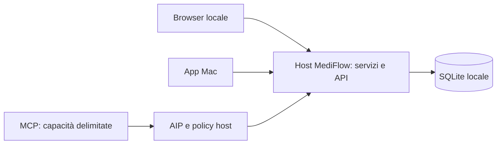

<!-- reconciliation-20260912 -->
> **Candidata ricostruita il 12 settembre 2026, non release.** Il perimetro vigente della 0.8.6 è Mac, localhost, backend, WHO/OpenAI e Headless sul Mac. Windows, Linux, Mini, iPhone e iPad sono rinviati alla 1.0; ATHENA è opzionale. Le prove storiche sotto conservano i propri SHA e non qualificano automaticamente questa ricostruzione. Il coordinamento resta [WUL-669](https://linear.app/wulfgardr/issue/WUL-669); proposte recuperate e servizi configurati non attestano funzionamento reale.

<div align="center">


# MediFlow

**Ritrova il filo.**

Il gestionale open source per i pazienti dell’ambulatorio.<br>
Informazioni, fonti e prossimi passi. Un po’ più facili da ritrovare.

<a href="https://claude.com/claude-code"></a>
<a href="https://openai.com/codex"></a>

[](./docs/analysis/2026-09-07-086-release-verification.md)
[](https://github.com/Wulfgardr/mediflow/releases/latest)
[](./LICENSE)
[](#dove-stanno-i-dati)
[](./docs/analysis/2026-09-07-086-release-verification.md)

[**Scopri Get MediFlow**](https://getmediflow.dev) · [Perché nasce](#perché-nasce) · [Cosa puoi fare](#cosa-puoi-fare) · [Provalo](#provalo) · [Per chi sviluppa](#per-chi-sviluppa) · [Documentazione](#documentazione)

</div>


*Interfaccia web 0.8.6 con soli dati sintetici; acquisizione del candidato `ddff0a929`.*

<details>
<summary><strong>Versione sorgente, verifiche e distribuzione</strong></summary>

> **0.8.6: candidata locale per Mac e browser localhost.**
> Backend, Intelligence Fabric e Headless operano sul Mac locale. L’adapter
> OpenAI è spento per default; se autorizzato, invia il contenuto preparato al
> servizio esterno. Le immagini usano soltanto
> dati sintetici. Windows, Linux, Mini, iPhone e iPad sono rinviati alla 1.0;
> ATHENA è opzionale. Una candidata, una build o una prova locale non equivalgono
> a release pubblicata, validazione clinica o disponibilità su altri sistemi.
> [Verifiche e limiti](./docs/analysis/2026-09-07-086-release-verification.md).

</details>

<details>
<summary><strong>Le terapie, da vicino</strong></summary>


Schermata reale con dati interamente sintetici.

</details>

## Perché nasce

MediFlow è un sistema di gestione elettronica dei pazienti dell’ambulatorio.
Organizza cartelle, diario, terapie, documenti, misure e attività da seguire.
Questa base funziona anche con tutti i modelli AI spenti.

Il percorso del paziente è una storia lunga. Una struttura coerente aiuta a
leggerla: dati codificati dove servono, testo per descrivere il contesto,
fonti consultabili per tornare al dettaglio.

Poi c’è ciò che una struttura, da sola, non risolve. Una terapia descritta in
un referto, un esame rilevante dentro un allegato, un controllo indicato e perso
tra le cose da fare. Le funzioni intelligenti aiutano a recuperare queste
informazioni e a servirle nel loro contesto. Richiedono capacità configurate
e revisione professionale: i modelli possono sbagliare.

### Ordine dove serve. Spazio per ragionare.

La ricerca terminologica, i cataloghi farmaceutici e le scale danno una forma
riconoscibile alle informazioni. Versione e provenienza contano: riferimenti,
cataloghi e strumenti di misura possono cambiare nel tempo.

Il catalogo AIFA può essere importato da file locale. Il servizio WHO ICD-11
richiede configurazione esplicita. L’export FHIR segue il contratto documentato
nell’[ADR 0081](./docs/adr/0081-fhir-r4-export-v0-contract.md): un formato
condiviso facilita lo scambio, ma non garantisce compatibilità con ogni sistema.
La parità FHIRv2 resta da verificare.

## Cosa puoi fare

| Esigenza | Strumento | Confine da conoscere |
| --- | --- | --- |
| Ricostruire la storia | Diario, diagnosi, terapie, misure e contesto amministrativo | Modifiche versionate; i conflitti richiedono riesame. |
| Ritrovare l'evidenza | Documenti collegati alla cartella e alle fonti | Estrazione locale dei formati supportati; errori espliciti. |
| Preparare il seguito | Checkup, appuntamenti e attese aperte | Una proposta di follow-up non attesta che l'azione sia stata eseguita. |
| Dare struttura alle parole | Ricerca terminologica e cataloghi | Il servizio WHO ICD-11 è opzionale e richiede configurazione esplicita. |
| Registrare una misura | Scale Web/native con risposte esplicite | Zero e risposta mancante sono distinti; fonte e versione restano nello storico. |
| Rivedere informazioni complesse | Quattro percorsi Intelligence Fabric | Output da rivedere, senza scrittura clinica automatica. |
| Usare capacità senza ogni schermata | Supervisor, AIP e MCP | Accessi delimitati; nessun accesso diretto al database per gli adapter. |

<details>
<summary><strong>Guarda la revisione documentale</strong></summary>


Interfaccia documentale con dati sintetici. La schermata non attesta
un’esecuzione AI, un’estrazione AnyDoc o un passaggio OCR.

</details>

### Intelligence Fabric, in parole semplici

Fabric è il coordinamento delle capacità intelligenti di MediFlow. Il sistema
locale decide quale percorso può essere usato, con quali fonti e con quali
limiti. La risposta del modello è una proposta da esaminare.

- **Patient Insight**: preparare una sintesi del contesto clinico.
- **Smart Import**: proporre informazioni strutturate da una fonte.
- **Document Synthesis**: mettere in relazione il contenuto dei documenti.
- **Treatment Reasoning**: supportare il riesame professionale con un percorso dedicato.

Ollama può servire i primi tre percorsi. ATHENA/MLX resta opzionale per
Treatment Reasoning e richiede configurazione e verifica locali. L’adapter
OpenAI è disponibile solo in prove controllate e spento per default: non esiste
un ripiego silenzioso sul cloud. La sua presenza non prova la disponibilità di
un account, del servizio o di un uso con dati clinici reali.

<details>
<summary><strong>Perché una proposta non è ancora una modifica</strong></summary>

Ogni percorso conserva provenienza, ricevuta e controllo che le fonti siano
ancora attuali. Queste evidenze permettono di rivedere il risultato; non gli
conferiscono autorità di scrittura. Le operazioni protette hanno propri
controlli di ruolo, contesto, conferma e audit.

[Confini Fabric e headless](./docs/adr/0117-headless-portable-agent-first-and-capability-first-fabric.md).

</details>

<details>
<summary><strong>Provider esterni e offuscamento: il percorso in sviluppo</strong></summary>

La scelta di un provider esterno è esplicita. Il percorso previsto minimizza il
contenuto in uscita, sostituisce gli identificativi e riconcilia il risultato
in locale. È un rollout progressivo: non una protezione già disponibile per
ogni funzione. Il testo narrativo clinico resta bloccato finché i controlli
richiesti non sono pronti.

Pseudonimizzazione e anonimizzazione non sono equivalenti. Dati riconducibili
alla persona restano soggetti al GDPR. La presenza di un adapter non attesta
un servizio cloud clinico pronto all’uso.

[Matrice dei runtime](./docs/ai-runtime-serving-matrix.md) ·
[Decisione sul confine egress](./docs/adr/0077-ai-provider-abstraction-and-egress-anonymization-boundary.md)

</details>

## Dati sanitari e responsabilità

Accessi delimitati, fonti consultabili e revisione umana orientano il progetto.
La valutazione dell’uso concreto comprende finalità, ruoli, base giuridica,
sicurezza e obblighi applicabili. Il funzionamento locale non dimostra da solo
la conformità; la presenza di supervisione umana non è una certificazione.

[GDPR, AI Act e scelte di progetto](./docs/privacy-and-ai-governance.md).

## Dove stanno i dati

Il Mac è il nodo autorevole della candidata 0.8.6: conserva SQLite e ospita
servizi e API. Browser localhost e app Mac sono le interfacce nel perimetro
attuale. iPhone, iPad e gli altri sistemi restano rinviati alla 1.0.


```mermaid
flowchart LR
    web[Browser locale] --> host[Host MediFlow: servizi e API]
    mac[App Mac] --> host
    host --> db[(SQLite locale)]
    mcp[MCP: capacità delimitate] --> broker[AIP e policy host]
    broker --> host
```

Gli adapter non aprono direttamente SQLite. La cifratura
protegge campi clinici sensibili secondo il contratto documentato; non è un
claim di cifratura integrale di ogni metadato o del file database.

[Topologia dei dati](./docs/topologia-dati-flussi.md) ·
[Sicurezza](./SECURITY.md) · [Limiti noti](./docs/known-limitations.md)

## Provalo

Per partire dai sorgenti servono Git, **Node.js 24.x** e le dipendenze del
progetto. Usa fixture sintetiche per valutazioni e sviluppo.

```sh
git clone https://github.com/Wulfgardr/mediflow
cd mediflow
nvm use
npm ci
```

`nvm use` è necessario solo se usi nvm; negli altri casi seleziona Node 24 con
il tuo gestore. `better-sqlite3` deve corrispondere all'ABI del Node attivo.

| Ambiente Web locale | Avvio |
| --- | --- |
| macOS | `./Start_MediFlow.command` |

Apri `http://localhost:3000`. Il launcher verifica checkout e porta per evitare
di aprire un'altra istanza. Windows e Linux, Mini, iPhone e iPad non fanno parte
della candidata 0.8.6: sono rinviati alla 1.0.

I provider AI, il servizio WHO e gli altri connettori opzionali non si
attivano con questi comandi. La clone segue il ramo predefinito pubblico:
non è un'istruzione per ottenere una candidatura non ancora pubblicata.

<details>
<summary><strong>Apple: account gratuito, Xcode e distribuzione</strong></summary>

Xcode completo serve per compilare e testare le applicazioni Apple; le sole
Command Line Tools non coprono SwiftUI, XCTest e i relativi gate.
Un Apple Account gratuito consente sviluppo e prove personali entro i limiti
del Personal Team. Developer ID e notarizzazione Mac richiedono l'Apple
Developer Program. Non sono prerequisiti per pubblicare il codice sorgente.

[Guida nativa](./docs/NATIVE.md) ·
[Verifiche e limiti della candidata 0.8.6](./docs/analysis/2026-09-07-086-release-verification.md) ·
[Confronto ufficiale Apple](https://developer.apple.com/support/compare-memberships/)

</details>

## Per chi sviluppa

La repository operativa è soltanto [`Wulfgardr/mediflow`](https://github.com/Wulfgardr/mediflow).
La precedente repository privata è archiviata. Non esiste un export
private-to-OSS: codice pubblicabile e documenti vivono nella repository canonica;
database, credenziali, fonti riservate e output clinici restano fuori da Git.

[Topologia repository](./docs/repository-topology.md) ·
[Architettura](./ARCHITECTURE.md) · [Contribuire](./CONTRIBUTING.md)

<details>
<summary><strong>Headless: cosa parte e cosa non autorizza</strong></summary>

```sh
npm run build -- --webpack
npm run mcp:intelligent-host:production
```

Nella candidata 0.8.6 il Supervisor mantiene il runtime Web e MCP come
processi figli separati sul Mac. MCP usa stdio. Per una capacità riferita al
paziente servono autenticazione, selezione e attivazione esplicita
nell'interfaccia fidata. Revoca, logout, cambio di selezione o scadenza chiudono
il grant.

Headless non concede accesso generale al database né autorizza scritture
cliniche fuori dai controlli applicabili. Mini non fa parte della candidata
0.8.6 ed è rinviato alla 1.0. Il planner semantico resta limitato a strumenti
approvati.

</details>

## Documentazione

| Se vuoi… | Parti da… |
| --- | --- |
| Capire il progetto senza conoscere il codice | [Get MediFlow](https://getmediflow.dev) |
| Vedere cosa è implementato e cosa resta da provare | [Stato del sistema](./docs/STATE_OF_THE_SYSTEM.md) e [verifiche della candidata 0.8.6](./docs/analysis/2026-09-07-086-release-verification.md) |
| Trovare la fonte autorevole di un tema | [Mappa della documentazione](./docs/README.md) |
| Capire piattaforme e parità | [Guida nativa](./docs/NATIVE.md) e [matrice di parità](./docs/parity-matrix.md) |
| Ricostruire una decisione tecnica | [ADR](./docs/adr/README.md) |
| Capire come viene presentato il prodotto | [Get MediFlow e linea editoriale](./docs/getmediflow-editorial-proposal.md) |
| Trovare un documento preciso | [Indice completo](./docs/markdown-index.md) |

I percorsi SISS/FSE restano handoff o webapp-assisted. L’export FHIR segue
il contratto ADR0081; la parità FHIRv2 resta da verificare.

## Sviluppo assistito

<details>
<summary><strong>Uso dei modelli: conteggi locali e limiti di attribuzione</strong></summary>

<!-- usage-dashboard:start -->

| Snapshot | Periodo dei log disponibili | Token di sessione | Ripartizione | Cache letta | Copertura storica |
| :-- | :-- | --: | :-- | --: | :-- |
| **5 settembre 2026** | 2026-02-01 → 2026-09-05 | **50.810.826.389** | Codex 44.773.273.634 · Claude Code 6.037.552.755 | 48.607.240.570 (95,7%) | Codex UNKNOWN · Claude Code attestata |


La fonte è **CodexBar 0.56.4**, comando locale `cost --refresh`, con una finestra massima di 365 giorni. Il conteggio usa gli aggregati disponibili per Codex e Claude Code e non è filtrato per repository. CodexBar attribuisce ogni token al processo che lo registra. Un worker OpenAI avviato da Claude Code compare quindi nel totale Claude Code. Il grafico indica lo strumento che registra i token, non il fornitore del modello.

**ATTESTATO:** i valori sono le somme esatte dei log disponibili nel periodo indicato. **STIMATO:** nessun valore. **UNKNOWN:** la completezza storica resta sconosciuta quando CodexBar non la attesta. L'attribuzione a MediFlow, a una release, a una PR o a un commit è sempre sconosciuta.

Rigenera il grafico con `npm run build:usage-dashboard`. Usa `CODEXBAR_BIN` per scegliere un eseguibile diverso e `USAGE_DASHBOARD_DAYS` per impostare una finestra da 1 a 365 giorni.

Le barre sono divise per modello e usano la stessa scala. La cache letta è una parte dell'input Codex, mentre CodexBar la espone come categoria separata per Claude Code: per questo il grafico non impila categorie di token con semantiche diverse. Sono pubblicati soltanto aggregati. Nessun prompt, contenuto di sessione, costo o percorso locale entra nel README o nell'SVG.

Il dato misura contesto elaborato. Non misura righe di codice, costo o qualità.

La responsabilità del progetto resta mia.

<!-- usage-dashboard:end -->

</details>

## Licenza e contributi

Codice sotto [licenza MIT](./LICENSE). Dataset, terminologie, modelli e fonti
esterne conservano le proprie condizioni d'uso: la licenza del codice non le
sostituisce. [Crediti e attribuzioni](./CREDITS.md).
