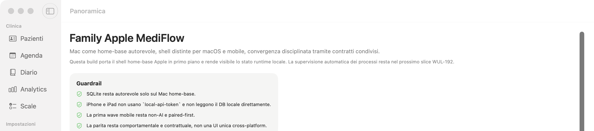
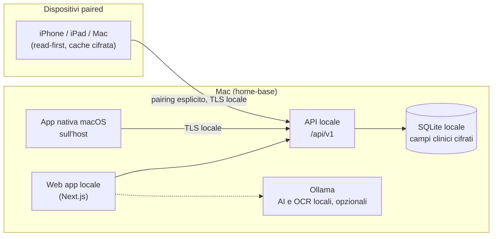

<div align="center">

<picture>
  <source media="(prefers-color-scheme: dark)" srcset="./docs/design/lume/icona/mediflow-icon-grafite.svg">
  <source media="(prefers-color-scheme: light)" srcset="./docs/design/lume/icona/mediflow-icon-giorno.svg">
  
</picture>

# MediFlow

<a href="https://claude.com/claude-code"></a>
<a href="https://openai.com/codex"></a>

_by Ordito & Concilio_

**Cartella clinica territoriale local-first, open source e libera da usare.**

**Serve the right information at the right time.**<br>
**Porta l'informazione giusta nel momento giusto.**

[](./CHANGELOG.md)
[](./LICENSE)
[](#confini-dichiarati)
[](#release-sorgente-080)

[In breve](#mediflow-in-breve) · [Schermate](#come-si-presenta) · [Architettura](#come-è-fatto) · [Stato](#release-sorgente-080) · [Avvio](#avvio-rapido) · [Sviluppo](#sviluppo-assistito)

</div>

## MediFlow, in breve

MediFlow nasce dalle difficoltà operative reali dei medici. È un workspace
clinico open source e libero da usare. Aiuta a trovare un paziente, leggere la
sua storia, seguire terapie, controlli e documenti e preparare il passaggio
successivo. Non promette una pratica clinica senza attrito. Riduce l'attrito
evitabile senza nascondere complessità, provenienza, privacy e responsabilità
professionale.

Il prodotto è information-first, question-first e convenience-first. Non è
AI-first. Dati clinici, terminologie, reference data, ricerca, navigazione e
workflow deterministici restano funzioni di prima classe anche quando ogni
provider AI è disabilitato.

Il Mac ospita la base autorevole. iPhone e iPad si collegano come client paired
sulla rete locale. Il cloud non è un requisito per lavorare. Quando Ollama è
configurato, alcune funzioni locali possono preparare materiale da rivedere.
Nessun output AI aggiunge diagnosi, terapie o altri dati clinici strutturati
senza un'azione esplicita del medico.

Nel contesto territoriale italiano, MediFlow aiuta ad aprire la scheda giusta,
ritrovare la fonte, distinguere una terapia da una prestazione prescritta e
preparare la decisione successiva. Il medico verifica le evidenze e decide.
MediFlow non prescrive, non formula diagnosi autonome e non sostituisce il
giudizio clinico.

MediFlow non sostituisce SISS, FSE o gli altri canali ufficiali. Sta accanto al
lavoro clinico quotidiano, con confini dichiarati e verificabili.

Lo sviluppo avviene nella repository pubblica
[`Wulfgardr/mediflow`](https://github.com/Wulfgardr/mediflow). Database, dati
sanitari, credenziali e altri artefatti locali restano fuori da Git secondo
[`SECURITY.md`](./SECURITY.md) e
[`docs/repository-topology.md`](./docs/repository-topology.md).

## Come si presenta

### iPhone

<table>
<tr>
<td></td>
<td></td>
<td></td>
</tr>
</table>

### iPad

<table>
<tr>
<td></td>
<td></td>
</tr>
</table>

<p align="center"></p>

### App macOS



### Web locale


_Catture reali della candidata Apple e della build web di produzione. Le viste
cliniche usano solo fixture dimostrative sintetiche e deterministiche. Nessun
dato paziente reale. Il [manifest media 0.8](./screenshots/0.8/manifest.json)
registra dispositivo, runtime, scena, commit sorgente e hash._

<details>
<summary><b>Altre schermate web</b>: scheda paziente, quadro clinico, revisione documentale e sicurezza</summary>
<p></p>
<p></p>
<p></p>
<p></p>
</details>

## Come è fatto

Il Mac è il nodo autorevole (`home-base`): ospita database e web app. Gli altri
dispositivi non parlano direttamente con SQLite, ma con l'API locale, dopo un
pairing esplicito.


```mermaid
flowchart LR
    subgraph mac["Mac (home-base)"]
        web["Web app locale<br/>(Next.js)"]
        api["API locale<br/>/api/v1"]
        db[("SQLite locale<br/>campi clinici cifrati")]
        ai["Ollama<br/>AI e OCR locali, opzionali"]
        web --> api --> db
        web -.-> ai
        native["App nativa macOS<br/>sull'host"]
        native -- "TLS locale" --> api
    end
    subgraph paired["Dispositivi paired"]
        mobile["iPhone / iPad / Mac<br/>(read-first, cache cifrata)"]
    end
    mobile -- "pairing esplicito, TLS locale" --> api
```

Il diagramma mostra il percorso locale. Trasporto, pairing e limiti del data
plane sono documentati in
[`docs/topologia-dati-flussi.md`](./docs/topologia-dati-flussi.md).

## Release sorgente 0.8.0

La release `0.8.0` distribuisce il codice sorgente verificato. Non costituisce
una pubblicazione App Store, una certificazione o una dichiarazione di
conformità completa.

La release consolida contratti AI review-first, hardening del pacchetto
autonomo e una UI clinico-semantica coerente su localhost, macOS, iPhone e iPad.
Le prove usano solo fixture sintetiche:

- iPhone: XCUITest 2/2 sul simulatore iOS 27;
- iPad: XCUITest 7/7 sul simulatore iPadOS 27;
- macOS: build, resize, focus, tastiera, Cmd-R contestuale e VoiceOver manuale;
- localhost: 82/82 test, viewport 320/390/768/1440 e zoom reale 200%/400%.

Queste prove non dichiarano parity completa o conformità accessibilità. Gli
audit automatici su iPhone e iPad sono verdi, ma VoiceOver reale mobile non è
provato. L'API assistiva pubblica della beta Xcode 27 non ha raggiunto uno stato
terminale nel simulatore. Il limite è registrato in
[`docs/known-limitations.md`](./docs/known-limitations.md).

### Aggiornamenti integrati

La tranche integrata rafforza i contratti dei contenitori JSON (`envelope`) AI.
Un output AI deve rispettare il contratto dell'attività richiesta prima di
diventare materiale di revisione. Un contenitore ambiguo, incompleto, multiplo o
con chiavi riservate duplicate non può attivare il recupero legacy né essere
usato.

Le diagnosi estratte da documento restano materiale di revisione: la sintesi
non le aggiunge automaticamente alla scheda. Codex Operator personale non è
incluso: i relativi limiti di sicurezza richiedono decisioni e correzioni
separate.

Il dettaglio è nel [CHANGELOG](./CHANGELOG.md). La fotografia completa vive in
[`docs/STATE_OF_THE_SYSTEM.md`](./docs/STATE_OF_THE_SYSTEM.md); la matrice
parity canonica vive in [`docs/parity-matrix.md`](./docs/parity-matrix.md).

### Modelli e servizi opzionali

Le funzioni deterministiche restano disponibili senza un modello. Il percorso
AI locale usa Ollama ed è disponibile quando Ollama è configurato.
L'architettura separa il servizio applicativo dal connettore del modello. Oggi
è operativo soltanto il connettore Ollama.

Una futura modifica può aggiungere plug-in opzionali per modelli locali, LAN o
cloud. Le regole dell'organizzazione e la scelta esplicita dell'utente devono
consentire ogni attivazione.

La direzione post-0.8 prende il nome di **Intelligence Fabric**: una capability
potrà usare logica deterministica, un modello on-device, un home-base paired, un
modello locale o un provider cloud approvato. Il routing dovrà essere esplicito,
osservabile, vincolato da policy e fail-closed. Questa direzione non è una
funzione completa della 0.8.

Un fornitore esterno può offrire più capacità o ridurre alcuni tempi di
elaborazione. Non è un requisito e non implica una promessa clinica.

Prima di ogni invio servono minimizzazione, controlli verificati, registrazione
locale e abilitazione esplicita. La redazione o pseudonimizzazione deve essere
dimostrata per il flusso specifico. MediFlow non dichiara anonimizzazione
garantita.

Il controllo dell'invio esterno resta oggi chiuso. Nessun plug-in esterno accede
direttamente al database. Il flusso separa proposta, chiarimento e scrittura
autorizzata; la scrittura diretta tramite modello non è consegnata.

L'[ADR 0086](./docs/adr/0086-intelligent-scaffold-and-graded-automation-boundary.md)
propone il contratto comune per Document Ops, riconciliazione anagrafica, sunto
clinico, Atena e provider. Distingue le funzioni presenti dalla roadmap. La
futura inbox conversazionale e l'automazione graduata non sono funzioni live
della 0.8.

## Confini dichiarati

MediFlow non racconta più di quanto possa dimostrare.

- **Il default è locale.** Nessun cloud obbligatorio, nessuna telemetria o
  uscita dati attiva per impostazione iniziale.
- **I fornitori esterni non sono operativi.** L'estensione a plug-in richiede
  attivazione esplicita, registrazione locale e controlli sull'invio esterno.
- **iPhone e iPad non sono app complete.** Il perimetro operativo è
  `home-base + client paired`; cache offline e alcune superfici derivate dai
  documenti restano parziali o disponibili solo sull'host.
- **Windows e Linux non hanno ancora parity applicativa.** La release verifica il
  core Swift condiviso e il runtime di base, non applicazioni complete su ogni
  piattaforma.
- **SISS e FSE restano un handoff assistito.** MediFlow apre il contesto giusto,
  ma non dichiara sincronizzazione FSE, writeback regionale o invio
  prescrittivo diretto.
- **L'AI resta review-first.** Può aiutare a leggere e organizzare, non
  sostituisce revisione, giudizio clinico o responsabilità professionale.
- **La inbox intelligente non è consegnata.** Le route conversazionali di base
  non costituiscono un flusso di chiarimento o conversione in record clinici.

Delle 43 capability per cui la parity è un obiettivo, 30 sono complete e 13
parziali; altre 21 restano intenzionalmente host-only. La matrice fa fede sui
conteggi e sul significato di ciascuno stato.

## Avvio rapido

```bash
git clone https://github.com/Wulfgardr/mediflow
cd mediflow
nvm use
npm ci
```

MediFlow richiede Node.js 24.x. Installazione, build e launcher verificano anche
che il binding nativo `better-sqlite3` appartenga alla stessa ABI di Node.

Poi usa il launcher della tua piattaforma:

| OS | Comando |
| :-- | :-- |
| macOS | `./Start_MediFlow.command` |
| Windows | `powershell -ExecutionPolicy Bypass -File .\Start-MediFlow.ps1` |
| Linux | `./scripts/start-mediflow.sh` |

Apri `http://localhost:3000`. Ollama, Docker e ICD-11 sono opzionali; senza,
MediFlow resta usabile con funzionalità ridotte.

## Documentazione

| Documento | Cosa contiene |
| :-- | :-- |
| [FAQ](./docs/FAQ.md) | Risposte rapide alle domande più comuni |
| [Stato del sistema](./docs/STATE_OF_THE_SYSTEM.md) | La fotografia completa e aggiornata |
| [Roadmap](./docs/ROADMAP.md) | Dove sta andando il progetto |
| [Compliance](./docs/COMPLIANCE.md) | Privacy, GDPR e confini regolatori |
| [Crediti](./CREDITS.md) | Fonti, modelli, librerie e ispirazioni con licenze |
| [Mappa documentale](./docs/README.md) | La guida alla documentazione canonica |

## Fonti e attribuzioni

La prima lingua visiva del cockpit è derivata da
[Kree8](https://www.kree8.studio/), tradotta in un'implementazione clinica
originale. Il ragionamento terapeutico review-only usa
[ATHENA](https://github.com/mims-harvard/ATHENA) di mims-harvard, con licenza
MIT. Il lavoro sulla visita registrabile prende a riferimento l'ecosistema
Fluid.

Modelli, runtime, librerie e ispirazioni, con URL, ruolo e licenza, sono in
**[CREDITS.md](./CREDITS.md)**.

L'icona MediFlow porta in primo piano il **Filo del diario**, la stessa geometria
che connette le voci cliniche lungo il tempo. Concetto, registri giorno/grafite
e asset sono documentati nella [specifica dell'icona](./docs/design/lume/09-icona.md).

## Sviluppo assistito

Scrivo MediFlow da medico, con un aiuto sostanziale e dichiarato di strumenti di
sviluppo assistito da AI.

[Codex](https://openai.com/codex) e
[Claude Code](https://claude.com/claude-code) hanno contribuito a progettazione,
implementazione, review e verifica. Le proposte dei modelli restano materiale da
controllare: test reali e guard automatici decidono se una modifica regge.

<!-- usage-dashboard:start -->

| Snapshot | Token di sessione | Ripartizione | Cache letta |
| :-- | --: | :-- | --: |
| **17 luglio 2026** | **22.185.794.772** | Codex 15.546.136.608 · Claude Code 6.639.658.164 | 20.917.134.403 (94,3%) |


**Effort Codex:** xhigh 7.350.462.593 · non registrato / Ultra 4.395.761.468 · high 2.000.320.556 · medium 1.774.948.743 · low 24.643.248 · non registrato 0. Le sessioni senza effort registrato restano separate; possono includere fan-out `Ultra`, che non è un livello di ragionamento. Nei transcript Claude Code l'effort non è esposto in modo uniforme.

Il conteggio usa i contatori di tutti i log locali dei due ambienti e non è filtrato per repository. Per Codex somma i delta dei totali cumulativi e conserva modello, effort e cache letta; per Claude Code deduplica le richieste e somma input diretto, cache creata, cache letta e output. Sono pubblicati soltanto aggregati: nessun prompt, contenuto di sessione o percorso locale entra nel README o nell'SVG.

Ogni colore corrisponde a un modello o a una famiglia vicina. Le due barre usano la stessa scala: mostrano il peso dei due ambienti e la composizione interna. Il dato misura contesto elaborato, non righe di codice, costo o qualità. [CodexBar](https://github.com/steipete/CodexBar) resta il pannello locale complementare per limiti e uso corrente.

La responsabilità del progetto resta mia.

<!-- usage-dashboard:end -->

Lo snapshot pubblicato in precedenza (17,56 miliardi al 15 luglio 2026) usava una
pipeline di conteggio diversa e non è direttamente confrontabile con questo.

## Licenza

MIT License.

---

Progettato in Italia.
