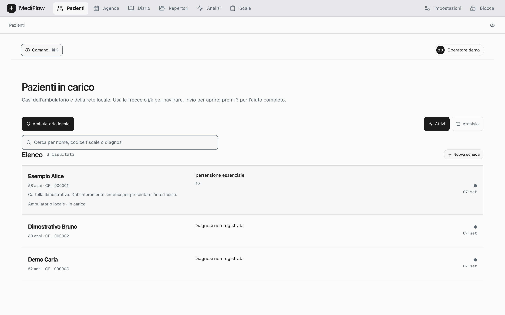
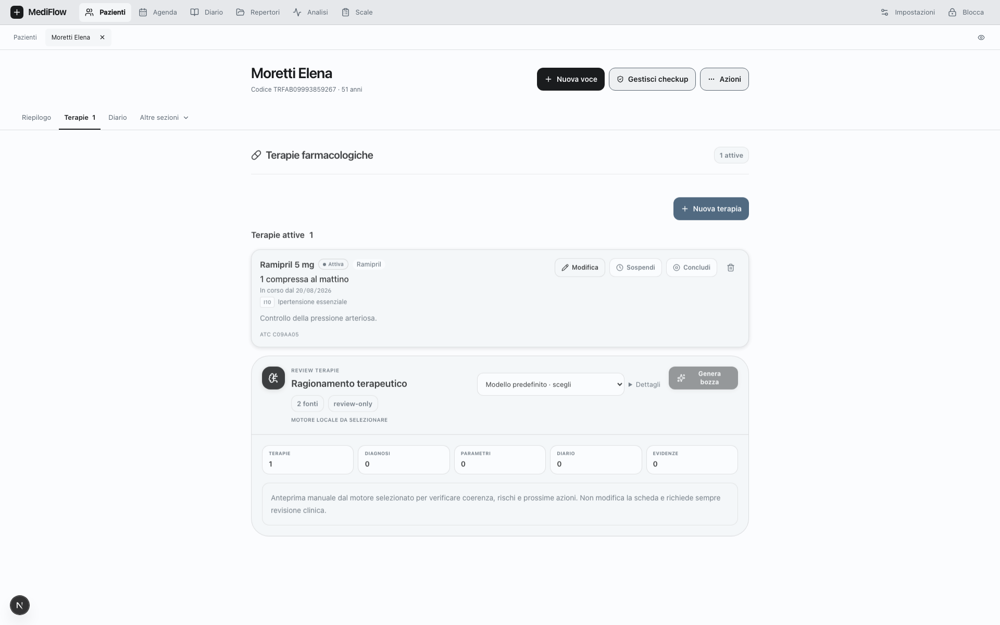
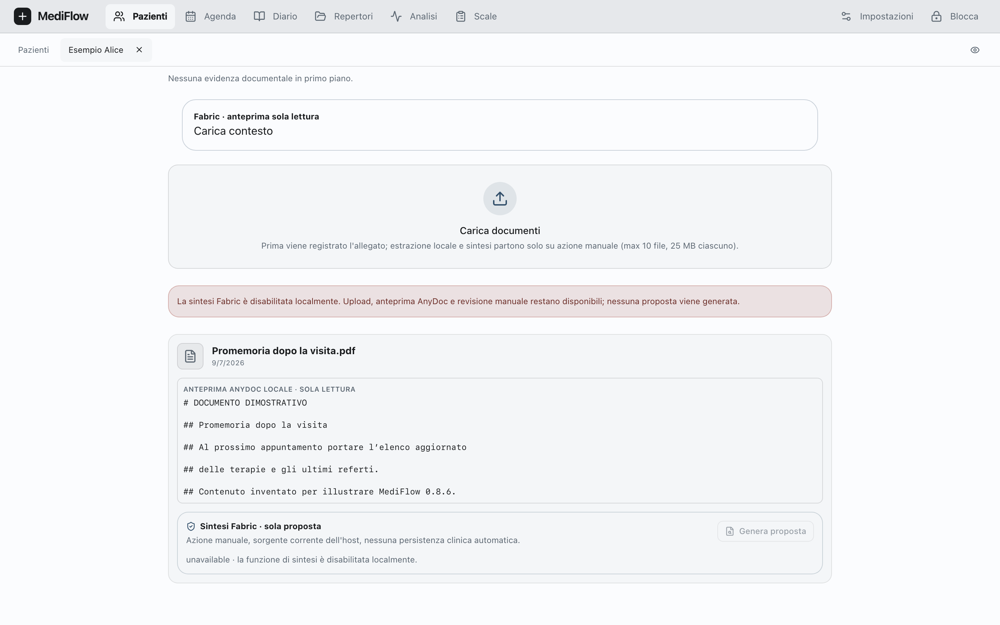
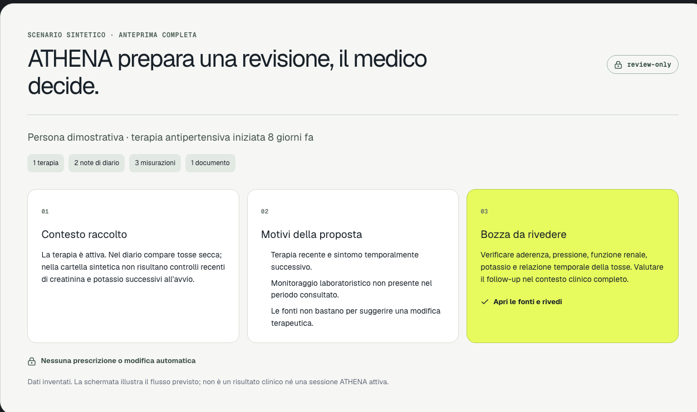
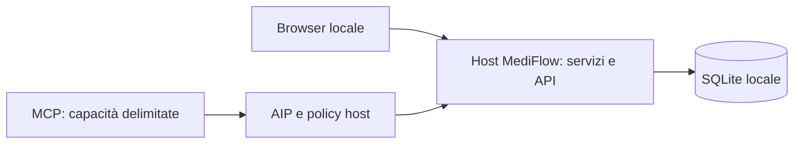
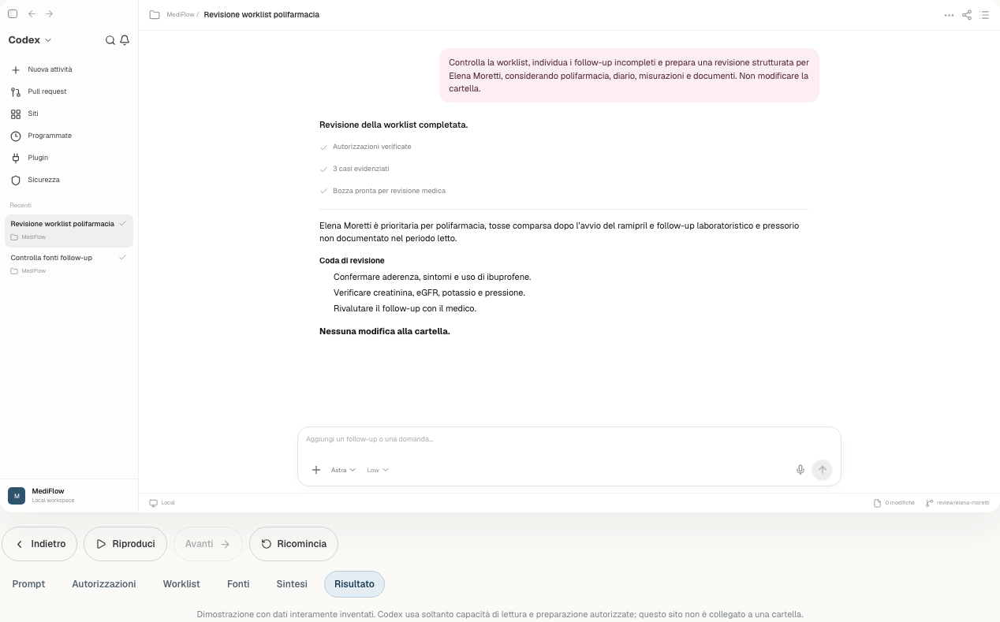

<div align="center">


# MediFlow

**Ritrova il filo.**

Un gestionale aperto e gratuito per il lavoro in ambulatorio.<br>
Cartelle, documenti e attività da seguire, anche senza intelligenza artificiale.

<a href="https://claude.com/claude-code"></a>
<a href="https://openai.com/codex"></a>

[](./docs/analysis/2026-09-07-086-release-verification.md)
[](https://github.com/Wulfgardr/mediflow/releases/latest)
[](./LICENSE)
[](#dove-stanno-i-dati)
[](https://github.com/Wulfgardr/mediflow/releases/tag/v0.8.6)

[**Scopri Get MediFlow**](https://getmediflow.dev) · [Perché nasce](#perché-nasce) · [Cosa puoi fare](#cosa-puoi-fare) · [Provalo](#provalo) · [Per chi sviluppa](#per-chi-sviluppa) · [Documentazione](#documentazione)

</div>

MediFlow nasce per tenere insieme ciò che, nel lavoro di ambulatorio, tende a
disperdersi: la storia del paziente, i documenti che la raccontano e le attività
che restano da seguire. Diario, terapie, misure e dati strutturati sono il punto
di partenza. Le funzioni intelligenti si possono aggiungere quando servano;
non sono la condizione per usare il gestionale.



*La lista pazienti nell’interfaccia web 0.8.6: un punto da cui riprendere la
cartella e il lavoro da seguire. La schermata è stata acquisita dal candidato
`ddff0a929` e contiene esclusivamente dati sintetici.*

> **MediFlow 0.8.6 è disponibile come [codice sorgente](https://github.com/Wulfgardr/mediflow/releases/tag/v0.8.6), pubblicato il 20 settembre 2026.**
>
> Questa release distribuisce i sorgenti del runtime locale per Mac, utilizzabile
> dal browser tramite `localhost` oppure senza interfaccia grafica da client e
> agenti autorizzati. Non comprende un installer firmato o notarizzato
> dell’applicazione nativa.
>
> La pubblicazione dei sorgenti non autorizza l’uso con dati clinici reali. Prima
> di un impiego effettivo, il professionista o l’organizzazione responsabile deve
> verificare finalità e base giuridica, informativa, ruoli e autorizzazioni,
> misure di sicurezza e, quando previsto, consenso dell’interessato. La valutazione
> del deployment resta aperta in [WUL-688](https://linear.app/wulfgardr/issue/WUL-688).

<details>
<summary><strong>Versione sorgente, verifiche e distribuzione</strong></summary>

La [release pubblicata su GitHub](https://github.com/Wulfgardr/mediflow/releases/tag/v0.8.6)
comprende gli archivi ZIP e TAR.GZ del codice. Non comprende un installer
nativo firmato o notarizzato e non attesta app complete per Windows, Linux,
iOS o iPadOS, né una validazione clinica.

Le funzioni AI sono facoltative; i servizi esterni, compresa l’integrazione
ChatGPT, sono spenti per impostazione predefinita e richiedono una scelta
esplicita. Configurare un servizio non dimostra che funzioni, così come una
prova sintetica non ne qualifica l’uso clinico. Ogni verifica conserva la
revisione su cui è stata eseguita: le prove precedenti non si estendono
automaticamente alla 0.8.6.
[Verifiche e limiti](./docs/analysis/2026-09-07-086-release-verification.md).

</details>

<details>
<summary><strong>Le terapie, da vicino</strong></summary>



Una schermata dell’interfaccia reale, con dati interamente sintetici, mostra
come le terapie restino consultabili nel contesto della cartella.

</details>

## Perché nasce

Seguire una persona nel tempo richiede più di una raccolta di campi. Alcune
informazioni hanno bisogno di una codifica, altre di un testo che ne conservi
il contesto; per altre ancora è essenziale poter tornare al referto originale.
MediFlow prova a dare una struttura a questi materiali senza far coincidere
la storia clinica con ciò che è più facile inserire in una tabella.

Per questo il gestionale deve restare utile anche con tutti i modelli AI
spenti. È una scelta di autonomia, ma anche un modo di non imporre dipendenze
a chi lavori con risorse limitate. La configurazione dei modelli resta
legata agli strumenti disponibili sulla singola postazione.

La modularità nasce dalla stessa ragione. Una postazione può aver bisogno di
organizzare cartelle e documenti; un’altra può aggiungere strumenti per
riesaminarli. Il progetto è aperto e gratuito, e intende rimanerlo, perché
possa essere studiato, discusso e migliorato anche dall’esterno. La gratuità
riguarda MediFlow, non l’hardware o gli eventuali servizi di terzi.

### Ordine dove serve. Spazio per ragionare.

La ricerca terminologica, i cataloghi farmaceutici e le scale aiutano a dare
un significato condiviso alle informazioni, purché restino riconoscibili la
fonte e la versione utilizzata. Il catalogo AIFA si può importare da file
locale; il servizio WHO ICD-11 richiede una configurazione esplicita.

Anche l’esportazione ha un confine preciso: FHIR segue il contratto
dell’[ADR 0081](./docs/adr/0081-fhir-r4-export-v0-contract.md). Un formato
condiviso è una base per lo scambio, non una garanzia di compatibilità con
ogni sistema. La parità FHIRv2 resta da verificare.

## Cosa puoi fare

| Esigenza | Strumento | Confine da conoscere |
| --- | --- | --- |
| Ricostruire la storia | Diario, diagnosi, terapie, misure e contesto amministrativo | Le modifiche sono versionate; un conflitto richiede riesame. |
| Ritrovare l’evidenza | Documenti collegati alla cartella e alle fonti | L’estrazione è locale per i formati supportati; gli errori restano espliciti. |
| Preparare il seguito | Checkup, appuntamenti e attese aperte | Proporre un follow-up non significa averlo eseguito. |
| Dare struttura alle parole | Ricerca terminologica e cataloghi | Il servizio WHO ICD-11 è opzionale e va configurato esplicitamente. |
| Registrare una misura | Scale con risposte esplicite | Zero e risposta mancante restano distinti; fonte e versione si conservano nello storico. |
| Riesaminare informazioni complesse | Quattro percorsi Intelligence Fabric | I risultati sono proposte da rivedere, senza scrittura clinica automatica. |
| Accedere alle funzioni senza passare da ogni schermata | Supervisor, AIP e MCP | I permessi sono delimitati; gli adapter non accedono direttamente al database. |

<details>
<summary><strong>Guarda la revisione documentale</strong></summary>



Le fonti restano vicine alle informazioni da riesaminare. Anche qui i dati
sono sintetici: la schermata documentale non dimostra che siano stati eseguiti
un modello AI, un’estrazione AnyDoc o un riconoscimento OCR.

</details>

### Intelligence Fabric, in parole semplici

Si può pensare alla Fabric come a un’impalcatura: una struttura di supporto
che organizza l’uso delle funzioni intelligenti senza rendere obbligatoria
nessuna di esse. La prima scelta resta non usarle. Quando invece servano,
non c’è ragione di chiedere allo stesso strumento di rispondere a ogni esigenza.

Riesaminare una terapia e mettere in relazione documenti diversi sono lavori
differenti. Si può quindi preferire uno strumento locale per una funzione e
valutare un altro modello, eventualmente esterno, per un’altra. È il principio
che orienta il progetto, non la dichiarazione che qualunque combinazione sia
già disponibile o clinicamente validata.

MediFlow distingue quattro percorsi: **Patient Insight** prepara una sintesi
del contesto del paziente; **Smart Import** propone informazioni strutturate
a partire da una fonte; **Document Synthesis** mette in relazione il contenuto
dei documenti; **Treatment Reasoning** accompagna il riesame professionale in
un percorso dedicato. In tutti i casi il risultato rimane una proposta.

La configurazione dà forma a questa scelta entro limiti precisi. Si possono
usare soltanto le opzioni del catalogo ammesso dal sistema locale, l’*host*;
un modello assente o non più valido non viene sostituito di nascosto. Le
preferenze per funzione e per singola richiesta seguono ADR0129: non sono
un’autorizzazione a scegliere liberamente provider, endpoint o modalità d’invio.

Ollama può servire i primi tre percorsi, mentre ATHENA/MLX è opzionale e
riservata a Treatment Reasoning, con configurazione e verifiche locali proprie.



La simulazione mostra il percorso completo senza presentare un risultato
clinico come reale: ATHENA raccoglie un contesto delimitato, espone le fonti e
i motivi verificabili della proposta, quindi consegna una bozza `review-only`.
Non prescrive, non modifica la terapia e non salva automaticamente nella
cartella. I dati e la situazione rappresentata sono inventati.

L’integrazione ChatGPT resta opzionale e spenta per impostazione predefinita.
Il percorso esterno richiede configurazione, consenso e controlli pertinenti
all’operazione; non viene dichiarata una nuova prova live di account/provider
consumer sul candidato finale. Collegare un account ChatGPT non equivale a
possedere accesso alle API OpenAI, né dimostra l’idoneità all’uso con dati
clinici reali.

<details>
<summary><strong>Perché una proposta non è ancora una modifica</strong></summary>

Una risposta è utile se si può capire da dove venga e se le fonti a cui si
riferisce siano ancora valide. Ogni percorso conserva perciò provenienza,
ricevuta e controlli di attualità. Queste evidenze permettono di riesaminare
il risultato, ma non gli attribuiscono il diritto di scrivere nella cartella.

Le operazioni protette mantengono controlli propri di ruolo, contesto,
conferma e audit. Anche gli agenti usano comandi MediFlow nominati, dopo
l’autenticazione e nei permessi assegnati; non aprono direttamente il database.
Il sistema verifica che dati e autorizzazioni siano ancora validi, richiede
la conferma pertinente prima delle scritture cliniche e restituisce una
ricevuta dell’esito.

[Confini Fabric e headless](./docs/adr/0117-headless-portable-agent-first-and-capability-first-fabric.md).

</details>

<details>
<summary><strong>Provider esterni e offuscamento: condizioni e limiti</strong></summary>

Scegliere un servizio esterno significa anche valutare quali informazioni
possano uscire. Il percorso documentato minimizza il contenuto, sostituisce
gli identificativi e riconcilia il risultato in locale. Non è una protezione
da presumere disponibile per ogni funzione: il testo narrativo clinico resta
bloccato finché non siano soddisfatti i controlli richiesti. Per i percorsi
ordinari ChatGPT, report e installazione del sistema di oscuramento dei dati identificativi,
se mancanti o incoerenti, impediscono l’invio, senza passaggi alternativi impliciti.

Pseudonimizzare non significa anonimizzare. I dati riconducibili a una persona
restano soggetti al GDPR; la presenza di un adapter non rende pronto all’uso
clinico un servizio cloud.

[Matrice dei runtime](./docs/ai-runtime-serving-matrix.md) ·
[Decisione sul confine egress](./docs/adr/0077-ai-provider-abstraction-and-egress-anonymization-boundary.md)

</details>

## Dati sanitari e responsabilità

Conservare le fonti, delimitare gli accessi e richiedere una revisione umana
sono scelte del progetto. La valutazione di un impiego concreto deve però
considerare anche finalità, ruoli, base giuridica, sicurezza e obblighi
applicabili. Il funzionamento locale non dimostra da solo la conformità, e
la supervisione umana non è una certificazione.

[GDPR, AI Act e scelte di progetto](./docs/privacy-and-ai-governance.md).

## Dove stanno i dati

Nella 0.8.6 il Mac conserva il database autorevole SQLite e ospita servizi e
API; il browser su localhost è l’interfaccia di riferimento. L’app Mac resta
uno sviluppo separato. Il principio locale va letto insieme ai percorsi
espliciti di pairing, cache, esportazione e backup, non come promessa che
ogni dato sia confinato per sempre a un solo dispositivo.


```mermaid
flowchart LR
    web[Browser locale] --> host[Host MediFlow: servizi e API]
    host --> db[(SQLite locale)]
    mcp[MCP: capacità delimitate] --> broker[AIP e policy host]
    broker --> host
```


Gli adapter non aprono direttamente SQLite. La cifratura protegge i campi
clinici sensibili secondo il contratto documentato: non è una dichiarazione
di cifratura integrale di ogni metadato o dell’intero file database.

[Topologia dei dati](./docs/topologia-dati-flussi.md) ·
[Sicurezza](./SECURITY.md) · [Limiti noti](./docs/known-limitations.md)

## Provalo

Per partire dai sorgenti servono Git, **Node.js 24.x** e le dipendenze del
progetto. Per valutazione e sviluppo usa fixture sintetiche.

```sh
git clone https://github.com/Wulfgardr/mediflow
cd mediflow
nvm use
npm ci
```


`nvm use` serve soltanto con nvm; altrimenti seleziona Node 24 con il tuo
gestore. `better-sqlite3` deve corrispondere all’ABI del Node attivo.

| Ambiente Web locale | Avvio |
| --- | --- |
| macOS | `./Start_MediFlow.command` |

Apri `http://localhost:3000`. Il launcher controlla checkout e porta, così da
non aprire per errore un’altra istanza. Gli altri sistemi operativi e i client
nativi non fanno parte della distribuzione dichiarata per la 0.8.6.

Questi comandi non attivano provider AI, servizio WHO o altri connettori
opzionali. Il clone segue il ramo predefinito pubblico: non seleziona il tag
della release né la base di una revisione editoriale.

<details>
<summary><strong>Apple: account gratuito, Xcode e distribuzione</strong></summary>

Per compilare e testare le applicazioni Apple serve Xcode completo: le sole
Command Line Tools non coprono SwiftUI e XCTest. Sono verifiche del seguito
nativo, non condizioni di consegna della release sorgente 0.8.6.

Un Apple Account gratuito consente sviluppo e prove personali entro i limiti
del Personal Team; Developer ID e notarizzazione Mac richiedono l’Apple
Developer Program. Non sono prerequisiti per pubblicare il codice sorgente.

[Guida nativa](./docs/NATIVE.md) ·
[Verifiche e limiti della candidata 0.8.6](./docs/analysis/2026-09-07-086-release-verification.md) ·
[Confronto ufficiale Apple](https://developer.apple.com/support/compare-memberships/)

</details>

## Per chi sviluppa

La repository operativa è soltanto [`Wulfgardr/mediflow`](https://github.com/Wulfgardr/mediflow).
Quella privata precedente è archiviata. Codice pubblicabile e documenti vivono
qui, senza un passaggio di esportazione private-to-OSS; database, credenziali,
fonti riservate e risultati clinici restano fuori da Git.

[Topologia repository](./docs/repository-topology.md) ·
[Architettura](./ARCHITECTURE.md) · [Contribuire](./CONTRIBUTING.md)

<details>
<summary><strong>Headless: cosa parte e cosa non autorizza</strong></summary>

```sh
npm run build -- --webpack
npm run mcp:intelligent-host:production
```


Usare MediFlow senza attraversare le schermate non significa aggirarne i
controlli. Il Supervisor mantiene Web e MCP come processi figli separati sul
Mac; MCP comunica tramite stdio. Per una funzione riferita al paziente servono
autenticazione, selezione e attivazione esplicita nell’interfaccia fidata.
Revoca, logout, cambio di selezione o scadenza chiudono l’autorizzazione, il
*grant*, senza trasferirla all’agente.



La schermata racconta il passaggio dall’interfaccia all’uso agentico: il client
riceve soltanto il contesto autorizzato, consulta fonti nominate, rende visibili
stato e motivi della proposta e rimanda il risultato alla revisione nel Web.
È un’illustrazione animata della roadmap 1.0, acquisita da Get MediFlow con dati
inventati: non è una sessione Codex collegata e non prova disponibilità nella
release 0.8.6.

Questo accesso non concede un diritto generale sul database o scritture
cliniche fuori dai controlli applicabili. La 0.8.6 non richiede né qualifica
un client agente specifico: si usano soltanto i comandi MediFlow nominati.
Anche il pianificatore semantico resta limitato agli strumenti approvati.

</details>

## Documentazione

| Per… | Parti da… |
| --- | --- |
| Conoscere il progetto senza leggere il codice | [Get MediFlow](https://getmediflow.dev) |
| Distinguere implementazione e prove ancora necessarie | [Stato del sistema](./docs/STATE_OF_THE_SYSTEM.md) e [verifiche della candidata 0.8.6](./docs/analysis/2026-09-07-086-release-verification.md) |
| Individuare il documento di riferimento di un tema | [Mappa della documentazione](./docs/README.md) |
| Capire ruoli delle piattaforme e parità | [Guida nativa](./docs/NATIVE.md) e [matrice di parità](./docs/parity-matrix.md) |
| Ricostruire una decisione tecnica | [ADR](./docs/adr/README.md) |
| Capire come viene presentato il prodotto | [Get MediFlow e linea editoriale](./docs/getmediflow-editorial-proposal.md) |
| Trovare un documento preciso | [Indice completo](./docs/markdown-index.md) |

I percorsi SISS/FSE restano passaggi assistiti verso i canali ufficiali,
indicati come handoff o `webapp-assisted`. L’export FHIR segue ADR0081;
la parità FHIRv2 resta da verificare.

## Sviluppo assistito

<details>
<summary><strong>Uso dei modelli: conteggi locali e limiti di attribuzione</strong></summary>

<!-- usage-dashboard:start -->

| Snapshot | Periodo dei log disponibili | Token di sessione | Ripartizione | Cache letta | Copertura storica |
| :-- | :-- | --: | :-- | --: | :-- |
| **21 settembre 2026** | 2026-02-01 → 2026-09-21 | **50.214.967.557** | Codex 44.177.414.802 · Claude Code 6.037.552.755 | 48.055.125.677 (95,7%) | Codex attestata · Claude Code attestata |


La fonte è **CodexBar 0.60.3**, comando locale `cost --refresh`, con una finestra massima di 365 giorni. Il conteggio usa gli aggregati disponibili per Codex e Claude Code e non è filtrato per repository. CodexBar attribuisce ogni token al processo che lo registra. Un worker OpenAI avviato da Claude Code compare quindi nel totale Claude Code. Il grafico indica lo strumento che registra i token, non il fornitore del modello.

**ATTESTATO:** i valori sono le somme esatte dei log disponibili nel periodo indicato. **STIMATO:** nessun valore. **UNKNOWN:** la completezza storica resta sconosciuta quando CodexBar non la attesta. L'attribuzione a MediFlow, a una release, a una PR o a un commit è sempre sconosciuta.

Rigenera il grafico con `npm run build:usage-dashboard`. Usa `CODEXBAR_BIN` per scegliere un eseguibile diverso e `USAGE_DASHBOARD_DAYS` per impostare una finestra da 1 a 365 giorni.

Le barre sono divise per modello e usano la stessa scala. La cache letta è una parte dell'input Codex, mentre CodexBar la espone come categoria separata per Claude Code: per questo il grafico non impila categorie di token con semantiche diverse. Sono pubblicati soltanto aggregati. Nessun prompt, contenuto di sessione, costo o percorso locale entra nel README o nell'SVG.

Il dato misura contesto elaborato. Non misura righe di codice, costo o qualità.

La responsabilità del progetto resta mia.

<!-- usage-dashboard:end -->

</details>

## Licenza e contributi

Il codice è pubblicato sotto [licenza MIT](./LICENSE), perché sia possibile
esaminarlo e contribuire al suo sviluppo. Dataset, terminologie, modelli e
fonti esterne conservano le rispettive condizioni d’uso: la licenza di
MediFlow non le sostituisce. [Crediti e attribuzioni](./CREDITS.md).
