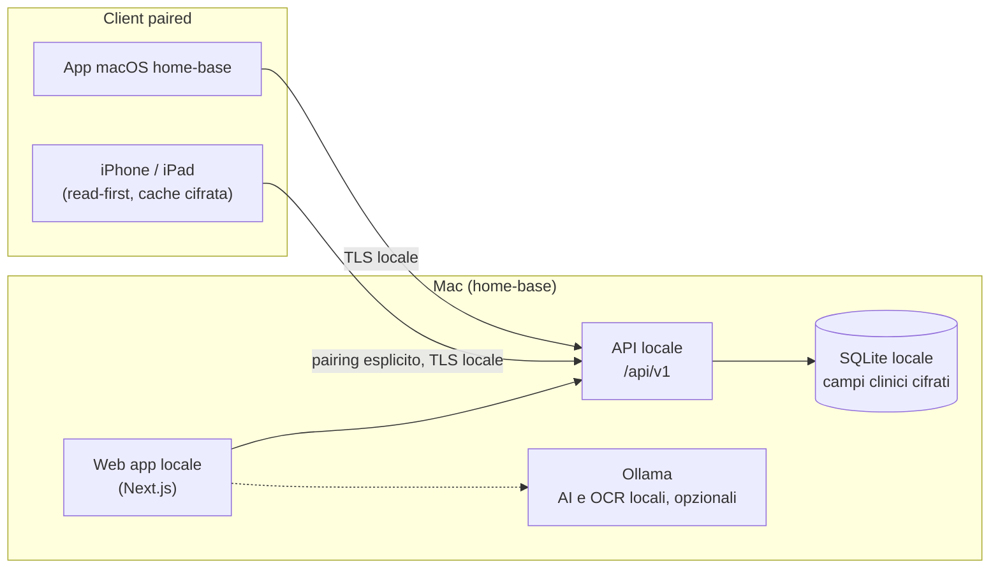

<div align="center">

# MediFlow

**Cartella clinica territoriale local-first.**

Dati vicini al medico, flusso rapido, privacy come impostazione di base.

[](./CHANGELOG.md)
[](./LICENSE)
[](#confini-dichiarati)
[](#la-071-in-breve)

[](https://claude.com/claude-code)
[](https://openai.com/codex)

[Perché](#perché-mediflow) · [Screenshot](#come-si-presenta) · [Architettura](#come-è-fatto) · [0.7.1](#la-071-in-breve) · [Confini](#confini-dichiarati) · [Avvio](#avvio-rapido) · [AI e trasparenza](#come-è-stato-costruito)

</div>

## Perché MediFlow

MediFlow nasce dal lavoro reale con i pazienti, non da un esercizio teorico.

Una cartella clinica deve aiutare chi cura a ritrovare informazioni, seguire
terapie, annotare decisioni, conservare documenti e mantenere continuità, senza
trasformare ogni gesto in burocrazia digitale.

Nel contesto territoriale italiano questo bisogno è ancora più evidente: il
tempo è poco, i dati sono sensibili, i percorsi sono spesso frammentati e gli
strumenti disponibili non sempre rispettano il modo in cui il lavoro clinico
viene davvero svolto.

MediFlow prova a rispondere a questo spazio: una base locale, leggibile,
prudente e modulare per la gestione quotidiana dei pazienti. La priorità non è
fare scena, ma ridurre attrito: aprire la scheda, capire dove si è, rivedere una
fonte, distinguere una terapia da una prestazione prescritta, preparare il
passaggio giusto senza confondere supporto operativo e integrazione
istituzionale.

Non nasce per sostituire i canali istituzionali, né per promettere integrazioni
che non sono ancora dimostrate. Nasce per dare ordine, continuità e controllo al
lavoro clinico di tutti i giorni.

## Come si presenta


_Render reali dell'interfaccia attuale, catturati con dati dimostrativi sintetici: nessun dato paziente reale._

<details>
<summary><b>Altri screenshot</b> (Scheda paziente, quadro clinico, revisione documenti, sicurezza)</summary>
<p>

</p>
<p>

</p>
<p>

</p>
<p>

</p>
</details>

## L'idea

MediFlow è una web app locale per gestire dati clinici, terapie, note e documenti.

Il principio guida è **local-first**: il dato resta vicino a chi lo produce e lo
usa. Il cloud non è un requisito per lavorare, e l'architettura è pensata per
ridurre al minimo la dipendenza da servizi esterni.

La direzione è quella di uno strumento:

- sobrio nell'interfaccia;
- esplicito nei confini;
- prudente nell'uso dell'AI;
- rispettoso della privacy;
- adatto a crescere senza diventare opaco.

## Come è fatto

Il Mac è il nodo autorevole (`home-base`): ospita il database e la web app.
Gli altri dispositivi non parlano mai col database: parlano con l'API locale,
dopo un pairing esplicito.


```mermaid
flowchart LR
    subgraph mac["Mac (home-base)"]
        web["Web app locale<br/>(Next.js)"]
        api["API locale<br/>/api/v1"]
        db[("SQLite locale<br/>campi clinici cifrati")]
        ai["Ollama<br/>AI e OCR locali, opzionali"]
        web --> api --> db
        web -.-> ai
    end
    subgraph paired["Client paired"]
        native["App macOS home-base"]
        mobile["iPhone / iPad<br/>(read-first, cache cifrata)"]
    end
    native -- "TLS locale" --> api
    mobile -- "pairing esplicito, TLS locale" --> api
```

Il cloud non compare nel diagramma: nessun egress di default, il percorso resta local-first.

## La 0.7.1 in breve

La `0.7.1` consolida il ramo Apple/native e lo porta sul mainline: macOS diventa
il fronte più avanzato dell'app nativa, iPhone e iPad restano client paired sul
modello `home-base`, e Linux e Windows entrano come gate di portabilità del core
condiviso, non come promessa di app complete.

- **web app locale** come superficie primaria di lavoro sul Mac;
- **Kree8 cockpit** come root web live, con una direzione visuale unica e senza selector persistiti: copy asciutto, palette semantica sobria, dark mode completa e flusso a un clic verso la Scheda paziente;
- **database SQLite cifrato**, con approccio zero-knowledge;
- **backup, audit e contratto `/api/v1`** resi più chiari ed espliciti;
- **AI locale** per insight e OCR, senza egress di default;
- **import documentale reviewable**, con Smart Import prudente, artifact `parse/evidence`, ancore fonte e benchmark di assorbimento evidenza;
- **prescrizioni di prestazione** separate dalle terapie farmacologiche, con item codificabili e matching repertorio preparato in modo bounded;
- **app Apple/native** con macOS come fronte più maturo, shell home-base, core Swift condiviso e target iPhone/iPad paired senza accesso diretto al DB;
- **core tri-OS** costruito e testato su macOS, Linux e Windows: oggi prova di portabilità del core, non promessa di app desktop complete su ogni piattaforma;
- **runtime cross-platform**: launcher per macOS, Windows e Linux, scheduler di backup adattivo (launchd, Task Scheduler, systemd/cron) e degradazione esplicita delle funzioni solo-Mac;
- **boundary SISS/FSE realistico**: handoff contestuale e percorso prescrittivo `webapp-assisted`, non integrazione regionale nativa già risolta.

Il dettaglio completo è nel [CHANGELOG](./CHANGELOG.md).

## Confini dichiarati

MediFlow non vuole raccontare più di quanto possa dimostrare.

- **Nessun cloud obbligatorio**: il default resta locale.
- **Nessuna app iPad/iPhone dichiarata come già completa**: la direzione multi-device esiste, ma il perimetro operativo attuale è `home-base + paired client`, con approccio read-only-first, cache cifrata e write online limitati a profilo/status, diario, terapie, checkup e osservazioni.
- **Nessuna parity Windows/Linux dichiarata oggi**: la 0.7.1 prova il core tri-OS e il runtime di base, non app complete su ogni piattaforma.
- **Nessuna integrazione SISS/FSE certificata dichiarata senza prove**: il percorso attuale è contestuale e `webapp-assisted`, usando i canali ufficiali; MediFlow non dichiara sincronizzazione FSE, writeback regionale o invio prescrittivo diretto.
- **Nessuna delega cieca all'AI**: l'AI locale può aiutare, ma non sostituisce revisione, giudizio clinico e responsabilità professionale.

## Perché open source

MediFlow nasce come progetto personale, ma ha senso solo se può diventare una
base aperta, verificabile e migliorabile.

Open source, in questo caso, significa soprattutto:

- codice leggibile;
- documentazione chiara;
- confini dichiarati;
- nessuna promessa vaga;
- possibilità di controllo da parte di chi usa lo strumento.

## Documentazione

| Documento | Cosa contiene |
| :-- | :-- |
| [FAQ](./docs/FAQ.md) | Risposte rapide alle domande più comuni |
| [Stato del sistema](./docs/STATE_OF_THE_SYSTEM.md) | La fotografia completa e aggiornata |
| [Roadmap](./docs/ROADMAP.md) | Dove sta andando il progetto |
| [Compliance](./docs/COMPLIANCE.md) | Privacy, GDPR e confini regolatori |
| [Document map](./docs/README.md) | La mappa di tutta la documentazione |

## Avvio rapido

```bash
git clone https://github.com/Wulfgardr/mediflow
cd mediflow
npm install
```

Poi il launcher della tua piattaforma:

| OS | Comando |
| :-- | :-- |
| macOS | `./Start_MediFlow.command` |
| Windows | `powershell -ExecutionPolicy Bypass -File .\Start-MediFlow.ps1` |
| Linux | `./scripts/start-mediflow.sh` |

Apri `http://localhost:3000`. Ollama, Docker e ICD-11 sono opzionali: senza,
MediFlow resta usabile con funzionalità ridotte.

## Come è stato costruito

Questo progetto è scritto da un medico con un aiuto sostanziale, e dichiarato,
di strumenti di sviluppo assistito da AI.

Sviluppo assistito: Codex come principale copilota di implementazione e verifica; Claude Code come seconda corsia di review e supporto.

I numeri, misurati dai log locali delle sessioni e non stimati: almeno
**19,6 miliardi di token** tra Codex CLI (16,0 miliardi, febbraio-luglio 2026) e
Claude Code (3,6 miliardi, maggio-luglio 2026). È un pavimento, non un totale:
esclude gli strumenti che non lasciano log misurabili e il lavoro precedente
all'inizio della registrazione.

Il metodo conta più del volume: ogni modifica passa da review incrociata tra
modelli diversi, test locali e guard automatici in CI che bloccano regressioni
di sicurezza e affermazioni non dimostrate. L'AI scrive, ma non decide: la
responsabilità del progetto resta umana.

## Licenza

MIT License.

---

Progettato in Italia.
