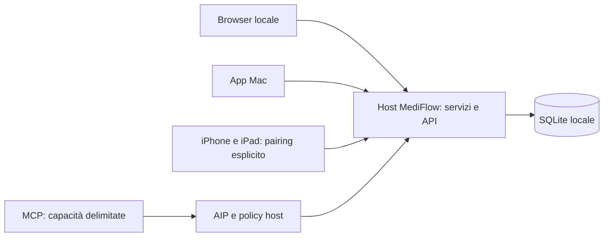

<div align="center">


# MediFlow

**Ritrova il filo.**

Una cartella clinica territoriale local-first.<br>
Informazioni, fonti e prossimi passi, nello stesso contesto.

_by Ordito & Concilio · Open source · [MIT](./LICENSE)_

[Perché nasce](#perché-nasce) · [Cosa puoi fare](#cosa-puoi-fare) · [Provalo](#provalo) · [Per chi sviluppa](#per-chi-sviluppa) · [Documentazione](#documentazione)

</div>

> **Stato del ramo: 0.8.5 candidata.** I controlli locali della revisione sono
> documentati; i gate Apple completi e di distribuzione restano aperti.
> Una build riuscita non equivale a una release pubblicata.
> [Verifiche e limiti della candidatura](./docs/release-085-readiness.md).

## Perché nasce

Una terapia in una nota. Un esame in un allegato. Un controllo rimasto in
sospeso. Il lavoro clinico sul territorio richiede continuità fra informazioni
raccolte in momenti e sistemi diversi.

MediFlow nasce dalle difficoltà operative della pratica medica: aiuta a
ritrovare una persona, leggere cosa è cambiato, tornare alla fonte e preparare
il prossimo passo. Il dato resta vicino al suo contesto e a chi deve decidere.

La cartella, la ricerca e i percorsi deterministici funzionano anche con tutti
i modelli AI spenti. Il progetto non sostituisce il giudizio professionale.

## Cosa puoi fare

| Esigenza | Strumento | Confine da conoscere |
| --- | --- | --- |
| Ricostruire la storia | Diario, diagnosi, terapie, misure e contesto amministrativo | Modifiche versionate; i conflitti richiedono riesame. |
| Ritrovare l'evidenza | Documenti collegati alla cartella e alle fonti | Estrazione locale dei formati supportati; errori espliciti. |
| Preparare il seguito | Checkup, appuntamenti e attese aperte | Una proposta di follow-up non attesta che l'azione sia stata eseguita. |
| Dare struttura alle parole | Ricerca terminologica e cataloghi | Il servizio WHO ICD-11 è opzionale e richiede configurazione esplicita. |
| Registrare una misura | Scale Web/native con risposte esplicite | Zero e risposta mancante sono distinti; fonte e versione restano nello storico. |
| Rivedere informazioni complesse | Quattro percorsi Intelligence Fabric | Output da rivedere, senza scrittura clinica automatica. |
| Usare capacità senza ogni schermata | Supervisor, AIP e MCP | Accessi delimitati; nessun accesso diretto al database per gli adapter. |

### Intelligence Fabric, in parole semplici

Fabric è il coordinamento delle capacità intelligenti di MediFlow. Il sistema
locale decide quale percorso può essere usato, con quali fonti e con quali
limiti. La risposta del modello è una proposta da esaminare.

- **Patient Insight**: preparare una sintesi del contesto clinico.
- **Smart Import**: proporre informazioni strutturate da una fonte.
- **Document Synthesis**: mettere in relazione il contenuto dei documenti.
- **Treatment Reasoning**: supportare il riesame professionale con un percorso dedicato.

Ollama può servire i primi tre percorsi; ATHENA/MLX è separata e destinata a
Treatment Reasoning. Entrambi richiedono configurazione e verifica locali.
Gli adapter OpenAI e Anthropic restano **spenti per default**. Non esiste un
ripiego silenzioso sul cloud. La presenza dell'adapter non prova la disponibilità
di un account, del servizio o di un uso con dati clinici reali.

<details>
<summary><strong>Perché una proposta non è ancora una modifica</strong></summary>

Ogni percorso conserva provenienza, ricevuta e controllo che le fonti siano
ancora attuali. Queste evidenze permettono di rivedere il risultato; non gli
conferiscono autorità di scrittura. Le operazioni protette hanno propri
controlli di ruolo, contesto, conferma e audit.

[Confini Fabric e headless](./docs/adr/0117-headless-portable-agent-first-and-capability-first-fabric.md).

</details>

## Dove stanno i dati

Il Mac home base è il riferimento autorevole del prodotto Apple: conserva
SQLite e ospita servizi e API. Browser locale e app Mac offrono le interfacce.
iPhone e iPad sono client paired in sviluppo, collegati esplicitamente al nodo.


```mermaid
flowchart LR
    web[Browser locale] --> host[Host MediFlow: servizi e API]
    mac[App Mac] --> host
    paired[iPhone e iPad: pairing esplicito] --> host
    host --> db[(SQLite locale)]
    mcp[MCP: capacità delimitate] --> broker[AIP e policy host]
    broker --> host
```

I client paired e gli adapter non aprono direttamente SQLite. La cifratura
protegge campi clinici sensibili secondo il contratto documentato; non è un
claim di cifratura integrale di ogni metadato o del file database.

[Topologia dei dati](./docs/topologia-dati-flussi.md) ·
[Sicurezza](./SECURITY.md) · [Limiti noti](./docs/known-limitations.md)

## Provalo

Per partire dai sorgenti servono Git, **Node.js 24.x** e le dipendenze del
progetto. Usa fixture sintetiche per valutazioni e sviluppo.

```sh
git clone https://github.com/Wulfgardr/mediflow
cd mediflow
nvm use
npm ci
```

`nvm use` è necessario solo se usi nvm; negli altri casi seleziona Node 24 con
il tuo gestore. `better-sqlite3` deve corrispondere all'ABI del Node attivo.

| Ambiente Web locale | Avvio |
| --- | --- |
| macOS | `./Start_MediFlow.command` |
| Windows | `powershell -ExecutionPolicy Bypass -File .\Start-MediFlow.ps1` |
| Linux | `./scripts/start-mediflow.sh` |

Apri `http://localhost:3000`. Il launcher verifica checkout e porta per evitare
di aprire un'altra istanza. La portabilità del workspace Web e del core Swift
non equivale a parità delle applicazioni Apple su ogni sistema.

I provider AI, il servizio WHO e gli altri connettori opzionali non si
attivano con questi comandi. La clone segue il ramo predefinito pubblico:
non è un'istruzione per ottenere una candidatura non ancora pubblicata.

<details>
<summary><strong>Apple: account gratuito, Xcode e distribuzione</strong></summary>

Xcode completo serve per compilare e testare le applicazioni Apple; le sole
Command Line Tools non coprono SwiftUI, XCTest e i relativi gate.
Un Apple Account gratuito consente sviluppo e prove personali entro i limiti
del Personal Team. Developer ID e notarizzazione Mac richiedono l'Apple
Developer Program. Non sono prerequisiti per pubblicare il codice sorgente.

[Guida nativa](./docs/NATIVE.md) ·
[Canali e verifiche 0.8.5](./docs/release-085-readiness.md) ·
[Confronto ufficiale Apple](https://developer.apple.com/support/compare-memberships/)

</details>

## Per chi sviluppa

La repository operativa è soltanto [`Wulfgardr/mediflow`](https://github.com/Wulfgardr/mediflow).
La precedente repository privata è archiviata. Non esiste un export
private-to-OSS: codice pubblicabile e documenti vivono nella repository canonica;
database, credenziali, fonti riservate e output clinici restano fuori da Git.

[Topologia repository](./docs/repository-topology.md) ·
[Architettura](./ARCHITECTURE.md) · [Contribuire](./CONTRIBUTING.md)

<details>
<summary><strong>Headless: cosa parte e cosa non autorizza</strong></summary>

```sh
npm run build -- --webpack
npm run mcp:intelligent-host:production
```

Il Supervisor mantiene il runtime Web e MCP come processi figli separati.
MCP usa stdio. Per una capacità riferita al paziente servono autenticazione,
selezione e attivazione esplicita nell'interfaccia fidata. Revoca, logout,
cambio di selezione o scadenza chiudono il grant.

Mini condivide catalogo tipizzato e fondazione CLI; nella 0.8.5 non ha un
binding Supervisor di produzione e richiede un canale AIP genitore.
Questi comandi non concedono accesso generale al database né autorizzano
scritture cliniche. Il planner semantico resta limitato a strumenti approvati.

</details>

## Documentazione

| Se vuoi… | Parti da… |
| --- | --- |
| Capire il progetto senza conoscere il codice | [Inizia qui](./docs/start-here.md) |
| Vedere cosa è implementato e cosa resta da provare | [Stato del sistema](./docs/STATE_OF_THE_SYSTEM.md) e [readiness 0.8.5](./docs/release-085-readiness.md) |
| Trovare la fonte autorevole di un tema | [Mappa della documentazione](./docs/README.md) |
| Capire piattaforme e parità | [Guida nativa](./docs/NATIVE.md) e [matrice di parità](./docs/parity-matrix.md) |
| Ricostruire una decisione tecnica | [ADR](./docs/adr/README.md) |
| Valutare il nuovo racconto pubblico | [Proposta getmediflow e piano editoriale](./docs/getmediflow-editorial-proposal.md) |
| Trovare un documento preciso | [Indice completo](./docs/markdown-index.md) |

I percorsi SISS/FSE restano handoff o webapp-assisted. L’export FHIR segue
il contratto ADR0081; la parità FHIRv2 resta da verificare.

## Licenza e contributi

Codice sotto [licenza MIT](./LICENSE). Dataset, terminologie, modelli e fonti
esterne conservano le proprie condizioni d'uso: la licenza del codice non le
sostituisce. [Crediti e attribuzioni](./CREDITS.md).
