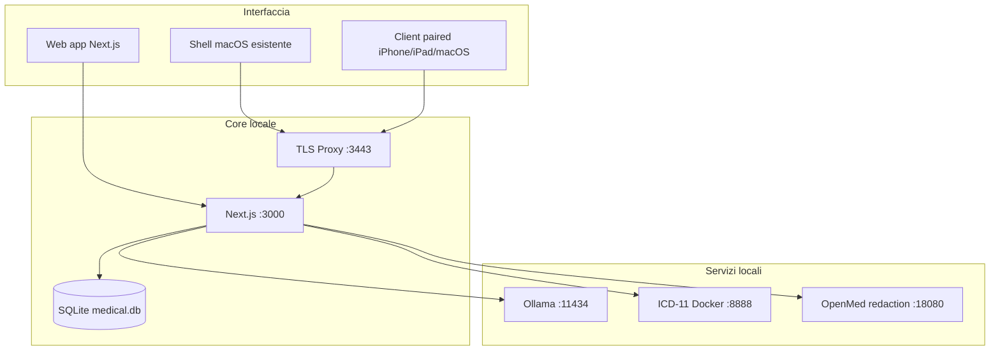

# Architettura MediFlow (Deep Dive)

> [!NOTE]
> **Stato documento: SECONDARY (deep dive tecnico).**
> Per i confini stabili prevale [ARCHITECTURE.md](../ARCHITECTURE.md).
> Per il flusso operativo reale prevale [docs/walkthrough.md](./walkthrough.md).

Questo file serve a dare una lettura più discorsiva del sistema reale, senza
sovrapporsi ai documenti canonici.

---

## 🧭 1. Snapshot tecnico attuale

MediFlow oggi va letto così:

- **web app locale** come superficie primaria: la root `/` apre direttamente il
  cockpit Kree8, senza selector di shell;
- **SQLite cifrato** come storage autorevole;
- **`/api/v1`** come contratto condiviso per i client Apple;
- **`home-base` read-only-first** con write online limitati/versionati su
  profilo/status paziente, diario clinico, terapie, checkup e osservazioni;
- **document intelligence reviewable** con artifact `parse/evidence`;
- **stack AI locale governato** e separato dalle lane `benchmark-only`;
- **SISS/FSE** dentro un boundary esplicito di handoff e `webapp-assisted`.

### Topologia logica

La cosa importante è questa: i client non parlano con un database remoto.
Parlano con un **nodo locale** che resta autorevole e che, quando serve, espone
solo un perimetro documentato.

---

## 🔒 2. Dato, chiavi e persistenza

Il dato clinico sensibile viene cifrato lato client prima della persistenza.

Schema essenziale:

1. l'utente sblocca con il PIN;
2. il PIN deriva la KEK;
3. la KEK sblocca la master key in RAM;
4. i campi clinici vengono cifrati in `AES-256-GCM`;
5. su disco finiscono valori nel formato `ENC:<iv_b64>:<cipher_b64>`.

Questo vale sia per il dato strutturato sia per gli snapshot documentali
sensibili, compresi `summarySnapshot` e `parseEvidenceArtifactSnapshot`.

Sul fronte cancellazione, il dato non viene orfanato: la rimozione di un
paziente scrive un tombstone reversibile (`deletedAt` / `deletionReason`) con
version guard, senza staccare i figli clinici. L'erasure GDPR esplicita
(`purge-patient`) e il `restore-patient` restano azioni admin separate e
audited. Il dato cifrato non viene mai sovrascritto dal placeholder
`[LOCKED DATA]`, che è solo presentazione.

---

## 🔌 3. API e boundary operativi

Le superfici principali sono tre:

| Surface | Auth | Ruolo |
| --- | --- | --- |
| `/api/*` | sessione web | CRUD web e overview locale |
| `/api/v1/*` | bearer token locale | contratto condiviso per client Apple |
| `/api/v1/network/*` | paired client + sessione operatore | perimetro `home-base`, read-only-first con write versionati su ciclo di vita paziente, diario, terapie, checkup, osservazioni, prestazioni e protesica, piu export FHIR lato client, validazione FSE, revisione e discovery; cataloghi in sola lettura |

Le sotto-risorse cliniche (diario, terapie, checkup, osservazioni) condividono
un ciclo di vita unificato: version guard con `409` sulle scritture, liste che
escludono i soft-deleted (`includeDeleted` opt-in), soft delete su tutte le
`DELETE`, audit che distingue eliminazione da aggiornamento. Questo è
`BREAKING` per il client nativo macOS ed è gated come blocker di release.

Punti da non perdere:

- `local-only` resta il default;
- `home-base` è opt-in;
- il pairing è esplicito;
- con `network-home-base` spenta i token paired non leggono né scrivono
  (`403 NETWORK_MODE_DISABLED`), mentre i pairing restano;
- esistono solo write remoti limitati/versionati sui moduli gia documentati;
  sync automatico e multi-master restano fuori scope;
- i client iPadOS/iOS rientrano in questo stesso disegno, non in una scorciatoia tipo "DB remoto".

---

## 🤖 4. Document intelligence e AI

La pipeline documentale non è più solo "upload e riassunto".

Oggi la direzione è:

1. normalizzazione input;
2. OCR locale (Ollama primario; Apple Vision come fallback solo macOS, nessun
   equivalente su Windows/Linux), con coda OCR per i documenti senza testo;
3. estrazione/sintesi locale, prudente sull'identità (niente data di nascita da
   data arbitraria, niente slittamento per fuso, codice fiscale con omocodie);
4. persistenza di artifact `parse/evidence` cifrati sul singolo allegato,
   section-aware (`sectionMap`, ancore page/section/snippet);
5. consumer reviewable su `Patient Insight`, smart import e create-flow documentale.

Finché il testo non basta, non parte alcuna proposta clinica, e gli errori AI
restano visibili invece di sparire.

Lato governance, MediFlow tiene separati:

- **runtime operativo** (AI locale di default, review-first);
- **lane benchmark-only** (comparator cloud `gpt-5.4`, MLX benchmark-visible);
- **sidecar specialistici** (OpenMed `redaction.v1`, shadow/opt-in);
- **shadow/comparator opt-in**.

Sopra tutto questo c'è un safety gate: kill-switch per `patient-insight`,
`smart-import` e `document-synthesis`, più model governance delle decisioni
documentali. Lo stack AI può crescere, ma non viene promosso nel flusso clinico
solo perché "sembra andare bene".

---

## 🍎 5. Apple clients

La direzione Apple oggi è più chiara di prima:

- la **web app** resta la base forte;
- la shell **macOS** storica è da preservare come snapshot, non da usare come
  tela infinita per tutto il seguito;
- il lavoro nuovo ruota attorno a **`/api/v1` + TLS locale + home-base**;
- **iPadOS / iOS** sono previsti dentro questo stesso modello paired,
  read-only-first con write online espliciti e limitati sui moduli core.

Questa distinzione conta: evita sia il finto "solo web", sia il finto
"app universale già pronta".

---

## 🏛️ 6. Sistemi regionali: cosa diciamo davvero

Sul filone SISS/FSE il punto non è “fare vedere un bottone”.
Il punto è mantenere un boundary corretto.

Oggi MediFlow può:

- preparare il contesto paziente;
- fare handoff contestuale;
- richiamare il percorso prescrittivo ufficiale in modalità `webapp-assisted`;
- eseguire pre-check locali dove sensato;
- gestire un dominio locale per le prescrizioni di prestazione (visite, esami,
  imaging, riabilitazione, screening), separato dalle terapie farmacologiche,
  con item codificabili e matching su repertorio locale.

> [!WARNING]
> Oggi MediFlow **non** dichiara: integrazione regionale nativa certificata,
> consumo libero di REST/WS regionali, UI prescrittiva custom che sostituisce il
> modulo ufficiale, generazione NRE, invio prescrittivo regionale, writeback
> FSE/SISS.

Questo boundary non è cosmetico: evita di raccontare come pronto qualcosa che
dipende ancora da scenari approvati, qualifica `SISS` e provisioning reale.

---

## 📚 7. Dove guardare dopo questo file

- [ARCHITECTURE.md](../ARCHITECTURE.md)
- [docs/walkthrough.md](./walkthrough.md)
- [docs/topologia-dati-flussi.md](./topologia-dati-flussi.md)
- [docs/system_architecture.md](./system_architecture.md)
- [docs/ROADMAP.md](./ROADMAP.md)
