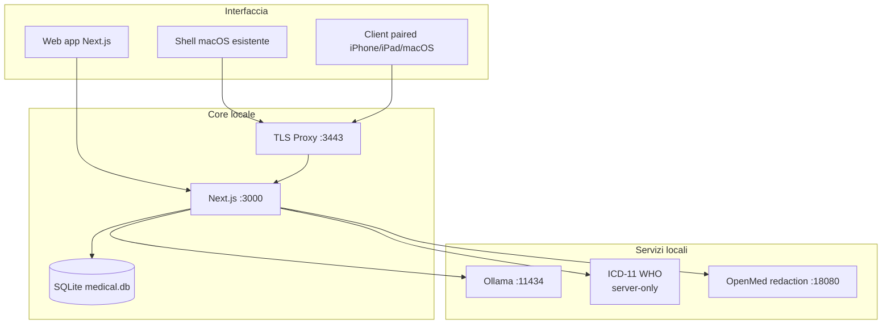

# Architettura MediFlow (Deep Dive)

> [!NOTE]
> **Stato documento: SECONDARY (deep dive tecnico).**
> Per i confini stabili prevale [ARCHITECTURE.md](../ARCHITECTURE.md).
> Per il flusso operativo reale prevale [docs/walkthrough.md](./walkthrough.md).

Questa lettura collega le scelte architetturali alle esigenze che le hanno
motivate. Non sostituisce i contratti canonici: aiuta a capire perché dati,
interfacce e strumenti intelligenti abbiano responsabilità distinte.

---

## 🧭 1. Snapshot tecnico attuale

Il punto di partenza è la cartella locale, utilizzabile anche senza AI.
La web app apre il cockpit Kree8 dalla root `/`, senza selettore di shell;
SQLite conserva il dato autorevole e i campi clinici sensibili vengono
cifrati dal client. Questo non equivale alla cifratura integrale del file.

Per raggiungere la stessa cartella da un client Apple si passa dal contratto
`/api/v1`, non da un database remoto. La modalità `home-base` privilegia la
lettura e ammette solo scritture online limitate e versionate, fra cui
profilo/status paziente, diario, terapie, checkup e osservazioni. Documenti
e risultati AI conservano fonti e artifact `parse/evidence` da riesaminare;
i percorsi `benchmark-only` non diventano runtime clinico.

La release sorgente 0.8.6 riguarda Mac, browser localhost e accesso headless.
Le app native sono un seguito separato, non una distribuzione certificata dal
diagramma. Anche SISS/FSE mantiene il proprio limite: handoff contestuale e
`webapp-assisted`, non una catena regionale qualificata.

### Topologia logica

I client si rivolgono a un nodo locale che conserva l’autorità e rende
accessibili solo i servizi previsti. Il diagramma rappresenta questi rapporti,
non prova che ogni componente opzionale sia attivo o che ogni app sia pronta
alla distribuzione.

---

## 🔒 2. Dato, chiavi e persistenza

Sbloccare la cartella e leggere un campo sensibile sono passaggi collegati,
ma non coincidono con la cifratura dell’intero database. Il PIN deriva la KEK;
la KEK apre la master key in RAM; questa permette al client di cifrare i campi
in `AES-256-GCM` prima di salvarli come `ENC:<iv_b64>:<cipher_b64>`.

La stessa protezione riguarda gli snapshot documentali sensibili, compresi
`summarySnapshot` e `parseEvidenceArtifactSnapshot`. Identificativi e metadati
fuori dal mapping non vanno descritti come se fossero coperti automaticamente.

Anche la cancellazione distingue intenzioni diverse. Rimuovere un paziente
scrive un tombstone reversibile, `deletedAt` / `deletionReason`, con controllo
di versione e senza separarne i figli clinici. L’erasure GDPR esplicita
`purge-patient` e il `restore-patient` restano azioni amministrative separate,
registrate in audit; la purge non raggiunge backup già esportati. Il segnaposto
`[LOCKED DATA]` appartiene soltanto alla presentazione e non deve mai
sovrascrivere il contenuto cifrato.

---

## 🔌 3. API e boundary operativi

Ogni superficie espone un contratto e richiede la propria autenticazione.
La vicinanza alla postazione non attribuisce da sola un permesso.

| Surface | Auth | Ruolo |
| --- | --- | --- |
| `/api/*` | sessione web | Operazioni CRUD web e stato del nodo locale. |
| `/api/v1/*` | bearer token locale | Contratto condiviso dai client Apple. |
| `/api/v1/network/*` | paired client + sessione operatore | Perimetro `home-base`, centrato sulla lettura, con scritture versionate di ciclo di vita paziente, diario, terapie, checkup, osservazioni, prestazioni e protesica; export-only v0 lato client in Bundle FHIR R4 `collection`, che non attesta conformità completa, e pre-check FSE locale; cataloghi in sola lettura. |

Diario, terapie, checkup e osservazioni condividono il ciclo di vita: una
scrittura in conflitto restituisce `409`; tutte le `DELETE` sono soft delete;
le liste escludono i record rimossi salvo `includeDeleted` esplicito; l’audit
distingue eliminazione e aggiornamento. L’introduzione di questo contratto era
`BREAKING` per il client macOS e veniva trattata come blocco della relativa
release nativa. Non è una prova di qualifica del client successivo né un
nuovo blocco alla pubblicazione sorgente 0.8.6 già avvenuta.

`local-only` resta il default e `home-base` una scelta esplicita. Il pairing
è obbligatorio; con `network-home-base` spenta i token paired non leggono né
scrivono e ricevono `403 NETWORK_MODE_DISABLED`, ma i pairing restano salvati.
Sono ammesse solo le scritture remote limitate e versionate documentate:
sincronizzazione automatica e multi-master rimangono esclusi. iPadOS e iOS
seguono lo stesso disegno, senza una scorciatoia verso il database.

---

## 🤖 4. Document intelligence e AI

Un documento non va trattato come testo indistinto da consegnare a un modello.
Occorre prima sapere quale sia la fonte, che cosa se ne sia estratto e se
quell’estrazione sia ancora valida. Il percorso parte dalla normalizzazione
dell’input e da AnyDoc, prima estrazione automatica locale. Per i PDF
supportati, solo le pagine `needsOcr` vengono materializzate e renderizzate
entro limiti espliciti, poi lette da Apple Vision sul Mac e ricomposte con
ordine e provenienza. Ollama non è il motore OCR di questo percorso; non si
attesta un equivalente Apple Vision per Windows o Linux.

L’estrazione e la sintesi restano prudenti sull’identità: nessuna data di
nascita ricavata da una data arbitraria, nessuno slittamento per fuso, gestione
delle omocodie del codice fiscale. Gli artifact `parse/evidence` cifrati sul
singolo allegato conservano le sezioni tramite `sectionMap` e ancore di
pagina, sezione e frammento. `Patient Insight`, Smart Import e creazione da
documento li consumano come informazioni da rivedere, non come scritture già
approvate. Finché il testo non basta non parte una proposta clinica; gli
errori rimangono visibili.

La Fabric è la struttura che tiene organizzate queste scelte. Non usarla
resta possibile; attivarla non rende intercambiabile qualunque modello.
Le opzioni per funzione dipendono dal catalogo e dall’autorità dell’host,
secondo ADR0129. Il sistema distingue runtime operativo locale con revisione,
confronti `benchmark-only` — compresi il comparator cloud `gpt-5.4` e MLX
nei relativi benchmark — e sidecar specialistici come OpenMed `redaction.v1`
in shadow/opt-in. Una prova parallela non autorizza l’uso clinico.

Il kill-switch per `patient-insight`, `smart-import` e `document-synthesis`
e la governance dei modelli nelle decisioni documentali restano attivi.
Un risultato plausibile non basta a promuovere un nuovo strumento. I servizi
esterni sono spenti per default, senza fallback implicito; l’integrazione
ChatGPT non equivale a un accesso API o a una nuova qualifica live consumer.

---

## 🍎 5. Apple clients

Il modello Apple mantiene una base comune: `/api/v1` + TLS locale + home-base.
La web app resta la superficie primaria della 0.8.6. La shell macOS storica
si conserva come snapshot; il lavoro nativo successivo non va confuso con
quella fotografia né con un installer già distribuito.

iPadOS e iOS rientrano nel disegno paired, con lettura prioritaria e scritture
online esplicite sui moduli core ammessi. Il codice nativo e le prove del core
esistono, ma non attestano da soli un’app universale pronta o una parità
funzionale completa. Il client nativo resta separato dalla consegna sorgente
0.8.6.

---

## 🏛️ 6. Sistemi regionali: cosa diciamo davvero

Un comando che apre un portale non è un’integrazione qualificata. MediFlow
può preparare il contesto del paziente, accompagnare il passaggio al percorso
ufficiale in modalità `webapp-assisted` ed eseguire pre-controlli locali dove
pertinenti. Il dominio delle prescrizioni di prestazione — visite, esami,
imaging, riabilitazione e screening — è locale e distinto dalle terapie
farmacologiche; gli item codificabili e il confronto con il repertorio restano
strumenti di lavoro da rivedere.

> [!WARNING]
> MediFlow **non** dichiara integrazione regionale nativa certificata, accesso
> libero a REST/WS regionali, un’interfaccia prescrittiva che sostituisca il
> modulo ufficiale, generazione NRE, invio prescrittivo regionale o writeback
> FSE/SISS.

La distinzione dipende da scenari approvati, qualifica `SISS` e provisioning
reale: non può essere superata migliorando la descrizione di una funzione.

---

## 📚 7. Dove guardare dopo questo file

- [ARCHITECTURE.md](../ARCHITECTURE.md): confini stabili.
- [docs/walkthrough.md](./walkthrough.md): percorso operativo completo.
- [docs/topologia-dati-flussi.md](./topologia-dati-flussi.md): circolazione dei dati.
- [docs/system_architecture.md](./system_architecture.md): sintesi tecnica.
- [docs/ROADMAP.md](./ROADMAP.md): direzioni e condizioni di avanzamento.
