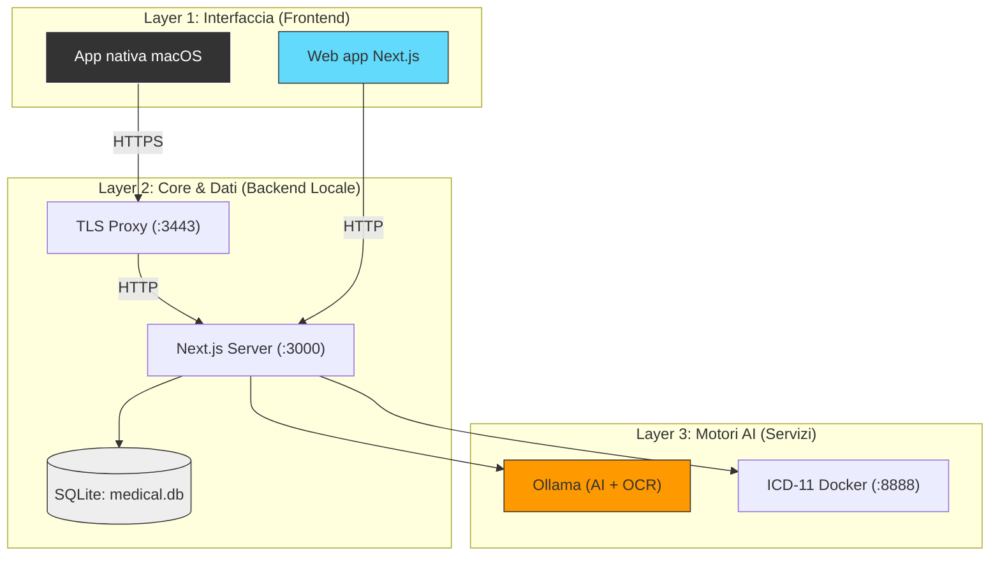
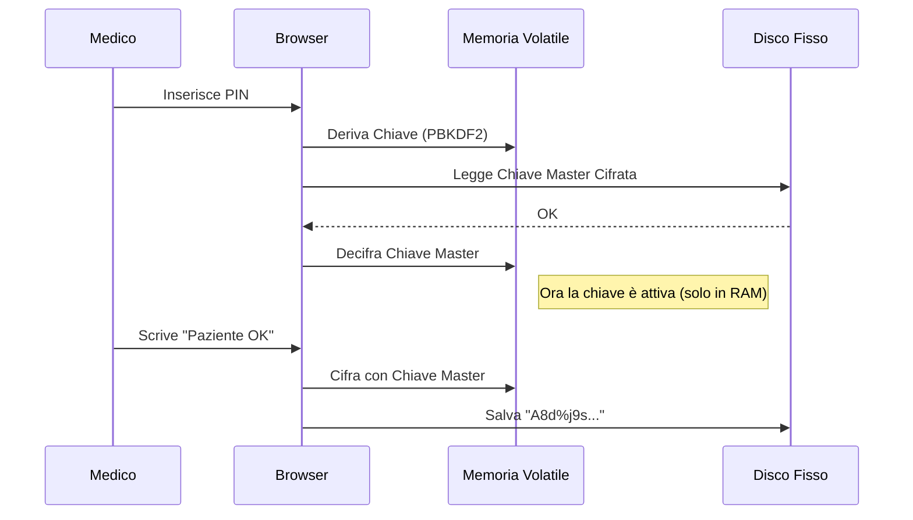

# Architettura MediFlow (Deep Dive)

> [!NOTE]
> **Stato documento: SECONDARY (deep dive tecnico).**
> Per confini stabili e decisioni architetturali prevale `ARCHITECTURE.md`.
> Per il flusso operativo end-to-end prevale `docs/walkthrough.md`.

> Stack tecnico, sicurezza e flussi dati.
> Documento per chi deve implementare, mantenere o estendere MediFlow.

Per confini stabili e decisioni di alto livello, consulta prima `ARCHITECTURE.md`.

---

## 1. Visione d'insieme

MediFlow non è una semplice web app: è un **sistema ibrido locale** pensato per privacy, affidabilità e continuità operativa.

### Topologia ibrida locale

Il sistema è composto da tre layer che convivono sul `localhost` del medico:

1. **Layer Interfaccia**: l'utente usa browser (Chrome/Safari) o app nativa (SwiftUI).
2. **Layer Core**: Next.js gestisce la logica, le API e parla con il database SQLite.
3. **Layer Servizi**: Container Docker e processi locali forniscono l'intelligenza (AI) e gli standard (ICD-11).

---

## 2. Stack tecnico

Una selezione pragmatica per performance e mantenibilità.

| Ruolo | Tecnologia | Versione | Perché |
| :--- | :--- | :--- | :--- |
| **Frontend** | React / Next.js | 16 / 15 | Standard industriale, rapido, component-based. |
| **UI** | Tailwind CSS | v4 | Styling rapido e consistente. |
| **Database** | SQLite | 3.x | File singolo, zero config, perfetto per local-first. |
| **ORM** | Drizzle | Ultima | Type-safe, leggero, ottime migrazioni. |
| **AI Runtime** | Ollama | Locale | Esegue LLM (Gemma, Llama) su GPU Apple Silicon. |
| **Native** | SwiftUI | 5.0 | UI nativa performante per macOS. |

---

## 3. Sicurezza e crittografia (Zero-Knowledge)

La sicurezza è il pilastro fondamentale. **Nessun dato chiaro tocca mai il disco.**

### Protocollo di cifratura

1. **PIN Utente**: L'unica chiave che non viene mai salvata.
2. **Master Key (AES-256)**: Generata al setup, cifrata con il PIN.
3. **Sessione**: Quando l'utente fa login, il PIN decifra la Master Key in RAM.

### Flusso di Scrittura

Quando salvi una nota clinica:

1. Il Frontend prende il testo `"Paziente iperteso"`.
2. Usa la *Master Key* (in memoria) per cifrarlo con **AES-256-GCM**.
3. Genera una stringa: `ENC:base64(iv):base64(ciphertext)`.
4. Invia questa stringa al Database.

Il database `medical.db` contiene solo stringhe senza senso. Se rubano il file, non leggono nulla.

---

## 4. Pipeline AI & OCR

La pipeline documentale resta locale: nessun upload a servizi cloud per default.

### Flusso Documentale

1. **Upload**: Il medico carica un PDF/JPG.
2. **OCR (DeepSeek-VLM)**:
    * Il file passa a Ollama.
    * Il modello multimodale "guarda" l'immagine ed estrae il testo strutturato.
3. **Sintesi (MedGemma)**:
    * Il testo estratto viene passato a un LLM clinico (MedGemma).
    * Prompt: *"Sei un medico esperto. Riassumi questo referto..."*
4. **Salvataggio**:
    * Testo e Riassunto vengono cifrati e salvati nel DB.

---

## 5. Struttura del Database

Principali tabelle in `lib/schema.ts`:

* `patients`: Anagrafica base. Molti campi sono cifrati (`notes`, `phone`).
* `entries`: Il diario clinico. Visite, note, tutto cronologico.
* `therapies`: Farmaci attivi.
* `ambulatories`: Per gestire multi-sede.

---

## 6. API v1 (per client nativo)

Questi endpoint restituiscono solo JSON puro (niente HTML/React Server Components) e sono ottimizzati per Swift.

| Endpoint | Metodo | Scopo |
| :--- | :--- | :--- |
| `/api/v1/patients` | GET/POST | Lista pazienti / Crea paziente |
| `/api/v1/patients/[id]` | GET | Dettaglio completo (cifrato) |
| `/api/v1/patients/[id]/entries` | GET/POST | Diario clinico |
| `/api/v1/patients/[id]/therapies` | GET/POST | Terapie attive |
| `/api/v1/ambulatories` | GET | Lista ambulatori (per i colori) |

---

## 7. Prossimi passi (engineering)

* [ ] Backup automatico schedulato.
* [ ] Export GDPR-compliant (JSON/CSV leggibile).
