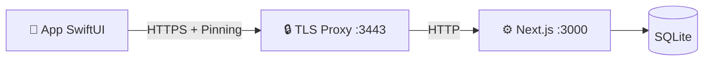

# Sviluppo nativo Apple (macOS, iPhone e iPad)

> Guida tecnica della family SwiftUI di MediFlow e del Mac `home-base`.

> [!IMPORTANT]
> Il congelamento dello snapshot macOS precedente a `v0.4.0` e storico. La base
> attiva e oggi l'app universale descritta da ADR 0048/0071: bundle macOS
> `home-base`, target iPhone/iPad paired e package condiviso
> `MediFlowCore`/`MediFlowAppleShared`. La web app resta la superficie piu
> completa. Nella candidata sorgente v0.8 la family include correzioni SwiftUI,
> build e test verificati. "Family Apple attiva" non significa parity completa,
> certificazione o pubblicazione App Store.

Riferimenti correlati:

- [docs/README.md](./README.md) (mappa canonica documentazione)
- [docs/markdown-index.md](./markdown-index.md) (indice completo markdown)
- [docs/walkthrough.md](./walkthrough.md) (flusso end-to-end)
- [docs/local-api-tls.md](./local-api-tls.md) (trasporto TLS locale)
- [docs/native-testing.md](./native-testing.md) (strategia test ufficiale)
- [docs/parity-matrix.md](./parity-matrix.md) (stato verificato delle capability)
- [docs/design/lume/README.md](./design/lume/README.md) (lingua di design attiva)
- [docs/design/lume/06-macos-apple-contract.md](./design/lume/06-macos-apple-contract.md) (contratto macOS)

---

## Stato del progetto

La base corrente va letta cosi:

* **macOS**: `MediFlowMacApp` e il fronte nativo piu maturo. Il bundle packaged
  include il WebRuntime Next standalone e puo osservare o gestire esplicitamente
  backend locale e proxy TLS senza diventare supervisore dei provider AI opzionali.
* **iPhone/iPad**: `MediFlowMobileApp` usa la stessa libreria SwiftUI e il
  boundary `/api/v1/network/*`. I workflow paired online coprono lifecycle
  paziente, moduli clinici non-AI, cataloghi, prestazioni/protesica e create
  documentale manuale secondo ADR 0076.
* **Core condiviso**: `MediFlowCore` concentra contratti, cifratura, codec,
  validatori, scale cliniche e SQLite. I gate macOS/Linux/Windows provano la
  portabilita del core, non app desktop complete su tre sistemi.
* **Sicurezza**: i client sigillano i campi sensibili prima del wire/storage;
  pairing device e sessione operatore restano distinti; nessun client mobile
  accede direttamente al database del Mac.
* **Headless/AIP locale**: il Supervisor Node portabile avvia Web standalone e
  MCP `stdio` come figli distinti su IPC ereditato. Contesto, lease, revoca e
  audit restano host-owned. L'adapter LaunchAgent/libxpc macOS resta una
  direzione opzionale separata e non è un requisito della 0.8.5.
* **Parity**: la matrice post-Wave 5 e in [docs/parity-matrix.md](./parity-matrix.md).
  `WUL-401`/PR #21 hanno consegnato bundle, fixture, probe AX e runbook P6 di
  base. La candidata v0.8 chiude i gate UI sul candidato con iPhone 2/2, iPad
  7/7 e prove macOS reali. VoiceOver reale su iPhone e iPad resta un limite
  esterno documentato, non un PASS e non un claim di conformità.
  `WUL-403` resta la corsia per rendere visibili eta,
  TTL e staleness della cache e il degrado offline read-only.

---

## Deep link locali di navigazione (row32)

Il contratto locale, entro ADR 0048, usa lo schema `mediflow` e il solo
destinatario `navigate`. Non e un ingresso API o di pairing. Forme ammesse:

```text
mediflow://navigate?area=agenda
mediflow://navigate?area=patients&paziente=patient-synthetic-01&section=diary
```

`area` nomina una destinazione gia presente: `patients`, `agenda`, `diary`,
`analytics`, `scales`, `settings`, `runtime`, `overview`, `milestones`; su macOS
anche `host` e `repertori`. `paziente` e ammesso solo con `area=patients` e indica
un ID opaco da risolvere con il reader ordinario nello scope della sessione
corrente, mai un record fornito dal link. L'ID contiene solo lettere ASCII,
cifre, trattino, underscore o punto (1–512 byte; esclusi `.` e `..`).
`section` richiede `paziente`: `overview` (default), `diary`, `scales`,
`therapies`, `clinical`, `prescriptions`, `documents`.

Il parser rifiuta chiavi sconosciute o ripetute, URL oltre 2048 byte, path,
fragment, porta o credenziali. Token, PIN, dati clinici, configurazione host e
URL esterni non appartengono al contratto. Il client non persiste il link ne lo
registra nei propri log. Il custom scheme non autentica chi lo apre: l'app resta bloccata
senza sessione ordinaria sbloccata e non riprende il link dopo il login; occorre
riaprirlo esplicitamente. Non esegue login, salvataggi, export, upload o altri
comandi e non concede capability. I controlli delle viste rimangono attivi.

La navigazione appartiene alla singola finestra. Un nuovo link o una navigazione
manuale nell'area globale invalida il precedente intento in corso. Prima di
cambiare paziente, il raccordo del workspace controlla sessione/scope correnti,
selezione e bozze; un rifiuto della sola navigazione conserva la cartella e il
testo presenti. Il blocco della sessione e invece un evento di privacy: rimuove
subito presentazione clinica e bozze locali secondo il lifecycle della sessione.
Una risposta tardiva non puo riaprire una destinazione superata. Solo il successo
del reader e della selezione emette la presentazione del dettaglio compatto;
nessuna ricostruzione dello split o sostituzione del modello e necessaria.

Parser/router e integrazione OS sono verifiche distinte: i test con un reader
sostituito non attestano pairing reale, apertura del link dal sistema operativo
o interazione su iPhone/iPad. La row32 resta `partial` finche i relativi percorsi
interattivi non sono verificati; il confine Mini resta `manual_only`.

Verifica locale della slice (2026-09-06): 84 test SwiftPM passano, comprendendo
parser/router, selezione con reader ordinario e transport sostituito, lifecycle
e cache. Le build Debug Mac e iOS Simulator generica passano con Xcode 26.6
(17F113), senza signing; entrambi i bundle contengono la registrazione dello
schema `mediflow`. Queste prove non attestano apertura OS o pairing reale.

## Requisiti e setup rapido

1. **Xcode corrente compatibile con Swift 5.9**; per i gate locali viene usato
   Xcode beta quando indicato dai runbook.
2. **Node.js 24 richiesto** per il bundle runnable/WebRuntime e per i launcher.
   Il launcher rifiuta runtime o binding `better-sqlite3` non conformi prima
   di avviare il setup.
3. **OpenSSL** (per HTTPS locale).

### Quick start

**Opzione A: launcher rapido**

```bash
./scripts/Launch_MediFlowMac.command
```

* configura TLS locale
* compila il client nativo
* apre la app macOS
* registra `runtime-status.json` accanto a `native-config.json`, cosi il
  pannello runtime nella app puo mostrare lo stato del bootstrap senza esporre
  token o contenuti sensibili

**Opzione B: setup sviluppatore**

1. Prepara l'ambiente:

    ```bash
    ./scripts/native-setup.sh
    ```

    *(Genera certificati, config e controlla le porte.)*

2. Apri il progetto in Xcode:

    ```bash
    open native/MediFlowMac/Package.swift
    ```

---

## Testing nativo (Xcode-first)

La strategia testing ufficiale e documentata in:

- [docs/native-testing.md](./native-testing.md)
- [docs/mobile-home-base-smoke.md](./mobile-home-base-smoke.md)

Comandi rapidi:

```bash
npm run test:native
npm run test:native:xcode
npm run test:parity:smoke
```

Nel percorso mobile paired corrente, il target condiviso include anche una cache
locale derivata della lista pazienti. Il candidato WUL-676 (0.8.6, ADR 0048)
usa AES-GCM/Portachiavi, stessa sessione operatore sbloccata, pairing, scope e
pin TLS, senza ripristino prima del login. Il TTL massimo e 24 ore: una copia
scaduta restituisce solo timestamp, scadenza, conteggio e motivo, mai dati
paziente. Il modello conserva anche l'ultimo profilo manuale letto online,
con TTL separato e renderer read-only dedicato nelle destinazioni compatta e affiancata.
Sotto-risorse, artifact, export, scritture offline e coda di merge sono esclusi.
Il fallback e limitato a indisponibilita/timeout di rete; 401/403 e problemi
TLS non possono autorizzarlo.

Le prime scritture mobile paired esposte nella shell condivisa coprono diario
clinico, terapie, controlli e osservazioni. Dalla scheda paziente iPhone/iPad si
possono leggere le ultime voci diario, inviare una nuova voce online
all'home-base, modificarla e annullarla con soft-delete reviewable. Le terapie
espongono lookup AIFA paired con fallback manuale, list/create/update e
annullamento online per campi non-AI essenziali: farmaco, AIC/ATC quando
disponibili, principio attivo opzionale, posologia, stato, date e motivazione.
I controlli espongono titolo, data, stato e note manuali; le
osservazioni espongono parametro/codice LOINC, valore, unita UCUM, data di
rilevazione e note. Ogni create diario usa un identificativo client-side stabile
per evitare duplicati se la rete cade dopo il commit; update e annullamento
usano la `version` del record e mostrano il conflitto come richiesta di
ricarica/confronto. Il client non gestisce un repertorio farmaci autonomo:
interroga in sola lettura il catalogo dell'home-base. Non esistono prescrizione
SISS nativa, AI/OCR paired, scritture offline o coda di merge.

Durante il salvataggio Diario, i controlli che cambiano la voce restano
disabilitati fino al termine dell'operazione. Il writer cattura titolo, tipo,
documento e riferimenti: l'ACK azzera solo la bozza ancora identica a quella
inviata e nello stesso contesto. Eventuali modifiche locali arrivate dopo lo
snapshot non vengono perse o inviate automaticamente. Per un create confermato
restano una nuova bozza non salvata; per un update restano nell'editor e
richiedono confronto con la versione riletta, perche l'ACK non porta una nuova
`version`. Un errore senza ACK conserva la bozza e, per create, il suo ID stabile.

Un `409` sospende il successivo Save anche se si chiude il banner. La rilettura
mostra la voce corrente senza sostituire testo, riferimenti o versione della
bozza. Dopo confronto e revisione manuali, **Ho confrontato: mantieni la mia
bozza** adotta la versione letta e conserva i contenuti locali. Solo un successivo
**Salva modifiche** esegue il PUT ordinario con CAS; un ulteriore `409` richiede
un nuovo confronto. Una voce assente dalla lettura, eliminata, non leggibile o
letta in un contesto superato non autorizza la conferma. Nessun merge, retry o
overwrite automatico.

---

## Funzionalità principali

### 0. Shell Apple/home-base e runtime locale

La finestra primaria della app macOS e il shell Apple/home-base condiviso con
la family architecture. In questa slice il bundle **osserva** il runtime locale:

* legge `~/Library/Application Support/MediFlow/native-config.json`;
* legge `runtime-status.json` prodotto da `scripts/native-setup.sh`;
* mostra server, modalita rete, presenza token, PID proxy e coerenza del
  fingerprint TLS;
* include nel bundle il runtime Next standalone validato da
  `check:standalone-runtime-bundle`;
* puo avviare e arrestare esplicitamente il backend web production locale;
* puo avviare e arrestare esplicitamente il solo proxy TLS locale usando lo
  script `local-api-tls-proxy.mjs` incluso nel bundle;
* arresta backend/proxy con timeout esplicito e escalation locale quando il
  processo non termina in modo ordinato;
* mostra lo stato diagnostico read-only di Ollama (`127.0.0.1:11434`) e MLX;
* non mostra mai token, certificati, chiavi o dati paziente;
* non installa, avvia, arresta o supervisiona i provider AI opzionali.

`scripts/build-apple-macos-app.sh` produce un bundle macOS specifico per
l'architettura corrente (`arm64` oppure `x86_64`) con il WebRuntime incluso. Il
bundle non è firmato per default e può usare `MEDIFLOW_CODESIGN_IDENTITY` (`-`
per ad-hoc, Developer ID Application per distribuzione diretta). La
notarizzazione Apple è un passaggio separato della distribuzione diretta. La
distribuzione Mac App Store usa invece il relativo percorso di firma e upload
e richiede una decisione distinta su App Sandbox. I servizi opzionali sono
visibili come health diagnostico, non come processi app-managed.

### Adapter AIP macOS opzionale

ADR 0114 e #329 riservano nel bundle firmato un LaunchAgent
`com.mediflow.aip-broker`, due launcher nativi, l'addon Node-API/libxpc e il
runtime JavaScript AIP. Il plist vive in `Contents/Library/LaunchAgents`, usa
`BundleProgram` e pubblica due Mach service per-user: control e RPC. Il
launcher MCP sostituisce l'ambiente e mantiene il PID quando esegue il Node 24
approvato; il broker verifica PID, EUID e ASID dal canale XPC, il requisito di
firma e una bootstrap reference monouso.

In questa direzione, `MediFlowMacApp` resterebbe l'unico owner di registrazione,
update, rollback e unregister tramite `SMAppService`. Un bundle unsigned,
l'approvazione di sistema mancante o un mismatch di firma/manifest manterrebbe
l'adapter disabilitato. Non sono ammessi XPCService proxy, secondo IPC,
fallback TCP, API private o raw audit token. Questa sezione descrive una
decisione di packaging futura, non il Supervisor portabile integrato nella
0.8.5.

### Registrazione visita 0.8.5

Su macOS 26 o successivo, la shell integra cattura e trascrizione italiana con
API Apple on-device. Il percorso richiede consenso esplicito, mantiene l'audio
bounded solo in RAM e trasferisce il transcript al draft soltanto dopo review.
Non esegue writer clinici automatici. La prova con microfono reale e la
validazione clinica restano fuori dal claim del candidato.

### 1. Sessione e privacy

Il client mantiene la master key soltanto in memoria durante una sessione
sbloccata e applica il privacy shield quando l'app perde il primo piano. Il
token del nodo, la sessione operatore e la chiave clinica hanno cicli di vita
distinti; il dettaglio normativo resta negli ADR auth/crypto.

### 2. Workspace clinico condiviso

La scheda macOS distingue **Anagrafica**, **Clinica** e **Amministrazione**
senza cambiare paziente o writer. Clinica e la vista iniziale: diagnosi,
terapie attive caricate, follow-up, note e risultati da rivedere. Anagrafica
raccoglie identita e contatti; Amministrazione raccoglie ambulatorio, stato,
esenzioni e provenienza dell'archiviazione. Il cambio di area conserva
l'editor esistente; il cambio paziente riparte da Clinica. I contatori delle
terapie mantengono il limite della lista caricata; diagnosi ed esenzioni
protette non diventano conteggi zero.

Nei documenti, il conteggio compare dopo la lettura completata. Un archivio
vuoto mostra direttamente i comandi di caricamento, soggetti ai permessi e
alla sessione ordinari; non mostra una sezione di sintesi vuota. Dettagli,
follow-up documentali e verifica FSE restano sui percorsi esistenti.
Queste modifiche non introducono API, scoring, inferenza o writer nuovi.

La shell SwiftUI espone lista e dettaglio paziente, diario rich text, terapie,
checkup, osservazioni, prestazioni, protesica, documenti e report entro le
capability concesse dall'home-base. Le superfici AI, OCR e document-derived
restano host-only o review-only secondo
[ADR 0073](./adr/0073-treatment-reasoning-athena-boundary.md) e
[ADR 0076](./adr/0076-paired-document-domain-write-policy.md).

### 3. Design e accessibilita

ADR 0078 e `Accepted`: Lume e la lingua attiva della candidata locale e Vetro
Clinico resta baseline storica e transitoria. La card clinica gia migrata resta opaca e
leggibile; le altre superfici sono ancora in adozione progressiva. Sidebar,
toolbar, menu, sheet, popover e inspector usano i componenti di sistema. Liquid
Glass e un enhancement del chrome su OS compatibili, non un materiale da
applicare alle card cliniche. macOS, iPhone e iPad condividono semantica e
primitive, non la stessa navigazione o densita.

La slice macOS WUL-566/WUL-567 conserva Carta come grammatica documentale, non
come palette: nessuna resa crema, beige, avorio o parchment. L'inspector paziente usa
colori neutrali nativi adattivi. Solo la major esatta macOS 27 usa lo sheet di
compatibilita; macOS 28+ torna all'inspector di sistema.

Gli audit XCTest e i test UI sono verdi su iPhone e iPad. VoiceOver è stato
esercitato manualmente su macOS. La beta Xcode 27 non completa l'abilitazione
VoiceOver nel simulatore mobile; il limite e la deroga della sola candidata
sorgente 0.8 sono registrati in
[docs/known-limitations.md](./known-limitations.md).
La nuova slice inspector non aggiunge un PASS VoiceOver: nel run WUL-567 la
sessione Mac era bloccata, quindi focus, resize e narrazione restano `PARTIAL`.

### 4. Temperamento mobile candidato e stato paired

`WUL-556` usa **Guardia** come temperamento esplorativo su iPhone/iPadOS e
**Carta** come substrato delle superfici cliniche. La decisione owner è
acquisita per la candidata: Carta descrive la grammatica del contenuto, non una
palette. Non resta quindi una decisione di contratto aperta. Il client non forza
il tema scuro; usa il canvas Guardia solo quando l'aspetto di sistema è scuro e
mantiene componenti, materiali e navigazione di sistema.

La decisione owner per questa slice è vincolante: **Carta descrive la grammatica
del contenuto, non una palette**. Le superfici mobili non introducono crema,
beige, avorio o parchment. Il giorno usa i colori neutrali adattivi già
canonici (`canvas #eef0f2`, `field #f4f6f8`, `focal #fbfcfe`); il buio usa il
canvas Guardia neutro `#0c0e12`. I colori success/warning/critical restano
segnali funzionali e non derivano dalla metafora Carta. Le preview sintetiche
coprono esplicitamente iPhone light e iPad dark.

Il pannello `mobile-paired-status` rende distinguibili caricamento, errore,
online, cache locale, offline in sola lettura e sessione scaduta. La resa stale
e collegata ai metadata live nel candidato WUL-676; oltre il TTL sono nascosti
i dati paziente, mantenendo visibili acquisizione, scadenza e motivo. L'azione primaria misura almeno 48 pt, espone label
VoiceOver e supporta `⌘R` e pointer su iPad.

Questa superficie non concede capability. Il gate di consumo `WUL-557` usa il
contratto machine-readable canonico
`packages/mini/contracts/mini-parity.json`, verificato byte-identico nei head
`3fd988bafe71a058fdd7d3c25ea569793dcba903` (PR #184) e
`1e35733c0218eae67a1d6e158085aab7340bc26b` (PR #190). Il contratto dichiara
4 righe `available` su 66 (`6.060606%`), 61 `manual_only`, 1 `proposal_only` e
0 `unavailable`; le ragioni restano 23 `HOST_AUTHORITY_ONLY`, 38
`NOT_IN_MINI_PILOT` e 1 `SYNTHETIC_PREVIEW_ONLY`.

Per la slice `WUL-556`, `patient search/show` (riga 1), `whoami` (riga 39) e
`capabilities` (riga 63) sono disponibili in Mini, ma non colmano i residui
nativi e non diventano grant. La cache offline (riga 45) resta `manual_only`
con ragione `NOT_IN_MINI_PILOT`, mentre iPhone/iPadOS restano `partial` per
renderer profilo integrato; verifica UI/device ancora aperta.
I metadata stale sono collegati nel candidato; write queue e sotto-risorse
restano escluse dal contratto, non un difetto di parity. Manifest, receipt,
stato paired e token locale non conferiscono autorità agentica. La parity resta
incompleta fino alla verifica manager e a `WUL-564`.

---

## Architettura client-server

Il client Swift comunica con Next.js tramite bridge TLS locale.

* **Server**: `https://localhost:3443` (proxy verso `:3000`)
* **API**: `/api/v1/*`
* **Auth**: Bearer token + sessione PIN



### Struttura codice

* `native/MediFlowAppleApp/project.yml`: target app macOS e iOS/iPadOS.
* `native/MediFlowAppleApp/Sources/`: entrypoint delle due shell.
* `native/MediFlowMac/Package.swift`: package condiviso e separazione dei target
  Apple dal core tri-OS.
* `native/MediFlowMac/Sources/MediFlowCore/`: dominio, contratti, crypto e store
  portabile.
* `native/MediFlowMac/Sources/MediFlowAppleShared/`: networking home-base,
  cache, privacy, report e shell SwiftUI condivisa.
* `native/MediFlowMac/Sources/MediFlowAppleShared/AppleFoundation/`: workspace
  clinico, settings, runtime status e modelli di presentazione.

---

## Come contribuire

Se vuoi aggiungere una vista:

1. Parti dal contratto OpenAPI e dai tipi paired gia implementati.
2. Metti logica portabile in `MediFlowCore` e presentazione Apple in
   `MediFlowAppleShared`; evita un terzo modello parallelo.
3. Mantieni sigillo e decrittazione nel boundary client esistente: non creare
   scorciatoie dirette verso SQLite o nuove primitive crypto.
4. Aggiorna matrice parity, capability manifest e test nello stesso slice.
