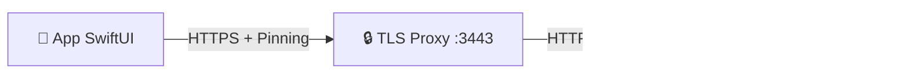

# 🍎 Sviluppo Nativo (macOS)

> **Guida per nerd Apple & Sviluppatori.**
> Il client nativo SwiftUI di MediFlow completa l'esperienza con performance e integrazione OS.

---

## 🚀 Stato del Progetto: "Alpha Avanzata"

L'app nativa non è più solo un lettore. Ora supporta:

* **Lettura e Scrittura**: Puoi creare pazienti, visite, terapie e controlli.
* **AI Control Panel**: Un pannello dedicato per monitorare e chattare con l'AI (Ollama) direttamente.
* **Sicurezza Completa**: Lock Screen con PIN, cifratura AES-256 in memoria, e Certificate Pinning.

---

## 🛠 Requisiti e Setup Rapido

1. **Xcode 15+** (Swift 5.9).
2. **Node.js 20+**.
3. **Mkcert** (per HTTPS locale).

### Il "Quick Start" (Script Magico)

Non impazzire con i comandi manuali. Abbiamo creato layout automatici.

**Opzione A: Launcher (Per uso rapido)**

```bash
./scripts/Launch_MediFlowMac.command
```

* Avvia Next.js (Server)
* Avvia il Proxy TLS
* Lancia l'App macOS compilata (se esiste)

**Opzione B: Setup Sviluppatore (Per chi tocca il codice)**

1. Prepara l'ambiente:

    ```bash
    ./scripts/native-setup.sh
    ```

    *(Genera certificati, config, e controlla le porte)*

2. Apri il progetto in Xcode:

    ```bash
    open native/MediFlowMac.xcodeproj
    ```

---

## 📱 Features Ntive (Cosa c'è di nuovo)

### 1. Lock Screen & Sicurezza

L'app parte bloccata.

* Devi inserire il **PIN** (lo stesso della web app).
* Il PIN deriva la **Master Key** in RAM.
* Se l'app va in background o chiudi il coperchio, si blocca e "dimentica" la chiave per sicurezza.

### 2. AI Control Panel & Tools

Nel tab "Strumenti" (Tools) trovi il pannello di controllo AI.

* **Stato Modelli**: Vedi se MedGemma/DeepSeek sono carichi in memoria.
* **Chat di Ragionamento**: Puoi parlare direttamente con l'AI per testare prompt o chiedere consulti rapidi (bypassando la cartella clinica).
* **Gestione Farmaci/ICD**: Strumenti rapidi per cercare codici senza aprire un paziente.

### 3. Editor Full-Feature

L'interfaccia di inserimento (Nuovo Paziente, Nuova Visita) è nativa SwiftUI.

* Usa i componenti di sistema (Date Picker, Menu).
* È molto più veloce del web.

---

## 🔗 Architettura Client-Server

Il client Swift parla con Next.js tramite un **Bridge TLS Privato**.

* **Server**: `https://localhost:3443` (Proxy verso :3000).
* **API**: `/api/v1/*` (Endpoint ottimizzati per JSON puro).
* **Auth**: Token Bearer + PIN Session.



### Struttura nel Codice (`native/MediFlowMac`)

* `Services/LocalAPIClient.swift`: Il cuore della comunicazione. Gestisce i `URLSession` pinnati.
* `Services/SecuritySession.swift`: Gestisce il ciclo di vita della chiave crittografica.
* `Views/AIControlPanelView.swift`: La dashboard per governare Ollama.

---

## 📝 Come Contribuire

Se vuoi aggiungere una vista:

1. Controlla `lib/api/v1/types.ts` per vedere i dati.
2. Crea la View in SwiftUI dentro `Views/`.
3. Ricordati di usare `SecuritySession.shared.decrypt(...)` quando mostri dati sensibili!
