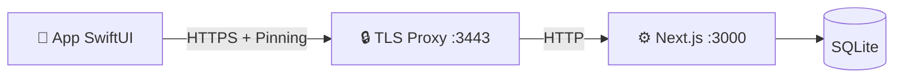

# Sviluppo Nativo (macOS)

> Guida tecnica del client SwiftUI di MediFlow.

Riferimenti correlati:

- [docs/README.md](./README.md) (mappa canonica documentazione)
- [docs/markdown-index.md](./markdown-index.md) (indice completo markdown)
- [docs/walkthrough.md](./walkthrough.md) (flusso end-to-end)
- [docs/local-api-tls.md](./local-api-tls.md) (trasporto TLS locale)
- [docs/native-testing.md](./native-testing.md) (strategia test ufficiale)

---

## Stato del progetto

Il client nativo non è più solo in lettura. Oggi supporta:

* **CRUD clinico essenziale**: creazione pazienti, visite, terapie e controlli.
* **AI Control Panel**: monitoraggio modelli e chat tecnica locale.
* **Sicurezza**: lock screen con PIN, cifratura in memoria e certificate pinning.

---

## Requisiti e setup rapido

1. **Xcode 15+** (Swift 5.9).
2. **Node.js 20+**.
3. **Mkcert** (per HTTPS locale).

### Quick start

**Opzione A: launcher rapido**

```bash
./scripts/Launch_MediFlowMac.command
```

* configura TLS locale
* compila il client nativo
* apre la app macOS

**Opzione B: setup sviluppatore**

1. Prepara l'ambiente:

    ```bash
    ./scripts/native-setup.sh
    ```

    *(Genera certificati, config e controlla le porte.)*

2. Apri il progetto in Xcode:

    ```bash
    open native/MediFlowMac/Package.swift
    ```

---

## Testing nativo (Xcode-first)

La strategia testing ufficiale e documentata in:

- [docs/native-testing.md](./native-testing.md)
- [docs/parity-smoke.md](./parity-smoke.md)
- [docs/parity-click-map-macos.md](./parity-click-map-macos.md)

Comandi rapidi:

```bash
npm run test:native
npm run test:native:xcode
npm run test:parity:smoke
```

---

## Funzionalità principali

### 1. Lock Screen & Sicurezza

L'app parte bloccata:

* Devi inserire il **PIN** (lo stesso della web app).
* Il PIN deriva la **Master Key** in RAM.
* Se l'app va in background (o il Mac si sospende), la chiave viene scaricata.

### 2. AI Control Panel & Tools

Nel tab `Strumenti` trovi il pannello AI.

* **Stato Modelli**: Vedi se Qwen/DeepSeek sono carichi in memoria.
* **Chat tecnica**: puoi testare prompt o fare troubleshooting locale.
* **Gestione Farmaci/ICD**: Strumenti rapidi per cercare codici senza aprire un paziente.

### 3. Editor Full-Feature

I form di inserimento (Nuovo Paziente, Nuova Visita) sono nativi SwiftUI.

* Usa i componenti di sistema (Date Picker, Menu).
* Performance e interazione sono più immediate rispetto al browser.

---

## Architettura client-server

Il client Swift comunica con Next.js tramite bridge TLS locale.

* **Server**: `https://localhost:3443` (proxy verso `:3000`)
* **API**: `/api/v1/*`
* **Auth**: Bearer token + sessione PIN



### Struttura codice (`native/MediFlowMac`)

* `Services/LocalAPIClient.swift`: comunicazione HTTP/TLS con pinning.
* `Services/SecuritySession.swift`: ciclo di vita chiavi in memoria.
* `Views/AIControlPanelView.swift`: controllo runtime AI locale.

---

## Come contribuire

Se vuoi aggiungere una vista:

1. Controlla `lib/api/v1/types.ts` per vedere i dati.
2. Crea la View in SwiftUI dentro `Views/`.
3. Ricordati di usare `SecuritySession.shared.decrypt(...)` quando mostri dati sensibili!
