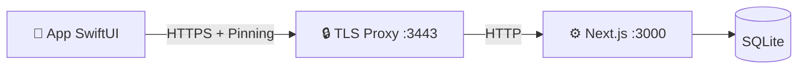

# Sviluppo nativo Apple (macOS, iPhone e iPad)

> Guida tecnica della famiglia SwiftUI di MediFlow e del Mac `home-base`.

> [!IMPORTANT]
> Il congelamento dello snapshot macOS precedente a `v0.4.0` appartiene alla
> storia del progetto. La base di sviluppo attiva è l'app universale descritta
> da ADR 0048/0071: bundle macOS `home-base`, target iPhone/iPad associati e
> package condiviso `MediFlowCore`/`MediFlowAppleShared`. La web app rimane la
> superficie più completa. Le correzioni SwiftUI, le build e i test citati per
> la candidata sorgente v0.8 valgono per le revisioni a cui si riferiscono:
> non dimostrano parità completa, certificazione o pubblicazione App Store.
> La release 0.8.6 distribuisce sorgenti per il runtime locale/headless su Mac
> con browser localhost; il seguito nativo è un percorso separato.

Riferimenti correlati:

- [docs/README.md](./README.md) (mappa canonica documentazione)
- [docs/markdown-index.md](./markdown-index.md) (indice completo markdown)
- [docs/walkthrough.md](./walkthrough.md) (flusso end-to-end)
- [docs/local-api-tls.md](./local-api-tls.md) (trasporto TLS locale)
- [docs/native-testing.md](./native-testing.md) (strategia test ufficiale)
- [docs/parity-matrix.md](./parity-matrix.md) (stato verificato delle capability)
- [docs/design/lume/README.md](./design/lume/README.md) (lingua di design attiva)
- [docs/design/lume/06-macos-apple-contract.md](./design/lume/06-macos-apple-contract.md) (contratto macOS)

---

## Stato del progetto

La base condivisa serve a mantenere coerenti contratti e protezione dei dati,
non a rendere identici i ruoli dei dispositivi. Lo stato va quindi letto per
componente:

* **macOS**: `MediFlowMacApp` è il fronte nativo più maturo. Il bundle completo
  include il WebRuntime Next standalone e può osservare o gestire, con azioni
  esplicite, backend locale e proxy TLS. Questa responsabilità non si estende
  alla supervisione dei provider AI facoltativi.
* **iPhone/iPad**: `MediFlowMobileApp` usa la stessa libreria SwiftUI, ma accede
  ai dati entro il contratto `/api/v1/network/*`. I percorsi online con pairing
  coprono il ciclo di vita del paziente, i moduli clinici non-AI, i cataloghi,
  prestazioni/protesica e la creazione manuale di documenti secondo ADR 0076.
* **Core condiviso**: `MediFlowCore` raccoglie contratti, cifratura, codec,
  validatori, scale cliniche e SQLite. I controlli su macOS/Linux/Windows
  verificano la portabilità di questo nucleo; non dimostrano che siano
  disponibili app desktop complete su tre sistemi.
* **Sicurezza**: i client sigillano i campi sensibili prima della trasmissione
  o della memorizzazione. L'associazione del dispositivo e la sessione
  dell'operatore restano distinte, e nessun client mobile accede direttamente
  al database del Mac.
* **Headless/AIP locale**: il Supervisor Node portabile avvia Web standalone e
  MCP `stdio` come processi figli distinti, su IPC ereditato. L'host mantiene
  la responsabilità di contesto, autorizzazioni temporanee (lease), revoca e
  audit. L'adapter LaunchAgent/libxpc macOS è una direzione facoltativa
  separata, non un requisito della 0.8.5.
* **Parity**: la matrice post-Wave 5 e in [docs/parity-matrix.md](./parity-matrix.md).
  `WUL-401`/PR #21 hanno consegnato bundle, fixture, probe AX e runbook P6 di
  base. Le prove riportate per la candidata v0.8 chiudono i gate UI di quel
  candidato con iPhone 2/2, iPad 7/7 e verifiche macOS reali. VoiceOver reale
  su iPhone e iPad resta un limite
  esterno documentato, non un PASS e non un claim di conformità.
  `WUL-403` resta la corsia per rendere visibili eta,
  TTL e staleness della cache e il degrado offline read-only.

---

## Deep link locali di navigazione (row32)

Un collegamento locale serve a raggiungere una vista, non a ottenere accesso
ai dati. Entro ADR 0048, il contratto usa perciò lo schema `mediflow` e il solo
destinatario `navigate`: non costituisce un ingresso API né un meccanismo di
pairing. Sono ammesse queste forme:

```text
mediflow://navigate?area=agenda
mediflow://navigate?area=patients&paziente=patient-synthetic-01&section=diary
```

`area` nomina una destinazione già presente: `patients`, `agenda`, `diary`,
`analytics`, `scales`, `settings`, `runtime`, `overview`, `milestones`; su macOS
anche `host` e `repertori`. `paziente` e ammesso solo con `area=patients` e indica
un ID opaco da risolvere con il reader ordinario nello scope della sessione
corrente, mai un record fornito dal link. L'ID contiene solo lettere ASCII,
cifre, trattino, underscore o punto (1–512 byte; esclusi `.` e `..`).
`section` richiede `paziente`: `overview` (default), `diary`, `scales`,
`therapies`, `clinical`, `prescriptions`, `documents`.

Il parser rifiuta chiavi sconosciute o ripetute, URL oltre 2048 byte, path,
fragment, porta o credenziali. Token, PIN, dati clinici, configurazione host e
URL esterni non fanno parte del contratto; il client non conserva il link né
lo registra nei log. Poiché lo schema personalizzato non autentica chi lo apre,
l'app rimane bloccata senza una sessione ordinaria sbloccata e non riprende il
link dopo il login: occorre aprirlo di nuovo, esplicitamente. Il collegamento
non esegue login, salvataggi, export, upload o altri comandi, non concede
capability e non disattiva i controlli delle viste.

Ogni finestra mantiene il proprio intento di navigazione: un nuovo link o uno
spostamento manuale nell'area globale invalida quello precedente. Prima di
cambiare paziente, il raccordo del workspace controlla sessione e scope ancora
validi, selezione e bozze. Se rifiuta soltanto la navigazione, conserva cartella
e testo presenti; se invece si blocca la sessione, rimuove subito la
presentazione clinica e le bozze locali, secondo il ciclo di vita della
sessione. Una risposta tardiva non può riaprire una destinazione superata.
Il dettaglio compatto viene presentato solo quando lettura e selezione hanno
successo, senza ricostruire lo split o sostituire il modello.

Verificare parser e router non equivale a verificare l'integrazione con il
sistema operativo. I test che sostituiscono il reader non attestano pairing
reale, apertura del link dal sistema o interazione su iPhone/iPad. La row32
resta quindi `partial` finché questi percorsi interattivi non sono verificati;
per Mini il limite rimane `manual_only`.

Verifica locale della slice (2026-09-06): 84 test SwiftPM passano, comprendendo
parser/router, selezione con reader ordinario e transport sostituito, lifecycle
e cache. Le build Debug Mac e iOS Simulator generica passano con Xcode 26.6
(17F113), senza signing; entrambi i bundle contengono la registrazione dello
schema `mediflow`. Queste prove non attestano apertura OS o pairing reale.

## Requisiti e setup rapido

1. **Xcode corrente compatibile con Swift 5.9**; per i gate locali viene usato
   Xcode beta quando indicato dai runbook.
2. **Node.js 24 richiesto** per il bundle runnable/WebRuntime e per i launcher.
   Il launcher rifiuta runtime o binding `better-sqlite3` non conformi prima
   di avviare il setup.
3. **OpenSSL** (per HTTPS locale).

<a id="quick-start"></a>

### Avvio rapido

**Opzione A: launcher rapido**

```bash
./scripts/Launch_MediFlowMac.command
```

* inizializza il database soltanto in una cartella dati nuova o vuota, prima dei file TLS
* conserva cartelle non vuote senza database: richiedono recupero esplicito
* configura TLS locale
* compila il client nativo
* apre la app macOS
* registra `runtime-status.json` accanto a `native-config.json`, cosi il
  pannello runtime nella app può mostrare lo stato del bootstrap senza esporre
  token o contenuti sensibili

**Opzione B: setup sviluppatore**

1. Prepara l'ambiente:

    ```bash
    ./scripts/native-setup.sh
    ```

    *(Genera certificati, config e controlla le porte.)*

2. Apri il progetto in Xcode:

    ```bash
    open native/MediFlowMac/Package.swift
    ```

---

## Testing nativo (Xcode-first)

La strategia ufficiale distingue i test del nucleo dai percorsi interattivi ed è documentata in:

- [docs/native-testing.md](./native-testing.md)
- [docs/mobile-home-base-smoke.md](./mobile-home-base-smoke.md)

Comandi rapidi:

```bash
npm run test:native
npm run test:native:xcode
npm run test:parity:smoke
```

Il target mobile condiviso può conservare una copia derivata della lista
pazienti, ma la continuità di lettura non deve diventare un modo per aggirare
la sessione. Nel candidato WUL-676 (0.8.6, ADR 0048), la cache usa
AES-GCM/Portachiavi e richiede la stessa sessione operatore sbloccata, pairing,
scope e pin TLS; non viene ripristinata prima del login. Il TTL massimo è
24 ore. Quando scade, restano disponibili soltanto timestamp, scadenza,
conteggio e motivo, mai i dati paziente.

Il modello conserva anche l'ultimo profilo manuale letto online, con TTL
separato e una presentazione dedicata in sola lettura nelle destinazioni
compatta e affiancata. Restano esclusi sotto-risorse, artifact, export,
scritture offline e coda di merge. Il ricorso alla cache è ammesso solo per
indisponibilità o timeout di rete: risposte 401/403 e problemi TLS non lo
autorizzano.

Le scritture online del client mobile associato riguardano diario clinico,
terapie, controlli e osservazioni. Dalla scheda paziente iPhone/iPad si possono
leggere le ultime voci di diario, inviarne una nuova all'home-base, modificarla
e annullarla con una cancellazione logica verificabile, o soft-delete. Le terapie
espongono lookup AIFA paired con fallback manuale, list/create/update e
annullamento online per campi non-AI essenziali: farmaco, AIC/ATC quando
disponibili, principio attivo opzionale, posologia, stato, date e motivazione.
I controlli espongono titolo, data, stato e note manuali; le
osservazioni espongono parametro/codice LOINC, valore, unità UCUM, data di
rilevazione e note. Ogni create diario usa un identificativo client-side stabile
per evitare duplicati se la rete cade dopo il commit; update e annullamento
usano la `version` del record e mostrano il conflitto come richiesta di
ricarica/confronto. Il client non gestisce un repertorio farmaci autonomo:
interroga in sola lettura il catalogo dell'home-base. Non esistono prescrizione
SISS nativa, AI/OCR paired, scritture offline o coda di merge.

Durante il salvataggio del Diario, i controlli che modificano la voce restano
disabilitati fino al termine dell'operazione. Il writer acquisisce titolo,
tipo, documento e riferimenti; la conferma ACK azzera soltanto la bozza che
sia ancora identica a quella inviata e nello stesso contesto. In questo modo,
eventuali modifiche locali successive allo snapshot non vengono perse né
inviate automaticamente. Per un create confermato
restano una nuova bozza non salvata; per un update restano nell'editor e
richiedono confronto con la versione riletta, perché l'ACK non porta una nuova
`version`. Un errore senza ACK conserva la bozza e, per create, il suo ID stabile.

Un `409` sospende il successivo Save anche se si chiude il banner. La rilettura
mostra la voce corrente senza sostituire testo, riferimenti o versione della
bozza. Dopo confronto e revisione manuali, **Ho confrontato: mantieni la mia
bozza** adotta la versione letta e conserva i contenuti locali. Solo un successivo
**Salva modifiche** esegue il PUT ordinario con CAS; un ulteriore `409` richiede
un nuovo confronto. Una voce assente dalla lettura, eliminata, non leggibile o
letta in un contesto superato non autorizza la conferma. Nessun merge, retry o
overwrite automatico.

---

## Funzionalità principali

### 0. Shell Apple/home-base e runtime locale

La finestra primaria dell'app macOS usa la shell Apple/home-base della
famiglia condivisa. Il bundle **osserva** il runtime locale e consente le sole
azioni esplicite indicate sotto, senza estendere la gestione ai provider AI:

* legge `~/Library/Application Support/MediFlow/native-config.json`;
* legge `runtime-status.json` prodotto da `scripts/native-setup.sh`;
* mostra server, modalità rete, presenza token, PID proxy e coerenza del
  fingerprint TLS;
* include nel bundle il runtime Next standalone validato da
  `check:standalone-runtime-bundle`;
* può avviare e arrestare esplicitamente il backend web production locale;
* può avviare e arrestare esplicitamente il solo proxy TLS locale usando lo
  script `local-api-tls-proxy.mjs` incluso nel bundle;
* arresta backend/proxy con timeout esplicito e escalation locale quando il
  processo non termina in modo ordinato;
* mostra lo stato diagnostico read-only di Ollama (`127.0.0.1:11434`) e MLX;
* non mostra mai token, certificati, chiavi o dati paziente;
* non installa, avvia, arresta o supervisiona i provider AI opzionali.

`scripts/build-apple-macos-app.sh` produce un bundle macOS specifico per
l'architettura corrente (`arm64` oppure `x86_64`) con il WebRuntime incluso. Il
bundle non è firmato per default e può usare `MEDIFLOW_CODESIGN_IDENTITY` (`-`
per ad-hoc, Developer ID Application per distribuzione diretta). La
notarizzazione Apple è un passaggio separato della distribuzione diretta. La
distribuzione Mac App Store usa invece il relativo percorso di firma e upload
e richiede una decisione distinta su App Sandbox. I servizi opzionali sono
visibili come health diagnostico, non come processi app-managed.

### Adapter AIP macOS opzionale

La direzione descritta da ADR 0114 e #329 riserva nel bundle firmato un LaunchAgent
`com.mediflow.aip-broker`, due launcher nativi, l'addon Node-API/libxpc e il
runtime JavaScript AIP. Il plist vive in `Contents/Library/LaunchAgents`, usa
`BundleProgram` e pubblica due Mach service per-user: control e RPC. Il
launcher MCP sostituisce l'ambiente e mantiene il PID quando esegue il Node 24
approvato; il broker verifica PID, EUID e ASID dal canale XPC, il requisito di
firma e una bootstrap reference monouso.

In questa direzione, `MediFlowMacApp` resterebbe l'unico owner di registrazione,
update, rollback e unregister tramite `SMAppService`. Un bundle unsigned,
l'approvazione di sistema mancante o un mismatch di firma/manifest manterrebbe
l'adapter disabilitato. Non sono ammessi XPCService proxy, secondo IPC,
fallback TCP, API private o raw audit token. Questa sezione descrive una
decisione di packaging futura, non il Supervisor portabile integrato nella
0.8.5.

### Registrazione visita 0.8.5

Su macOS 26 o successivo, la shell integra la cattura e la trascrizione
italiana tramite API Apple sul dispositivo. Il consenso deve essere esplicito;
l'audio rimane entro limiti definiti e soltanto in RAM, mentre la trascrizione
passa alla bozza solo dopo la revisione. Il percorso non esegue scritture
cliniche automatiche. Le prove del candidato non comprendono il microfono
reale né la validazione clinica.

### 1. Sessione e privacy

La chiave clinica serve alla sessione sbloccata, non deve diventare una
credenziale persistente del client: la master key rimane perciò soltanto in
memoria e l'app applica lo schermo di riservatezza quando perde il primo piano.
Token del nodo, sessione operatore e chiave clinica conservano cicli di vita
distinti, disciplinati dagli ADR di autenticazione e crittografia.

### 2. Workspace clinico condiviso

La scheda macOS separa **Anagrafica**, **Clinica** e **Amministrazione** per
rendere leggibili esigenze diverse senza cambiare paziente o writer. La vista
iniziale è Clinica, con diagnosi, terapie attive caricate, follow-up, note e
risultati da rivedere. Anagrafica raccoglie identità e contatti; Amministrazione
riunisce ambulatorio, stato, esenzioni e provenienza dell'archiviazione.
Passare da un'area all'altra conserva l'editor esistente; cambiare paziente
riporta invece a Clinica. I contatori delle terapie si riferiscono soltanto
alla lista caricata, e diagnosi o esenzioni protette non vengono rappresentate
come conteggi zero.

Per i documenti, il conteggio compare solo quando la lettura è completata.
Se l'archivio è vuoto, la vista offre direttamente i comandi di caricamento,
sempre soggetti a permessi e sessione ordinari, anziché mostrare una sintesi
vuota. Dettagli, follow-up documentali e verifica FSE restano nei percorsi
esistenti: questa organizzazione non introduce API, scoring, inferenze o
writer nuovi.

La shell SwiftUI espone lista e dettaglio paziente, diario rich text, terapie,
checkup, osservazioni, prestazioni, protesica, documenti e report entro le
capability concesse dall'home-base. Le superfici AI, OCR e document-derived
restano host-only o review-only secondo
[ADR 0073](./adr/0073-treatment-reasoning-athena-boundary.md) e
[ADR 0076](./adr/0076-paired-document-domain-write-policy.md).

<a id="3-design-e-accessibilita"></a>

### 3. Design e accessibilità

ADR 0078 è `Accepted`: Lume è il linguaggio attivo della candidata locale,
mentre Vetro Clinico resta una baseline storica e transitoria. La card clinica
già migrata rimane opaca e leggibile; l'adozione sulle altre superfici è
progressiva. Sidebar, toolbar, menu, sheet, popover e inspector usano i
componenti di sistema, e Liquid Glass migliora soltanto gli elementi di
contorno sui sistemi compatibili: non è un materiale da applicare alle card
cliniche. macOS, iPhone e iPad condividono così semantica e primitive senza
forzare la stessa navigazione o densità.

La slice macOS WUL-566/WUL-567 conserva Carta come grammatica documentale, non
come palette: nessuna resa crema, beige, avorio o parchment. L'inspector paziente usa
colori neutrali nativi adattivi. Solo la major esatta macOS 27 usa lo sheet di
compatibilità; macOS 28+ torna all'inspector di sistema.

Gli audit XCTest e i test UI sono verdi su iPhone e iPad. VoiceOver è stato
esercitato manualmente su macOS. La beta Xcode 27 non completa l'abilitazione
VoiceOver nel simulatore mobile; il limite e la deroga della sola candidata
sorgente 0.8 sono registrati in
[docs/known-limitations.md](./known-limitations.md).
La nuova slice inspector non aggiunge un PASS VoiceOver: nel run WUL-567 la
sessione Mac era bloccata, quindi focus, resize e narrazione restano `PARTIAL`.

### 4. Temperamento mobile candidato e stato paired

`WUL-556` usa **Guardia** come temperamento esplorativo su iPhone/iPadOS e
**Carta** come substrato delle superfici cliniche. La decisione owner è
acquisita per la candidata: Carta descrive la grammatica del contenuto, non una
palette. Non resta quindi una decisione di contratto aperta. Il client non forza
il tema scuro; usa il canvas Guardia solo quando l'aspetto di sistema è scuro e
mantiene componenti, materiali e navigazione di sistema.

Da questa decisione vincolante discende anche il limite cromatico: **Carta
descrive la grammatica del contenuto, non una palette**. Le superfici mobili
non introducono crema,
beige, avorio o parchment. Il giorno usa i colori neutrali adattivi già
canonici (`canvas #eef0f2`, `field #f4f6f8`, `focal #fbfcfe`); il buio usa il
canvas Guardia neutro `#0c0e12`. I colori success/warning/critical restano
segnali funzionali e non derivano dalla metafora Carta. Le preview sintetiche
coprono esplicitamente iPhone light e iPad dark.

Il pannello `mobile-paired-status` distingue caricamento, errore, connessione
online, cache locale, uso offline in sola lettura e sessione scaduta. Nel
candidato WUL-676, l'indicazione di dati non più aggiornati è collegata ai
metadata effettivi: oltre il TTL nasconde i dati paziente e lascia visibili
acquisizione, scadenza e motivo. L'azione primaria misura almeno 48 pt, ha una
label VoiceOver e supporta `⌘R` e il puntatore su iPad.

Questa superficie non concede capability. Il gate di consumo `WUL-557` usa il
contratto machine-readable canonico
`packages/mini/contracts/mini-parity.json`, verificato byte-identico nei head
`3fd988bafe71a058fdd7d3c25ea569793dcba903` (PR #184) e
`1e35733c0218eae67a1d6e158085aab7340bc26b` (PR #190). Il contratto dichiara
4 righe `available` su 66 (`6.060606%`), 61 `manual_only`, 1 `proposal_only` e
0 `unavailable`; le ragioni restano 23 `HOST_AUTHORITY_ONLY`, 38
`NOT_IN_MINI_PILOT` e 1 `SYNTHETIC_PREVIEW_ONLY`.

Per la slice `WUL-556`, `patient search/show` (riga 1), `whoami` (riga 39) e
`capabilities` (riga 63) sono disponibili in Mini, ma non colmano i residui
nativi e non diventano grant. La cache offline (riga 45) resta `manual_only`
con ragione `NOT_IN_MINI_PILOT`, mentre iPhone/iPadOS restano `partial` per
renderer profilo integrato; verifica UI/device ancora aperta.
I metadata stale sono collegati nel candidato; write queue e sotto-risorse
restano escluse dal contratto, non un difetto di parity. Manifest, receipt,
stato paired e token locale non conferiscono autorità agentica. La parity resta
incompleta fino alla verifica manager e a `WUL-564`.

---

## Architettura client-server

Il client Swift raggiunge Next.js attraverso il collegamento TLS locale,
anziché accedere direttamente al database. Trasporto, API e autenticazione
rimangono distinti:

* **Server**: `https://localhost:3443` (proxy verso `:3000`)
* **API**: `/api/v1/*`
* **Auth**: Bearer token + sessione PIN



### Struttura codice

* `native/MediFlowAppleApp/project.yml`: target app macOS e iOS/iPadOS.
* `native/MediFlowAppleApp/Sources/`: entrypoint delle due shell.
* `native/MediFlowMac/Package.swift`: package condiviso e separazione dei target
  Apple dal core tri-OS.
* `native/MediFlowMac/Sources/MediFlowCore/`: dominio, contratti, crypto e store
  portabile.
* `native/MediFlowMac/Sources/MediFlowAppleShared/`: networking home-base,
  cache, privacy, report e shell SwiftUI condivisa.
* `native/MediFlowMac/Sources/MediFlowAppleShared/AppleFoundation/`: workspace
  clinico, settings, runtime status e modelli di presentazione.

---


### Headless MCP nel bundle — WUL-697 (candidato)

<!-- @Codex -->
Per rendere invocabile il percorso headless dal bundle, il builder aggiunge
`Contents/Resources/mediflow-headless-supervisor.mjs` e
`WebRuntime/HeadlessRuntime`. Include i file sorgenti necessari al
Supervisor/MCP esistente, non copie indiscriminate di `lib` o `packages`.
Condivide il Web standalone e il loader SQLite già normalizzato, senza
aggiungere Mach-O, listener o installer.
Il tracing usa Next/TypeScript già installati nel checkout completo e fallisce su
file mancanti, risoluzioni non chiuse o dipendenze non fisiche. Il roster fissa
SHA-256, byte e modi dopo la firma dei payload nativi, prima del sigillo esterno.
Sidecar, revisione canonica e pin del helper restano invariati; i controlli dopo
il sigillo sono in sola lettura.

L'interprete non è incluso: occorre il **medesimo eseguibile fisico Node 24**
attestato al packaging (hash, byte, modo, versione, ABI e architettura), già
provisionato sull'host, senza alias o symlink negli antenati. Aggiornare Node
richiede un nuovo packaging, non la riscrittura del roster nell'app sigillata.
Anche app e directory dati devono avere percorsi fisici assoluti; la directory
dati deve esistere ed essere esterna all'app. Invocazione esemplificativa, da
adattare ai percorsi provisionati, con ambiente pulito:

```sh
/usr/bin/env -i MEDIFLOW_DATA_DIR='/percorso/fisico/dati' \
  /percorso/fisico/node24 \
  /percorso/fisico/MediFlow.app/Contents/Resources/mediflow-headless-supervisor.mjs
```

Nessun argomento oppure il solo `--mcp`. Mini (`--mini`), argomenti aggiuntivi,
preload e variabili di ricerca Node sono rifiutati. Il launcher non cerca Node in
PATH, non usa una shell e non conserva override di autorità del chiamante.
Avvia nello stesso PID il Supervisor di produzione: authority, IPC ereditato,
lease, revoca e cleanup restano nei contratti esistenti. stdout è riservato al
protocollo. Roster e hook verificano i moduli caricati; non sono una sandbox
contro sorgenti ostili già fidati o un interprete manomesso prima dell'avvio.
La fiducia iniziale resta nell'app distribuita e nel Node provisionato: un
launcher sostituibile insieme al proprio roster non è auto-autenticante.

Lo smoke reale, con dati soltanto sintetici e porta esistente libera, usa:

```sh
/percorso/fisico/node24 scripts/mediflow-headless-supervisor-standalone-smoke.mjs \
  --app /percorso/fisico/estratto/MediFlow.app
```

Il test avvia l'entrypoint estratto da cwd estraneo/PATH ostile, esegue il percorso
Web autenticato già esistente, verifica stdout JSON-RPC, revoca/logout,
EOF/SIGTERM, assenza di figli residui e invarianza dell'app. I test dei guard su
layout sintetico e dei contratti IPC non lo sostituiscono. Questa slice è un
candidato da qualificare sul checkout completo/macOS: non attesta smoke reale,
firma, notarizzazione, release o chiusura complessiva WUL-697. Mini WUL-696 resta
fuori da questo entrypoint.

## Come contribuire

Per aggiungere una vista senza creare un percorso parallelo di dati o autorità:

1. Parti dal contratto OpenAPI e dai tipi paired già implementati.
2. Metti logica portabile in `MediFlowCore` e presentazione Apple in
   `MediFlowAppleShared`; evita un terzo modello parallelo.
3. Mantieni sigillo e decrittazione nel boundary client esistente: non creare
   scorciatoie dirette verso SQLite o nuove primitive crypto.
4. Aggiorna matrice parity, capability manifest e test nello stesso slice.

### Configurazione AI nativa — ADR0135 / WUL-694

La configurazione AI riguarda l'intero host, non il paziente aperto. Su macOS,
Impostazioni → Preferenze AI dell’host usa i tre servizi introdotti da questa
slice: `/api/v1/network/ai/functions` (GET/POST) e `/preview` (POST). Per le
quattro esperienze offre solo opzioni catalogate e i preset
`host_defaults`/`all_off`, passando da anteprima, conferma e rilettura. CAS,
catalogo e idempotenza appartengono al dominio parent 09ebe699b.

Il pairing e la sessione PIN nativa esistenti sono necessari ma non sufficienti:
serve il grant privato host per operatore admin e dispositivo descritto in
[ADR0135](./adr/0135-native-ai-configuration-authority.md). Il file 0600 è
indicato da `MEDIFLOW_NATIVE_AI_CONFIG_GRANTS_FILE`, ha scadenza e non viene
mai creato da una sessione Web o dal Mac remoto. Revoca e lock invalidano le
richieste; un esito ambiguo richiede rilettura, senza retry automatico.
La UI host per concedere questo grant non è disponibile. Nessun account Web
viene proiettato nella sessione Mac: lo stato account è esplicitamente non
disponibile e richiede un owner distinto. Questo percorso non aggiunge
inferenza né il data plane ADR0134. I test sintetici del servizio e del client non attestano
parità totale, account live o una release distribuita.
