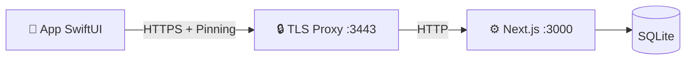

# Sviluppo nativo Apple (macOS, iPhone e iPad)

> Guida tecnica della family SwiftUI di MediFlow e del Mac `home-base`.

> [!IMPORTANT]
> Il congelamento dello snapshot macOS precedente a `v0.4.0` e storico. La base
> attiva e oggi l'app universale descritta da ADR 0048/0071: bundle macOS
> `home-base`, target iPhone/iPad paired e package condiviso
> `MediFlowCore`/`MediFlowAppleShared`. La web app resta la superficie piu
> completa. Nella candidata sorgente v0.8 la family include correzioni SwiftUI,
> build e test verificati. "Family Apple attiva" non significa parity completa,
> certificazione o pubblicazione App Store.

Riferimenti correlati:

- [docs/README.md](./README.md) (mappa canonica documentazione)
- [docs/markdown-index.md](./markdown-index.md) (indice completo markdown)
- [docs/walkthrough.md](./walkthrough.md) (flusso end-to-end)
- [docs/local-api-tls.md](./local-api-tls.md) (trasporto TLS locale)
- [docs/native-testing.md](./native-testing.md) (strategia test ufficiale)
- [docs/parity-matrix.md](./parity-matrix.md) (stato verificato delle capability)
- [docs/design/lume/README.md](./design/lume/README.md) (lingua di design attiva)
- [docs/design/lume/06-macos-apple-contract.md](./design/lume/06-macos-apple-contract.md) (contratto macOS)

---

## Stato del progetto

La base corrente va letta cosi:

* **macOS**: `MediFlowMacApp` e il fronte nativo piu maturo. Il bundle packaged
  include il WebRuntime Next standalone e puo osservare o gestire esplicitamente
  backend locale e proxy TLS senza diventare supervisore di Ollama o Docker.
* **iPhone/iPad**: `MediFlowMobileApp` usa la stessa libreria SwiftUI e il
  boundary `/api/v1/network/*`. I workflow paired online coprono lifecycle
  paziente, moduli clinici non-AI, cataloghi, prestazioni/protesica e create
  documentale manuale secondo ADR 0076.
* **Core condiviso**: `MediFlowCore` concentra contratti, cifratura, codec,
  validatori, scale cliniche e SQLite. I gate macOS/Linux/Windows provano la
  portabilita del core, non app desktop complete su tre sistemi.
* **Sicurezza**: i client sigillano i campi sensibili prima del wire/storage;
  pairing device e sessione operatore restano distinti; nessun client mobile
  accede direttamente al database del Mac.
* **Parity**: la matrice post-Wave 5 e in [docs/parity-matrix.md](./parity-matrix.md).
  `WUL-401`/PR #21 hanno consegnato bundle, fixture, probe AX e runbook P6 di
  base. La candidata v0.8 chiude i gate UI sul candidato con iPhone 2/2, iPad
  7/7 e prove macOS reali. VoiceOver reale su iPhone e iPad resta un limite
  esterno documentato, non un PASS e non un claim di conformità.
  `WUL-403` resta la corsia per rendere visibili eta,
  TTL e staleness della cache e il degrado offline read-only.

---

## Requisiti e setup rapido

1. **Xcode corrente compatibile con Swift 5.9**; per i gate locali viene usato
   Xcode beta quando indicato dai runbook.
2. **Node.js 24 consigliato**. Il runner TypeScript richiede almeno Node 22.6.
3. **Mkcert** (per HTTPS locale).

### Quick start

**Opzione A: launcher rapido**

```bash
./scripts/Launch_MediFlowMac.command
```

* configura TLS locale
* compila il client nativo
* apre la app macOS
* registra `runtime-status.json` accanto a `native-config.json`, cosi il
  pannello runtime nella app puo mostrare lo stato del bootstrap senza esporre
  token o contenuti sensibili

**Opzione B: setup sviluppatore**

1. Prepara l'ambiente:

    ```bash
    ./scripts/native-setup.sh
    ```

    *(Genera certificati, config e controlla le porte.)*

2. Apri il progetto in Xcode:

    ```bash
    open native/MediFlowMac/Package.swift
    ```

---

## Testing nativo (Xcode-first)

La strategia testing ufficiale e documentata in:

- [docs/native-testing.md](./native-testing.md)
- [docs/mobile-home-base-smoke.md](./mobile-home-base-smoke.md)

Comandi rapidi:

```bash
npm run test:native
npm run test:native:xcode
npm run test:parity:smoke
```

Nel percorso mobile paired corrente, il target condiviso include anche una cache
locale derivata della lista pazienti: lo snapshot e cifrato con chiave locale da
Portachiavi, e valido solo per il medesimo `home-base` / ambulatorio entro una
soglia breve. Quando il Mac non e raggiungibile, l'app mobile puo mostrare lo
stato `offline degradato` in sola consultazione; non esistono ancora scritture
offline o coda di merge mobile.

Le prime scritture mobile paired esposte nella shell condivisa coprono diario
clinico, terapie, controlli e osservazioni. Dalla scheda paziente iPhone/iPad si
possono leggere le ultime voci diario, inviare una nuova voce online
all'home-base, modificarla e annullarla con soft-delete reviewable. Le terapie
espongono lookup AIFA paired con fallback manuale, list/create/update e
annullamento online per campi non-AI essenziali: farmaco, AIC/ATC quando
disponibili, principio attivo opzionale, posologia, stato, date e motivazione.
I controlli espongono titolo, data, stato e note manuali; le
osservazioni espongono parametro/codice LOINC, valore, unita UCUM, data di
rilevazione e note. Ogni create diario usa un identificativo client-side stabile
per evitare duplicati se la rete cade dopo il commit; update e annullamento
usano la `version` del record e mostrano il conflitto come richiesta di
ricarica/confronto. Il client non gestisce un repertorio farmaci autonomo:
interroga in sola lettura il catalogo dell'home-base. Non esistono prescrizione
SISS nativa, AI/OCR paired, scritture offline o coda di merge.

---

## Funzionalità principali

### 0. Shell Apple/home-base e runtime locale

La finestra primaria della app macOS e il shell Apple/home-base condiviso con
la family architecture. In questa slice il bundle **osserva** il runtime locale:

* legge `~/Library/Application Support/MediFlow/native-config.json`;
* legge `runtime-status.json` prodotto da `scripts/native-setup.sh`;
* mostra server, modalita rete, presenza token, PID proxy e coerenza del
  fingerprint TLS;
* include nel bundle il runtime Next standalone validato da
  `check:standalone-runtime-bundle`;
* puo avviare e arrestare esplicitamente il backend web production locale;
* puo avviare e arrestare esplicitamente il solo proxy TLS locale usando lo
  script `local-api-tls-proxy.mjs` incluso nel bundle;
* arresta backend/proxy con timeout esplicito e escalation locale quando il
  processo non termina in modo ordinato;
* mostra lo stato diagnostico read-only di Ollama (`127.0.0.1:11434`) e
  Docker/ICD (`127.0.0.1:8888`) quando sono gia attivi;
* non mostra mai token, certificati, chiavi o dati paziente;
* non installa, avvia, arresta o supervisiona Ollama o container Docker.

`scripts/build-apple-macos-app.sh` produce il bundle universale macOS con il
WebRuntime incluso, non firmato per default, e puo firmarlo con
`MEDIFLOW_CODESIGN_IDENTITY` (`-` per ad-hoc, Developer ID per distribuzione).
La notarizzazione resta un passaggio di distribuzione separato. I servizi
opzionali sono visibili come health diagnostico, non come processi app-managed.

### 1. Sessione e privacy

Il client mantiene la master key soltanto in memoria durante una sessione
sbloccata e applica il privacy shield quando l'app perde il primo piano. Il
token del nodo, la sessione operatore e la chiave clinica hanno cicli di vita
distinti; il dettaglio normativo resta negli ADR auth/crypto.

### 2. Workspace clinico condiviso

La shell SwiftUI espone lista e dettaglio paziente, diario rich text, terapie,
checkup, osservazioni, prestazioni, protesica, documenti e report entro le
capability concesse dall'home-base. Le superfici AI, OCR e document-derived
restano host-only o review-only secondo
[ADR 0073](./adr/0073-treatment-reasoning-athena-boundary.md) e
[ADR 0076](./adr/0076-paired-document-domain-write-policy.md).

### 3. Design e accessibilita

ADR 0078 e `Accepted`: Lume e la lingua attiva della candidata locale e Vetro
Clinico resta baseline storica e transitoria. La card clinica gia migrata resta opaca e
leggibile; le altre superfici sono ancora in adozione progressiva. Sidebar,
toolbar, menu, sheet, popover e inspector usano i componenti di sistema. Liquid
Glass e un enhancement del chrome su OS compatibili, non un materiale da
applicare alle card cliniche. macOS, iPhone e iPad condividono semantica e
primitive, non la stessa navigazione o densita.

Gli audit XCTest e i test UI sono verdi su iPhone e iPad. VoiceOver è stato
esercitato manualmente su macOS. La beta Xcode 27 non completa l'abilitazione
VoiceOver nel simulatore mobile; il limite e la deroga della sola candidata
sorgente 0.8 sono registrati in
[docs/known-limitations.md](./known-limitations.md).

### 4. Temperamento mobile candidato e stato paired

`WUL-556` usa **Guardia** come temperamento esplorativo su iPhone/iPadOS e
**Carta** come substrato delle superfici cliniche. La scelta resta
`PROPOSED_FOR_OWNER_REVIEW`: un rifiuto o un cambio del product owner blocca
la promozione della candidata. Il client non forza il tema scuro; usa il canvas
Guardia solo quando l'aspetto di sistema è scuro e mantiene componenti,
materiali e navigazione di sistema.

La decisione owner per questa slice è vincolante: **Carta descrive la grammatica
del contenuto, non una palette**. Le superfici mobili non introducono crema,
beige, avorio o parchment. Il giorno usa i colori neutrali adattivi già
canonici (`canvas #eef0f2`, `field #f4f6f8`, `focal #fbfcfe`); il buio usa il
canvas Guardia neutro `#0c0e12`. I colori success/warning/critical restano
segnali funzionali e non derivano dalla metafora Carta. Le preview sintetiche
coprono esplicitamente iPhone light e iPad dark.

Il pannello `mobile-paired-status` rende distinguibili caricamento, errore,
online, cache locale, offline in sola lettura e sessione scaduta. La resa stale
ha preview e test sintetici, ma non è ancora cablata a metadata live: la cache
oltre il TTL viene scartata. L'azione primaria misura almeno 48 pt, espone label
VoiceOver e supporta `⌘R` e pointer su iPad.

Questa superficie non concede capability. AIP/Mini e WUL-518 restano fonti
host-only: manifest, receipt o stato headless non diventano un grant clinico nel
client mobile.

---

## Architettura client-server

Il client Swift comunica con Next.js tramite bridge TLS locale.

* **Server**: `https://localhost:3443` (proxy verso `:3000`)
* **API**: `/api/v1/*`
* **Auth**: Bearer token + sessione PIN



### Struttura codice

* `native/MediFlowAppleApp/project.yml`: target app macOS e iOS/iPadOS.
* `native/MediFlowAppleApp/Sources/`: entrypoint delle due shell.
* `native/MediFlowMac/Package.swift`: package condiviso e separazione dei target
  Apple dal core tri-OS.
* `native/MediFlowMac/Sources/MediFlowCore/`: dominio, contratti, crypto e store
  portabile.
* `native/MediFlowMac/Sources/MediFlowAppleShared/`: networking home-base,
  cache, privacy, report e shell SwiftUI condivisa.
* `native/MediFlowMac/Sources/MediFlowAppleShared/AppleFoundation/`: workspace
  clinico, settings, runtime status e modelli di presentazione.

---

## Come contribuire

Se vuoi aggiungere una vista:

1. Parti dal contratto OpenAPI e dai tipi paired gia implementati.
2. Metti logica portabile in `MediFlowCore` e presentazione Apple in
   `MediFlowAppleShared`; evita un terzo modello parallelo.
3. Mantieni sigillo e decrittazione nel boundary client esistente: non creare
   scorciatoie dirette verso SQLite o nuove primitive crypto.
4. Aggiorna matrice parity, capability manifest e test nello stesso slice.
