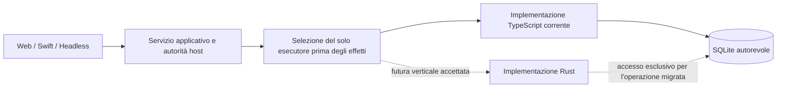
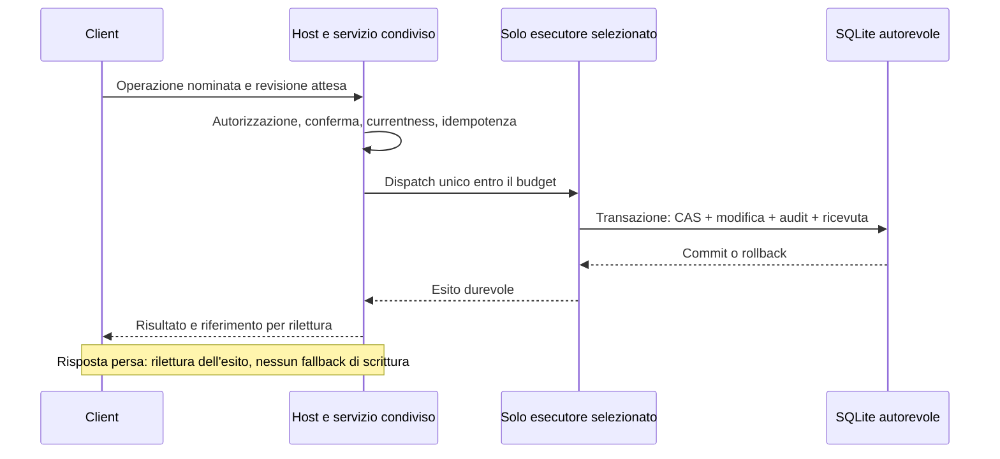

# ADR 0137: Proposta di una verticale Rust dietro il servizio già provato

Date: 2026-09-26

Status: Proposed — non accettato, nessun collegamento al runtime

Issue: [WUL-706](https://linear.app/wulfgardr/issue/WUL-706). Evidenze e decisione
di questa preparazione nel [dossier](../analysis/2026-09-26-rust-boundary-evaluation.md).

## Problema e prerequisiti

La migrazione deve ridurre un costo o un rischio osservato, conservando una sola
autorità. La lingua del codice e la shell grafica sono decisioni separabili.
La baseline di questo studio è `6c212221a98f9b8e45cc1d243226d0adb41770bd`.
I candidati locali C03/C04/C05 del 26 settembre non sono contenuti in quel commit.
Il coordinatore conferma che WUL-735, WUL-573 e WUL-580 non sono accettati e
che WUL-574 non ha ancora selezionato il pilota. Questo ADR non li sostituisce.

WUL-706 richiede di consumare il servizio 0.9.1 già provato. Il nome
dell'operazione clinica, il suo schema e le policy restano quindi **da ricevere**.
Il confronto preliminare fra modifica di un campo anagrafico protetto e
transizione checkup F10 non basta: F10 non dimostra la reversibilità richiesta.
Non aggiungiamo una nuova transizione per renderlo ammissibile.

## Opzioni e proposta condizionata

| Confine | Beneficio possibile | Costo o limite | Disposizione |
| --- | --- | --- | --- |
| TypeScript in-process esistente | Nessun nuovo trasporto, pacchetto o failure mode | Conserva eventuali costi misurati del runtime | Baseline e percorso autorevole attuali |
| Processo Rust con canale privato ereditato | Isolamento del crash e lifecycle esplicito, linguaggio indipendente dal client | Avvio, copie, serializzazione, backpressure, aggiornamenti coordinati e recupero dopo perdita della risposta | Primo candidato desktop/headless, subordinato alle misure e al confine 0.9.1 |
| Libreria Rust via FFI/UniFFI | Chiamate locali e integrazione nel lifecycle mobile | Crash condiviso, ownership del buffer, ABI, thread/callback, panic e cancellazione attraversano il confine | Candidato Apple soltanto per un bisogno misurato e una decisione distinta |
| Addon Node come unico ingresso | Accesso diretto dal runtime corrente | Accoppia distribuzione e binding a Node; non risolve da solo i client Swift | Nessuna adozione proposta |

IPC non autentica automaticamente il chiamante; FFI non elimina copie o
serializzazione automaticamente. UniFFI genera binding, non consegna il pacchetto
installato. Le fonti tecniche sono nel dossier. Nessuna delle opzioni concede
permessi, sostituisce il controllo dell'host o amplia il perimetro clinico.

Le due frecce verso SQLite sono alternative per l'operazione, non writer
contemporanei. Il dettaglio di custodia della connessione appartiene alla futura
decisione WUL-709: non è autorizzato aprire una seconda connessione indipendente
per comodità del port. Le operazioni non migrate restano attribuite al servizio
attuale. Nessun secondo Core, issuer, key store o database.

## Contratto da congelare prima dell'integrazione

La proposta distingue una busta di trasporto dai contratti di dominio da ricevere.
Non assegna ora un nuovo nome canonico all'operazione clinica.

| Elemento | Obbligo proposto |
| --- | --- |
| Versioni | Versione del trasporto, schema dell'operazione e generazione dell'artefatto distinti; handshake con insieme esplicito di versioni supportate; intersezione vuota arresta prima del dispatch |
| Operazione | Solo ID e schema nominati dal servizio accettato; niente SQL, patch generiche, percorsi filesystem o provider arbitrari |
| Identità | Bootstrap privato monouso legato al processo figlio; grant opachi risolti dall'host. Nessuna fiducia in PID, stringhe di identità o possesso della pipe da soli |
| Validità | Sessione, selezione, revisione, scopo, scadenza e revoca verificati dove stabilito dal servizio; nessuna conversione di un messaggio valido in autorizzazione |
| Limiti | Dimensioni prima del parsing, coda e concorrenza limitate, output e stderr limitati, budget per operazione. I valori verranno dal workload WUL-715 e dal contratto accettato |
| Deadline | Budget monotono locale; nessuna estensione implicita con retry o passaggio di processo. Scadenze persistenti e timer locali non si confondono |
| Cancellazione | Prima degli effetti: esito certo senza commit; dopo l'inizio: richiede stato autorevole. Una richiesta di kill/cancel non dimostra cessazione o rollback |
| Errori | Rifiuto senza effetti, conflitto, indisponibilità e risultato indeterminato distinti; codici chiusi, nessun contenuto clinico nei messaggi diagnostici |
| Commit | Modifica, CAS, audit obbligatorio, idempotenza e ricevuta nella stessa unità atomica prevista dal contratto; risposta soltanto dopo commit |
| Risposta persa | Rilettura per ID idempotente presso l'autorità; mai ripetizione clinica tramite implementazione alternativa |
| Compatibilità | Matrice client/host precedente-candidato con fallimenti chiusi, vecchie versioni ammesse solo per durata e owner espliciti |

Il diagramma è una proposta di obblighi, non la topologia già implementata.
La conferma e le credenziali non si ricavano dal JSON del client. Non si modifica
il modello di cifratura né la custodia del plaintext.

## Esperimento autorizzato e schema realmente provato

`experiments/rust-boundary/` riproduce solo il codec di
`packages/aip/src/portable-supervisor-web-ipc-contract.ts`. Quel file resta
autorevole: schema `mediflow.portable-supervisor.web-ipc.v1`, massimo 4096 byte,
sette forme di frame, chiavi e ordine canonici, interi sicuri JavaScript.
`activate` rimane un nome nel messaggio: l'esperimento non attiva niente.

Il processo di prova riceve esclusivamente fixture sintetiche. Non importa il
database, non emette grant, non apre listener e non sostituisce AIP o il
supervisore Node. Il confronto ha valore di conformità del codec e costo del
trasporto; non soddisfa WUL-707/708/709/736. Le copie sintetiche non sono una
prova di custodia del plaintext clinico. Il formato di harness non è il futuro
protocollo applicativo v1.

## Percorso incrementale e rollback

1. Ricevere l'accettazione e gli hash di consolidamento, pilota e contratti
   WUL-735/573/580; ripetere il confronto solo sui byte effettivamente cambiati.
2. Congelare l'operazione WUL-574, i vettori e il workload WUL-715, incluse soglie
   di beneficio concordate **prima** della misura. Accettare questo ADR soltanto
   con owner, custodia, compatibilità e failure semantics risolti.
3. Implementare le sole primitive necessarie; eseguire equivalenza, limiti,
   proprietà e prove negative contro il servizio TypeScript. Il confronto
   differenziale in lettura non acquisisce effetti.
4. Eseguire una verticale su SQLite sintetico reale: stessa semantica, un solo
   writer, audit failure, conflitto, retry, risposta persa e recupero. Prove reali
   di crash, timeout, revoca, parent death e assenza dei discendenti per WUL-708.
5. Collegare solo adapter Headless/CLI e client TS dell'operazione accettata;
   ritirare il percorso precedente per quella autorità o fissarne la scadenza.
6. WUL-736 decide GO circoscritto, KEEP o proposta PIVOT con revisione indipendente
   e prove sull'artefatto installato. Nessuna scelta della shell è implicita.

Per l'esperimento, rollback significa smettere di eseguire il binario e rimuovere
il suo namespace dalla futura patch: il runtime non cambia. Non si cancella
automaticamente l'evidenza. Per la futura verticale: fermare nuovi dispatch,
risolvere gli esiti pendenti tramite ricevute, arrestare e verificare l'assenza
del vecchio owner, selezionare la generazione compatibile precedente e rileggere
lo stato. Mai downgrade dello schema, replay, doppio writer o fallback dopo
effetti. Se la compatibilità non è dimostrata, mantenere HOLD e il recovery
previsto dal contratto, senza improvvisare un percorso alternativo.

## Conseguenze e decisioni aperte

La prova aggiunge toolchain, crate e superficie di parsing da mantenere: è un
costo reale anche se il binario è piccolo. Il codec corrente è già limitato e
rigoroso; un port byte-equivalente non dimostra di correggere un difetto.
L'esito valido può essere KEEP. Restano aperti selezione del pilota, limiti e
schema finali, owner della connessione, packaging multipiattaforma, FFI misurata
e beneficio applicativo. Questo ADR non supera ADR 0068 né conferma o revoca la
raccomandazione storica sul linguaggio di ADR 0071.
