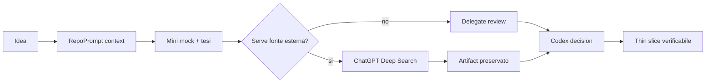
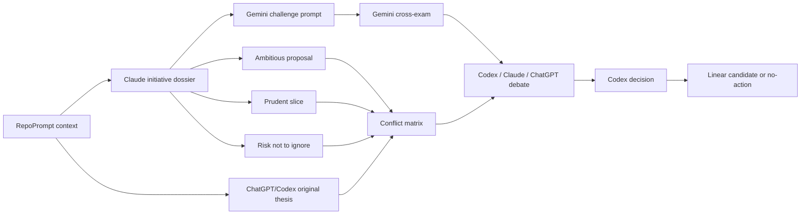

<!-- Codex: WUL-295 -->
# Agentic Development Operating Loop

Stato documento: `INTERNAL / SECONDARY`<br>
ADR: [ADR 0067](./adr/0067-agentic-development-operating-loop.md)<br>
Linear: `WUL-295`

Questo runbook governa il pool agentico di sviluppo MediFlow. Non descrive una
feature clinica, non entra nel runtime prodotto e non autorizza azioni esterne
sensibili. Serve a far avanzare il lavoro engineering con traccia, verifiche e
stop rule.

## Ruoli

| Ruolo | Responsabilita | Limite |
| --- | --- | --- |
| Codex | Controller-of-record, implementazione finale, review finale, Git/Linear/handoff | Non tratta output delegate come prova senza verifica locale |
| RepoPrompt | Binding progetto, file selection, export, oracle/agent context, context pack per confronti complessi | Non va bindato a home, Downloads, mail, database o vault privati senza richiesta esplicita; non assumere che esegua modelli web-only |
| Linear | Issue, priorita, acceptance criteria, stato, evidenza | Non sostituisce ADR o verifica locale |
| `/goal` | Contratto per workstream multi-step | Non si usa per micro-edit o domande brevi |
| Claude/Opus | Chief design/product proposer, senior UI/UX reviewer, risk/test reviewer read-only | Porta una tesi originale; Codex/ChatGPT produce una valutazione autonoma e decide; no PHI/PII, no write access, no decisione finale |
| Gemini | Adversarial scout, disagreement, architettura, alternative, sintesi | Di norma risponde a un packet Codex/Claude; lead da verificare, non source of truth |
| RepoPrompt agents | Explore/engineer/pair/design bounded | Codex deve aspettare, riconciliare e verificare |
| ChatGPT web 5.5 Pro / Extended Pro | Ragionamento puro, sintesi difficile e confronto prospettico su prompt costruiti da Codex | Superficie web via Chrome/Computer Use; no PHI/PII; risultato preservato se decision-shaping |
| ChatGPT Deep Search/Research | Reperimento fonti esterne e stato dell'arte source-heavy | No PHI/PII; heartbeat ogni 30 minuti; risultato preservato prima di diventare decisione |
| OpenClaw | Sidecar locale di workflow per brief, preview sintetiche, pattern redatti e futuri review candidate | Non e runtime clinico; nessun accesso diretto a SQLite/API/apply/PHI; apply resta in MediFlow con conferma |
| Workflow monitor | Branch/scope/privacy/check drift su metadati | Non legge diff content, DB, mail o docs private |

## Costituzione Di Proposta

Ogni proposta non banale deve essere presentata come un piccolo dossier
decisionale, non come una lista astratta di idee.

### Formato minimo

1. **Tesi**: cosa conviene fare e quale problema risolve.
2. **Perche e interessante**: insight, leva operativa, rischio ridotto o nuova
   possibilita che rende la proposta degna di attenzione.
3. **Mini mock visuale**: wireframe ASCII, diagramma Mermaid, state map,
   tabella prima/dopo o storyboard a 3 frame. Obbligatorio per UI/UX, flussi,
   architettura, processi agentici e interazioni operatore.
4. **Evidenza**: repo/docs/Linear/benchmark/delegate/fonti web usate.
5. **Incertezza**: cosa manca, cosa potrebbe invalidare l'idea e come
   verificarlo.
6. **Thin slice**: la prima azione piccola, testabile e reversibile.

Esempio di mini mock per proposta UI:

```text
[Paziente]  [Timeline]  [Documenti]
    |            |            |
    +----> "Cosa e cambiato?" <----+
              |
       [review card con fonti]
       [Applica] [Ignora] [Chiedi confronto]
```

Esempio di mini mock per processo agentico:



### Immaginazione senza drift

- L'immaginazione e consentita prima della decisione, non al posto della
  decisione.
- Le idee esplorative devono restare marcate come `concept`, `candidate` o
  `benchmark-only` finche non hanno issue, acceptance criteria e verifica.
- Un mock visuale non autorizza implementazione UI: serve a chiarire intenzione,
  densita informativa, gesto operatore e trade-off.
- Se una proposta supera un tema o una branch, va divisa prima di diventare
  lavoro.

### Claude Initiative Lane

Claude/Opus non deve essere usato solo come reviewer a fine patch, ne come
assistente a cui Codex chiede una lista. Nel Parlamento settimanale porta una
tesi originale: una proposta forte, con gusto, rischi e forma visiva.
ChatGPT/Codex produce in parallelo una tesi originale sullo stesso packet prima
della sintesi, non solo una valutazione della proposta Claude. Codex resta il
capo operativo: mette in conflitto le due tesi, decide cosa sopravvive e traduce
solo l'esito verificato in candidate issue, thin slice o no-action.

Output minimo della lane:

1. **Una proposta ambiziosa**: UI/UX, prodotto, architettura operativa o flusso
   di lavoro con mini mock.
2. **Una proposta prudente**: stesso tema, ma ridotta a slice piu piccola e
   verificabile.
3. **Un rischio da non ignorare**: privacy, claims, complessita, regressione,
   carico cognitivo o debito di test.
4. **Un primo prompt per Gemini**: cosa Gemini deve attaccare, semplificare o
   contraddire.

Output obbligatorio ChatGPT/Codex prima della sintesi:

1. **Tesi originale parallela**: proposta autonoma sullo stesso packet, con
   mini mock quando il tema riguarda UI, UX, flusso o processo agentico.
2. **Valutazione autonoma**: cosa Codex ritiene valido, fragile o prematuro,
   anche se Claude non lo ha detto.
3. **Conflitto produttivo**: dove Codex concorda, diverge o riformula la tesi
   originale Claude.
4. **Decisione provvisoria**: `promote`, `revise`, `hold`, `reject` o
   `research-needed`.
5. **Verifica locale richiesta**: check, fonte, mock, benchmark o issue da
   consultare prima di qualunque apply.

Protocollo di isolamento minimo:

1. prepara un packet redatto e bounded;
2. genera la tesi ChatGPT/Codex dal packet senza leggere la risposta Claude, o
   registra esplicitamente perche non e stato possibile;
3. conserva o riferisci i raw transcript/scratch con timestamp o path locali;
4. solo dopo unisci le tesi in una matrice di conflitto e passa il packet a
   Gemini;
5. registra nel report finale cosa e stato indipendente, cosa no e quale
   rischio di contamination resta.

Per le run che usano davvero questa dinamica completa, copia il template
[Dual-Thesis Agentic Run Ledger / Evidence Pack](./agentic-dual-thesis-run-ledger-template.md).
Il ledger e il posto per isolamento, artifact registry, issue decision record,
matrice di conflitto, cross-exam Gemini e decisione Codex; l'evidence comment
finale deve solo riassumerlo per Linear/PR.
Non incollare raw transcript o dati sensibili nel ledger: usa path locali e
sintesi redatte.

Claude puo proporre issue candidate, ma non puo crearle, approvarle o
implementare senza decisione Codex e riconciliazione Linear. Se il tema e
ampio, Claude `workflow` o `ultracode` si usa solo come escalation opt-in per
audit larghi, migrazioni o review naturalmente parallele; non e la modalita
standard.



### Gemini Cross-Exam Lane

Gemini opera come dissenso guidato, non come secondo manager autonomo. Di
default riceve un packet costruito da Codex o da Claude e risponde con:

- assunzioni fragili;
- alternativa piu piccola;
- rischi nascosti;
- verifica locale concreta;
- cosa non vale la pena fare ora.

Se Gemini scopre un tema indipendente, non lo allarga nella stessa branch:
propone un candidate follow-up e Codex decide se aprire o no una issue.

### OpenClaw Sidecar Lane

OpenClaw puo entrare nel Parlamento come sidecar di workflow, non come agente
con autorita clinica. La sua lane produce solo:

- brief sintetici o redatti;
- preview di workflow;
- pattern operativi da Chronicle gia minimizzati;
- futuri `review_candidate` solo dopo gate dedicato.

OpenClaw non legge `medical.db`, non chiama API MediFlow, non usa rete o modelli
esterni senza gate esplicito, non applica cambi e non sostituisce il review
surface di MediFlow. Il suo valore sta nel ridurre cambio di contesto e rendere
visibili workflow candidate; l'apply resta sempre una decisione MediFlow/Codex
con conferma.

### Routing ricerca e confronto

- Usa RepoPrompt per domande su piu file, confronto tra opzioni architetturali,
  impatto cross-module, review di coerenza e compressione contesto. Prima
  binda sempre la root reale. RepoPrompt prepara il contesto; non trattarlo come
  host garantito di modelli web-only.
- Per ragionamento puro che richiede `5.5 Pro` o modalita web equivalenti,
  prepara un prompt compatto con Codex/RepoPrompt e lancialo su ChatGPT web via
  Chrome/Computer Use o skill dedicata. Il dossier deve indicare superficie,
  modello/mode osservato, prompt label, privacy boundary e artifact catturato.
- Usa ChatGPT Deep Search/Deep Research quando serve reperire fonti esterne
  aggiornate o source-heavy. Il prompt deve chiedere Markdown, citazioni,
  assunzioni, incertezza e next actions; durante run lunghi mantieni heartbeat
  ogni 30 minuti con stato, ultimo controllo e prossimo controllo.
- Non usare Deep Search per leggere il repo o per compensare una mancata
  verifica locale. Il repo corrente, Linear e i comandi locali restano fonte di
  verita per stato MediFlow.
- Ogni risultato web che influenza decisioni va preservato con provenienza e
  hash prima di aprire issue o cambiare codice.
- Ogni risultato Deep Research, Extended Pro, RepoPrompt export, Claude, Gemini
  o check locale che influenza una decisione deve comparire nell'artifact
  registry del ledger con source, path raw locale, eventuale digest committato,
  timestamp, hash, privacy boundary, ruolo nella decisione, stato di verifica e
  disposizione Codex (`adopt`, `adapt`, `reject`, `hold` o
  `research-needed`).
- Gli export raw sotto `prompt-exports/` restano locali e fuori export OSS; se
  un output influenza decisioni, committa solo un digest redatto sotto
  `docs/analysis/`.

## Weekly Company Loop

Cadenza consigliata: una volta a settimana, 30-45 minuti.

1. Esegui stato locale:

```bash
git status --short --branch
npm run workflow-monitor -- --once --json
```

2. Riconcilia Linear:
   - cerca issue attive e stale;
   - controlla lo storico locale prima di creare nuove issue;
   - sposta in `Planned` solo lavori con acceptance criteria verificabili.

3. Scegli il carico:
   - massimo 3-5 issue candidate per ciclo;
   - massimo 2 issue `In Progress`;
   - ogni issue deve avere scope, out-of-scope e verifiche.

4. Per ogni issue candidata, decidi la lane:
   - `implementation`: Codex o RepoPrompt engineer;
   - `claude-initiative`: Claude/Opus porta una tesi originale con proposta
     ambiziosa, slice prudente, rischio e prompt di cross-exam; Codex/ChatGPT
     produce una tesi originale parallela dal medesimo packet prima di leggere
     o sintetizzare Claude, poi risponde con valutazione autonoma prima di
     decidere;
   - `UI/UX`: Claude/Opus review bounded prima o dopo patch;
   - `architecture`: Gemini disagreement prima della decisione;
   - `gemini-cross-exam`: Gemini attacca e riduce il dossier Claude/Codex;
   - `openclaw-sidecar`: solo brief/preview/pattern sintetici o redatti, senza
     runtime/apply;
   - `review`: Codex finale con verifica locale;
   - `research/design`: RepoPrompt design/oracle export se riduce contesto.

5. Apri `/goal` solo per lavori multi-step:

```text
/goal Deliver <WUL-id> as the smallest coherent slice, verified by <checks/evidence>,
while preserving <privacy, branch, scope and runtime constraints>. Use <RepoPrompt,
Linear, delegates, local checks>. Between iterations record <branch, issue, evidence,
next action>. If blocked, stop with <attempted paths, evidence, blocker, exact input needed>.
```

6. Registra l'esito:
   - issue selezionate;
   - goal attivi;
   - delegate necessari;
   - verifiche minime;
   - blocker reali.

## Readiness Runner

Prima di aprire o riprendere un workstream agentico, usa il controllo repo-local:

```bash
npm run test:agentic-readiness
npm run agentic:readiness -- --expected-issue WUL-295 --json
```

Il runner verifica:

- file skill Claude/Gemini installati in `~/.codex/skills`;
- probe CLI non-live di Claude e Gemini;
- branch Git e issue attesa;
- `workflow-monitor` con metadati Git/check, senza leggere diff content.

Di default non effettua chiamate modello. Per verifiche credenziali esplicite e
non-PHI, usa solo gli smoke statici del runner; non inserire issue, branch,
diff o contesto clinico nel prompt live:

```bash
npm run agentic:readiness -- --expected-issue WUL-295 --json --live-gemini
npm run agentic:readiness -- --expected-issue WUL-295 --json --live-claude
```

Se il probe non-live passa ma lo smoke live fallisce, registra il blocker come
problema di credenziale/sessione CLI. Non degradare l'intero workstream se la
slice puo proseguire con Codex, RepoPrompt e un delegate alternativo verificabile.
Quando vuoi che una credenziale live sia un gate bloccante, aggiungi
`--strict-live` allo smoke richiesto.

## Per-Workstream Loop

1. **Reconcile**
   - leggi issue Linear;
   - esegui archive/memory check;
   - verifica branch e dirty state.

2. **Contain**
   - branch `codex/<issue-id>-<slug>`;
   - un solo tema;
   - nuova conversazione se cambia issue autonoma.

3. **Context**
   - bind RepoPrompt alla root reale;
   - seleziona solo file rilevanti;
   - non inviare intero repo ai delegate.

4. **Delegate**
   - Claude/Opus per initiative dossier, UI/UX, copy clinica, hierarchy,
     accessibility, review risk e candidate implementation plan quando il
     packet e bounded;
   - Gemini per cross-exam di dossier Claude/Codex, alternative, hidden
     assumptions, disagreement, smaller slice e candidate test/failure-mode;
   - OpenClaw solo per sidecar brief/preview sintetici o redatti quando il gate
     del relativo workstream lo consente;
   - transcript salvati sotto `~/.codex/delegate-runs/*`, non committati.
   - transcript, prompt export e report source-heavy che incidono sullo scope
     registrati nell'Evidence Pack / Issue Decision Record.

5. **Implement**
   - diff minimo;
   - nessun refactor opportunistico;
   - se Claude o Gemini hanno prodotto candidate work, compila gli
     implementation delegation slots nel
     [Dual-Thesis Agentic Run Ledger](./agentic-dual-thesis-run-ledger-template.md):
     Claude puo fornire piani/moduli/diff artifact read-only, Gemini resta
     adversarial scout con smaller-slice/test/failure-mode candidate, e Codex
     registra `adopt`, `adapt` o `reject` prima dell'apply;
   - nessun output delegate viene applicato automaticamente al branch primario;
   - Codex marca contributi secondo convenzione repo quando applicabile.

6. **Verify**
   - check pertinenti;
   - workflow monitor con expected issue;
   - scope check prima di commit/PR.

7. **Handoff**
   - Linear comment con branch, file, delegate evidence, checks, non verificato;
   - PR draft quando il ramo supera una sessione o richiede review asincrona.

## Non-Stalling Rules

- Se Claude/Gemini va in timeout: riduci contesto una volta e riprova solo se il
  valore giustifica il costo.
- Se la CLI e non autenticata o instabile: registra il blocker e continua con
  Codex/Gemini/RepoPrompt se la slice puo essere verificata localmente.
- Se un delegate produce solo opinioni non verificabili: scarta o trasforma in
  check locale concreto.
- Se emergono due temi indipendenti: apri nuova issue/branch invece di allargare
  il workstream.
- Se lo stesso blocker si ripete per tre iterazioni `/goal`: marca il goal
  bloccato con evidenza e decisione richiesta.

## Token And Capacity Budget

Default:

- RepoPrompt prima di shell quando la domanda e su piu file;
- context packet piccoli per delegate;
- Claude/Opus max per initiative dossier ad alto valore, UI/UX importante,
  review ampia o criticita;
- Claude `workflow`/`ultracode` solo per lavori larghi, paralleli o
  adversarial; non come default settimanale;
- Gemini come cross-exam economico di disaccordo/sintesi, di norma dopo packet
  Codex/Claude;
- OpenClaw solo quando il contributo e preview/brief/candidate sidecar e non
  richiede accesso runtime o dati reali;
- no full-repo prompt;
- no documenti privati o dati clinici in prompt.

Ogni delegate packet deve dichiarare:

- ruolo richiesto;
- evidenza fornita;
- cosa e fuori evidenza;
- output atteso;
- verifica locale richiesta a Codex.

## Side Effects

Consentiti nel normale delivery Codex quando ancorati a issue/branch:

- creare o aggiornare issue Linear del workstream;
- creare branch, commit, push e PR secondo playbook;
- aggiornare docs/ADR/runbook e commenti Linear con evidenza.

Richiedono conferma esplicita nel turno:

- inviare mail o messaggi;
- creare/modificare eventi calendario;
- pubblicare o inviare dati clinici;
- chiudere pratiche o record esterni;
- eliminare dati, archivi o issue in modo distruttivo;
- inviare PHI/PII a servizi esterni o cloud.

## Evidence Comment Template

```md
WUL-XXX operating update

- Branch: `codex/wul-xxx-slug`
- Goal: <active/complete/blocked + one-line contract>
- Delegates:
  - Claude initiative: <path/status/verdict or not run>
  - Gemini cross-exam: <path/status/verdict or not run>
  - OpenClaw sidecar: <preview/status or not applicable>
- Dual-thesis ledger: <path/status or not applicable>
- Evidence Pack / Issue Decision Record: <path/status or not applicable>
- RepoPrompt: <binding/export/agent evidence>
- Checks:
  - `npm run ...`: pass/fail/skip
  - `npm run workflow-monitor -- --once --json --expected-issue WUL-XXX`: pass/fail
- Not verified:
  - ...
- Next action:
  - ...
```

## First Slice Checklist

- [ ] Linear issue exists and is not a duplicate.
- [ ] Branch name contains the issue id.
- [ ] `/goal` contract exists for multi-step work.
- [ ] RepoPrompt root binding verified.
- [ ] `npm run agentic:readiness -- --expected-issue WUL-XXX --json` eseguito; se fallisce, blocker registrato prima di delegare altro lavoro.
- [ ] Dual-thesis ledger copied or explicitly skipped when independent Claude/Codex theses are used.
- [ ] Evidence Pack / Issue Decision Record copied or explicitly skipped.
- [ ] Decision-shaping artifacts are registered or explicitly marked not applicable.
- [ ] Delegate outputs, if used, are read-only and preserved.
- [ ] Checks and non-checks are explicit.
- [ ] Workflow monitor evidence is attached or summarized.
