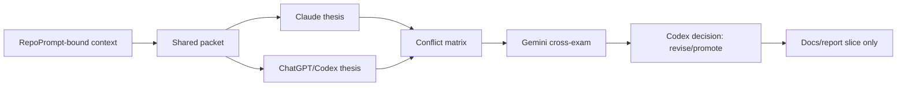

<!-- Codex: WUL-295 -->
# Agentic Dynamics Test Run 2026-06-01

Stato documento: `INTERNAL / RUN REPORT` 
Issue: `WUL-295` 
Branch: `codex/wul-295-agentic-development-operating-loop` 
Canonical sources: [ADR 0067](../adr/0067-agentic-development-operating-loop.md), [agentic operating loop](../agentic-development-operating-loop.md), [workflow monitor ADR 0063](../adr/0063-local-workflow-monitor-control-plane.md), [claims guard ADR 0065](../adr/0065-intended-purpose-and-claims-guard.md)

## Boundary

Questa run testa la dinamica di sviluppo agentico, non una feature clinica. Non
modifica runtime clinico, schema, API, UI, dati, mail, calendario o sistemi
esterni. Non invia PHI/PII o materiale clinico a strumenti esterni. Non crea
issue Linear figlie.

## Test Question

La domanda era: il Parlamento WUL-295 riesce a produrre progresso reale e non
sola orchestrazione se Claude e ChatGPT/Codex generano due tesi originali sullo
stesso brief prima della sintesi?

Risposta breve: `si, ma con revise`. La dinamica funziona solo se il report
prova l'isolamento delle tesi prima di Gemini e della decisione Codex.

## Isolation Evidence

| Step | Evidence | Result |
| --- | --- | --- |
| Shared packet | `tmp/agentic-dynamics-test-context.md`, created `2026-06-01 21:02:59 +0200` | bounded, no PHI/PII |
| ChatGPT/Codex thesis | local scratch created `2026-06-01 21:03:34 +0200` | produced before successful Claude output was read |
| Claude attempt 1 | `~/.codex/delegate-runs/claude/20260601-210355` | timeout, no stdout |
| Claude attempt 2 | `~/.codex/delegate-runs/claude/20260601-210823` | unusable tool-call stub |
| Claude attempt 3 | `~/.codex/delegate-runs/claude/20260601-210936` | successful inline thesis, stdout `2026-06-01 21:10:18 +0200` |
| Gemini cross-exam | `~/.codex/delegate-runs/gemini/20260601-211056` | successful, stdout `2026-06-01 21:11:25 +0200` |

The run therefore achieved practical independence for the ChatGPT/Codex thesis:
it was written from the shared packet before the successful Claude transcript
existed locally.

## Mini State Map

| Color | State | Meaning |
| --- | --- | --- |
| `green` | `promote` | Implement the thin slice now. |
| `yellow` | `revise` | Idea survives, but must tighten assumptions or scope. |
| `blue` | `research-needed` | External source route or web-model run is required. |
| `gray` | `hold` | Valuable, but outside the current branch. |
| `red` | `reject` | Risk or mismatch outweighs value. |

## Claude Thesis

Claude proposed a versioned **Parliament Run Ledger**: one committed artifact per
run that captures the Claude thesis, ChatGPT/Codex thesis, Gemini challenge and
final decision. The prudent slice was only the report template plus artifact
preservation convention, without route registry, readiness probe or Linear
automation.

Useful point: Claude identified `false independence` as the main risk. A ledger
can look compliant while one thesis has already influenced the other.

Filtered point: Claude's mock used route/model labels too concretely for the
verified repo state. This run treats those labels as illustrative, not factual
implementation evidence.

## ChatGPT/Codex Thesis

ChatGPT/Codex independently proposed a **dual-thesis decision ledger**. The core
idea is that every non-trivial agentic run must fork the same bounded context
into a Claude original thesis and a ChatGPT/Codex original thesis before either
side is synthesized.

The prudent slice was to codify the dual-thesis requirement in ADR 0067 and the
operating loop, then preserve this run as the first dual-thesis report. No new
runner or route registry should be added in this branch.

## Conflict Matrix

| Point | Claude | ChatGPT/Codex | Codex read |
| --- | --- | --- | --- |
| First slice | Parliament Run Ledger | Dual-thesis decision ledger | Same center: ledger/report first. |
| Quality driver | Artifact accountability | Forced divergence before synthesis | Adopt divergence as the rule; artifact is the carrier. |
| Tooling now | No automation yet | No runner yet | Keep this branch docs/report-only. |
| Main risk | False independence | Compliance theater | Add isolation/order evidence to each run. |
| Follow-up | Codex may attack readiness/route registry separately | Hold registry until ledger exists | Hold as candidate, do not widen WUL-295. |

## Gemini Cross-Exam

Gemini agreed that documentation comes before automation, but recommended
`revise` rather than immediate `promote` because the ledger alone does not prove
independence.

Key findings:

- the strongest fragile assumption is that recording order is enough to prove
  independence;
- the hidden risk is compliance theater: two models can still collapse into the
  same safe middle;
- a cheaper alternative is a very small append-only log, but that would be too
  thin for this branch because WUL-295 already needs a durable run report;
- the local check should compare transcript timing, inspect failure logs and
  avoid automating the runner before the isolation protocol is real.

## Decision

Decision: `revise/promote`.

Promote the dual-thesis ledger/report convention, but revise the runbook and ADR
to require an explicit isolation protocol:

1. one bounded packet;
2. Claude original thesis and ChatGPT/Codex original thesis generated before
   synthesis;
3. raw transcript/scratch evidence recorded with timestamp or path;
4. conflict matrix;
5. Gemini cross-exam;
6. final Codex decision with local verification.

Do not implement a RepoPrompt readiness probe, route registry, checker script,
automation runner or child Linear issue in this branch.

## Candidate Follow-Ups

Still uncreated:

1. `WUL-295A` - reusable dual-thesis report template and ledger convention.
2. `WUL-295B` - RepoPrompt readiness probe for bind/export state.
3. `WUL-295C` - `/goal` and Linear reconciliation checklist in readiness path.
4. `WUL-295D` - external route registry for ChatGPT web 5.5 Pro, Extended Pro
   and Deep Search.
5. `WUL-295E` - artifact preservation convention for delegate/web outputs.

Recommended next slice after this branch: `WUL-295A`, but only after Leonardo
confirms promotion from candidate to issue.

## Non-Actions

- No clinical runtime, UI, schema, API, database, mail or calendar changed.
- No PHI/PII was sent to delegate CLIs.
- No ChatGPT web 5.5 Pro / Extended Pro or Deep Search run was launched.
- No OpenClaw sidecar was launched.
- No child Linear issue was created.
- No automation runner was added.

## Verification Evidence

Run completed on 2026-06-01:

| Check | Result |
| --- | --- |
| Claude CLI probe | `pass`, ready |
| Gemini CLI probe | `pass`, ready |
| Claude delegate run | `pass after retries`, timeout then tool-call stub then successful inline brief |
| Gemini delegate run | `pass` |
| Dual-thesis timing check | `pass`, ChatGPT/Codex scratch `21:03:34 +0200`, successful Claude stdout `21:10:18 +0200` |
| Lexical overlap sanity | `pass`, 45 shared terms out of 151 ChatGPT/Codex terms and 174 Claude terms; overlap mostly generic process vocabulary |
| `git diff --check` | `pass` after whitespace fix |
| `npm run check:claims` | `pass` |
| `npm run test:agentic-readiness` | `pass` |
| `npm run test:workflow-monitor` | `pass` |
| `npm run agentic:readiness -- --expected-issue WUL-295 --json` | `pass` |
| `MEDIFLOW_OSS_TARGET_DIR=/tmp/mediflow-oss-wul-295-dynamics-test npm run prepare:oss` | `pass` |
| OSS grep for WUL-295/internal agentic terms | `pass`, no matches |
| `npm run workflow-monitor -- --once --json --expected-issue WUL-295 ...` | `pass` |
