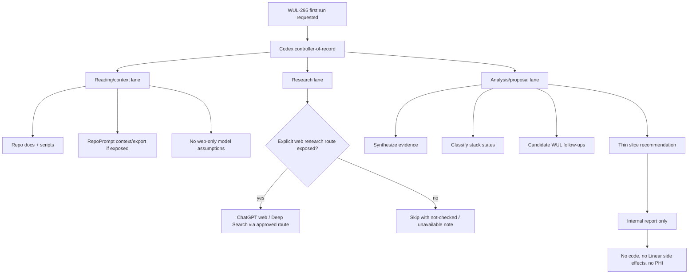

<!-- Codex: WUL-295 -->
# RepoPrompt Export Digest: Agentic Parliament 2026-06-01

Original local export path:
`prompt-exports/oracle-question-2026-06-01-134326-agentic-parliament-8-6eea.md`

RepoPrompt chat: `agentic-parliament-87A6ED`
Mode: `question`
Role in decision: context/export layer and read-only synthesis support.

This tracked digest preserves the decision-shaping response in repo evidence.
The raw `prompt-exports/` directory stays local and ignored because future
exports may contain oversized context packets or private operational notes.

## Prompt Boundary

The task asked RepoPrompt to run a read-only first-pass "agentic parliament"
analysis for `WUL-295`: identify what remains to implement in the agentic
development stack, and propose a first run split into research, reading/context
and analysis/proposal lanes.

Constraints given to RepoPrompt:

- Codex remains controller-of-record.
- RepoPrompt is context/export layer only.
- ChatGPT web 5.5 Pro / Extended Pro and Deep Search are web-surface routes,
  not guaranteed RepoPrompt model presets.
- No PHI/PII, no clinical runtime/schema/API/UI changes, no external issue
  creation unless approved.
- Output should be usable as a repo-local internal report with a mini visual
  state map and candidate follow-up workstreams.

## Selected Context Summary

RepoPrompt selected WUL-295 docs and tooling, plus governance sources:

- `docs/adr/0067-agentic-development-operating-loop.md`
- `docs/agentic-development-operating-loop.md`
- `scripts/agentic-stack-readiness.mjs`
- `scripts/agentic-stack-readiness.test.mjs`
- `scripts/codex-workflow-monitor.mjs`
- `scripts/codex-workflow-monitor.test.mjs`
- `scripts/prepare-oss.js`
- `docs/README.md`
- `docs/markdown-index.md`
- `docs/STATE_OF_THE_SYSTEM.md`
- `ARCHITECTURE.md`
- `SECURITY.md`
- `CONTRIBUTING.md`
- `PLANS.md`
- related workflow, Linear and cloud-comparator precedents.

## Generated Answer

WUL-295 already has a coherent first slice:

- Decision layer: ADR 0067 defines the agentic operating loop.
- Runbook layer: `docs/agentic-development-operating-loop.md` defines roles,
  weekly/per-workstream loops, proposal dossier rules, readiness runner usage,
  side-effect boundaries and evidence templates.
- Executable guard: `scripts/agentic-stack-readiness.mjs` checks Claude/Gemini
  skill files, CLI non-live probes, Python, branch issue match, optional live
  smokes and workflow monitor metadata.
- Drift guard: workflow monitor remains metadata-only and PHI-safe.
- Docs/OSS hygiene: internal WUL-295 docs/scripts are indexed privately and
  excluded from OSS export.

Remaining implementation areas:

1. Readiness coverage gaps:
   - RepoPrompt availability, binding, selected-root status and export
     capability.
   - `/goal` contract presence for long workstreams.
   - Linear issue reconciliation and duplicate-check evidence.
   - ChatGPT web / Extended Pro / Deep Search route availability.
   - Artifact preservation path for decision-shaping external/model outputs.
   - Proposal dossier production with mini visual mock, evidence, uncertainty
     and thin slice.

2. Operational evidence gaps:
   - which lanes were run;
   - which were skipped and why;
   - what context was selected;
   - which delegates or web routes were unavailable;
   - what evidence influenced the proposal;
   - what follow-up workstreams are candidate-only vs approved.

3. Governance gaps:
   - explicit `ready`;
   - explicit `warning`;
   - explicit `blocked`;
   - explicit `not checked`;
   - explicit `not applicable`.

RepoPrompt recommended the safest next slice:

> Produce one internal dry-run parliament report for WUL-295 using existing
> docs/scripts, marking unverified local capabilities as `not checked`, and
> converting only confirmed gaps into candidate issues.

Suggested checks:

```bash
npm run test:agentic-readiness
npm run test:workflow-monitor
npm run agentic:readiness -- --expected-issue WUL-295 --json
npm run workflow-monitor -- --once --json --expected-issue WUL-295 --check agentic-parliament-report=pass
```

## RepoPrompt Mini State Map


