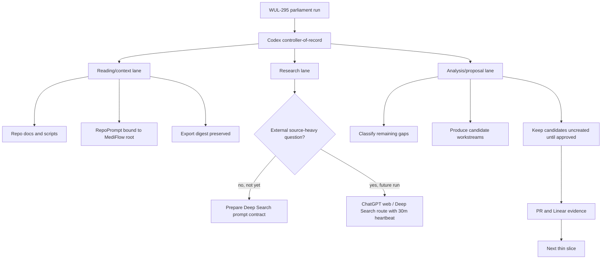

<!-- Codex: WUL-295 -->
# Agentic Parliament Run 2026-06-01

Stato documento: `INTERNAL / RUN REPORT`
Issue: `WUL-295`
Branch: `codex/wul-295-agentic-development-operating-loop`
Canonical sources: [ADR 0067](../adr/0067-agentic-development-operating-loop.md), [agentic operating loop](../agentic-development-operating-loop.md), [workflow monitor ADR 0063](../adr/0063-local-workflow-monitor-control-plane.md), [claims guard ADR 0065](../adr/0065-intended-purpose-and-claims-guard.md)

## Boundary

Questa e la prima run read-only del "Parlamento" agentico di sviluppo. Non e
una feature di prodotto e non modifica runtime clinico, schema, API, UI, dati,
mail, calendario o sistemi esterni. Non sono stati inviati PHI/PII o materiale
clinico a strumenti esterni.

RepoPrompt e stato usato come context/export layer bindato alla root reale del
progetto. Il digest tracciato dell'export decision-shaping e in
[2026-06-01-agentic-parliament-repoprompt-export.md](./2026-06-01-agentic-parliament-repoprompt-export.md).

## Verdict

Lo stack WUL-295 e gia sufficiente per partire come processo governato:
ADR, runbook, readiness runner, workflow monitor, branch/issue e OSS exclusion
sono presenti. Non e ancora sufficiente per chiamarsi "autonomo" in senso forte:
mancano report di run, probe di availability per RepoPrompt/Linear/goal/web
surface, registro degli artefatti e promozione disciplinata dei follow-up.

La prima run quindi parte, ma resta una dry-run interna di planning. La lane di
ricerca web non viene avviata perche non c'e ancora una domanda esterna
source-heavy abbastanza specifica; viene invece preparato il prompt contract e
il criterio di attivazione.

## Mini State Map



## Lane 1: Research

Status: `not run / prepared`.

Purpose: use ChatGPT web 5.5 Pro / Extended Pro for pure reasoning and Deep
Search/Research for cited external discovery only when the question is precise,
non-PHI and worth the cost.

Trigger criteria:

- The question depends on current external sources, vendor docs, laws, platform
  behavior, or state-of-the-art comparisons.
- The same question cannot be answered from repo docs, Linear, local checks or
  RepoPrompt context.
- The prompt contains no PHI/PII, no patient material, no private mail/calendar
  content and no live clinical database details.
- The expected output is Markdown with citations, assumptions, uncertainty and
  next actions.
- Long runs get a 30-minute heartbeat until complete or honestly blocked.

Reusable prompt contract:

```text
You are supporting MediFlow internal development planning. Do not request,
infer, or process PHI/PII. Research the following source-heavy question:
<question>.

Return Markdown with:
1. confirmed findings with citations;
2. uncertainty and contradictory evidence;
3. implications for a local-first, no-cloud-default healthcare app;
4. candidate implementation slices, each marked concept/candidate/ready;
5. explicit non-actions.
```

First candidate research questions:

- Which patterns are currently strongest for preserving web-model research
  outputs into local engineering ledgers without leaking private context?
- Which mature approaches exist for multi-agent engineering governance where a
  controller agent owns final verification and delegates remain advisory?
- Which current browser/desktop automation constraints matter for reliable
  ChatGPT web Deep Search capture and heartbeat reporting?

## Lane 2: Reading / Context

Status: `run`.

Sources read or selected:

- repo boot documents and canonical maps: `README.md`, `AGENTS.md` from session
  context, `docs/README.md`, `docs/markdown-index.md`, `ARCHITECTURE.md`,
  `SECURITY.md`, `CONTRIBUTING.md`, `PLANS.md`, `docs/walkthrough.md`;
- latest governing ADRs: ADR 0063, ADR 0065, ADR 0067;
- WUL-295 implementation files: `docs/agentic-development-operating-loop.md`,
  `scripts/agentic-stack-readiness.mjs`,
  `scripts/agentic-stack-readiness.test.mjs`, `scripts/prepare-oss.js`;
- related precedents: workflow monitor docs, Linear/Codex playbook,
  Codex/Opus dialogue, cloud comparator shadow eval.

RepoPrompt status:

- root binding to `~/Antigravity/medical-record-app`:
  `ready`;
- context builder answer: `ready`;
- export preservation: `ready`, via the digest linked above;
- web-only model execution inside RepoPrompt: `not assumed`.

## Lane 3: Analysis / Proposal

Status: `run`.

What remains to implement:

| Gap | State | Why it matters | First thin slice |
| --- | --- | --- | --- |
| Parliament run report | `started` | Without a run ledger, the process remains chat-local. | This report becomes the first ledger entry. |
| RepoPrompt readiness probe | `missing` | The runner cannot yet prove binding/export availability. | Add a non-invasive check or checklist entry. |
| `/goal` evidence capture | `manual` | A goal can exist in the thread but not in repo evidence. | Add report field and monitor check label. |
| Linear reconciliation evidence | `manual` | Issue/duplicate checks are not recorded by readiness. | Add report template section before creating child issues. |
| ChatGPT web / Deep Search route registry | `missing` | Web-only model access must not be confused with CLI/RepoPrompt models. | Document detection, launch, heartbeat and preservation states. |
| Artifact preservation convention | `partial` | Delegate/web outputs can shape decisions but live outside Git. | Standardize digest vs private raw transcript handling. |
| Candidate-to-issue promotion | `manual` | Ideas need approval before creating backlog noise. | Keep candidates in report until Leonardo/Codex promote. |

Candidate follow-up workstreams, not yet created:

1. `WUL-295A` - Parliament report template and ledger convention.
2. `WUL-295B` - RepoPrompt readiness probe for bind/export state.
3. `WUL-295C` - Goal and Linear reconciliation checklist in the readiness path.
4. `WUL-295D` - External route registry for ChatGPT web 5.5 Pro, Extended Pro
   and Deep Search.
5. `WUL-295E` - Artifact preservation convention for delegate/web outputs.

Recommended next slice:

Implement only the report-template/ledger convention first. It has the lowest
risk, exercises the whole process, and gives future runs a stable place to
record what was run, skipped, blocked or promoted.

## Non-Actions

- No external Deep Search was launched in this run.
- No Claude/Gemini live prompt was launched in this run.
- No new Linear issue was created from the candidates above.
- No runtime, UI, schema, API, database, private docs or clinical data changed.
- No web-only model availability was claimed through RepoPrompt.

## Verification Evidence

Run completed on 2026-06-01:

| Check | Result |
| --- | --- |
| `git diff --check` | `pass` |
| `npm run test:agentic-readiness` | `pass` |
| `npm run test:workflow-monitor` | `pass` |
| `npm run check:claims` | `pass` |
| `npm run agentic:readiness -- --expected-issue WUL-295 --json` | `pass` |
| `MEDIFLOW_OSS_TARGET_DIR=/tmp/mediflow-oss-wul-295-parliament npm run prepare:oss` | `pass` |
| OSS grep for `agentic-parliament`, `Parlamento agentico`, `Deep Search`, `5.5 Pro`, `RepoPrompt`, `agentic:readiness`, `test:agentic-readiness` | `pass`, no matches |
| `npm run workflow-monitor -- --once --json --expected-issue WUL-295 --check git-diff-check=pass --check test:agentic-readiness=pass --check test:workflow-monitor=pass --check check:claims=pass --check prepare:oss=pass --check agentic:readiness=pass --check agentic-parliament-report=pass` | `pass` |

Skipped surfaces:

- live Claude/Gemini smoke prompts;
- ChatGPT web 5.5 Pro / Extended Pro;
- ChatGPT Deep Search/Research;
- Linear child issue creation for candidate follow-ups.
