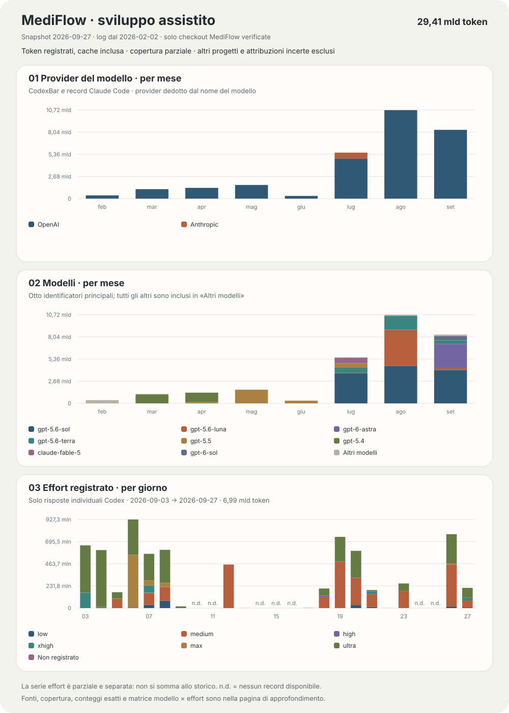

# Sviluppo assistito: disclosure e consumi

MediFlow è sviluppato con l’assistenza di modelli AI. Codex e Claude Code
hanno contribuito a progettazione, scrittura, revisione e verifica dei sorgenti.
Direzione e responsabilità del progetto rimangono dell’autore. I controlli
automatizzati non equivalgono a una revisione umana di ogni modifica. L’uso di
questi strumenti durante lo sviluppo non attiva servizi AI nel gestionale e
non dimostra qualità o validazione clinica.

Questa pagina rende pubblici gli aggregati disponibili e il modo in cui sono
letti. Le istruzioni personali usate dagli assistenti per sviluppare restano
fuori dalla repository. I [crediti](../CREDITS.md#sviluppo-assistito) riconoscono
gli strumenti impiegati.



## Come leggere il grafico

- **Perimetro:** solo registrazioni associate alle checkout verificate di
  MediFlow e alle loro sottocartelle. Altri progetti e attribuzioni incerte
  sono esclusi. È un’attribuzione tecnica per repository e directory di lavoro,
  non una classificazione del contenuto delle conversazioni: una chat mista
  nella checkout può includere attività accessorie. Nessuna ripartizione per
  release, PR o commit e nessuna stima proporzionale dei consumi mancanti.
- **Token:** contesto elaborato, con la cache inclusa. Non sono una misura di
  spesa, quota dell’abbonamento, codice prodotto o qualità. Il testo riutilizzato
  può essere conteggiato a ogni elaborazione: non sono parole uniche.
- **Provider:** dedotto dall’identificatore registrato: `gpt-*` e
  `codex-auto-review` → OpenAI; `claude-*` → Anthropic. Gli altri restano
  “Non determinato”. Questa classificazione non verifica endpoint, fatturazione
  o sede di esecuzione. Gli alias, come `gpt-reserve` o `chatgpt-web/*`,
  non identificano necessariamente il modello effettivamente eseguito.
- **Ambiente:** Codex e Claude Code indicano chi registra il consumo, non il
  provider del modello. I record OpenAI dentro Claude Code rimangono in
  quell’ambiente ma sono classificati OpenAI nel grafico per provider.
- **Effort:** livello di ragionamento registrato nel contesto della risposta,
  non una misura dello sforzo realmente impiegato o della qualità. `none`
  sarebbe un valore registrato; “Non registrato” indica invece un dato mancante.
  I livelli di modelli diversi non sono prestazioni equivalenti.

## Fonti, copertura e limiti

Lo snapshot del **27 settembre 2026** applica lo stesso confine MediFlow a
tutte le serie. Le checkout sono riconosciute tramite l’origine Git di
MediFlow registrata nei metadati delle sessioni, incluso il precedente repository
del progetto, oppure tramite il registro Git corrente delle worktree.
Il confronto usa percorsi normalizzati e confini di directory, non una ricerca
del nome “MediFlow”. I percorsi privati non vengono pubblicati. Checkout eliminate
senza una provenienza verificabile e registrazioni non attribuibili restano escluse.

- **Codex:** aggregati per directory sorgente di **CodexBar 0.60.3**, con una
  finestra richiesta di 365 giorni. Le sorgenti vengono filtrate prima di sommare
  giorni e modelli; ogni sorgente entra una sola volta. Sono conservate le date
  giornaliere della fonte.
- **Claude Code:** record locali delle risposte con directory di lavoro
  verificata. Lo snapshot CodexBar non forniva una suddivisione per progetto
  utilizzabile per questo ambiente: il suo totale generale è quindi escluso.
  I record sono deduplicati per identificatore della risposta, anche fra file,
  verificando anche l’identificatore della richiesta quando presente.
  Quando più aggiornamenti della stessa risposta riportano contatori crescenti,
  si conserva l’ultimo; record senza identità, sintetici o incoerenti sono esclusi.
  Si sommano input, output, cache letta e cache creata, una volta ciascuno;
  i dettagli annidati della cache non si aggiungono nuovamente. Date in Europe/Rome.

La raccolta si ferma al **27 settembre 2026, 14:38:12 UTC**. Il grafico raggruppa
i dati per mese. Le somme giornaliere e per modello riconciliano con i totali
di ciascun ambiente. **La copertura è parziale per entrambi:** una somma
riconciliata non dimostra completezza storica. Giorni senza record non provano
assenza di attività.
Non è attestata l’esclusività contabile tra ambienti che possono delegare
lavoro l’uno all’altro: il totale descrive registrazioni, non consumo fatturato.

Lo storico principale non espone l’effort. Il terzo grafico usa perciò
una **serie distinta e parziale**: soltanto record individuali di utilizzo
Codex, deduplicati per identificatore di risposta, appartenenti alla rispettiva
chat MediFlow e associati al contesto dello stesso turno disponibile prima della risposta.
La raccolta si ferma all’istante dello snapshot CodexBar di Codex. Somma input e output; non
aggiunge di nuovo cache o reasoning già inclusi. Le date sono in Europe/Rome.
Non usa contatori cumulativi né distribuisce proporzionalmente token a un effort.
Il numero di file MediFlow indicizzati ma mancanti è riportato sotto. Eventuali metadati
di modello/effort mancanti restano sconosciuti.

**La serie effort non va sommata allo storico principale, né usata per suddividerlo.**
Copertura e metodo sono diversi; non viene ricostruito un effort per Claude
Code o per il resto dello storico. I vecchi snapshot pubblicati nella storia
Git restano fotografie delle rispettive fonti. Lo snapshot precedente includeva
tutti i progetti locali: la riduzione dei totali riflette il nuovo filtro e il
metodo di raccolta, non una riduzione retroattiva del lavoro svolto.

## Riproducibilità e riservatezza

Il [dataset pubblico](./data/development-usage.json) contiene solo date,
ambiente, provider dedotto, identificatore modello, effort registrato e conteggi,
oltre ai metadati aggregati della fonte. Non contiene prompt, messaggi, titoli,
identificatori di chat, percorsi locali, credenziali o dati clinici.
La raccolta dei log e la preparazione degli aggregati restano locali.

Il generatore incluso nella repository legge esclusivamente questo dataset,
senza cercare sessioni personali né chiamare servizi esterni:

```bash
npm run build:usage-dashboard
npm run check:usage-dashboard
```

Il primo comando rigenera SVG e tabelle; il secondo controlla che corrispondano
al dataset. La CI esegue questo controllo e le sue prove sintetiche a ogni PR.
La validazione richiede il perimetro MediFlow ed esclusione delle attribuzioni
incerte; rifiuta campi extra, duplicati, somme incoerenti e
nuovi identificatori di modello non ancora riesaminati. Per aggiornare i dati,
verificare localmente l’attribuzione delle sorgenti prima di pubblicare un nuovo
snapshot aggregato con data, fonte e copertura esplicite. La CI verifica il
dataset pubblico e la sua rappresentazione; non può attestare i log privati.

## Conteggi esatti

<!-- usage-dashboard:start -->

Snapshot: **2026-09-27**. Token registrati nelle checkout verificate di **MediFlow: 29.411.209.035**. Altri progetti e attribuzioni incerte esclusi.

| Ambiente che registra | Fonte | Periodo disponibile | Token | Cache letta (inclusa) | Copertura |
| :-- | :-- | :-- | --: | --: | :-- |
| Codex | CodexBar 0.60.3 | 2026-02-02 → 2026-09-27 | 28.619.562.515 | 27.473.682.415 | Parziale |
| Claude Code | Claude Code local response records | 2026-07-02 → 2026-08-10 | 791.646.520 | 732.595.902 | Parziale |

### Storico mensile per provider

| Provider dedotto | 2026-02 | 2026-03 | 2026-04 | 2026-05 | 2026-06 | 2026-07 | 2026-08 | 2026-09 | Totale |
| :-- | --: | --: | --: | --: | --: | --: | --: | --: | --: |
| OpenAI | 392.724.553 | 1.143.437.723 | 1.300.702.147 | 1.650.113.993 | 327.263.594 | 4.848.219.908 | 10.701.770.867 | 8.317.602.702 | 28.681.835.487 |
| Anthropic | 0 | 0 | 0 | 0 | 0 | 713.927.967 | 15.445.581 | 0 | 729.373.548 |

### Storico mensile completo per modello

Valori zero indicano assenza di token registrati, non prova di mancato utilizzo. L’ultimo mese è parziale.

| Identificatore modello | 2026-02 | 2026-03 | 2026-04 | 2026-05 | 2026-06 | 2026-07 | 2026-08 | 2026-09 | Totale |
| :-- | --: | --: | --: | --: | --: | --: | --: | --: | --: |
| gpt-5.6-sol | 0 | 0 | 0 | 0 | 0 | 3.643.888.650 | 4.535.268.418 | 4.032.171.592 | 12.211.328.660 |
| gpt-5.6-luna | 0 | 0 | 0 | 0 | 0 | 36.160.075 | 4.360.662.683 | 222.688.256 | 4.619.511.014 |
| gpt-6-astra | 0 | 0 | 0 | 0 | 0 | 0 | 0 | 2.933.011.101 | 2.933.011.101 |
| gpt-5.6-terra | 0 | 0 | 0 | 0 | 0 | 678.987.477 | 1.689.514.162 | 426.875.063 | 2.795.376.702 |
| gpt-5.5 | 0 | 0 | 166.706.103 | 1.649.938.188 | 327.263.594 | 489.183.706 | 0 | 0 | 2.633.091.591 |
| gpt-5.4 | 0 | 1.091.585.133 | 1.124.469.068 | 0 | 0 | 0 | 0 | 0 | 2.216.054.201 |
| claude-fable-5 | 0 | 0 | 0 | 0 | 0 | 682.998.672 | 0 | 0 | 682.998.672 |
| gpt-6-sol | 0 | 0 | 0 | 0 | 0 | 0 | 0 | 537.845.199 | 537.845.199 |
| gpt-5.3-codex | 303.266.404 | 51.642.499 | 9.526.976 | 175.805 | 0 | 0 | 0 | 0 | 364.611.684 |
| gpt-daybreak-blue-latest | 0 | 0 | 0 | 0 | 0 | 0 | 116.325.604 | 38.563.477 | 154.889.081 |
| gpt-6-luna | 0 | 0 | 0 | 0 | 0 | 0 | 0 | 126.448.014 | 126.448.014 |
| gpt-5.2-codex | 78.566.024 | 0 | 0 | 0 | 0 | 0 | 0 | 0 | 78.566.024 |
| claude-opus-4-8 | 0 | 0 | 0 | 0 | 0 | 21.305.602 | 0 | 0 | 21.305.602 |
| claude-sonnet-5 | 0 | 0 | 0 | 0 | 0 | 9.623.693 | 8.861.454 | 0 | 18.485.147 |
| gpt-5.2 | 10.892.125 | 0 | 0 | 0 | 0 | 0 | 0 | 0 | 10.892.125 |
| claude-opus-5 | 0 | 0 | 0 | 0 | 0 | 0 | 6.584.127 | 0 | 6.584.127 |
| gpt-5.3-codex-spark | 0 | 210.091 | 0 | 0 | 0 | 0 | 0 | 0 | 210.091 |

### Provider, modello ed effort registrato

Serie separata: **2026-09-03 → 2026-09-27**, **6.992.506.818 token** in **50.444 risposte**. 130 file indicizzati non erano disponibili: la copertura non è completa.

| Provider dedotto | Identificatore modello | Effort registrato | Token |
| :-- | :-- | :-- | --: |
| OpenAI | gpt-6-astra | ultra | 2.191.566.524 |
| OpenAI | gpt-5.6-sol | ultra | 982.521.161 |
| OpenAI | gpt-6-astra | medium | 771.521.299 |
| OpenAI | gpt-5.6-sol | medium | 611.967.864 |
| OpenAI | gpt-6-sol | medium | 558.849.533 |
| OpenAI | gpt-6-astra | max | 484.405.483 |
| OpenAI | gpt-5.6-terra | medium | 436.645.403 |
| OpenAI | gpt-5.6-luna | max | 175.251.858 |
| OpenAI | gpt-6-astra | low | 175.076.068 |
| OpenAI | gpt-5.6-sol | xhigh | 162.693.375 |
| OpenAI | gpt-6-luna | medium | 136.135.783 |
| Non determinato | chatgpt-web/pro | ultra | 106.373.221 |
| OpenAI | gpt-daybreak-blue-latest | xhigh | 75.760.903 |
| OpenAI | gpt-6-astra | xhigh | 54.251.515 |
| OpenAI | gpt-5.6-luna | medium | 38.184.213 |
| OpenAI | gpt-6-astra | high | 15.802.168 |
| OpenAI | codex-auto-review | low | 12.512.044 |
| Non determinato | unknown | Non registrato | 1.647.964 |
| OpenAI | gpt-5.6-sol | low | 1.340.439 |

<!-- usage-dashboard:end -->
