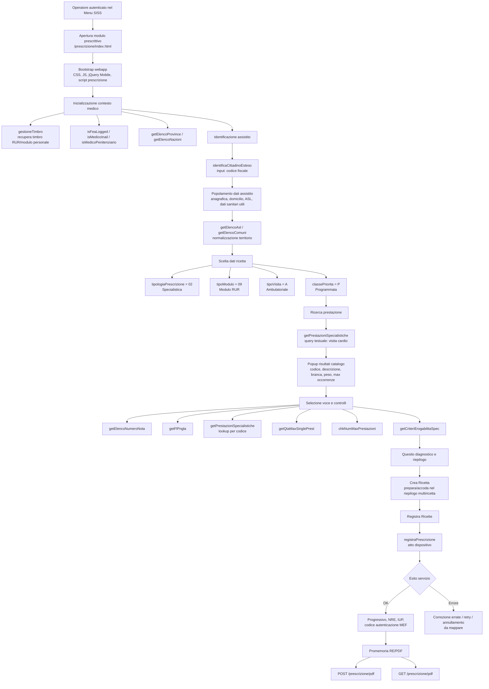

# MediFlow e SISS: ipotesi tecnica di integrazione, inspection e middleware applicativo

## 1. Scopo del documento

Questo testo formalizza, in termini tecnici, l’ipotesi di lavoro per rendere più rapida e usabile l’interazione tra MediFlow e i servizi informatici sanitari regionali, in particolare quando l’operatore sanitario accede tramite autenticazione personale al Menu SISS e ai moduli stock.

L’obiettivo non è sostituire il sistema regionale, né aggirare i meccanismi di autenticazione, autorizzazione, firma, tracciamento o non ripudio. L’obiettivo è descrivere un possibile modello di integrazione o di interfaccia assistita, capace di ridurre la frizione operativa del front end stock, mantenendo il controllo clinico dell’operatore e la coerenza con i canali consentiti.

## 2. Contesto operativo

MediFlow è un applicativo clinico locale, orientato al lavoro del medico, con funzioni di cartella, organizzazione del profilo paziente, supporto documentale e potenziale supporto alla prescrizione.

Il medico accede ai servizi regionali tramite utenza personale, firma remota o altri meccanismi previsti dal sistema. L’accesso avviene attraverso il Menu SISS o moduli regionali specifici. Il problema principale non è l’assenza di autorizzazione soggettiva dell’operatore, ma la distanza tra:

- il flusso clinico reale, che parte dal profilo paziente, dalla valutazione, dalla terapia e dal bisogno prescrittivo;
- il flusso applicativo stock, spesso rigido, lento e poco integrato con la documentazione clinica locale;
- le integrazioni più evolute dei gestionali terzi, che possono disporre di canali applicativi dedicati o qualificati.

## 3. Obiettivo tecnico

L’obiettivo desiderato è costruire una superficie di lavoro più efficiente, integrata in MediFlow, che permetta di:

1. predisporre bozze prescrittive strutturate a partire dal profilo paziente;
2. validare localmente congruenze minime, completezza dei campi e coerenza dei dati;
3. segmentare automaticamente le richieste secondo regole parametrizzabili, per esempio numero massimo di prestazioni o farmaci per impegnativa, senza hardcoding non verificato;
4. guidare l’operatore nel passaggio verso il sistema regionale;
5. mantenere audit locale, tracciabilità decisionale e separazione netta tra dati clinici locali e azioni effettivamente eseguite sul sistema regionale;
6. utilizzare un canale applicativo ufficiale solo qualora disponibile, autorizzato e documentato.

In termini architetturali, il componente non dovrebbe essere pensato come “iniezione” nel sistema regionale, ma come **adapter applicativo** o **presentation/integration layer** posto tra MediFlow e il canale ufficiale utilizzabile.

## 4. Cosa può dare la web inspection

La web inspection tramite strumenti sviluppatore del browser può avere un valore tecnico se usata come analisi passiva e documentale del comportamento della pagina stock, senza riuso non autorizzato di token, sessioni, endpoint o payload.

Può aiutare a mappare:

- sequenza delle schermate e degli stati applicativi;
- campi obbligatori, validazioni front end e messaggi di errore;
- dipendenze tra campi, per esempio paziente, esenzione, priorità, prestazione, farmaco, motivazione, struttura, regime;
- punti di latenza percepita, blocchi, refresh, chiamate ripetute, caricamenti asincroni;
- condizioni in cui la UI stock diventa fragile, lenta o ambigua;
- differenza tra logica clinica, logica di compilazione e logica di invio;
- vincoli da riprodurre localmente solo come checklist o prevalidazione, non come replica non autorizzata del servizio.

La web inspection non dovrebbe essere usata per:

- estrarre credenziali, token, cookie, sessioni o header di autenticazione;
- replicare chiamate protette fuori dal contesto previsto;
- automatizzare azioni dispositive senza canale approvato;
- aggirare controlli di firma, profilazione, auditing o non ripudio;
- costruire un client parallelo non qualificato verso servizi regionali.

## 5. Modello concettuale del middleware

Il middleware, nella forma sostenibile, è un componente di **orchestrazione locale o autorizzata**, non un intercettore opaco.

### 5.1 Componenti

```text
MediFlow Patient Workspace
        |
        v
Prescription Draft Builder
        |
        v
Local Validation and Grouping Engine
        |
        v
SISS Handoff / Authorized Adapter
        |
        v
Regional System UI or Official API Channel
```

### 5.2 Responsabilità dei componenti

#### Patient Workspace

Contiene il contesto clinico locale:

- anagrafica interna o riferimenti minimi;
- problemi attivi;
- terapia;
- documenti;
- note cliniche;
- bisogni prescrittivi;
- informazioni utili alla decisione.

Non deve sostituire l’anagrafica regionale né considerarsi fonte autoritativa per dati che il sistema regionale deve validare.

#### Prescription Draft Builder

Produce bozze strutturate, non ancora prescrizioni valide:

- farmaci o prestazioni proposte;
- quantità, dosaggio, note, priorità, quesito diagnostico, esenzione proposta;
- motivazione clinica;
- riferimenti documentali interni;
- stato della bozza: incompleta, pronta per revisione, inviata a handoff, completata manualmente, annullata.

#### Local Validation and Grouping Engine

Esegue controlli locali di coerenza:

- campi mancanti;
- duplicati evidenti;
- incompatibilità logiche;
- segmentazione in gruppi prescrittivi;
- regole configurabili, revisionabili e non presentate come equivalenti alle regole SISS;
- generazione di una preview operativa.

Il grouping deve essere parametrico. Esempio concettuale:

```text
input: elenco richieste
regole locali: max_item_per_gruppo, tipo_richiesta, priorità, regime, esenzione, note
output: gruppi di bozza prescrittiva da sottoporre a conferma operatore
```

#### SISS Handoff / Authorized Adapter

È il punto di contatto con il mondo regionale.

Può assumere tre forme, in ordine crescente di integrazione:

1. **Handoff controllato**: MediFlow apre il modulo regionale corretto nel contesto più vicino possibile al paziente o alla funzione.
2. **Assisted UI locale**: MediFlow prepara campi, checklist, copia controllata e sequenze operative, ma l’inserimento dispositivo resta nel portale stock.
3. **Adapter ufficiale**: MediFlow usa un canale A2A/API Manager o equivalente, solo se formalmente abilitato, documentato, testato e autorizzato.

La terza opzione è l’unica che può trasformare MediFlow in un vero front end prescrittivo integrato.

## 6. Architetture possibili

## 6.1 Livello 0: handoff attuale migliorato

MediFlow resta fuori dal flusso dispositivo.

Funzioni implementabili:

- pulsante contestuale verso Menu SISS o modulo pertinente;
- riepilogo paziente e bozza prescrittiva visibile accanto al portale;
- checklist di compilazione;
- copia controllata dei dati non sensibili o minimizzati;
- marcatura locale dello stato: da prescrivere, in corso, completato, fallito, da rivedere.

Vantaggio: basso rischio.

Limite: non elimina la lentezza del modulo stock.

## 6.2 Livello 1: interfaccia locale preparatoria

MediFlow diventa il luogo in cui il medico costruisce la prescrizione prima di operare sul sistema regionale.

Funzioni implementabili:

- maschera prescrittiva locale rapida;
- ricerca interna di prestazioni o farmaci;
- template clinici;
- raggruppamento automatico delle bozze;
- alert di incompletezza;
- esportazione o passaggio manuale guidato verso il portale.

Vantaggio: migliora il lavoro cognitivo e riduce errori di preparazione.

Limite: la prescrizione effettiva resta manuale sul sistema regionale.

## 6.3 Livello 2: shell browser assistita

MediFlow può incorporare una vista controllata o affiancata del portale regionale, senza alterare il contenuto né intercettare chiamate protette.

Funzioni possibili:

- layout a due pannelli;
- pannello MediFlow con dati clinici e bozza;
- pannello portale stock;
- cronologia locale delle operazioni dichiarate dall’utente;
- promemoria e checklist.

Vantaggio: migliore continuità ergonomica.

Limite: rischio di fragilità, dipendenza dal portale stock, possibile incompatibilità con policy di embedding, sicurezza o autenticazione.

## 6.4 Livello 3: adapter ufficiale A2A/API Manager

È il modello tecnicamente corretto per un’integrazione vera.

Richiede:

- canale applicativo approvato;
- documentazione tecnica;
- profilazione dell’applicativo;
- ambiente di test;
- gestione formale di autenticazione, autorizzazione, tracciamento, audit, firma e non ripudio;
- qualificazione del software, se richiesta;
- responsabilità chiare tra operatore, ente, fornitore e infrastruttura regionale.

Vantaggio: consente una UI MediFlow realmente nativa.

Limite: richiede interlocuzione istituzionale e autorizzazione formale.

## 6.5 Livello non raccomandato: proxy/interceptor non autorizzato

Un proxy locale o un middleware che intercetti traffico autenticato del browser e lo riproponga come API privata non è un modello stabile di prodotto.

Problemi:

- dipende da endpoint non contrattualizzati;
- può rompere autenticazione, firma, auditing e non ripudio;
- può violare condizioni d’uso;
- è fragile a ogni aggiornamento;
- può esporre dati sanitari e credenziali;
- crea rischio clinico e organizzativo.

## 7. Modello dati interno consigliato

Il modello dati deve rappresentare bozze e stati, non prescrizioni regionali già valide.

```text
PatientContext
- patient_internal_id
- identifiers_minimized
- active_problems
- relevant_documents
- allergies_or_warnings
- current_therapy_snapshot

PrescriptionDraft
- draft_id
- patient_internal_id
- draft_type: farmaco | specialistica | protesica | altro
- clinical_reason
- priority
- exemption_candidate
- items[]
- status
- created_by
- reviewed_by
- timestamps

PrescriptionItemDraft
- item_id
- catalog_source
- local_code
- description
- quantity
- dosage_or_notes
- constraints
- validation_status

PrescriptionGroupDraft
- group_id
- draft_id
- grouping_rule_version
- items[]
- handoff_status

HandoffEvent
- event_id
- draft_id
- target_system
- target_function
- event_type
- operator
- timestamp
- outcome_declared
- notes
```

## 8. Stato macchina della bozza

```text
CREATED
  -> INCOMPLETE
  -> READY_FOR_REVIEW
  -> REVIEWED
  -> HANDOFF_OPENED
  -> COMPLETED_MANUALLY
  -> FAILED
  -> CANCELLED
```

Ogni transizione deve essere auditabile. La conclusione della prescrizione deve essere dichiarata o documentata dall’operatore, salvo integrazione ufficiale che restituisca un esito applicativo.

## 9. Requisiti di sicurezza

Requisiti minimi:

- nessuna memorizzazione di credenziali, token, cookie o sessioni SISS;
- nessuna manipolazione di header o sessioni del portale;
- log locali privi di segreti tecnici;
- cifratura del database locale;
- separazione tra bozza locale e atto prescrittivo regionale;
- audit trail immutabile o append-only per eventi rilevanti;
- controllo esplicito dell’operatore su ogni passaggio dispositivo;
- minimizzazione dei dati copiati verso il portale;
- configurazioni documentate e versionate;
- disabilitazione immediata di qualunque automatismo in caso di errore, anomalia o variazione del portale.

## 10. UX proposta

La vista prescrittiva in MediFlow dovrebbe essere strutturata in quattro zone:

```text
[Contesto paziente]      [Bozza prescrittiva]
[Validazioni locali]     [Handoff / azioni]
```

### Contesto paziente

- dati identificativi minimi;
- problemi attivi;
- terapia corrente;
- documenti rilevanti;
- alert clinici.

### Bozza prescrittiva

- elenco richieste;
- tipo richiesta;
- priorità;
- esenzione proposta;
- note;
- motivazione clinica.

### Validazioni locali

- campi mancanti;
- possibili duplicati;
- incongruenze;
- segmentazione in gruppi;
- checklist finale.

### Handoff / azioni

- apri modulo SISS pertinente;
- copia riepilogo controllato;
- marca come completato;
- marca come fallito;
- salva nota di esito;
- annulla bozza.

## 11. Metriche operative

Metriche utili per valutare l’efficacia, anche senza integrazione piena:

- tempo medio da apertura profilo a handoff;
- tempo medio da bozza a completamento dichiarato;
- numero di errori evitati prima del portale;
- numero di bozze incomplete;
- numero di gruppi prescrittivi generati;
- numero di fallimenti per blocco portale;
- numero di duplicati intercettati;
- quota di prescrizioni completate al primo tentativo;
- carico manuale residuo.

## 12. Roadmap prudente

### Fase 1: mappatura funzionale

Output:

- mappa schermate;
- campi obbligatori;
- punti di latenza;
- errori ricorrenti;
- checklist clinico-operativa.

### Fase 2: bozza prescrittiva locale

Output:

- modello dati interno;
- maschera rapida;
- validazione minima;
- stato macchina;
- audit locale.

### Fase 3: grouping locale

Output:

- regole parametrizzate;
- preview dei gruppi;
- revisione manuale;
- log della regola applicata.

### Fase 4: handoff robusto

Output:

- pulsanti contestuali;
- riepilogo laterale;
- copia controllata;
- registrazione esito.

### Fase 5: richiesta canale ufficiale

Output:

- dossier tecnico;
- casi d’uso;
- volumi stimati;
- requisiti di sicurezza;
- richiesta di sandbox o specifiche;
- valutazione A2A/API Manager o canale equivalente.

## 13. Criteri di accettazione

Un’implementazione è accettabile se:

- non usa credenziali o token al di fuori del contesto previsto;
- non replica endpoint protetti senza abilitazione;
- non automatizza atti prescrittivi senza conferma e canale ufficiale;
- mantiene la responsabilità clinica dell’operatore;
- migliora il tempo di preparazione;
- riduce errori di compilazione;
- produce audit locale coerente;
- può essere disattivata senza perdita di continuità operativa;
- separa chiaramente “bozza MediFlow” da “atto regionale”.

## 14. Documentazione da richiedere o verificare

Per passare da handoff assistito a integrazione reale servono almeno:

- documentazione tecnica del canale applicativo disponibile;
- requisiti per applicativi aderenti o enti erogatori;
- ambiente di test;
- modalità di autenticazione applicativa;
- modalità di delega o token di procedura automatica, se prevista;
- tracciamento e audit richiesti;
- regole prescrittive esposte;
- limiti di chiamata;
- responsabilità del fornitore o dell’ente;
- processo di qualificazione;
- referenti tecnici e istituzionali.

## 15. Fonti pubbliche consultate

Le fonti pubbliche indicano che il SISS prevede modelli di integrazione Application to Application e meccanismi API Manager per specifici contesti, ma non documentano automaticamente un libero riuso del modulo prescrittivo stock da parte di applicativi non qualificati.

- SISS, “Integrazione Application to Application (A2A)”, pagina ufficiale Regione Lombardia/SISS.
- ARIA, “Sistema Informativo Socio Sanitario (SISS)”, descrizione del sistema come piattaforma di cooperazione e integrazione tra attori aderenti.
- Progetto FHIR per Regione Lombardia, “API RESTful”, documentazione pubblica di profili FHIR esposti tramite API Manager.
- ASST Mantova, affidamento 2024 relativo a upgrade SISS3 tramite API Manager per scenari di prescrizione ricette, utile come indizio pubblico dell’esistenza di attività tecniche specifiche sul dominio prescrittivo.

## 16. Osservazione live del modulo prescrittivo dematerializzato

Data osservazione: 2026-05-20.

Contesto: sessione autenticata nel Menu SISS, modulo prescrittivo regionale, compilazione di una ricetta dematerializzata di specialistica. Questo documento nasce come materiale tecnico interno di sviluppo e può conservare in chiaro i dati funzionali necessari a capire il processo prescrittivo: codici prestazione, descrizioni, priorità, quesito diagnostico, identificativi regionali di ricetta, messaggi applicativi, stati UI, endpoint, sequenza chiamate, tempi e artefatti. I dati anagrafici personali non utili all'analisi, come indirizzo o dettagli identificativi eccedenti, devono invece essere evitati o ridotti.

### 16.0 Regola di conservazione interna dell'evidenza

Per la mappatura tecnica interna si distinguono tre categorie.

Da conservare in chiaro perché rilevante:

- codici fiscali di test o dell'operatore quando indispensabili a ricostruire la ricerca assistito;
- tipo prescrizione, tipo modulo, tipo visita, priorità, esenzione se usata;
- codici catalogo, descrizioni, branca, peso, occorrenze massime e altri metadati della prestazione o del farmaco;
- quesito diagnostico, quando serve a ricostruire la validazione del flusso;
- progressivo, NRE, IUP e altri identificativi regionali dell'atto;
- messaggi di errore e validazione;
- URL applicativi, path endpoint, metodo, status, MIME, resource type, timing, dimensioni;
- nomi di script, funzioni client, stack trace non contenenti segreti;
- percorsi locali degli artefatti di evidenza, per esempio HAR o PDF.

Da conservare solo se necessario e con attenzione:

- payload applicativi non autenticativi, preferendo estrazione di campi e schema invece di dump integrale;
- screenshot o PDF regionali, con collocazione locale controllata e annotazione del contenuto;
- dati anagrafici del paziente quando spiegano il comportamento del portale, per esempio popolamento da anagrafe assistiti.

Da non conservare nel documento e da non riusare:

- password, PIN, OTP, codici temporanei di firma;
- cookie, token, session ID, bearer token, SAML assertion, header di autenticazione;
- dump integrali di storage browser o profili Chrome;
- dati di sessione riutilizzabili per impersonare l'operatore o replicare chiamate fuori dal browser autenticato.

Questa distinzione non riduce la ricchezza del dato clinico-tecnico. Serve a separare evidenza utile alla comprensione del processo da segreti tecnici che non descrivono la logica prescrittiva e non devono diventare materiale di sviluppo.

### 16.1 Evidenza acquisita

Durante la sessione sono stati configurati gli strumenti sviluppatore di Chrome nel pannello Network con:

- registrazione attiva;
- `Preserve log` abilitato;
- `Disable cache` abilitato;
- log pulito prima dell'atto osservato;
- export HAR sanitizzato al termine.

L'export HAR osservato è stato salvato in:

```text
/Users/leonardopegollo/Downloads/operatorisiss.servizirl.it.har
```

Il file HAR deve essere trattato come materiale sensibile: anche quando esportato in modalità sanitizzata può contenere dettagli operativi, URL, tempi, sequenze applicative e frammenti di contesto clinico. La lettura tecnica usabile per questo documento include metadati, sequenza delle chiamate, payload applicativi non segreti se necessari, messaggi e identificativi di esito. Restano esclusi cookie, token, header di sessione, credenziali e altri elementi riutilizzabili per autenticazione o impersonificazione.

### 16.2 Architettura applicativa osservata

Il modulo prescrittivo si presenta come una webapp jQuery Mobile con navigazione a stati lato client. L'URL principale osservato appartiene al dominio:

```text
https://operatorisiss.servizirl.it/prescrizione/index.html
```

I cambi di schermata avvengono tramite hash e pagine interne, per esempio:

```text
#compila-ricetta-page
#compila-ricetta-spec-quesito-erogabilita-page-1-3
#riepilogo-ricetta-page
#riepilogo-multiricetta-page
#compila-ricetta-page-2
```

Gli script caricati indicano una separazione funzionale tra:

- compilazione generale della ricetta;
- ramo farmaceutico;
- ramo specialistico;
- riepilogo singola ricetta;
- riepilogo multiricetta;
- registrazione prescrizione;
- visualizzazione PDF;
- bridge locali o componenti di firma.

Script significativi osservati:

```text
/prescrizione/js/iocJsonRemoting.js
/prescrizione/js/compila-ricetta.js
/prescrizione/js/compila-ricetta-1-1.js
/prescrizione/js/compila-ricetta-1-2.js
/prescrizione/js/compila-ricetta-1-3-farm.js
/prescrizione/js/compila-ricetta-1-3-spec.js
/prescrizione/js/riepilogo-ricetta.js
/prescrizione/js/riepilogo-multiricetta.js
/prescrizione/js/registra-prescrizione.js
/prescrizione/js/view-pdf.js
/prescrizione/js/plugin/siss.js
/prescrizione/js/page-manager.js
```

Questa struttura suggerisce che il browser non è una pagina statica, ma un client applicativo che mantiene stato locale, valida transizioni, popola campi nascosti e invoca un broker applicativo centrale.

### 16.3 Endpoint centrale osservato

L'endpoint dominante della sessione prescrittiva è:

```text
POST /prescrizione/jsonBroker
```

Nel tracciamento HAR osservato:

- entry totali: 183;
- host prevalente: `operatorisiss.servizirl.it`;
- chiamate a `/prescrizione/jsonBroker`: 28;
- metodo: `POST`;
- status osservato: `200`;
- MIME prevalente: `text/plain`;
- tipo risorsa lato browser: `xhr`.

Nel tratto finale prima della pagina di esito sono state osservate più chiamate consecutive a `/prescrizione/jsonBroker`, seguite dal caricamento delle icone di esito e dalle chiamate PDF:

```text
POST /prescrizione/pdf
GET  /prescrizione/pdf
```

Inferenza prudente: `jsonBroker` è il punto di remoting applicativo della webapp prescrittiva. Non va però trattato come API pubblica o contrattualizzata. È una superficie interna della webapp stock, vincolata alla sessione, alla profilazione, al contesto SISS e alle logiche di autenticazione/autorizzazione regionali.

### 16.4 Flusso funzionale della specialistica osservato

La compilazione specialistica osservata segue questa sequenza:

1. Inserimento codice fiscale assistito.
2. Recupero/visualizzazione del soggetto.
3. Scelta tipo prescrizione.
4. Selezione `Specialistica`.
5. Scelta del modulo.
6. Scelta tipo visita.
7. Scelta priorità.
8. Ricerca testuale della prestazione.
9. Apertura popup risultati.
10. Selezione prestazione codificata.
11. Conferma prestazione nella tabella.
12. Inserimento quesito diagnostico.
13. Riepilogo ricetta.
14. Creazione della ricetta nel riepilogo multiricetta.
15. Registrazione delle ricette.
16. Pagina di esito con progressivo, NRE e IUP.
17. Disponibilità del flusso PDF.

La distinzione tra `Crea Ricetta` e `Registra Ricette` è sostanziale:

- `Crea Ricetta` prepara/accoda la ricetta nel riepilogo multiricetta;
- `Registra Ricette` è il passaggio dispositivo che produce l'esito regionale e gli identificativi della ricetta.

Per MediFlow questo comporta una distinzione netta tra:

- bozza locale;
- ricetta preparata nella webapp;
- ricetta effettivamente registrata;
- ricetta annullata o corretta in un passaggio successivo.

### 16.5 Campi e valori visibili nella ricetta specialistica

Campi UI osservati nella schermata dati ricetta:

```text
select-choice-tipoprescrizione
select-choice-tipomodulo
select-choice-tipovisita
select-choice-classe-priorita
```

Valori funzionali osservati:

```text
Tipo prescrizione:
- Farmaceutica
- Specialistica

Tipo modulo:
- Modulo RUR

Tipo visita:
- Ambulatoriale
- Domiciliare

Classe priorità:
- Urgente
- Breve
- Differibile
- Programmata
```

Nella sessione specialistica osservata è stata selezionata priorità `P`, cioè `Programmata`.

### 16.6 Ricerca prestazione specialistica

La ricerca testuale della prestazione non è un semplice campo libero. Il popup di ricerca restituisce una prestazione codificata e popola campi visibili e nascosti.

Popup osservato:

```text
#popupRisultatoRicercaPrestazioniSpec
#listview-prestazioni-spec
```

Esempio di prestazione selezionata nella sessione osservata:

```text
Codice prestazione: 0889013.0
Descrizione: VISITA CARDIOLOGICA (CONTROLLO) CON ECG
```

La ricerca contestuale del popup, però, non restituisce una sola voce. Con query come `visita cardiologica`, `cardiologica` o `cardio`, il catalogo può proporre più opzioni clinicamente vicine ma prescrittivamente diverse:

```text
VISITA CARDIOCHIRURGICA (CONTROLLO)
VISITA CARDIOCHIRURGICA (PRIMA VISITA)
VISITA CARDIOLOGICA (CONTROLLO) CON ECG
VISITA CARDIOLOGICA (PRIMA VISITA) CON INCLUSO ECG
```

Sono da verificare in ulteriori run anche eventuali voci aggiuntive collegate a riabilitazione cardiologica individuale o di gruppo. Per il modello MediFlow è essenziale conservare sia la query testuale sia l'elenco candidati sia il codice finale selezionato, perché la differenza tra prima visita e controllo non è un dettaglio descrittivo ma una scelta prescrittiva codificata.

Campi e metadati osservati nella selezione:

```text
#tx-codice-prestazioni-spec
#tx-ricerca-prestazioni-spec
hiddenBranca
hiddenFlPeso
hiddenMaxOccorrenze
```

Metadati osservati per la prestazione selezionata:

```text
hiddenBranca = 08
hiddenFlPeso = 1
hiddenMaxOccorrenze = 8
```

Lettura tecnica: la prestazione specialistica deve essere modellata come voce di catalogo codificata, non come solo testo descrittivo. I metadati collegati alla voce selezionata influenzano vincoli, validazioni, raggruppamento e forse regole di erogabilità.

### 16.7 Validazioni contestuali osservate

Il portale applica validazioni contestuali dopo la selezione della prestazione.

Esempio osservato: tentativo di valorizzare `Tipo Accesso` per la prestazione selezionata. Il sistema ha mostrato un alert:

```text
Non è possibile valorizzare il "Tipo Accesso" per la prestazione selezionata
```

Lettura tecnica: non tutte le regole sono deducibili dai soli campi visibili iniziali. Alcune dipendono dalla prestazione selezionata e vengono applicate dal client o dal broker dopo che il catalogo ha restituito la voce codificata.

Per MediFlow è quindi più corretto mantenere una prevalidazione locale prudente:

- campi obbligatori;
- completezza formale;
- duplicati evidenti;
- coerenza tra tipo prescrizione e item;
- raggruppamento proposto;
- checklist di attenzione.

Non è corretto presentare la prevalidazione locale come equivalente alla validazione ufficiale SISS, salvo accesso a specifiche ufficiali e ambiente di test.

### 16.8 Superficie di errore osservata

Durante un tentativo precedente, la registrazione si è bloccata con overlay e console error:

```text
SyntaxError: Unexpected token '<', "<html>..." is not valid JSON
```

Stack applicativo osservato:

```text
iocJsonRemoting.js
jQuery.parseJSON
XHR success handler
```

Lettura tecnica: il client si aspettava una risposta JSON o JSON-like dal broker, ma ha ricevuto HTML. Questo è compatibile con una risposta di autenticazione, timeout, errore server o redirect applicativo servito dentro un canale che il client interpreta come remoting JSON.

Implicazione per un sistema di supporto:

- il log locale deve distinguere errore di compilazione, errore di sessione, errore di broker, errore di validazione e mancato esito;
- una pagina apparentemente ferma può corrispondere a una risposta tecnicamente errata per il parser;
- il recupero operativo deve prevedere refresh e ripartenza controllata senza duplicare l'atto prescrittivo.

### 16.9 Momento dispositivo ed esito

L'esito positivo osservato è apparso nella pagina:

```text
#compila-ricetta-page-2
```

Testo funzionale della schermata:

```text
Esito della registrazione delle Ricette
```

Colonne osservate:

```text
Stampa
Esito
Info
Progressivo
N° Ricetta Elettronica
Codice IUP
```

Inferenza prudente: l'identità regionale della ricetta nasce solo dopo la registrazione, quando il portale restituisce progressivo, NRE e IUP. Prima di quel momento esistono compilazione, bozza o ricetta preparata nel riepilogo, ma non ancora l'atto regionale registrato.

Esito osservato nella sessione del 2026-05-20:

```text
Progressivo = 1
NRE = <NRE_REDACTED>
IUP = <IUP_REDACTED>
```

Questi identificativi vanno considerati parte dell'evidenza funzionale della registrazione. Nel modello MediFlow servono per riconciliare bozza locale, atto regionale, PDF/ricevuta, eventuale annullamento e audit successivo.

### 16.10 Implicazioni per il modello MediFlow

Il modello MediFlow dovrebbe rappresentare almeno quattro livelli:

```text
LocalPrescriptionDraft
PreparedSissWebDraft
RegisteredRegionalPrescription
RegionalPrescriptionFollowUp
```

Campi consigliati per l'audit locale, senza conservare segreti tecnici:

```text
handoff_id
patient_internal_id
draft_id
target_system = SISS
target_module = prescrizione
target_flow = specialistica | farmaceutica | protesica | altro
operator_declared_action
started_at
completed_at
outcome = prepared | registered | failed | cancelled | corrected | unknown
regional_identifiers_present = true | false
regional_progressive_optional
regional_nre_optional
regional_iup_optional
regional_pdf_path_optional
har_artifact_path_optional
browser_observation_notes
error_class
error_message_redacted
```

Per la parte prescrittiva specialistica, il dato locale non dovrebbe essere solo:

```text
descrizione = "visita cardiologica"
```

ma almeno:

```text
catalog_source = SISS observed catalog
item_type = specialistica
regional_code = 0889013.0
description = VISITA CARDIOLOGICA (CONTROLLO) CON ECG
branch_code = 08
weight_flag = 1
max_occurrences = 8
priority = P
diagnostic_question_present = true
```

Questi campi vanno considerati osservati o derivati dalla sessione, non regole normative generali.

## 17. Protocollo di cattura per prossime osservazioni Chrome

Questo protocollo va riusato per moduli ulteriori, per esempio farmaceutica, protesica, anagrafe, FSE o altri strumenti regionali.

### 17.1 Prima di iniziare

Preparazione DevTools:

1. Aprire DevTools sul tab operativo.
2. Selezionare `Network`.
3. Abilitare `Preserve log`.
4. Abilitare `Disable cache`.
5. Pulire il log appena prima del flusso da osservare.
6. Verificare che la registrazione sia attiva.
7. Non aprire o copiare cookie, token, password, PIN, OTP o header sensibili.

Annotazione iniziale:

```text
data_ora
modulo
funzione
operatore/ruolo in forma descrittiva
paziente o assistito con identificativi funzionali necessari e dettagli anagrafici non utili ridotti
obiettivo operativo
azione dispositiva prevista = sì/no
```

### 17.2 Durante il flusso

Annotare:

- schermata iniziale;
- URL/hash;
- campi obbligatori;
- campi facoltativi;
- popup;
- ricerche testuali;
- risultati selezionati;
- campi nascosti o metadati UI quando visibili senza estrarre segreti;
- messaggi di errore;
- overlay o hang;
- punto esatto in cui l'azione diventa dispositiva;
- esito finale;
- eventuale PDF o ricevuta.

Per ogni passaggio utile:

```text
step_number
screen_id_or_title
user_action
visible_result
network_pattern
client_script_if_relevant
risk_or_validation_note
```

### 17.3 Dopo il flusso

1. Esportare HAR sanitizzato.
2. Salvare percorso file.
3. Analizzare solo metadati, salvo necessità esplicita e autorizzata.
4. Separare:
   - fatti osservati;
   - inferenze tecniche;
   - ipotesi da verificare;
   - dati da non conservare nel documento.
5. Aggiornare questo documento con una nuova sezione datata.

### 17.4 Tassonomia minima degli errori

```text
UI_HANG
POPUP_EMPTY
CATALOG_SEARCH_FAILED
VALIDATION_BLOCKED
SESSION_HTML_INSTEAD_OF_JSON
BROKER_TIMEOUT
REGISTRATION_FAILED
PDF_UNAVAILABLE
USER_CANCELLED
UNKNOWN_OUTCOME
```

### 17.5 Tassonomia minima degli artefatti

```text
HAR_SANITIZED
SCREENSHOT_REDACTED
PDF_REGIONAL_RECEIPT
LOCAL_DRAFT_JSON
LOCAL_AUDIT_EVENT
MANUAL_NOTE
ERROR_CONSOLE_EXCERPT
```

## 18. Mappa iniziale dei flussi da completare

Flussi già osservati almeno una volta:

```text
prescrizione.specialistica.dematerializzata
```

Flussi da osservare con lo stesso protocollo:

```text
prescrizione.farmaceutica.dematerializzata
prescrizione.specialistica.con_esenzione
prescrizione.specialistica.con_priorita_urgente_breve_differibile
prescrizione.specialistica.multi_item
prescrizione.specialistica.correzione_errate
prescrizione.specialistica.annullamento
prescrizione.protesica
anagrafe.assistiti.identifica_cittadino
fse.operatore.consultazione
```

Per ogni nuovo flusso va prodotta una scheda con:

```text
nome_flusso
modulo_siss
precondizioni
sequenza_schermate
campi_obbligatori
cataloghi_interrogati
endpoint_pattern
validazioni_visibili
errori_osservati
momento_dispositivo
esito_regionale
artefatti_generati
implicazioni_per_mediflow
```

## 19. Flowchart operativa del percorso prescrittivo osservato

Questa mappatura collega lo stato UI, la chiamata applicativa e il significato funzionale. I nomi di metodo sono estratti dal payload applicativo di `/prescrizione/jsonBroker`, non da header o cookie.

### 19.1 Diagramma di processo



### 19.2 Ledger delle chiamate del tracciato HAR

Nel file HAR del 2026-05-20 sono presenti più segmenti operativi. Il segmento specialistico finale è quello che termina con NRE `<NRE_REDACTED>` e IUP `<IUP_REDACTED>`. È presente anche un segmento precedente con ricerca farmaco e registrazione, utile come indizio per il futuro flusso farmaceutico ma non ancora documentato come flusso completo validato.

| HAR idx | Fase | Metodo applicativo | Argomenti funzionali osservati | Risposta / significato | Tempo | Transfer |
|---:|---|---|---|---|---:|---:|
| 74 | inizializzazione medico | `gestioneTimbro` | `identificativoMedico=<CF_REDACTED>`, `tipoOperazione=0` | `messaggio=OK`, ritorna timbro RUR/modulo personale | 1160 ms | 1229 B |
| 75 | dizionari | `getElencoProvince` | stringa vuota | elenco province | 1184 ms | 3222 B |
| 76 | firma/FEA | `isFeaLogged` | nessuno | `false` | 1125 ms | 617 B |
| 77 | profilo medico | `isMedicoInail` | nessuno | `false` | 1171 ms | 617 B |
| 78 | profilo medico | `isMedicoPenitenziario` | nessuno | `false` | 1284 ms | 617 B |
| 81 | dizionari | `getElencoNazioni` | `EE` | elenco stati esteri | 734 ms | 7794 B |
| 82 | anagrafe assistito | `identificaCittadinoEsteso` | `codiceFiscale=<CF_REDACTED>` | ritorna dati cittadino, nascita, CF, codice sanitario, domicilio, ASL | 5113 ms | 3462 B |
| 85 | territorio assistito | `getElencoAsl` | provincia `015` | ASL/ATS disponibili, inclusa `030321` | 492 ms | 798 B |
| 86 | territorio assistito | `getElencoComuni` | provincia `015` | elenco comuni della provincia | 757 ms | 5960 B |
| 114 | segmento farmaceutico nello stesso HAR | `getElencoGE` | query `atorvastatina`, data nascita `<DOB_REDACTED>` | elenco farmaci con note CUF/AIFA e metadati prescrittivi | 1972 ms | 20252 B |
| 115 | segmento farmaceutico nello stesso HAR | `registraPrescrizione` | payload prescrittivo farmaceutico non ancora mappato in dettaglio | esito `OK`, NRE/IUP e promemoria RE presenti | 4307 ms | 12109 B |
| 142 | anagrafe assistito, run finale | `identificaCittadinoEsteso` | `codiceFiscale=<CF_REDACTED>` | ritorna dati cittadino e contesto assistito | 4656 ms | 3462 B |
| 143 | dizionari, run finale | `getElencoProvince` | stringa vuota | elenco province | 653 ms | 3222 B |
| 144 | territorio, run finale | `getElencoAsl` | provincia `015` | ASL/ATS disponibili | 462 ms | 798 B |
| 145 | territorio, run finale | `getElencoComuni` | provincia `015` | elenco comuni | 754 ms | 5960 B |
| 170 | catalogo specialistica | `getPrestazioniSpecialistiche` | codice vuoto, testo `visita cardio`, lista vuota | risultati: cardiochirurgica controllo, cardiochirurgica prima visita, cardiologica controllo con ECG, cardiologica prima visita con ECG | 1239 ms | 1230 B |
| 171 | note prestazione | `getElencoNumeroNota` | codice `08897A3` | lista vuota | 590 ms | 614 B |
| 172 | vincoli prestazione | `getFlPngla` | codice `08897A3` | `result=1` | 602 ms | 613 B |
| 173 | vincoli prestazione | `getFlPngla` | codice `08897A3` | `result=1` | 459 ms | 613 B |
| 174 | lookup prestazione | `getPrestazioniSpecialistiche` | codice `08897A3`, testo vuoto | ritorna `VISITA CARDIOLOGICA (PRIMA VISITA) CON INCLUSO ECG`, branca `08`, `flPeso=1`, `maxOccorrenze=8` | 740 ms | 775 B |
| 175 | quantita massima | `getQtaMaxSinglePrest` | codice `08897A3`, secondo argomento `null` | `result=8` | 498 ms | 613 B |
| 176 | controllo max prestazioni | `chkNumMaxPrestazioni` | `cdPrestazione=08897A3`, `quantita=1`, `numeroSedute=0`, `maxOccorrenze=8` | `true` | 495 ms | 616 B |
| 177 | criteri erogabilita | `getCriteriErogabilitaSpec` | lista `[08897A3]` | lista vuota | 512 ms | 614 B |
| 178 | registrazione specialistica | `registraPrescrizione` | payload dematerializzato specialistico, priorita `P`, quesito, prestazione `08897A3` | esito `OK`, progressivo `1`, NRE `<NRE_REDACTED>`, IUP `<IUP_REDACTED>`, promemoria RE presente | 2394 ms | 13337 B |
| 181 | PDF | `POST /prescrizione/pdf` | preparazione documento | `200` | 438 ms | 260 B |
| 182 | PDF | `GET /prescrizione/pdf` | apertura documento | `200` | 464 ms | 0 B |

### 19.3 Budget osservato per fase

Le durate sono la somma dei tempi HAR delle entry della fase, non il wall-clock reale, perché alcune risorse possono essere parallele.

| Fase | Entry | Somma tempi HAR | Transfer |
|---|---:|---:|---:|
| bootstrap webapp, asset e script | 65 | 225576 ms | 2003583 B |
| inizializzazione medico/dizionari | 7 | 7402 ms | 17318 B |
| prima identificazione assistito | 4 | 7020 ms | 13442 B |
| segmento non specialistico nello stesso HAR | 7 | 9617 ms | 68857 B |
| identificazione assistito run finale | 4 | 6524 ms | 13442 B |
| catalogo e validazione specialistica finale | 8 | 5135 ms | 5688 B |
| registrazione specialistica finale e PDF | 5 | 5252 ms | 48303 B |

Osservazione: il peso iniziale della webapp è alto perché carica un bundle ampio di librerie, CSS, immagini e script funzionali. La parte più critica per la UX prescrittiva non è solo il tempo del broker finale, ma l'accumulo di bootstrap, dizionari, popup catalogo e validazioni sincrone percepite dall'operatore.

### 19.4 Payload funzionale della registrazione specialistica finale

Estratto operativo da `registraPrescrizione` HAR idx `178`.

```text
dataSetVersion = 1.0
progressivoPrescrizione = 1
flagSostituzione = N
abilitazioneDowngrade = S
dataEmissione = 20260520
tipologiaPrescrizione = 02
tipoModulo = 09
tipoVisita = A
flagRicEl = E
classePriorita = P
codiceFiscaleCittadino = <CF_REDACTED>
cognomeCittadino = <SURNAME_REDACTED>
nomeCittadino = <NAME_REDACTED>
sessoCittadino = M
dataNascitaCittadino = <DOB_REDACTED>
ASLAssistito = 030321
provAssistito = MI
generaPromemoria = SI
codiceEsenzione = ""
testoQuesitoDiagnostico = Impegnativa di test
criterioErogabilita = ""
codicePrestazione = 08897A3
descrizionePrestazione = VISITA CARDIOLOGICA (PRIMA VISITA) CON INCLUSO ECG
quantitaPrestazione = 1
tipoAccesso = 1
numeroNotaMef = ""
condErogabilitaMef = ""
branca = 08
flPeso = 1
prstGruppo = ""
prstCiclica = ""
maxOccorrenze = 8
approprPrescrittiva = ""
```

Risposta applicativa:

```text
esitoServizio = OK
progressivoPrescrizione = 1
flagDowngradeRE = null
motivazioniDowngradeRE = null
identificativoUnivoco = <IUP_REDACTED>
numeroRicettaElettronica = <NRE_REDACTED>
codiceAutenticazioneMEF = <MEF_AUTH_REDACTED>
datiErogazione = null
promemoriaRE = presente come PDF/base64 nel payload, non riportato integralmente qui
```

### 19.5 Ricerca contestuale e prestazione finale selezionata

La ricerca testuale `visita cardio` nel popup ha prodotto più candidati:

```text
998901.77 = VISITA CARDIOCHIRURGICA (CONTROLLO)
99897.76 = VISITA CARDIOCHIRURGICA (PRIMA VISITA)
0889013.0 = VISITA CARDIOLOGICA (CONTROLLO) CON ECG
08897A3 = VISITA CARDIOLOGICA (PRIMA VISITA) CON INCLUSO ECG
```

Nella fase di popup era stata annotata anche la voce:

```text
0889013.0 = VISITA CARDIOLOGICA (CONTROLLO) CON ECG
```

Nel payload finale registrato, la prestazione effettivamente trasmessa a `registraPrescrizione` è:

```text
08897A3 = VISITA CARDIOLOGICA (PRIMA VISITA) CON INCLUSO ECG
```

Questa non va letta come anomalia del sistema, ma come comportamento strutturale del catalogo: una ricerca testuale ampia restituisce candidati multipli e la semantica prescrittiva reale nasce dalla voce selezionata. Per MediFlow implica che la riconciliazione non deve fidarsi solo della ricerca testuale o della prima voce annotata: deve registrare query, lista candidati, codice scelto, descrizione scelta e codice effettivamente presente nel payload finale o nell'esito/PDF.
