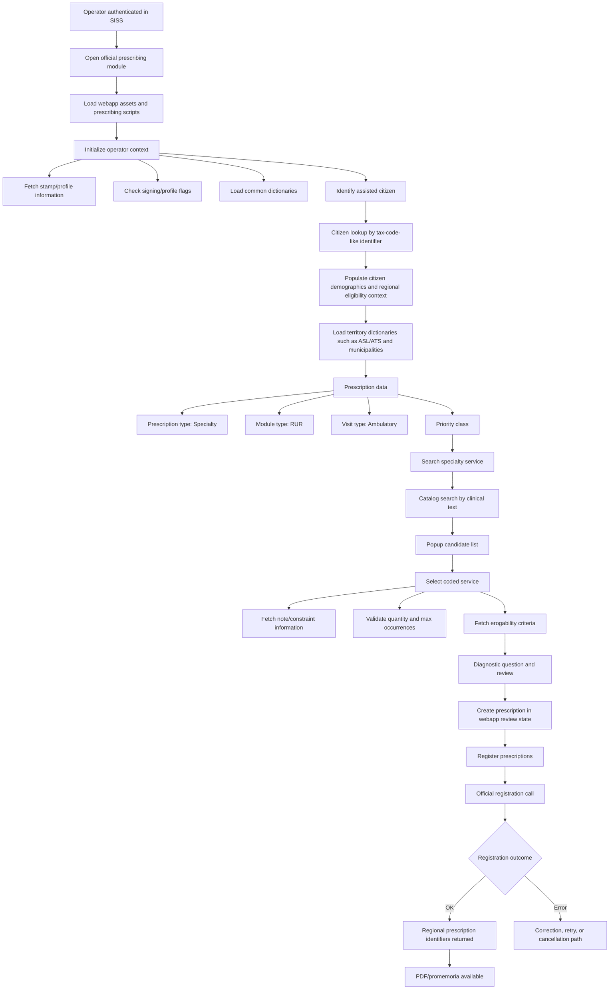

# SISS Modulo Prescrittivo: public-safe live process map

Status: public-safe observation note.

This document summarizes a live operator-session inspection of the Regione
Lombardia SISS prescribing webapp. It intentionally keeps the product boundary
unchanged: MediFlow can prepare context and support a `webapp-assisted` handoff,
but it does not claim a certified native SISS prescribing integration.

No personal identifiers, real regional prescription identifiers, raw HAR,
cookies, tokens, SAML assertions, browser storage, or authentication headers are
included here.

## What Was Observed

The prescribing module behaves as a session-bound browser application, not as a
stable public REST API. The UI is a multi-step webapp that keeps state in the
browser, validates transitions, opens catalog popups, populates hidden fields,
and then calls an application remoting layer.

Observed high-level surfaces:

- an authenticated SISS operator session;
- the official regional prescribing webapp;
- dematerialized prescription compilation;
- specialty-prescription catalog search;
- contextual validation before registration;
- final registration response with regional identifiers;
- PDF/promemoria generation through the official webapp.

## Process Flow



## Functional Stages

| Stage | Role in the workflow | MediFlow implication |
|---|---|---|
| Webapp bootstrap | Loads a large browser app with prescribing scripts, UI plugins, PDF handling and regional helpers. | The official UI has its own client logic; MediFlow should not assume a simple backend-only contract. |
| Operator context | Retrieves stamp/profile/signing flags and dictionaries needed for compilation. | A future local draft should distinguish operator metadata from patient and prescription data. |
| Citizen lookup | Populates citizen context from regional systems after identifier lookup. | MediFlow can prepare the identifier, but regional anagraphic truth remains external. |
| Prescription setup | Sets prescription type, module, visit type, priority and optional exemption. | Local drafts need structured fields, not only free-text notes. |
| Catalog search | Text search returns multiple coded candidates, not a single semantic answer. | Store query, candidates, selected code and final registered code separately. |
| Contextual validation | The chosen service triggers note, quantity, max occurrence and erogability checks. | Local prevalidation must be conservative and must not claim equivalence to SISS validation. |
| Webapp review | Creating a prescription in the webapp is not the final regional act. | Model a `prepared` state before `registered`. |
| Registration | Registration returns the official regional outcome and identifiers. | Reconciliation must happen only after the final registration response or PDF evidence. |
| PDF/promemoria | The webapp can generate an official promemoria/PDF after registration. | Store only governed artifacts and metadata; do not store session material. |

## Specialty Catalog Behavior

A broad cardiology query can return multiple clinically related but
prescriptively distinct candidates, for example:

- cardiothoracic surgery visit, control;
- cardiothoracic surgery visit, first visit;
- cardiology visit, control, with ECG;
- cardiology visit, first visit, with ECG;
- possibly additional rehabilitation-related cardiology entries in other runs.

The important modeling lesson is that the query text is not the prescription.
The selected code is the prescription item. The final registered payload or PDF
is the strongest reconciliation source.

Recommended local model fields:

```text
search_query
candidate_codes[]
selected_code
selected_description
branch_code
weight_flag
max_occurrences
quantity
priority
diagnostic_question_present
registered_code_optional
regional_outcome_present
```

## Observed Application Method Classes

The live inspection showed a remoting pattern behind the webapp. Public docs
should treat these names as observed webapp internals, not as a published API
contract.

| Method class | Purpose |
|---|---|
| citizen identification | Lookup assisted citizen context from the regional side. |
| operator/profile setup | Load stamp/profile flags and signing-related state. |
| dictionaries | Load provinces, municipalities, countries and ASL/ATS lists. |
| specialty catalog search | Search coded prestations by text or code. |
| specialty note/constraint checks | Check notes, flags, max quantity and erogability criteria. |
| prescription registration | Submit the reviewed prescription to the official webapp flow. |
| PDF/promemoria | Prepare and open the official promemoria document. |

## State Model For MediFlow

MediFlow should not flatten the flow into a single `prescribed` flag.

Recommended states:

```text
LOCAL_DRAFT
READY_FOR_HANDOFF
WEBAPP_OPENED
ASSISTED_CITIZEN_RESOLVED
WEBAPP_PREPARED
WEBAPP_REGISTERED
PDF_AVAILABLE
FAILED_VALIDATION
FAILED_SESSION_OR_BROKER
CORRECTION_REQUIRED
CANCELLED
UNKNOWN_OUTCOME
```

## Public Boundary

This observation supports the existing MediFlow direction:

- use MediFlow for patient context, draft building, checklisting and audit;
- keep the official SISS webapp as the dispositive surface unless a qualified
  SSI/A2A/API Manager path exists;
- do not replay session-bound internal calls as if they were stable public APIs;
- never store cookies, tokens, SAML assertions, browser profile data or raw
  authentication headers in repository artifacts;
- keep public documentation free of real patient and prescription identifiers.

## Open Follow-Up Maps

The same public-safe mapping pattern should be repeated for:

- pharmaceutical dematerialized prescription;
- specialty prescription with exemption;
- multi-item specialty prescription;
- correction of erroneous prescriptions;
- cancellation/annulment path;
- protesica regional workflow;
- regional anagraphic lookup;
- FSE operator consultation.
