# 🏥 MediFlow — Architettura di Sistema

> *Cartella Clinica Elettronica Local-First con Intelligenza Artificiale*

---

## 📋 Indice

1. [Vision & Filosofia](#1-vision--filosofia)
2. [Panoramica Architetturale](#2-panoramica-architetturale)
3. [Stack Tecnologico](#3-stack-tecnologico)
4. [Topologia dei Container Dati](#4-topologia-dei-container-dati)
5. [Flussi di Processo](#5-flussi-di-processo)
6. [Specifiche Avanzate](#6-specifiche-avanzate)
7. [Capacità dell'Applicazione](#7-capacità-dellapplicazione)

---

## 1. Vision & Filosofia

> [!IMPORTANT]
> **Zero-Knowledge by Design**: Il server non può mai leggere i dati clinici del paziente. La chiave di decifrazione esiste solo nella memoria volatile del browser.

MediFlow nasce con tre principi fondamentali:

| Principio | Descrizione |
|-----------|-------------|
| **Local-First** | I dati risiedono sul dispositivo. Nessun cloud, nessuna dipendenza esterna. |
| **Privacy-by-Design** | Crittografia AES-256-GCM client-side. Il PIN non viene mai trasmesso. |
| **AI-Powered** | LLM medici (MedGemma) eseguiti localmente per supporto decisionale clinico. |

---

## 2. Panoramica Architetturale

L'architettura è **ibrida**: combina l'agilità dello sviluppo web con la sicurezza e le performance di un'app desktop.

```mermaid
graph TB
    subgraph "🖥️ Client Browser"
        UI["React UI<br/>(Next.js)"]
        ENC["🔐 Encryption Layer<br/>(AES-GCM)"]
        API_CLIENT["API Facade<br/>(lib/db.ts)"]
    end

    subgraph "🍎 macOS Host (Native)"
        NEXT["Next.js Server<br/>:3000"]
        SQLITE[("💾 SQLite<br/>medical.db")]
        OLLAMA["🤖 Ollama<br/>:11434"]
        MLX["🍏 Apple MLX<br/>:8080"]
    end

    subgraph "🐳 Docker"
        ICD["🏛️ WHO ICD-11 API<br/>:8888"]
    end

    UI --> ENC
    ENC --> API_CLIENT
    API_CLIENT -->|"REST API"| NEXT
    NEXT -->|"Drizzle ORM"| SQLITE
    NEXT -->|"/api/proxy/ai/chat"| OLLAMA
    NEXT -.->|"Alternative"| MLX
    NEXT -->|"/api/icd/proxy"| ICD

    style UI fill:#4f46e5,color:#fff
    style ENC fill:#dc2626,color:#fff
    style SQLITE fill:#059669,color:#fff
    style ICD fill:#0284c7,color:#fff
    style OLLAMA fill:#f97316,color:#fff
```



> [!NOTE]
> **Perché nativo e non tutto Docker?**
> Su macOS con Apple Silicon, Ollama nativo accede direttamente alla GPU Metal, offrendo inferenza 5-10x più veloce rispetto a un container emulato.

---

## 3. Stack Tecnologico

### 3.1 Matrice delle Tecnologie

| Layer | Tecnologia | Ruolo | Porta |
|-------|-----------|-------|-------|
| **Frontend** | Next.js 15 + React 19 | UI reattiva, SSR | — |
| **Styling** | TailwindCSS v4, Framer Motion | Design system, animazioni | — |
| **DB Client** | API Facade (`lib/db.ts`) | Crittografia + REST calls | — |
| **DB Server** | SQLite + Drizzle ORM | Persistenza tipizzata | — |
| **AI Engine** | Ollama / Apple MLX | Inferenza LLM locale | 11434 / 8080 |
| **ICD-11** | WHO Official Docker Image | Codifiche diagnosi | 8888 |
| **Auth** | bcrypt + AES-GCM | Hashing PIN + cifratura dati | — |

### 3.2 Dipendenze Chiave

```
Core:        next@16, react@19, drizzle-orm, better-sqlite3
Security:    bcryptjs, Web Crypto API (native)
AI:          openai (client), Ollama/MLX (backend)
Utilities:   date-fns, uuid, zod, jspdf
```

---

## 4. Topologia dei Container Dati

Il database SQLite (`medical.db`) contiene le seguenti entità, gestite tramite **Drizzle ORM** con schema tipizzato in `lib/schema.ts`.

### 4.1 Entity-Relationship Diagram

```mermaid
erDiagram
    USERS ||--o{ PATIENTS : "gestisce"
    PATIENTS ||--o{ ENTRIES : "ha"
    PATIENTS ||--o{ THERAPIES : "assume"
    PATIENTS ||--o{ CHECKUPS : "registra"
    PATIENTS ||--o{ ATTACHMENTS : "allega"
    CONVERSATIONS ||--o{ MESSAGES : "contiene"

    USERS {
        text id PK
        text username UK
        text displayName
        text ambulatoryName
        text passwordHash "🔐"
        text encryptedMasterKey "🔐"
        text salt
    }

    PATIENTS {
        text id PK
        text firstName "🔐 ENC"
        text lastName "🔐 ENC"
        text taxCode
        int birthDate
        text address "🔐 ENC"
        text phone "🔐 ENC"
        text notes "🔐 ENC"
        text aiSummary "🔐 ENC"
        bool isArchived
    }

    ENTRIES {
        text id PK
        text patientId FK
        text type
        int date
        text content "🔐 ENC"
    }

    THERAPIES {
        text id PK
        text patientId FK
        text drugName
        text dosage
        text status
        int startDate
        int endDate
    }

    CHECKUPS {
        text id PK
        text patientId FK
        int date
        text title
        text status
    }

    CONVERSATIONS {
        text id PK
        text title "🔐 ENC"
        bool isArchived
    }

    MESSAGES {
        text id PK
        text conversationId FK
        text role
        text content "🔐 ENC"
        text reasoning "🔐 ENC"
    }

    ATTACHMENTS {
        text id PK
        text patientId FK
        text name
        blob data
    }
```



> [!WARNING]
> I campi marcati con 🔐 sono **cifrati lato client** prima della trasmissione. Il database contiene solo stringhe `ENC:iv:ciphertext`.

### 4.2 Mappa dei Campi Cifrati

| Tabella | Campi Cifrati |
|---------|---------------|
| `patients` | `address`, `phone`, `caregiver`, `notes`, `aiSummary`, `deletionReason` |
| `entries` | `content`, `deletionReason` |
| `therapies` | `motivation`, `deletionReason` |
| `checkups` | `notes` |
| `conversations` | `title` |
| `messages` | `content`, `reasoning` |

---

## 5. Flussi di Processo

### 5.1 Flusso di Autenticazione e Decifrazione


### 5.2 Flusso di Consultazione AI


### 5.3 Flusso Ricerca Diagnosi ICD-11


---

## 6. Specifiche Avanzate

### 6.1 Crittografia

| Parametro | Valore |
|-----------|--------|
| **Algoritmo** | AES-256-GCM (Web Crypto API) |
| **Key Derivation** | PBKDF2-SHA256, 100.000 iterazioni |
| **IV** | 12 byte casuali per ogni operazione |
| **Key Storage** | JWK esportato in `sessionStorage` (volatile) |
| **At-Rest** | Solo ciphertext (`ENC:base64iv:base64data`) |

### 6.2 Configurazione Docker (`docker-compose.yml`)

```yaml
services:
  icd-api:
    image: whoicd/icd-api
    container_name: mediflow-icd
    restart: unless-stopped
    ports:
      - "8888:80"
    environment:
      - acceptLicense=true
      - saveAnalytics=false
      - include=2024-01_en
    volumes:
      - icd-data:/app/data
```

### 6.3 Endpoints API Interni

| Endpoint | Metodo | Descrizione |
|----------|--------|-------------|
| `/api/patients` | GET, POST | CRUD pazienti |
| `/api/entries` | GET, POST | Diario clinico |
| `/api/therapies` | GET, POST | Piano terapeutico |
| `/api/checkups` | GET, POST | Controlli e misurazioni |
| `/api/conversations` | GET, POST | Storico chat AI |
| `/api/messages` | GET, POST | Messaggi singoli |
| `/api/proxy/ai/chat` | POST | Proxy verso Ollama/MLX |
| `/api/icd/proxy` | GET | Proxy verso ICD-11 Docker |
| `/api/auth/login` | POST | Autenticazione |
| `/api/auth/setup` | POST | Primo setup profilo |

---

## 7. Capacità dell'Applicazione

### 7.1 Funzionalità Cliniche

| Modulo | Descrizione |
|--------|-------------|
| **📋 Anagrafica Paziente** | Gestione completa dati demografici, ADI, caregiver |
| **📝 Diario Clinico** | Visite, telefonate, esami, ricoveri, accessi, note |
| **💊 Piano Terapeutico** | Prescrizioni con DB AIFA, storico sospensioni |
| **🩺 Diagnosi ICD** | Ricerca ICD-9 (legacy) e ICD-11 (standard attuale) |
| **📊 Monitoraggio** | Parametri vitali: PA, peso, glicemia, SpO2, scale ADL/IADL |
| **📎 Allegati** | Upload PDF/immagini con estrazione testo AI |
| **🗓️ Prossimi Controlli** | Scheduler appuntamenti e follow-up |

### 7.2 Funzionalità AI

| Feature | Descrizione |
|---------|-------------|
| **Clinical Insight** | Analisi automatica del quadro clinico del paziente |
| **Chat Assistente** | Conversazione libera con contesto clinico |
| **PDF Extraction** | OCR e summarization di referti allegati |
| **Suggestion Engine** | Promemoria intelligenti (es. rinnovi, screening) |

### 7.3 Sicurezza & Compliance

| Requisito | Implementazione |
|-----------|-----------------|
| **GDPR Art. 17** | Cancellazione sicura con soft-delete + audit trail |
| **GDPR Art. 20** | Export dati in formato portabile (JSON/PDF) |
| **Minimizzazione** | Solo dati strettamente necessari |
| **Pseudonimizzazione** | Dati AI anonimizzati prima dell'inferenza |
| **Audit Log** | Tracciabilità accessi (in roadmap) |

---

> [!TIP]
> Per avviare l'intero ecosistema: esegui **`Start_MediFlow.command`**. Lo script verifica Ollama, avvia Docker, e lancia l'app.

---

*Generato il 25 Gennaio 2026 — MediFlow v0.2.0*
