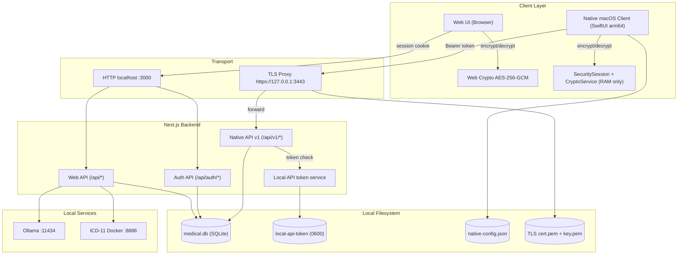
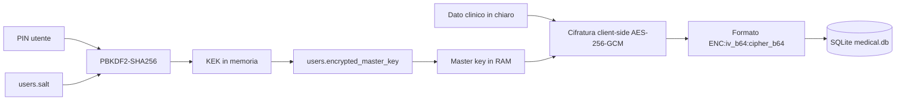
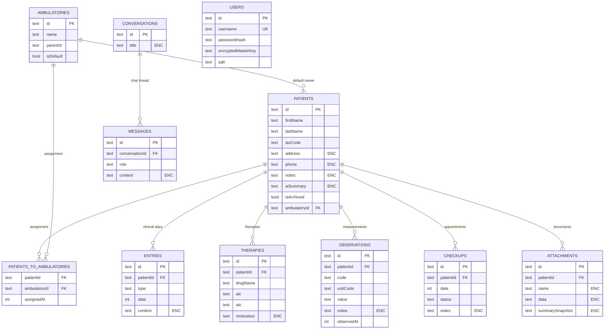
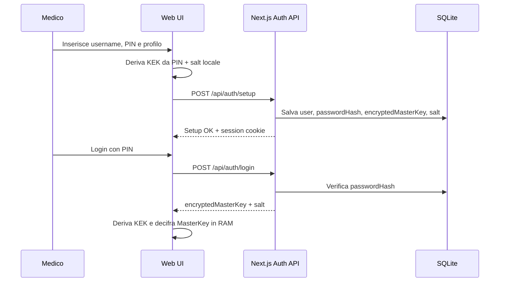
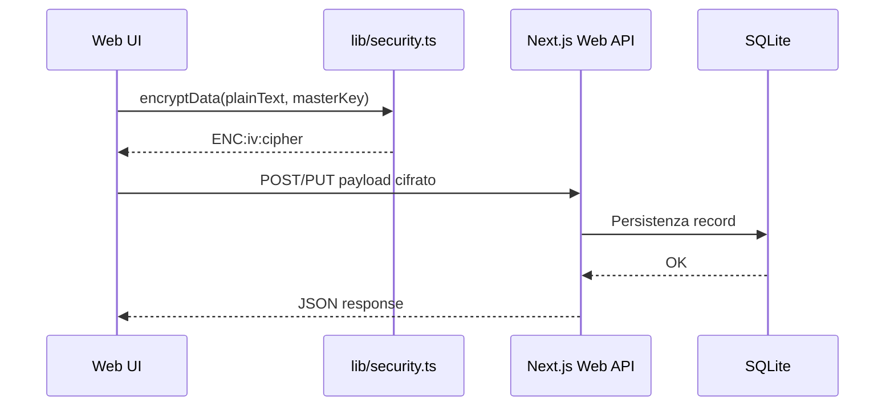
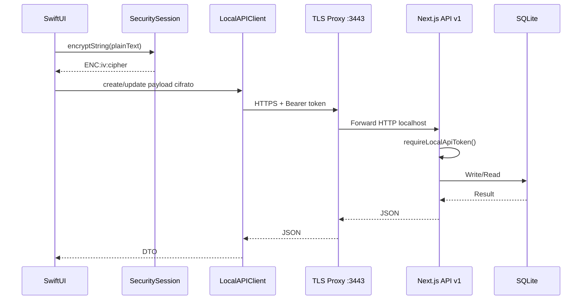
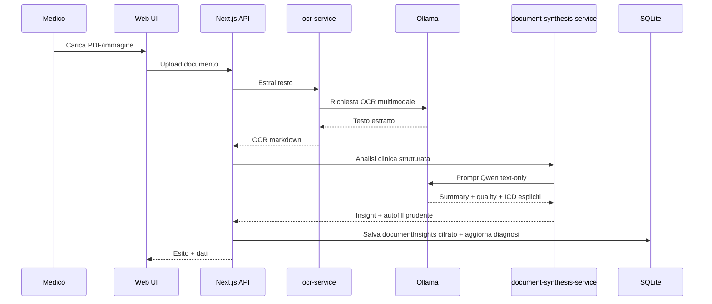
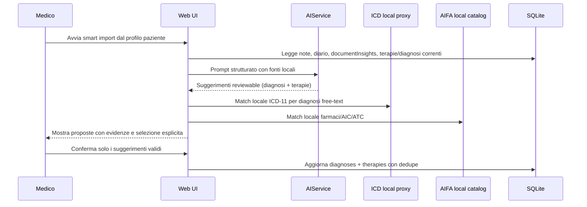

# Topologia Dati e Flussi - MediFlow

> [!IMPORTANT]
> **Stato documento: CANONICAL (topologia dati e percorsi digitali end-to-end).**
> Per principi stabili e confini, prevale [ARCHITECTURE.md](../ARCHITECTURE.md).
> Per policy di sicurezza e redazione, prevale [SECURITY.md](../SECURITY.md).

Questo documento mappa in modo operativo:

- dove nasce il dato
- dove viene cifrato/decifrato
- dove viene persistito
- quali controlli di sicurezza lo proteggono

Riferimenti rapidi:
- [docs/walkthrough.md](./walkthrough.md)
- [docs/README.md](./README.md)
- [docs/markdown-index.md](./markdown-index.md)

---

## 1. Topologia end-to-end (componenti + confini)

---

## 2. Topologia del dato a riposo

Note operative: il PIN non viene salvato, la master key resta in RAM di sessione e i campi sensibili persistono cifrati.

---

## 3. Topologia relazionale del database (schema principale)

---

## 4. Flussi operativi principali

### 4.1 Setup/login e attivazione chiavi (web)

### 4.2 Scrittura clinica via web (`/api/*`)

### 4.3 Lettura/scrittura via client nativo (`/api/v1/*`)

### 4.4 Pipeline documento -> OCR -> sintesi -> storage

### 4.5 Profilo paziente -> smart import reviewable

Nota operativa: questo flusso non sostituisce ADR 0011. L'autofill automatico
resta limitato ai soli ICD espliciti nei documenti; diagnosi free-text e terapie
richiedono sempre conferma umana in questa thin slice.

---

## 5. Superfici API e protezione

| Superficie | Consumer | Auth | Trasporto | Scopo |
| --- | --- | --- | --- | --- |
| `/api/auth/*` | Web UI e bootstrap client native | Credenziali + session cookie | HTTP localhost | Setup/login/check/logout |
| `/api/*` | Web UI | Session cookie server | HTTP localhost | CRUD web + proxy locali |
| `/api/v1/*` | Client nativo macOS | `Authorization: Bearer <token>` | HTTPS locale via TLS proxy | Contratto stabile native |
| `/api/proxy/ai/*` | Web UI (tool native via backend) | Sessione/token + allowlist localhost | HTTP localhost | AI/OCR locale |
| `/api/icd/proxy` | Web UI | Sessione + allowlist localhost | HTTP localhost | Lookup ICD-11 |

---

## 6. Mappa file autorevoli per i flussi

- Schema e topologia DB: `lib/schema.ts`
- Accesso DB server: `lib/db-server.ts`
- Facade web + cifratura client: `lib/db.ts`
- Cifratura web: `lib/security.ts`
- Auth web: `app/api/auth/*`
- API native v1: `app/api/v1/*`
- Controllo token locale: `lib/local-api-auth.ts`, `lib/local-api-token.ts`
- Proxy TLS locale: `scripts/local-api-tls-proxy.mjs`
- Pipeline OCR/sintesi: `lib/ocr-service.ts`, `lib/document-synthesis-service.ts`

---

## 7. Invarianti operativi da non rompere

- Nessun egress cloud di default per dati clinici.
- Nessun campo sensibile in chiaro su SQLite.
- `/api/v1/*` resta versionata e compatibile per client native.
- Token locale e sessione devono restare separati (web cookie vs native bearer).
- Proxy verso servizi locali sempre allowlist localhost.
