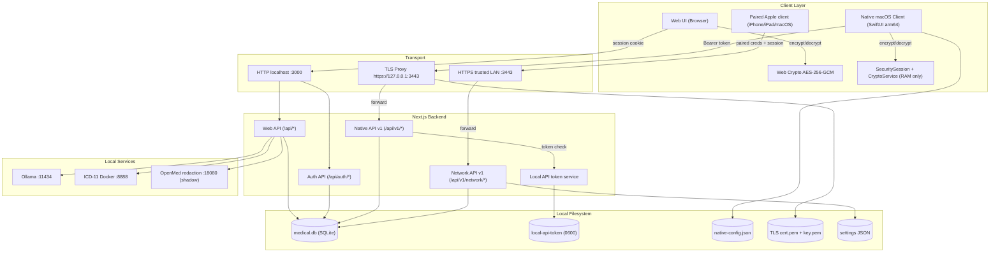
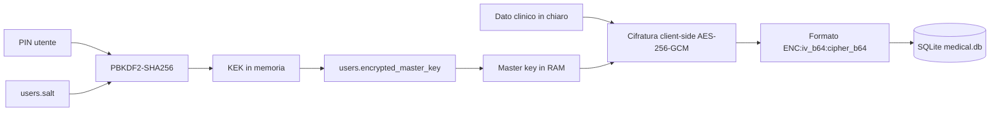
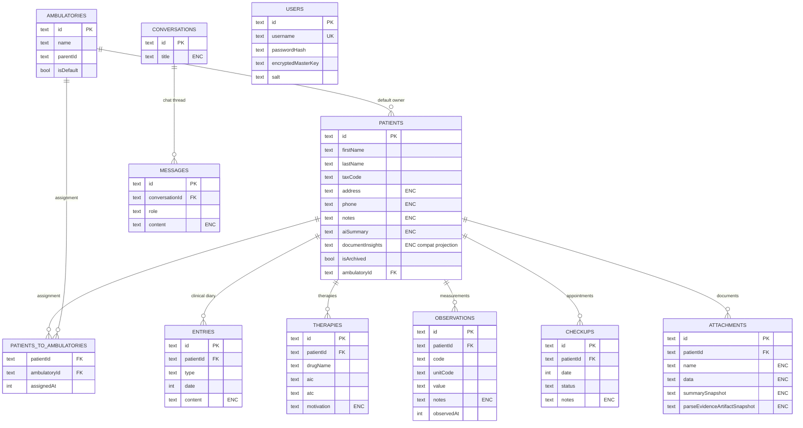
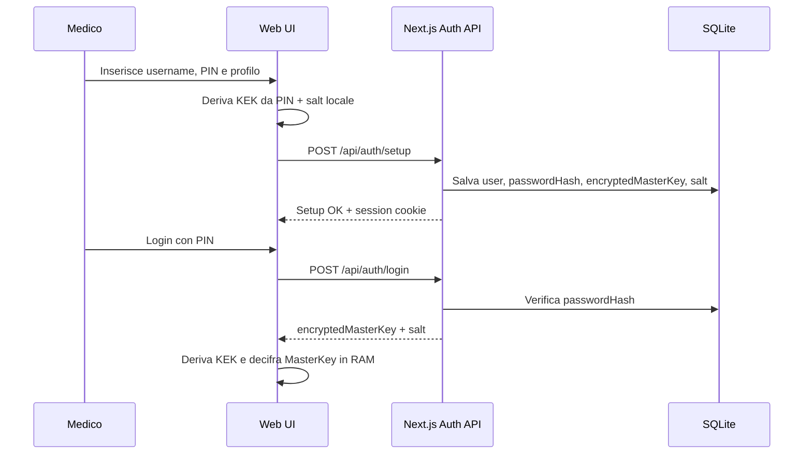
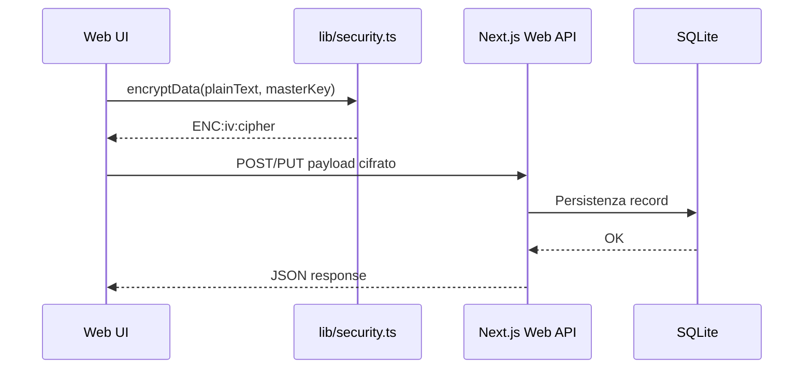
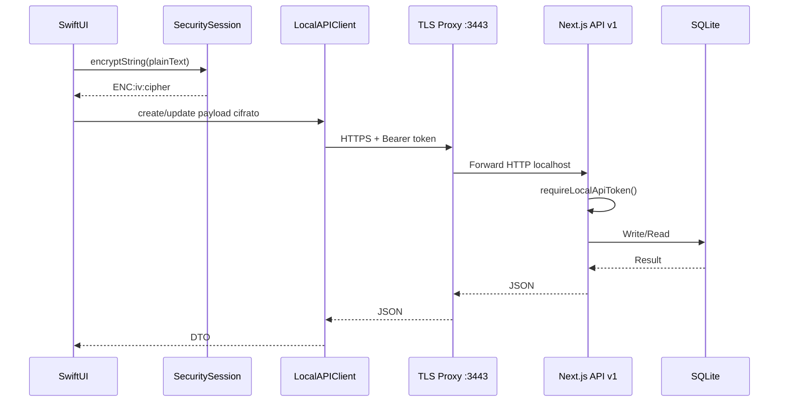
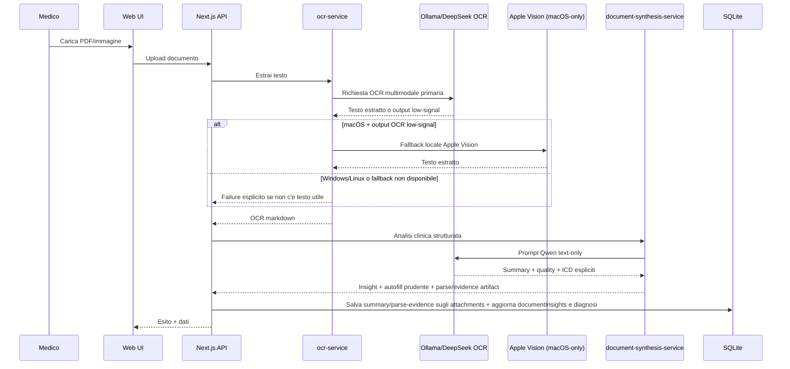
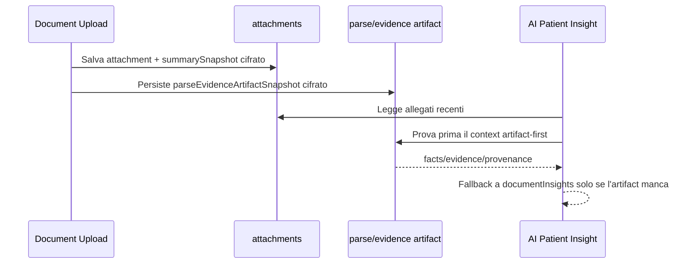
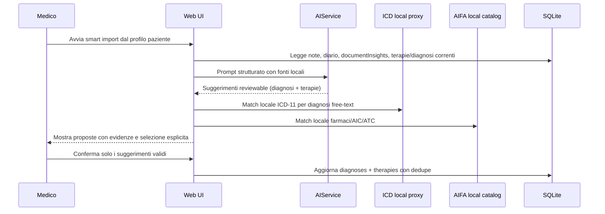
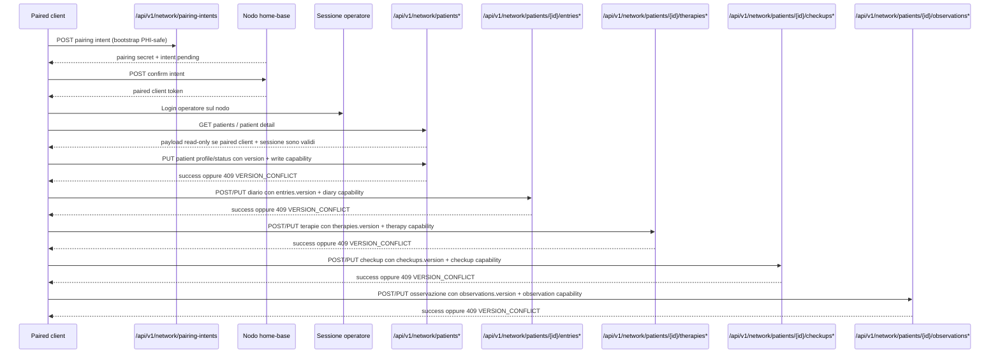

# Topologia Dati e Flussi - MediFlow

> [!IMPORTANT]
> **Stato documento: CANONICAL (topologia dati e percorsi digitali end-to-end).**
> Per principi stabili e confini, prevale [ARCHITECTURE.md](../ARCHITECTURE.md).
> Per policy di sicurezza e redazione, prevale [SECURITY.md](../SECURITY.md).

Questo documento mappa in modo operativo:

- dove nasce il dato
- dove viene cifrato/decifrato
- dove viene persistito
- quali controlli di sicurezza lo proteggono

Riferimenti rapidi:
- [docs/STATE_OF_THE_SYSTEM.md](./STATE_OF_THE_SYSTEM.md)
- [docs/walkthrough.md](./walkthrough.md)
- [docs/README.md](./README.md)
- [docs/markdown-index.md](./markdown-index.md)

---

## 🧱 1. Topologia end-to-end (componenti + confini)

Nota operativa: i client paired non accedono direttamente al database. Il nodo
autorevole resta il Mac `home-base`, che espone solo superfici documentate e
oggi ancora `read-only-first` nel disegno generale, con write online limitati e
versionati su profilo/status paziente, diario clinico, terapie, checkup e
osservazioni.

---

## 🔒 2. Topologia del dato a riposo

Note operative: il PIN non viene salvato, la master key resta in RAM di sessione e i campi sensibili persistono cifrati.

---

## 🗄️ 3. Topologia relazionale del database (schema principale)

Nota operativa: stati `network.mode`, pairing intents, paired client trusted,
backup scheduler e alcuni guardrail AI vivono in `settings` JSON versionati.

Nota soft-delete (ADR 0066, WUL-306): la cancellazione paziente scrive un
tombstone reversibile (`deletedAt` / `deletionReason`) con version guard, non
orfana i figli clinici e lascia il contratto API invariato. Le sotto-risorse
cliniche (diario, terapie, checkup, osservazioni) seguono lo stesso ciclo
soft-delete (WUL-308); le liste escludono i record soft-deleted salvo
`includeDeleted`. L'erasure GDPR esplicita resta una azione admin separata
(`purge-patient` con dry-run e audit `patient.purged`, `restore-patient` con
audit `patient.restored`).

---

## ⚙️ 4. Flussi operativi principali

### 4.1 Setup/login e attivazione chiavi (web)

### 4.2 Scrittura clinica via web (`/api/*`)

### 4.3 Lettura/scrittura via client nativo (`/api/v1/*`)

### 4.4 Pipeline documento -> OCR -> sintesi -> storage

La filiera OCR certificata corrente e platform-aware:

- `Ollama/DeepSeek OCR` resta il motore OCR primario locale.
- `Apple Vision` e un fallback locale **solo macOS**, attivato quando l'output
  primario e vuoto o degenerato.
- Windows e Linux non hanno oggi un fallback OCR platform-specific equivalente
  in MediFlow; senza testo utile dal primario o dal documento, il flusso deve
  fallire in modo esplicito.
- Il fallback OCR cambia solo la recognition: Smart Import, nuova anagrafica da
  documento e Patient Insight restano reviewable e non scrivono dati clinici
  strutturati senza conferma.
- I documenti senza testo finiscono nella `Coda OCR` (WUL-237) con stati e motivi
  in italiano e riprocesso idempotente; nessuna proposta clinica parte finche il
  testo non basta.

### 4.5 Documento archiviato -> Patient Insight artifact-first

### 4.6 Profilo paziente -> smart import reviewable

Nota operativa: questo flusso non sostituisce ADR 0011. L'autofill automatico
resta limitato ai soli ICD espliciti nei documenti; diagnosi free-text e terapie
richiedono sempre conferma umana in questa thin slice.

Nota aggiuntiva: se una fonte e solo referral/follow-up senza novita clinica e
una diagnosi o terapia e gia presente, il suggerimento viene soppresso per
ridurre rumore operativo.

### 4.7 Modalita `network-home-base` -> paired client read/write limitato

Nota operativa (WUL-307): con `network-home-base` spenta i token paired non
leggono ne scrivono e ricevono `403 NETWORK_MODE_DISABLED`, mentre i pairing gia
registrati restano. Fuori scope su questo canale: hard delete remoto, sync
completo, attachment remoti, cataloghi remoti, campi AI/documentali.

---

## 🔌 5. Superfici API e protezione

| Superficie | Consumer | Auth | Trasporto | Scopo |
| --- | --- | --- | --- | --- |
| `/api/auth/*` | Web UI e bootstrap client native | Credenziali + session cookie | HTTP localhost | Setup/login/check/logout |
| `/api/*` | Web UI | Session cookie server | HTTP localhost | CRUD web + proxy locali |
| `/api/v1/*` | Client nativo macOS | `Authorization: Bearer <token>` | HTTPS locale via TLS proxy | Contratto stabile native |
| `/api/v1/network/*` | Client paired trusted | Paired client credential + sessione operatore | HTTPS trusted LAN via TLS proxy | Home-base read-only-first + write versionati su ciclo di vita paziente, diario, terapie, checkup, osservazioni, prestazioni e protesica, piu export FHIR lato client, validazione FSE, revisione e discovery; cataloghi in sola lettura |
| `/api/proxy/ai/*` | Web UI (tool native via backend) | Sessione/token + allowlist localhost | HTTP localhost | AI/OCR locale |
| `/api/icd/proxy` | Web UI | Sessione + allowlist localhost | HTTP localhost | Lookup ICD-11 |

Nota auth: il token locale non porta privilegi admin web. Le route di sistema
ad alto impatto richiedono una sessione admin web; le eccezioni token-aware fuori
da `/api/v1/*` restano limitate a bootstrap/supporto locale e diagnostica
read-only esplicitamente documentati in [SECURITY.md](../SECURITY.md).

---

## 📚 6. Mappa file autorevoli per i flussi

- Schema e topologia DB: `lib/schema.ts`
- Accesso DB server: `lib/db-server.ts`
- Facade web + cifratura client: `lib/db.ts`
- Cifratura web: `lib/security.ts`
- Auth web: `app/api/auth/*`
- API native v1: `app/api/v1/*`
- Controllo token locale: `lib/local-api-auth.ts`, `lib/local-api-token.ts`
- Proxy TLS locale: `scripts/local-api-tls-proxy.mjs`
- Pipeline OCR/sintesi: `lib/ocr-service.ts`, `lib/document-synthesis-service.ts`

---

## ⚠️ 7. Invarianti operativi da non rompere

- Nessun egress cloud di default per dati clinici.
- Nessun campo sensibile in chiaro su SQLite.
- `/api/v1/*` resta versionata e compatibile per client native.
- `network-home-base` resta opt-in, paired e read-only-first, con write paziente, diario, terapie, checkup e osservazioni limitati/versionati.
- Token locale e sessione devono restare separati (web cookie vs native bearer).
- Token locale e sessione admin web non sono intercambiabili: un token valido
  non deve autorizzare audit, backup/restore, scheduler, repair DB o lifecycle
  MLX.
- Proxy verso servizi locali sempre allowlist localhost.
- `summarySnapshot` e `parseEvidenceArtifactSnapshot` restano dati clinici
  cifrati, non log di debug.
- Il placeholder `[LOCKED DATA]` resta solo di presentazione (WUL-323): non deve
  mai sovrascrivere il dato cifrato a riposo.
- La cancellazione clinica passa sempre per soft-delete con version guard
  (ADR 0066, WUL-306, WUL-308); la hard delete resta una erasure GDPR admin
  esplicita.
