# Topologia Dati e Flussi - MediFlow

> [!IMPORTANT]
> **Stato documento: CANONICAL (topologia dati e percorsi digitali end-to-end).**
> Per principi stabili e confini, prevale [ARCHITECTURE.md](../ARCHITECTURE.md).
> Per policy di sicurezza e redazione, prevale [SECURITY.md](../SECURITY.md).

Questo documento mappa in modo operativo:

- dove nasce il dato
- dove viene cifrato/decifrato
- dove viene persistito
- quali controlli di sicurezza lo proteggono

Riferimenti rapidi:
- [docs/STATE_OF_THE_SYSTEM.md](./STATE_OF_THE_SYSTEM.md)
- [docs/walkthrough.md](./walkthrough.md)
- [docs/README.md](./README.md)
- [docs/markdown-index.md](./markdown-index.md)

---

## 🧱 1. Topologia end-to-end (componenti + confini)

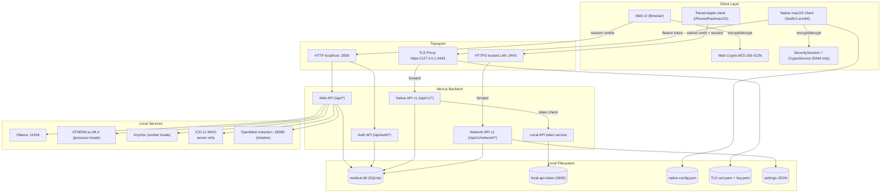

Nota operativa: i client paired non accedono direttamente al database. Il nodo
autorevole resta il Mac `home-base`, che espone solo superfici documentate e
oggi ancora `read-only-first` nel disegno generale, con write online limitati e
versionati su profilo/status paziente, diario clinico, terapie, checkup e
osservazioni.

---

## 🔒 2. Topologia del dato a riposo

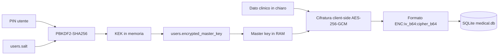

Note operative: il PIN non viene salvato, la master key resta in RAM di sessione e i campi sensibili persistono cifrati.

---

## 🗄️ 3. Topologia relazionale del database (schema principale)

Nota operativa: stati `network.mode`, pairing intents, paired client trusted,
backup scheduler e alcuni guardrail AI vivono in `settings` JSON versionati.

Nota soft-delete (ADR 0066, WUL-306): la cancellazione paziente scrive un
tombstone reversibile (`deletedAt` / `deletionReason`) con version guard, non
orfana i figli clinici e lascia il contratto API invariato. Le sotto-risorse
cliniche (diario, terapie, checkup, osservazioni) seguono lo stesso ciclo
soft-delete (WUL-308); le liste escludono i record soft-deleted salvo
`includeDeleted`. L'erasure GDPR esplicita resta una azione admin separata
(`purge-patient` con dry-run e audit `patient.purged`, `restore-patient` con
audit `patient.restored`).

---

## ⚙️ 4. Flussi operativi principali

### 4.1 Setup/login e attivazione chiavi (web)

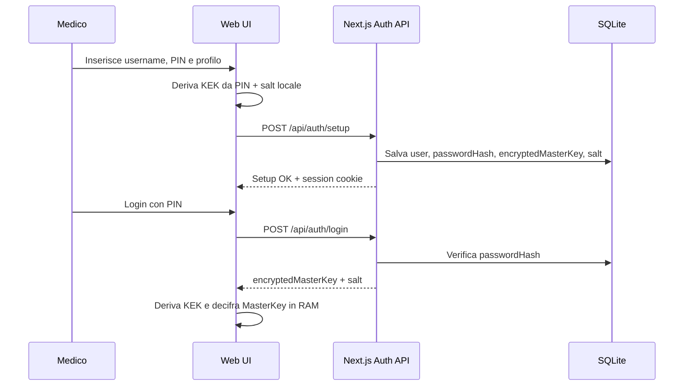

### 4.2 Scrittura clinica via web (`/api/*`)

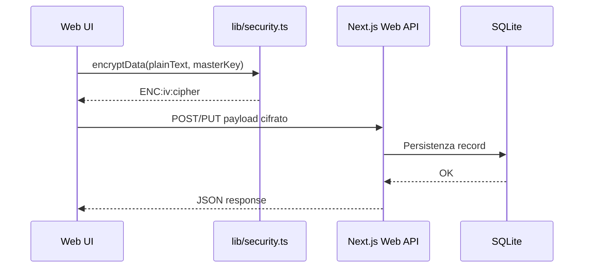

### 4.3 Lettura/scrittura via client nativo (`/api/v1/*`)

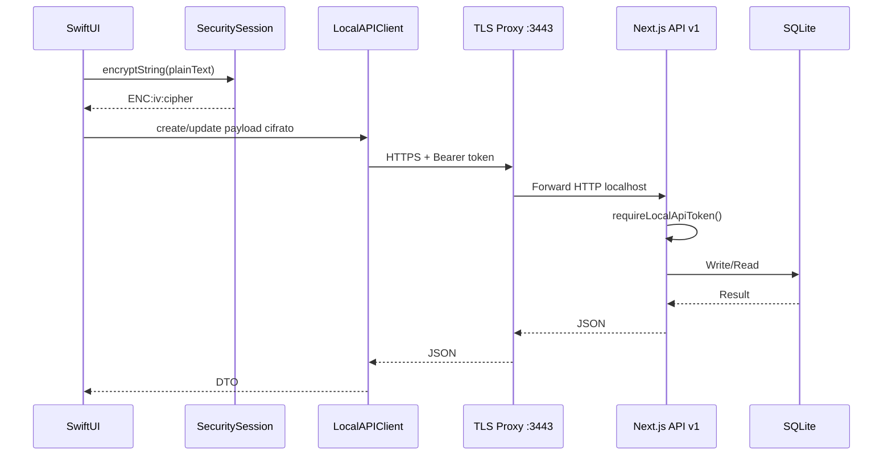

### 4.4 Allegato -> AnyDoc -> Document Synthesis review-only

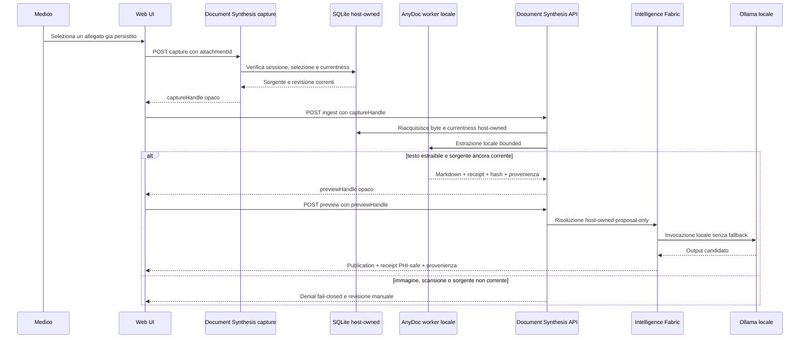

AnyDoc e l'unica estrazione automatica locale inclusa nella 0.8.5. Non esegue
OCR e non persiste il risultato nel record clinico. La publication Document
Synthesis dichiara `writesPerformed=0` e `applyPolicy=none`.

Le route legacy `/api/ocr/extract` e `/api/pdf-extract` acquisiscono prima la
sessione e poi restituiscono `410`. Il fallback selettivo DeepSeek-OCR 2 e un
requisito deciso ma `RELEASE_SCOPE_EXCLUDED`: non ha adapter, E2E o benchmark
di promozione. Un packet futuro dovra inviare soltanto pagine `needsOcr`,
ricomporre provenienza, hash e qualita per pagina e superare un benchmark
sintetico italiano con soglie fissate. Resta vietato cloud egress o write.

### 4.5 Patient Insight -> preview Fabric

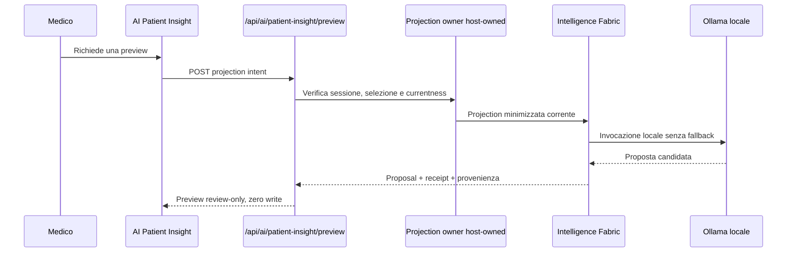

Artifact e snapshot documentali cifrati possono contribuire alla projection,
ma il provider non legge SQLite. La preview non aggiorna `aiSummary` o altre
colonne e viene negata se la sorgente non e piu corrente.

### 4.6 Smart Import -> preview Fabric

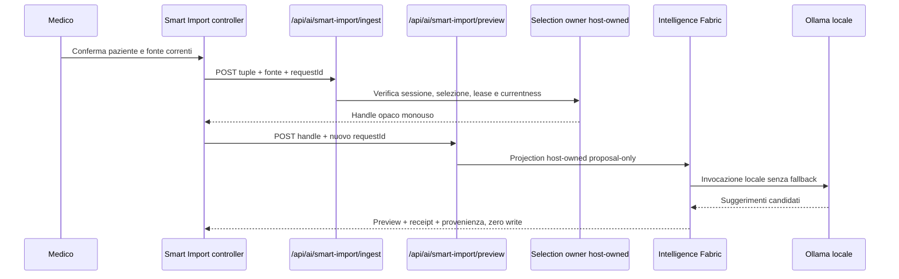

La preview Smart Import non scrive diagnosi o terapie. Un eventuale apply e un
Application Service separato, con conferma, authority, currentness, idempotenza
e audit propri. Non eredita authority dalla receipt o dalla proposta. ADR 0084
continua a vietare la scrittura diagnostica dalla sintesi documentale.

### 4.7 Treatment Reasoning -> preview Fabric ATHENA

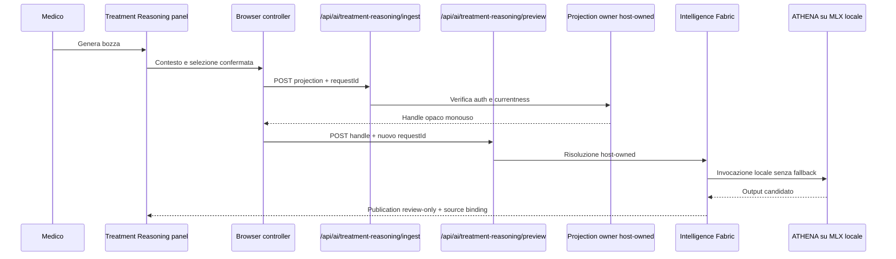

La route storica `/api/system/treatment-reasoning/athena-mlx` e auth-first e
termina con `410 legacy_route_retired`. Il percorso corrente non usa un
fallback Ollama e non applica terapie o diagnosi.

### 4.8 Matrice dei confini generativi

| Capability | Provider/venue | Stadio massimo | Currentness owner | Apply e write |
| --- | --- | --- | --- | --- |
| `patient_insight` | Ollama / loopback | preview | host | nessuno; `writesPerformed=0` |
| `smart_import` | Ollama / loopback | proposal | host | nessuno; `writesPerformed=0` |
| `document_synthesis` | Ollama / loopback | proposal | host | nessuno; `writesPerformed=0` |
| `treatment_reasoning` | ATHENA / processo MLX locale | preview | host | nessuno; `writesPerformed=0` |

Tutte le receipt sono PHI-safe e descrittive. Non sono grant. Il client paired
espone solo stato e non invoca queste capability. OpenAI e Anthropic restano
registry/disclosure informativa: runtime, credenziali ed egress sono
`RELEASE_SCOPE_EXCLUDED` dalla 0.8.5.

### 4.9 File AIFA locale -> catalogo indicizzato con provenienza

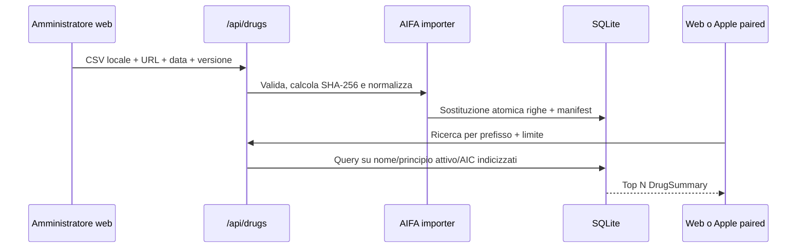

Il file sorgente resta locale e non viene aggiunto a Git. Il manifest salva la
provenienza e l'hash dell'artifact importato. Il canale paired espone solo la
lettura del catalogo tramite `network.catalogs.readonly`; non accetta dataset
remoti e non trasferisce il catalogo completo.

### 4.10 Modalita `network-home-base` -> paired client read/write limitato

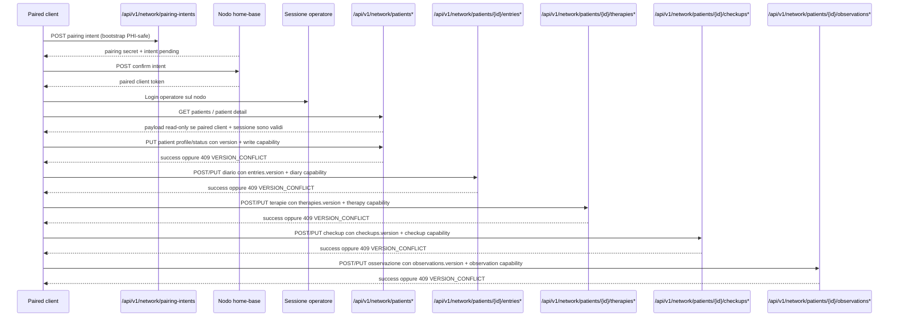

Nota operativa (WUL-307): con `network-home-base` spenta i token paired non
leggono ne scrivono e ricevono `403 NETWORK_MODE_DISABLED`, mentre i pairing gia
registrati restano. Fuori scope su questo canale: hard delete remoto, sync
completo, attachment remoti, cataloghi remoti, campi AI/documentali.

---

## 🔌 5. Superfici API e protezione

| Superficie | Consumer | Auth | Trasporto | Scopo |
| --- | --- | --- | --- | --- |
| `/api/auth/*` | Web UI e bootstrap client native | Credenziali + session cookie | HTTP localhost | Setup/login/check/logout |
| `/api/*` | Web UI | Session cookie server | HTTP localhost | CRUD web + proxy locali |
| `/api/v1/*` | Client nativo macOS | `Authorization: Bearer <token>` | HTTPS locale via TLS proxy | Contratto stabile native |
| `/api/v1/network/*` | Client paired trusted | Paired client credential + sessione operatore | HTTPS trusted LAN via TLS proxy | Home-base read-only-first + write versionati su ciclo di vita paziente, diario, terapie, checkup, osservazioni, prestazioni e protesica, piu export FHIR lato client, validazione FSE, revisione e discovery; cataloghi in sola lettura |
| `/api/proxy/ollama/*` | Web UI (solo runtime browser; lato server il provider parla direttamente al loopback) | Sessione web (`requireSession`) | HTTP localhost | Proxy verso il runtime Ollama locale (`chat` e `generate`) su loopback stretto, con attestazione del modello |
| `/api/attachments/{id}/local-extraction` | Web UI | Sessione web | HTTP localhost | Estrazione AnyDoc dell'allegato host-owned corrente; preview locale con hash e provenienza, senza write |
| `/api/ai/patient-insight/preview` | Web UI | Sessione web acquisita prima del payload | HTTP localhost | Preview Patient Insight host-owned con receipt e provenienza PHI-safe |
| `/api/ai/smart-import/{selection,ingest,preview}` | Web UI | Sessione web e selezione corrente | HTTP localhost | Selezione, ingest e preview Smart Import con handle opaco; nessun apply |
| `/api/ai/document-synthesis/{capture,ingest,preview}` | Web UI | Sessione web e allegato corrente | HTTP localhost | Capture AnyDoc, ingest e publication Document Synthesis proposal-only |
| `/api/ai/treatment-reasoning/{ingest,preview}` | Web UI | Sessione web e selezione corrente | HTTP localhost | Ingest e preview Treatment Reasoning tramite Fabric e ATHENA locale |
| `/api/ocr/extract`, `/api/pdf-extract` | Consumer legacy | Auth prima del body | HTTP localhost | Boundary terminale `410`; nessuna estrazione o invocazione OCR |
| `/api/icd/proxy` | Web UI | Sessione + allowlist localhost | HTTP localhost | Lookup ICD-11 |

Nota auth: il token locale non porta privilegi admin web. Le route di sistema
ad alto impatto richiedono una sessione admin web; le eccezioni token-aware fuori
da `/api/v1/*` restano limitate a bootstrap/supporto locale e diagnostica
read-only esplicitamente documentati in [SECURITY.md](../SECURITY.md).

---

## 📚 6. Mappa file autorevoli per i flussi

- Schema e topologia DB: `lib/schema.ts`
- Accesso DB server: `lib/db-server.ts`
- Facade web + cifratura client: `lib/db.ts`
- Cifratura web: `lib/security.ts`
- Auth web: `app/api/auth/*`
- API native v1: `app/api/v1/*`
- Controllo token locale: `lib/local-api-auth.ts`, `lib/local-api-token.ts`
- Proxy TLS locale: `scripts/local-api-tls-proxy.mjs`
- AnyDoc e source authority: `lib/domain/documents/anydoc-current-source-composition.ts`, `lib/domain/documents/anydoc-local-extraction-runner.ts`
- Catalogo e production root Fabric: `lib/ai-providers/fabric/generative-catalog.ts`, `lib/ai-providers/fabric/*production*`
- Crosswalk dei quattro percorsi: `docs/capability-mapping/fabric-generative-runtime-crosswalk.v1.json`
- Disclosure provider: `lib/ai-providers/fabric/provider-disclosure.ts`

---

## ⚠️ 7. Invarianti operativi da non rompere

- Nessun egress cloud di default per dati clinici.
- Nessun campo sensibile in chiaro su SQLite.
- `/api/v1/*` resta versionata e compatibile per client native.
- `network-home-base` resta opt-in, paired e read-only-first, con write paziente, diario, terapie, checkup e osservazioni limitati/versionati.
- Token locale e sessione devono restare separati (web cookie vs native bearer).
- Token locale e sessione admin web non sono intercambiabili: un token valido
  non deve autorizzare audit, backup/restore, scheduler, repair DB o lifecycle
  MLX.
- Proxy verso servizi locali sempre allowlist localhost.
- I quattro percorsi Fabric restano preview/proposal-only, host-owned e
  `writesPerformed=0`; receipt e provenienza non concedono authority.
- AnyDoc legge soltanto l'allegato corrente. Immagini e scansioni falliscono
  chiuse verso review manuale; le route OCR legacy restano terminali `410`.
- DeepSeek-OCR 2 selettivo e runtime OpenAI/Anthropic sono
  `RELEASE_SCOPE_EXCLUDED` dalla 0.8.5. Non devono apparire come fallback,
  credenziale o egress abilitati.
- `summarySnapshot` e `parseEvidenceArtifactSnapshot` restano dati clinici
  cifrati, non log di debug.
- Il placeholder `[LOCKED DATA]` resta solo di presentazione (WUL-323): non deve
  mai sovrascrivere il dato cifrato a riposo.
- La cancellazione clinica passa sempre per soft-delete con version guard
  (ADR 0066, WUL-306, WUL-308); la hard delete resta una erasure GDPR admin
  esplicita.

Claim ceiling dei percorsi Fabric e AnyDoc: candidato sorgente locale 0.8.5.
Questa topologia non prova release, pubblicazione, certificazione, deployment
cloud, AI paired, MCP operativo o authority agentica generale.
