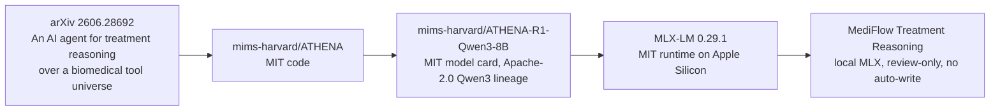

# ATHENA-style Treatment Reasoning Integration

Status: checkpoint 99% implementation, review-only and locally testable with ATHENA-R1 MLX
Owner surface: MediFlow AI/document intelligence and therapy review lanes
Primary ADR: [ADR 0073](./adr/0073-treatment-reasoning-athena-boundary.md)

## Decision Frame

Outcome: create a MediFlow-native `treatment_reasoning` lane that can later be
called from a patient profile or chat surface.

Scope: contracts, docs, synthetic benchmark, ATHENA-R1 local MLX runtime,
review-only patient panel and redacted live DB smoke. No ToolUniverse/vLLM
promotion, no schema migration and no automatic therapy write in this slice.

Constraints:

- local-first and no cloud default;
- no PHI/PII in repo, prompts, logs or benchmark fixtures;
- AI output is non-authoritative until clinician review;
- Smart Import remains the structured extraction/apply lane;
- therapy writes continue through existing reviewed forms and version guards;
- ToolUniverse/vLLM ATHENA sidecar remains benchmark/shadow-only until promoted
  by a separate gate;
- live DB tests are read-only, redacted and never store raw prompts/output.
- the ATHENA MLX route enforces the local kill switch server-side, stays
  session-cookie only and rejects prompts missing
  `mediflow.treatment_reasoning.v1`;
- clinical runtime uses pinned/offline MLX-LM dependency resolution; online
  package/model setup is a separate operator step, not part of generation.

## Evidence Checked

External facts:

- ATHENA-R1 presents treatment reasoning as multi-step evidence gathering over
  212 biomedical tools and needs vLLM plus ToolUniverse services.
- The released model is `mims-harvard/ATHENA-R1-Qwen3-8B`, derived from
  Qwen3-8B, with open Hugging Face weights, MIT-licensed ATHENA code and
  Apache-2.0 Qwen3 lineage.
- ATHENA's detailed report shape is useful for MediFlow: recommendation, key
  evidence, reasoning, caveats and trace.
- The ATHENA repository states intended use as research/decision support, not a
  medical device or direct patient care.
- The external paper/repo/model identifiers were rechecked on 2026-07-07 before
  the checkpoint 99 documentation update.

External sources:

- GitHub repository: <https://github.com/mims-harvard/ATHENA>
- arXiv paper: <https://arxiv.org/abs/2606.28692>
- Hugging Face model card:
  <https://huggingface.co/mims-harvard/ATHENA-R1-Qwen3-8B>
- Qwen3-8B license file:
  <https://huggingface.co/Qwen/Qwen3-8B/blob/main/LICENSE>
- MLX-LM project: <https://github.com/ml-explore/mlx-lm>
- project site: <https://athena.openscientist.ai/>

MediFlow facts:

- MediFlow's general AI runtime is local Ollama via `AIService`.
- The live configuration checked on 2026-07-07 used `qwen3.5:35b-a3b` for both
  `clinical` and generic `reasoning`, and `deepseek-ocr` for OCR.
- Treatment Reasoning now bypasses the generic Ollama reasoning lane in the
  browser service and calls local ATHENA-R1-Qwen3-8B through MLX.
- The first 50% slice was deterministic contract work: parser, prompt builder,
  corpus and validator. It did not call ATHENA, Ollama or any model.
- `AI Patient Insight` summarizes source-grounded patient context.
- Smart Import extracts diagnosis and therapy candidates and only applies after
  explicit review.
- `therapies` already has versioned, audited manual/network write boundaries.
- `network-therapy-write` rejects AI/document-derived fields.
- ADR 0033 requires lane-specific benchmark, fallback, kill-switch and stop
  rules before an AI lane leaves benchmark-only/shadow status.
- ADR 0065 forbids claims of diagnosis, triage, prescribing or clinical
  automation.

Inference:

ATHENA should influence the report/trace and benchmark architecture, not become
the first runtime dependency inside the patient data plane.

## Quadrant Map

### Known Knowns

- Treatment reasoning is distinct from extraction.
- The first integration must be contract-first and review-first.
- Existing therapy write paths must remain authoritative.
- A useful treatment-reasoning answer needs source ids, caveats and explicit
  uncertainty.
- ATHENA-style traceability maps cleanly to MediFlow's document/evidence
  direction.

### Known Unknowns

- Whether ATHENA-R1-Qwen3-8B is practical on the user's Mac with local vLLM.
- Whether ToolUniverse's 212-tool environment is acceptable as a local clinical
  dependency.
- How much Italian/AIFA/EMA/local-guideline grounding is needed before a
  patient-profile panel is useful.
- Whether the first UI belongs beside `TherapyManager`, `PatientSmartImportPanel`
  or inside a future chat/command interface.
- Which metrics should gate promotion beyond shadow mode.

### Unknown Knowns

These are tacit product preferences already implied by the repo:

- Clinicians need compact, source-bound output more than a long chat transcript.
- Suggested actions must feel like "open this form with context", not "the AI
  changed the chart".
- The UX should foreground safety flags and missing information before a neat
  answer.
- A future chat plug should reuse the same contract rather than inventing a chat
  memory store over raw patient data.

### Unknown Unknowns

Likely landmines to test before runtime promotion:

- fabricated or stale citations from model traces;
- contraindication advice that depends on missing labs/allergies not present in
  MediFlow;
- cross-jurisdiction mismatch between FDA-oriented ATHENA evidence and Italian
  prescribing/AIFA practice;
- model confidence language drifting into prescribing language;
- latency and resource pressure from vLLM + ToolUniverse on the home-base Mac;
- accidental persistence of PHI-bearing traces or raw prompts.

## Runtime Source Map

| Layer | Source | Current status |
| --- | --- | --- |
| Contract/parser | MediFlow TypeScript | Deterministic normalization, schema validation and evidence-ref validation. |
| Patient context | MediFlow TypeScript | Local source builder from profile, diagnoses, therapies, observations, diary, document insights and attachment summaries. |
| Active treatment runtime | `mims-harvard/ATHENA-R1-Qwen3-8B` via MLX-LM | Local model artifact outside Git, invoked through `/api/system/treatment-reasoning/athena-mlx`; supports canonical BF16 shards and a local MLX Q4 converted artifact. |
| Generic AI runtime | MediFlow `AIService.create('reasoning')` | Local Ollama remains available for other reasoning lanes. Live DB setting on 2026-07-07: `qwen3.5:35b-a3b`. |
| ToolUniverse runtime | ATHENA vLLM + ToolUniverse | Not integrated. Future benchmark/shadow sidecar only. |
| Live DB tests | `scripts/treatment-reasoning-live-db-smoke.ts` | Read-only SQLite, in-memory decrypt, redacted aggregate output, optional ATHENA MLX or Ollama model run, explicit `--max-tokens`. |

So the current MediFlow checkpoint is not proprietary and not pure
old-school heuristics:

- the source-bounding, parser, validator and UI gates are deterministic
  TypeScript;
- generation is model-powered by ATHENA-R1-Qwen3-8B when the local MLX artifact
  is present and Treatment Reasoning is enabled;
- ATHENA itself is open research code/weights; ToolUniverse/vLLM is still not
  part of the MediFlow patient data plane.

## Credits And Source Attribution



Attribution retained in this repo:

- Paper: Gao et al., "An AI agent for treatment reasoning over a biomedical
  tool universe", arXiv:2606.28692, submitted 2026-06-27.
- Code: `mims-harvard/ATHENA`, MIT license, ATHENA-R1 agent and ToolUniverse
  coordination reference.
- Model: `mims-harvard/ATHENA-R1-Qwen3-8B`, Hugging Face model card license
  MIT; model tree lists Qwen/Qwen3-8B-Base and Qwen/Qwen3-8B lineage.
- Base lineage: Qwen/Qwen3-8B license file is Apache-2.0.
- Inference runtime: `ml-explore/mlx-lm`, MIT license, used locally through
  pinned `mlx-lm==0.29.1` for Apple Silicon inference.
- Tooling acknowledged: ATHENA-R1 evidence retrieval is powered upstream by
  ToolUniverse. MediFlow does not run ToolUniverse in the patient data plane at
  checkpoint 99.

MediFlow adaptation:

- uses only the local ATHENA-R1-Qwen3-8B model artifact through MLX-LM;
- converts an optional Q4 MLX artifact locally for latency/memory on Apple
  Silicon;
- wraps output in `mediflow.treatment_reasoning.v1`, source-ref validation,
  fail-closed kill switch and review-only UI;
- does not claim ATHENA or MediFlow Treatment Reasoning is a medical device or a
  direct patient-care decision maker.

Public surface decision:

The root README and whitepaper stay unchanged in checkpoint 99. Treatment
Reasoning is still a secondary review-only lane, so full third-party attribution
is kept in this integration map, ADR 0073 and code provenance comments rather
than promoted into top-level product marketing.

## Runtime Optimization Checkpoint 99

Promoted runtime posture:

- the runtime resolves a single model directory (default
  `~/Library/Application Support/MediFlow/models/athena-r1-qwen3-8b`,
  overridable with `MEDIFLOW_ATHENA_MODEL_DIR`) and auto-detects the artifact
  inside it: the canonical Hugging Face BF16 shard set is checked first, then
  the converted single-file MLX layout, reading quantization bits from
  `config.json`;
- operational preference on this Mac: point `MEDIFLOW_ATHENA_MODEL_DIR` at the
  converted Q4 artifact (`athena-r1-qwen3-8b-mlx-q4`); the BF16 export stays
  available as the directory to switch back to for parity checks;
- runtime package: `mlx-lm==0.29.1` plus `transformers==4.56.2`;
- decoding for clinical JSON uses temperature 0, top-p 1 and stable seed 7
  unless `MEDIFLOW_ATHENA_SEED` is set;
- when the client omits an explicit budget (the shipped panel does), output
  tokens default to `MEDIFLOW_ATHENA_MAX_TOKENS` or 1600; explicit client
  budgets and the default are both hard-clamped to 4096.

Benchmarks run on 2026-07-07:

| Check | Artifact | Result |
| --- | --- | --- |
| Synthetic MLX runner, 2 cases, 128 max tokens | Q4 converted | Avg wall 2.49s, avg generation 75.7 tok/s, max peak memory 5.36 GB. |
| Live DB redacted smoke, 3 cases, 1600 max tokens, deterministic decoding | Q4 converted | Contract 3/3, evidence refs 3/3, per-case latency 25.5s / 31.0s / 27.8s. |
| Live DB redacted smoke, 1 case, 1600 max tokens | BF16 sharded | Contract 1/1, evidence refs 1/1, latency 63.4s. |
| Live DB redacted smoke after pin/offline hardening, 1 case | Q4 converted | Contract 1/1, evidence refs 1/1, latency 27.8s. |

Non-promoted runtime experiments:

- Warm `mlx_lm.server`: tested on loopback with ATHENA path, but this local
  MLX-LM 0.29.1 setup returned stale model IDs and a generation-thread GPU
  stream error after timeout. Not promoted until a clean server smoke succeeds.
- KV cache quantization: `kv_bits=4` produced minimal synthetic wall-time gain
  on the long prompt and visible output drift in one probe. Not promoted as a
  clinical runtime default.
- Prompt cache: useful only for a stable precomputed prefix and requires a more
  invasive cache lifecycle. Not promoted for checkpoint 99.

Current bottleneck:

The route still invokes `mlx_lm.generate` as a one-shot process. Q4 reduces
weight load and memory enough to make the lane usable on this Mac, but a future
warm server could still improve repeated calls once loopback logging, lifecycle,
auth boundary and MLX-LM server stability are solved.

## Architecture Map

```text
Patient profile / future chat
        |
        v
treatment reasoning context builder
        |
        +--> structured chart: diagnoses, active therapies, observations
        +--> evidence queue: diary/document/attachment source refs
        +--> clinician question
        |
        v
mediflow.treatment_reasoning.v1 prompt
        |
        +--> local ATHENA-R1 MLX adapter
        +--> local Ollama reasoning fallback/probe
        +--> ATHENA sidecar adapter (benchmark/shadow only, future)
        |
        v
contract parser + citation validator
        |
        v
review panel
        |
        +--> no_write / review_only
        +--> optional open existing form with prefilled draft fields
```

## Contract Summary

`mediflow.treatment_reasoning.v1` returns:

- `recommendation`: concise clinical support statement, not an order;
- `keyEvidence[]`: cited facts, each tied to allowed source refs;
- `reasoning[]`: short transparent reasoning steps;
- `caveats[]`: missing data, uncertainty and applicability limits;
- `safetyFlags[]`: interaction, contraindication, monitoring or follow-up flags;
- `suggestedActions[]`: only `no_write`, `review_only` or
  `form_prefill_only`;
- `trace`: model/runtime/tool metadata safe enough to show/store in redacted
  benchmark artifacts.

The parser drops fabricated source refs when an allowed source set is supplied.
Automatic write policies are downgraded to `review_only` and marked blocked.

## File-Level Implementation Plan

Done in this slice:

- `lib/treatment-reasoning-contract.ts`: schema, types, parser, prompt builder.
- `lib/treatment-reasoning-contract.test.ts`: focused contract tests.
- `scripts/fixtures/treatment-reasoning-corpus.json`: synthetic benchmark corpus.
- `scripts/benchmark-treatment-reasoning.ts`: validator/benchmark skeleton.
- `docs/adr/0073-treatment-reasoning-athena-boundary.md`: decision boundary.
- `lib/treatment-reasoning-context.ts`: build source-bounded patient context.
- `lib/treatment-reasoning-service.ts`: fail-closed service wrapper, no writes.
- `lib/ai-treatment-reasoning-kill-switch.ts`: lane kill-switch.
- `components/treatment-reasoning-panel.tsx`: profile panel, no auto-apply.
- insertion in `app/patients/[id]/modules/page.tsx` inside `TherapyManager`
  section.
- `scripts/treatment-reasoning-live-db-smoke.ts`: live DB redacted smoke with
  optional ATHENA MLX or Ollama model run.
- `lib/athena-mlx-runtime.ts`: local MLX-LM invocation of
  `mims-harvard/ATHENA-R1-Qwen3-8B`.
- `app/api/system/treatment-reasoning/athena-mlx/route.ts`: authenticated local
  endpoint for the browser panel.
- `lib/athena-mlx-runtime.test.ts`: artifact detection and token-budget tests.
- `scripts/treatment-reasoning-route-boundary.test.mjs`: route boundary guard
  for session-only auth, server-side kill switch, schema scoping and stderr
  redaction.

Later sidecar slice:

- `scripts/athena-treatment-reasoning-adapter.ts`: local ATHENA run importer.
- `docs/treatment-reasoning-athena-shadow.md` (private): setup for vLLM + ToolUniverse.
- shadow reports stored outside Git unless fully synthetic and redacted.

## Benchmark And Shadow Lane

Current validator:

```bash
npm run test:treatment-reasoning
npm run validate:treatment-reasoning
npm run smoke:treatment-reasoning:live -- --run-model --runtime athena_mlx --cases 3 --max-tokens 1600
```

Promotion metrics for a future model-backed benchmark:

- contract valid rate;
- evidence ref valid rate;
- blocked auto-write count;
- caveat coverage for missing labs/allergies;
- safety flag recall on synthetic contraindication/interactions;
- latency and timeout rate;
- PHI/logging audit pass.

Minimum promotion posture:

1. `benchmark-only`: contract and corpus exist. Completed.
2. `local-review-ready`: ATHENA local model service, panel, server-side
   kill-switch, redacted live DB smoke and Q4/BF16 latency comparison exist.
   Completed for checkpoint 99%.
3. `shadow-ready`: local model or ATHENA adapter passes synthetic validator,
   kill-switch exists and PHI logging is audited across traces.
4. `shadow-active`: clinician can compare output without chart writes.
5. `active-with-fallback`: only after separate ADR, owner, fallback and
   rollback criteria.

## Swarm Packet Map

- Antigravity/Gemini worker: broad implementation alternatives and UI insertion
  risk scan.
- Opus/Fable reviewer: clinical-safety and taste review of ADR/panel copy.
- RepoPrompt/Oracle: context-efficient code map and cross-file consistency
  check.

files, tests and docs before promotion.

## Next Decision

Recommended next response after this checkpoint: run an independent safety/taste
review on the panel and live-smoke evidence, then decide whether ATHENA sidecar
setup is worth a separate benchmark branch.
