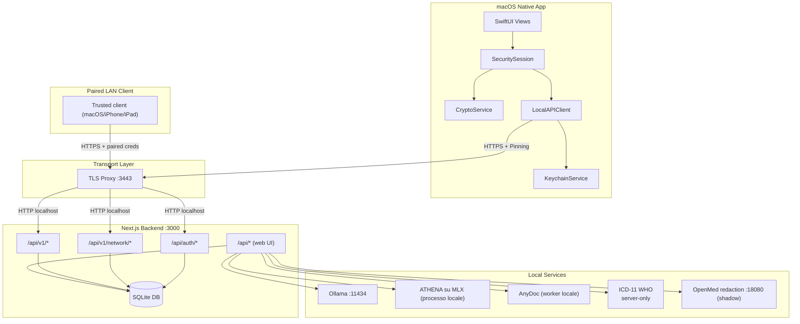
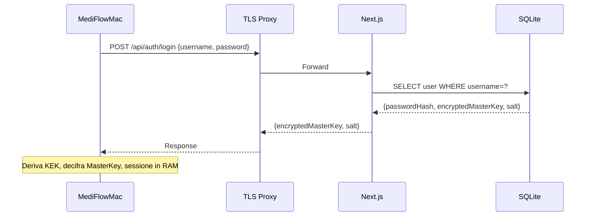
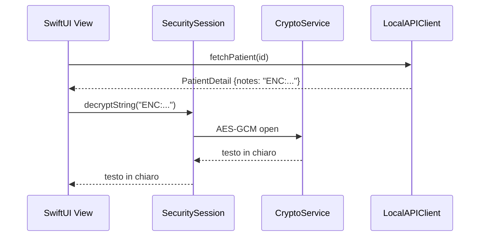
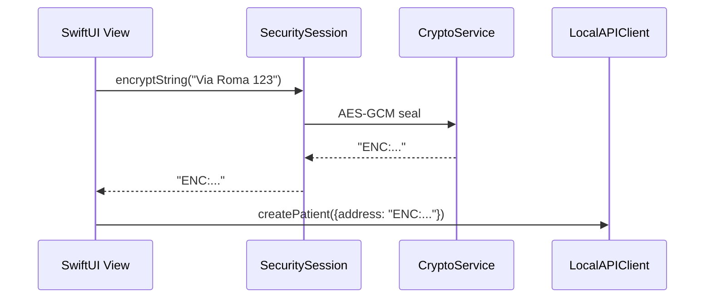

# Walkthrough MediFlow (Web + Native)

> [!IMPORTANT]
> **Stato documento: CANONICAL (walkthrough operativo end-to-end).**
> Per i dettagli dei flussi questa pagina prevale sulle sintesi tecniche
> secondarie; i contratti specifici e i loro emendamenti conservano il proprio
> ruolo. Lo [stato del sistema](./STATE_OF_THE_SYSTEM.md) distingue pubblicazione,
> contenuto dei sorgenti e prove storiche.

Il percorso comincia dalla cartella, non da un modello AI. La web app locale
permette di raccogliere dati e documenti; SQLite ne conserva lo stato e il
client cifra i campi sensibili prima di inviarli al server. Le funzioni
intelligenti si aggiungono soltanto quando siano scelte e ammesse. Seguire
questi passaggi rende più chiaro dove un componente possa leggere, trasformare
o proporre qualcosa, e dove debba invece fermarsi.

La **0.8.6 è pubblicata come sorgente dal 20 settembre 2026**, per runtime
locale/headless sul Mac e browser localhost. Le sezioni native descrivono
codice, contratti e percorsi di sviluppo separati, non un installer firmato o
notarizzato della release. La pubblicazione non attesta idoneità clinica:
l’ammissione del deployment resta aperta in WUL-688. Le prove della 0.8.5 e
quelle successive mantengono data e revisione proprie; non vengono estese
implicitamente al commit pubblicato.

Dopo `v0.7.0` il client macOS da estendere è il bundle Apple/home-base, non
la vecchia shell clinica, conservata come riferimento storico di parità.
Le slice `v0.7.0` introdussero `network home-base`, i client iPhone/iPad
paired non-AI, il bundle Mac packaged e il primo artefatto `parse/evidence`,
consumato anzitutto da `AI Patient Insight`. La lettura pazienti e le scritture
versionate circoscritte su `/api/v1/network/*` non aprono un accesso generale
al database.

Il percorso documentale locale della `0.8.5` rimane
`attachment host-owned -> AnyDoc -> provenienza -> proposta/review`, con la
precedenza precisata per la 0.8.6 da ADR 0119. Le vecchie route OCR verificano
prima l’autenticazione e rispondono `410`. I quattro percorsi generativi
attraversano la Fabric senza applicare o scrivere dati clinici.

---

## 🎯 Scopo e obiettivi

Questa guida collega architettura, responsabilità dei file e flussi reali,
così da poter seguire un’operazione dalla UI al dato persistito. Serve per
l’ingresso tecnico nel progetto, la manutenzione e la verifica dei passaggi
principali: contratto web/native (`/api/v1`), servizi locali, cifratura,
sessioni e trasporto. Non sostituisce il contratto del singolo modulo o una ricevuta di
test sulla revisione da consegnare.

Per gli approfondimenti:
- [docs/STATE_OF_THE_SYSTEM.md](./STATE_OF_THE_SYSTEM.md)
- [docs/topologia-dati-flussi.md](./topologia-dati-flussi.md)
- [docs/system_architecture.md](./system_architecture.md)
- [docs/native-setup.md](./native-setup.md)
- [docs/native-launch.md](./native-launch.md)
- [docs/README.md](./README.md) e [docs/markdown-index.md](./markdown-index.md)

---

## 🧱 Topologia del sistema

Lo schema mostra chi comunica con chi, non quali servizi siano accesi su ogni
installazione. SQLite resta dietro le API dell’host; AnyDoc lavora come
processo locale e OpenMed rimane sperimentale. L’assenza di un provider AI
non impedisce il normale lavoro nella cartella.




---

## ⚙️ Porte e servizi locali

| Servizio | Porta | Scopo |
| --- | --- | --- |
| Next.js | `3000` | UI web + API locali |
| TLS Proxy | `3443` | HTTPS locale per il client macOS |
| Ollama | `11434` | Provider locale per Patient Insight, Smart Import e Document Synthesis |
| ATHENA su MLX | n/a | Provider locale dedicato a Treatment Reasoning, se configurato |
| AnyDoc | n/a | Worker locale senza porta di rete per allegati con testo estraibile |
| ICD-11 WHO | Loopback del sidecar locale | Ricerca ICD-11 opt-in, risolta dal server; provisioning e prova target separati |
| OpenMed redaction (shadow) | `18080` | Sidecar locale benchmark/shadow per `redaction.v1` |

Il riferimento WHO qui è al sidecar locale opt-in di ADR 0115 e del setup
corrente. Il precedente accesso HTTPS ufficiale appartiene alla storia del
componente: non è un’autorizzazione a riattivare un percorso remoto. La
configurazione non attesta provisioning o prova sul target.

---

## 🖥️ Stack web (Next.js)

Next.js App Router, React e Tailwind compongono la superficie web. Le route
in `app/api/*` separano il client dalla persistenza: SQLite locale
(`medical.db`) è gestito con Drizzle attraverso `lib/schema.ts` e
`lib/db-server.ts`. Il client usa `lib/db.ts`, una facciata che combina
richieste REST e cifratura per campo; non apre direttamente il database.

### Directory principali

| Path | Contenuto |
| --- | --- |
| `app/` | pagine Next.js e route API |
| `components/` | componenti UI e logica client |
| `lib/` | servizi, DB, cifratura, Intelligence Fabric ed estrazione documentale |
| `drizzle/` | migrazioni DB |
| `native/` | app macOS SwiftUI |
| `scripts/` | avvio, TLS proxy, build native |

## 🖥️ Shell ufficiale e superfici integrate

La root `/` apre il `Kree8 cockpit` secondo ADR 0060, senza selettore di shell
né preview profiles persistiti. Kree8 è accreditato come ispirazione visuale
esterna e grammatica di riferimento, non come implementazione o prodotto
MediFlow distinto.

ADR 0050 ha ritirato il selettore di anteprime funzionali: AI, Smart Import e
contesto paziente SISS entrano nella shell ufficiale quando maturi per `main`.
Questo non li sottrae ai rispettivi limiti. `AI` resta uno stack governato,
`Smart Import` propone contenuti da rivedere e `SISS` prepara il contesto
mantenendo `webapp-assisted` verso i moduli regionali. `Protesica` raccoglie
un diario locale fondato su documenti e apre `Protesica-RL`, con il codice
fiscale pronto da incollare: non invia prescrizioni regionali né attesta un
canale certificato.

I punti principali dell’implementazione sono:
- `app/page.tsx`
- `components/kree8/kree8-clinical-cockpit.tsx`
- `app/patients/[id]/page.tsx`
- `components/siss-patient-context-panel.tsx`
- `components/prosthetic-prescription-manager.tsx`
- `app/settings/page.tsx`

### Navigazione un-clic e Impostazioni

La revisione UI 2026-06 ha avvicinato la Scheda paziente: `Apri scheda paziente`
è l’azione primaria, disponibile anche sulla riga della lista; `Quadro`
rimane nel cockpit senza rimontare la rotta e i ritorni convergono su
`/patients/[id]/modules`.

Le Impostazioni WUL-297 sono divise in Generale, Sicurezza e Dati,
Intelligenza Artificiale e Avanzate. `/settings` offre la sintesi Stato
sistema; CMD+K cerca le impostazioni e Privacy Mode resta nell’header.
Le operazioni distruttive richiedono la conferma digitata (`RIPRISTINA` /
`RESET`), non una semplice navigazione sulla pagina.

### Estrazione AnyDoc e confine OCR

L’estrazione automatica parte da un allegato già persistito e selezionato dal
nodo autorevole, non da byte o percorsi arbitrari indicati dal chiamante.
Dopo la selezione nella sessione web autenticata,
`POST /api/attachments/{id}/local-extraction` acquisisce byte e validità della
sorgente dal confine host-owned. Il worker locale AnyDoc produce Markdown
normalizzato e il contratto lega risultato, hash della sorgente, hash del
Markdown e provenienza a quell’allegato. Document Synthesis può usare tale
evidenza soltanto per una proposta Fabric da rivedere.

Se AnyDoc segnala pagine PDF `needsOcr`, la composizione materializza il
documento e renderizza soltanto quelle pagine per Apple Vision locale, senza
rete. Ricompone poi il risultato nell’ordine originale e ricontrolla che la
sorgente sia ancora valida. Immagini dirette, input cifrati, formati ambigui e
motore indisponibile interrompono il percorso. Le route
`/api/ocr/extract` e `/api/pdf-extract` autenticano prima e restituiscono `410`.

DeepSeek-OCR 2/CUDA, benchmark end-to-end e disponibilità universale mantengono
lo stato `OUT_OF_SCOPE_FOR_0.8.5_NON_BLOCKING`. Un futuro provider dovrà
conservare provenienza, hash e qualità per pagina, fallire chiuso e produrre
solo proposte, senza scritture. Il riferimento storico è
[ADR 0111](./adr/0111-deepseek-ocr2-selective-page-routing.md), da leggere con
la precedenza corrente di ADR 0119.

### Diario protesico da documenti Assistente RL

Un pacchetto `Protesica-RL` fornisce evidenza per preparare una bozza del
diario protesico. Non è una scrittura automatica certificata nel sistema
regionale. Le fonti hanno ruoli diversi: `PRESCRIZIONE DI PROTESICA` documenta
analisi funzionale, diagnosi o razionale, presidi ISO, significato
terapeutico-riabilitativo e tempi d’impiego; `MODELLO 03` descrive pratica o
domanda, data di presentazione, diritto, fornitore/prezzi, requisito di
collaudo e consegna; `SchedaTecnica` reca conferma tecnica, data della
prescrizione, codice ISO, quantità, descrizione, prescrittore e struttura.

La proposta contiene una voce `prosthetic_prescriptions` per ciascun presidio
ISO documentato. `regionalPrescriptionId` deriva da `NUMERO PRESCRIZIONE` /
`NUMERO PRATICA`; `prescribedAt` da `DATA PRESCRIZIONE`, conservando nelle note
un’eventuale data di domanda diversa. Lo stato è `status=prescribed` con la
sola prescrizione clinica e `status=submitted` se il modello attesta la domanda
presentata; `authorized`, `delivered` e `tested` richiedono evidenza esplicita.

`collaudoAt` richiede una data di collaudo effettivo: `Prescrizione soggetta a
collaudo: NO` descrive un requisito, non un collaudo completato. `measures`
contiene solo misure, configurazioni, quantità o tempi espliciti e
`clinicalReason` soltanto diagnosi, analisi funzionale e significato
terapeutico-riabilitativo documentati. La narrativa non autorizza a inventare
dettagli tecnici.

L’abbinamento resta circoscritto al paziente: prima codice fiscale, poi
nome/data di nascita come controllo secondario. Divergenze su identità,
pratica o data fermano l’import e lasciano una bozza da rivedere.

---

## 🔒 Data layer e cifratura

### DB locale

`medical.db` usa lo schema `lib/schema.ts` ed è accessibile sul server
attraverso `lib/db-server.ts`. `patients.documentInsights` conserva la
proiezione compatibile dei documenti analizzati; `attachments.summarySnapshot`
e `attachments.parseEvidenceArtifactSnapshot` sono invece snapshot clinici
cifrati associati al singolo allegato.

La cancellazione del paziente, secondo ADR 0066, è un soft-delete
reversibile: scrive `deletedAt` / `deletionReason` con controllo di versione,
senza lasciare orfani i figli clinici o cambiare il contratto API. L’erasure
GDPR esplicita resta un’azione amministrativa separata: `purge-patient` con
dry-run e `restore-patient` per il ripristino. La purge agisce sul database
live, non sui backup già esportati.

### Cifratura lato client (web)

Il browser cifra prima della scrittura i campi previsti da `ENCRYPTED_FIELDS`
in `lib/db.ts`. Il server riceve ciphertext; identificativi e alcuni
metadati rimangono fuori dal mapping. Il file SQLite non è cifrato integralmente
e il PIN non abilita un perimetro zero-knowledge dell’intero database.

```
Dato originale -> AES-256-GCM -> "ENC:<iv_b64>:<cipher_b64>" -> DB
```


Il mapping è in `lib/db.ts` (ENCRYPTED_FIELDS); per i campi effettivamente
presenti occorre verificare `lib/schema.ts`.

### Chiavi

La tabella conserva i parametri del contratto descritto: derivazione e
persistenza delle chiavi non si ricavano dal solo comportamento della UI.

| Chiave | Derivazione | Storage | Scopo |
| --- | --- | --- | --- |
| PIN | input utente | mai salvato | deriva KEK |
| Salt | random 16 bytes | DB `users.salt` | PBKDF2 |
| KEK | PBKDF2(PIN, salt, 100k) | memoria | decifra master key |
| MasterKey | random 256 bit | DB (cifrata) + RAM (chiaro) | cifra/decifra dati |

L’implementazione web è `lib/security.ts`; quella macOS è
`native/MediFlowMac/.../CryptoService.swift`.

---

## 🔑 Autenticazione e sessione

### Web (setup e login)

Il setup iniziale passa da `app/api/auth/setup/route.ts`, il login da
`app/api/auth/login/route.ts`. `components/security-provider.tsx` gestisce
la sessione del client: accedere al backend e possedere la chiave in memoria
sono aspetti da mantenere coerenti, non ragioni per trasferire segreti al
server.

### Native (login con PIN)

Lo schema conserva il flusso di derivazione locale delle chiavi: la risposta
di login non contiene la master key in chiaro; è l’app macOS a ricavarla e a
mantenerla nella sessione in RAM. È uno schema di contratto, non una nuova
prova del login sul bundle distribuito.




---

## 🔌 API layer: Web vs Native

### API per web UI

Le route `app/api/*` sono usate dalla UI attraverso `lib/db.ts`. Tra queste,
`app/api/fse/validate-patient/route.ts` effettua il pre-check FSE per l’export
paziente: la presenza di un pre-check non qualifica un invio regionale.

### API v1 per client nativo

`LocalAPIClient` usa `app/api/v1/*` con il token previsto dal contratto:

```
Authorization: Bearer <MEDIFLOW_LOCAL_API_TOKEN>
```


Il bootstrap macOS segue `Keychain -> native-config.json -> local-api-token`.
Le fonti secondarie sono ammesse solo quando il token nel Portachiavi non
esista; un errore Keychain deve restare esplicito, non innescare un fallback.
`LocalAPIClient` esegue il preflight secure-first prima della rete sugli
endpoint autenticati, secondo ADR 0014.

Endpoint principali:
- `app/api/v1/ambulatories/route.ts`
- `app/api/v1/patients/route.ts`
- `app/api/v1/patients/[id]/route.ts`
- `app/api/v1/patients/[id]/entries/route.ts`
- `app/api/v1/patients/[id]/entries/[entryId]/route.ts`
- `app/api/v1/patients/[id]/therapies/route.ts`
- `app/api/v1/patients/[id]/therapies/[therapyId]/route.ts`
- `app/api/v1/patients/[id]/checkups/route.ts`
- `app/api/v1/patients/[id]/checkups/[checkupId]/route.ts`
- `app/api/v1/patients/[id]/observations/route.ts`
- `app/api/v1/patients/[id]/observations/[observationId]/route.ts`
- `app/api/v1/drugs/route.ts`
- `app/api/v1/exemptions/route.ts`

Il catalogo AIFA si importa da CSV locale nella web UI, in
`Impostazioni -> Sicurezza e Dati -> Repertori`. SQLite conserva righe
indicizzate e manifest con fonte, URL, data di scarico, versione, nome file,
conteggio e hash SHA-256. Il file originale non entra nella repository.
Web e Apple interrogano il server per prefisso con un limite di risultati,
senza scaricare l’intero catalogo nel client. I tipi condivisi sono in
`lib/api/v1/types.ts`.

### API v1/network per `home-base` paired

La modalità `network-home-base` si attiva esplicitamente dalle Impostazioni.
Il nodo pubblica una sintesi PHI-safe di sessione, capability, identità e
runtime AI; `/api/v1/network/ai-runtime` include
`mediflow.ai.network-fabric-status.v1`. Pairing, lettura pazienti e scritture
circoscritte non sono un piano AI remoto: la proiezione Fabric è `status_only`
e `executionAuthorized` resta `false`.

`POST /api/v1/network/pairing-intents` è un bootstrap PHI-safe. Lettura e
scrittura richiedono sia `paired client` sia una sessione operatore valida.
Il primo piano dati espone `/api/v1/network/patients*`; il PUT
`PUT /api/v1/network/patients/{id}` è limitato a profilo/status e richiede
`network.replica.write-patient-profile` e `version`.

Le risorse paired conservano autorizzazioni e versioni specifiche:

- `/api/v1/network/patients/{id}/entries*`: diario con
  `network.replica.readonly-clinical-diary` /
  `network.replica.write-clinical-diary` e `entries.version`.
- `/api/v1/network/patients/{id}/therapies*`: terapie con
  `network.replica.readonly-therapies` / `network.replica.write-therapies`
  e `therapies.version`.
- `/api/v1/network/patients/{id}/checkups*`: checkup con
  `network.replica.readonly-checkups` / `network.replica.write-checkups`
  e `checkups.version`.
- `/api/v1/network/patients/{id}/observations*`: osservazioni con
  `network.replica.readonly-observations` /
  `network.replica.write-observations` e `observations.version`.

Il diario locale condiviso `/api/v1/patients/{id}/entries*` mantiene
soft-delete reversibile anche per native: lista attiva per default,
`includeDeleted=true` per i tombstone, motivo di eliminazione e ripristino
esplicito. Sono esclusi hard delete remoto, PUT/DELETE paired degli allegati,
sincronizzazione record-level, invocazione AI, campi derivati da documenti e
fallback automatico. Restano disponibili cataloghi in sola lettura e creazione
manuale degli allegati.

### Backup e restore artifact v1

La voce `Backup` in `app/settings/page.tsx` usa
`components/backup-restore-ui.tsx` per esportare un artefatto JSON `.mediflow`
v1 con manifest e checksum. `WUL-30` ha aggiunto
`components/backup-scheduler-ui.tsx`, che configura il backup notturno con
`launchd` utente su macOS. Il job `scripts/run-scheduled-backup.mjs` scrive
l’artefatto nella destinazione scelta e aggiorna in `settings` lo stato
ultimo. `WUL-31` completa la retention `keep-last-N`, limitata ai file
`mediflow-backup-v1-*` dello scheduler, con anteprima dry-run e applicazione
manuale nella stessa UI.

Per esportare, il client chiama `GET /api/system/backup-restore`. Il server
legge SQLite, costruisce lo snapshot canonico e aggiunge a `patients` gli
`assignedAmbulatoryIds` quando esistano membership many-to-many; serializza
poi manifest, conteggi e checksum `sha256`. Il restore usa la stessa route e,
solo dopo aver validato formato, versione, ambito, checksum e riferimenti
interni, svuota le tabelle supportate e reinserisce i record in SQLite.

La UI del backup automatico salva `enabled`, orario e destinazione in
`settings`; `app/api/system/backup-scheduler/route.ts` installa o rimuove il
`LaunchAgent`. All’orario scelto, `launchd` esegue il runner locale senza UI:
legge `medical.db`, genera l’artefatto v1, applica la retention soltanto ai
file posseduti dallo scheduler e salva esito e percorso ultimo.

`patients.ambulatoryId` e gli eventuali `assignedAmbulatoryIds` vengono
ricostruiti in `patients_to_ambulatories`; le preferenze non esportabili
restano un seguito separato. Il contratto è in
[ADR 0016](./adr/0016-backup-artifact-v1-manifest-preflight.md).

---

## 🤖 Intelligence Fabric ed estrazione documentale

La Fabric organizza una scelta che deve rimanere dell’utilizzatore: non usare
AI oppure attivare, per una funzione precisa, uno degli strumenti ammessi.
Serve una struttura comune perché scelta del modello, disponibilità,
autorizzazione e validità delle fonti non diventino quattro decisioni
incoerenti prese da altrettanti componenti. Questa struttura non sostituisce
i servizi della cartella e non concede di usare qualunque modello per
qualunque compito.

### Componenti correnti

- `lib/domain/documents/anydoc-current-source-composition.ts`: acquisisce
  l'allegato corrente dal boundary host-owned e compone l'estrazione AnyDoc.
- `lib/domain/documents/anydoc-local-extraction-runner.ts`: esegue il worker
  locale con limiti di input, output, tempo e risorse.
- `lib/ai-providers/fabric/generative-catalog.ts`: catalogo delle capability e
  dello stadio massimo.
- `lib/ai-providers/fabric/*production*`: production root e operazioni
  host-owned dei quattro percorsi generativi.
- `lib/ai-providers/fabric/provider-disclosure.ts`: disclosure read-only dei
  provider, distinta dall'osservazione di una singola operazione.
- `lib/ai-providers/fabric/guided-setup.ts` e
  `lib/ai-providers/fabric/capability-binding-store.ts`: discovery compatibile,
  smoke sintetico e attivazione atomica dei binding per capability.
- `lib/ai-providers/v2/*official-transport.ts`: transport ufficiali OpenAI e
  Anthropic, composti soltanto dopo policy e lifecycle host-owned.
- `docs/capability-mapping/fabric-generative-runtime-crosswalk.v1.json`:
  crosswalk verificabile tra UI, route, production root e publication.

Gli adapter ufficiali OpenAI e Anthropic e la probe amministrativa Document
Synthesis sono `default OFF`. Servono lifecycle, riferimento al segreto e
policy di egress/retention controllati dall’host; i test descritti usano
transport fake e non contengono credenziali o prove live. Un abbonamento
consumer non equivale ad accesso API, né una sonda abilita inferenza.

L’integrazione ChatGPT successiva è distinta dagli adapter API: ADR 0126
separa il controllo account dall’esecuzione, ADR 0134 governa il tentativo
confinato e le quattro esperienze ordinarie, ADR 0129 vincola le preferenze al
catalogo dell’host. L’utente può esprimere una scelta ammessa; il caller non
può imporre provider, modello o fallback. Login, catalogo informativo e
configurazione non attestano una funzione pronta, e non viene dichiarata una
nuova prova live consumer sul candidato finale.

### Quattro percorsi generativi Fabric

La tabella conserva i percorsi e i provider locali descritti nella 0.8.5.
Un canale ChatGPT ammesso dal proprio contratto non può presentarsi come
Ollama o come esecuzione ATHENA locale: la provenienza deve descrivere ciò
che sia stato realmente eseguito.

| Capability | Percorso autenticato | Provider locale | Risultato massimo |
| --- | --- | --- | --- |
| Patient Insight | UI -> `/api/ai/patient-insight/preview` -> production root host-owned | Ollama | Preview con receipt, provenienza e currentness |
| Smart Import | controller -> `/api/ai/smart-import/ingest` -> `/api/ai/smart-import/preview` | Ollama | Proposta review-only legata alla selezione corrente |
| Document Synthesis | controller -> `capture` -> AnyDoc -> `ingest` -> `preview` sotto `/api/ai/document-synthesis/*` | Ollama | Publication da allegato corrente con source binding |
| Treatment Reasoning | controller -> `/api/ai/treatment-reasoning/ingest` -> `/api/ai/treatment-reasoning/preview` | ATHENA su MLX | Anteprima review-only con source binding |

Ogni route acquisisce la sessione prima del payload clinico. Selezione,
proiezione dei dati necessari e controllo di validità appartengono al nodo,
non al provider, che non accede a SQLite. I risultati pubblicati includono
ricevuta e provenienza PHI-safe, dichiarano `writesPerformed=0` e
`applyPolicy=none` e non espongono prompt o risposta grezza. Una ricevuta
rende osservabile la risoluzione; non concede autorità.

Nessuno dei quattro percorsi applica la proposta. Un’eventuale modifica
clinica successiva, prevista da un Application Service distinto, richiede
selezione esplicita, autorità, dati ancora validi, idempotenza e audit propri.
I permessi non si ereditano dalla preview Fabric.

### Allegato -> AnyDoc -> proposta Document Synthesis

```text
allegato persistito e corrente
  -> capture autenticata host-owned
  -> AnyDoc locale + Apple Vision locale per le pagine PDF needsOcr
  -> Markdown + hash + provenienza
  -> ingest con handle opaco
  -> preview Fabric Document Synthesis
  -> proposta da rivedere, senza persistenza clinica
```


Il nodo deve risolvere l’allegato corrente. L’estrazione non applica dati e
la sintesi non aggiorna `patients.diagnoses`, terapie, `summarySnapshot`,
`parseEvidenceArtifactSnapshot` o `documentInsights`. I PDF supportati possono
usare Apple Vision locale per le scansioni; immagini dirette e casi non
supportati tornano alla revisione manuale, senza un fallback invisibile.

### Import documento nella nuova anagrafica

Il percorso storico `file -> OCR -> compilazione anagrafica` non è un
percorso automatico corrente della 0.8.5. Prima il documento deve diventare
un allegato controllato dall’host; solo allora AnyDoc può estrarre il testo e
Document Synthesis preparare una proposta.

[ADR 0042](./adr/0042-document-driven-new-patient-review-and-prudent-therapy-persistence.md)
e [ADR 0051](./adr/0051-patient-import-decision-contract-between-review-and-persistence.md)
conservano le decisioni storiche, ma non autorizzano un ponte diretto dalla
proposta al writer. Creare o modificare l’anagrafica resta un’azione
applicativa distinta, confermata dall’operatore.

### Smart Import review-only nel profilo paziente

Il controller lega richiesta, paziente selezionato e fonti correnti, quindi
esegue ingest e preview mediante un riferimento opaco. Il risultato contiene
suggerimenti con evidenze, ricevuta e provenienza. Replay, cambio di
selezione, lease scaduta o dati non più correnti negano l’operazione prima
dell’uso del provider.

Smart Import non modifica diagnosi o terapie dalla preview. Un eventuale
salvataggio successivo deve essere separato, esplicito e registrabile:
non appartiene al percorso Fabric. ADR 0084 continua a vietare la scrittura
diagnostica dalla sintesi documentale.

### Intelligent Host candidato via MCP e Mini

Il Supervisor Node portabile avvia Web standalone e MCP come processi figli
distinti, autenticati sull’IPC ereditato. MCP `stdio` e il raccordo Mini
WUL-696 usano il medesimo catalogo governato: ricerca terminologica locale
`read_only`, Open Loops minimizzate del paziente selezionato, proposta
follow-up `proposal_only` senza applicazione e query semantica `read_only`
sulle due operazioni nominate.

Purpose, selezione, ambito, lease, validità, revoca e audit restano sotto
l’autorità dell’host. I figli non importano SQLite, non accettano autorità
fornita dal chiamante e non aprono listener. Il raccordo Mini è successivo
alla fotografia 0.8.5: richiede attivazione Web e parent AIP, senza ampliare i
permessi dei comandi o trasformare la prova su fixture in qualifica di agenti
esterni.

F10 espone soltanto la preview `pending -> completed|cancelled`. Il commit
appartiene alla UI Web fidata, dopo rilettura della risorsa, ruolo medico
attivo, step-up e gesto specifico, con CAS, idempotenza, audit e ricevuta.
Proof e commit non vengono delegati all’agente; replay, revoca, logout e
cambio di selezione negano l’operazione.

Il planner collegato al Supervisor compone al massimo due operazioni di
lettura consentite, senza SQL libero o scritture. Su macOS 26 o successivo,
la shell può registrare con API Apple on-device: audio solo in RAM entro
limiti definiti e testo trasferito alla bozza dopo review, senza writer
clinici automatici. Smoke standalone del tree finale, installer, onboarding
ed esercizio su host esterni richiedono evidenze proprie, distinte dal
contenuto dei sorgenti.

### Guard revisione shell web

`lib/app-revision.ts` e `/api/system/revision` espongono un’impronta stabile
dei sorgenti locali. `AppRevisionGuard` la controlla quando la scheda torna
visibile e a intervalli regolari: un cambiamento di branch, revisione o
worktree provoca un solo reload soft.

I tre launcher mostrano versione, checkout e impronta e riusano la porta
`3000` solo quando `/api/system/revision` identifica gli stessi sorgenti.
`Start_MediFlow.command` ripulisce inoltre `.next` al cambio di sorgente.
Il controllo evita di scambiare un server già attivo per quello che si
intende verificare.

---

## 🍎 Integrazione nativa macOS

### TLS Proxy locale

`scripts/native-setup.sh` genera il certificato self-signed, avvia
`scripts/local-api-tls-proxy.mjs` in HTTPS su `:3443` e scrive
`~/Library/Application Support/MediFlow/native-config.json`. Nella stessa
cartella, `runtime-status.json` raccoglie timestamp, `baseURL`, impronta TLS,
modalità di rete e metadati del proxy privi di PHI.

`LocalAPIClient` applica il TLS pinning. La finestra primaria del bundle
compilato è la shell Apple/home-base: il pannello `Runtime` legge
`native-config.json` e `runtime-status.json` senza esporre token,
certificati, chiavi o dati paziente. Può avviare e arrestare esplicitamente
backend web production standalone e proxy TLS inclusi, con arresto limitato
nel tempo ed escalation locale. Per Ollama e MLX mostra soltanto diagnostica
in lettura: non li installa, avvia o arresta. Per ICD-11 WHO usa lo stato
autenticato della web app, senza sonde autonome della shell.

`Impostazioni -> Cataloghi` offre count/stato, import JSON compatibile e
svuotamento di farmaci ed esenzioni. L’import farmaci legacy sostituisce
atomicamente l’intero catalogo ma, non possedendo l’artefatto sorgente,
invalida il manifest AIFA e lo mostra come non verificato. L’import AIFA
con provenienza avviene dalla web UI; l’app nativa non crea un secondo
archivio dei cataloghi.

I form terapia Apple usano
`GET /api/v1/network/drugs?q=<prefisso>&limit=<N>` con
`network.catalogs.readonly`: al massimo 50 righe `DrugSummary`, senza
trasferimento dell’intero dataset o facoltà di import e clear per il client
paired. Le terapie seguono `/api/v1/patients/{id}/therapies*`, come la web UI:
farmaco AIFA o manuale/galenico, AIC/ATC se disponibili, principio attivo,
posologia, motivazione, indicazione ICD o sentinelle `PREV`/`NONE`, stato e
date. Una patch nullable permette di svuotare esplicitamente i campi
opzionali, evitando che sopravvivano valori clinici superati.

I form appuntamento/checkup seguono `/api/v1/patients/{id}/checkups*` con
data, titolo, note operative, stato e source `manual` in creazione. Le note
restano visibili e modificabili con svuotamento esplicito; `version`,
`updatedAt` e metadati tombstone rimangono parte del contratto nativo.
Queste descrizioni non attestano la firma o distribuzione del bundle della
release sorgente 0.8.6.

### Avvio rapido

- Web + servizi: `./Start_MediFlow.command`
- Native: `./scripts/Launch_MediFlowMac.command`

---

## 🗄️ Flusso dati cifrati (native)

In lettura il dato arriva cifrato; sessione e servizio crittografico lo
rendono leggibile nell’app, senza trasferire la master key al server.




In scrittura avviene il passaggio inverso: il client cifra prima di inviare
il campo all’API.




---

## 📚 Mappa file (rapida)

| Area | File chiave |
| --- | --- |
| Schema DB | `lib/schema.ts` |
| DB server | `lib/db-server.ts` |
| Client DB web | `lib/db.ts` |
| Sicurezza web | `lib/security.ts`, `components/security-provider.tsx` |
| API auth | `app/api/auth/*` |
| API web | `app/api/*` |
| API v1 | `app/api/v1/*` |
| Intelligence Fabric | `lib/ai-providers/fabric/generative-catalog.ts`, `lib/ai-providers/fabric/*production*` |
| AnyDoc | `lib/domain/documents/anydoc-current-source-composition.ts`, `lib/domain/documents/anydoc-local-extraction-runner.ts` |
| ICD | `app/api/icd/proxy/route.ts` |
| Native app | `native/MediFlowMac/Sources/MediFlowMac/*` |
| TLS proxy | `scripts/local-api-tls-proxy.mjs` |

---

## 🧪 Checklist operativa

La sequenza seguente riguarda l’ambiente di sviluppo web/native e non un
installer pubblicato. ICD-11 è facoltativo e richiede autorizzazione;
l’avvio del client nativo segue il proprio percorso di verifica.

1) Avvia `npm run dev` (o `Start_MediFlow.command`)  
2) Configura ICD-11 WHO solo se autorizzato, seguendo `docs/icd-who-setup.md`
3) Avvia TLS proxy (`scripts/native-setup.sh` o `Launch_MediFlowMac.command`)  
4) Apri web app e completa il setup PIN  
5) Avvia app macOS e fai login con PIN

---

## ⚠️ Limitazioni attuali

**Dati e client paired.** `home-base` mantiene l’autorità dell’host e
un’impostazione read-only-first, pur includendo scritture versionate per
lifecycle paziente, moduli clinici, prestazioni/protesica e creazione manuale
di allegati. Hard delete, cura dei dati derivati da documenti, invocazione
AI, scrittura offline e sincronizzazione record-level restano esclusi.
`documentInsights` è uno strato di compatibilità: il `document evidence ledger`
ha artefatti e prime ancore sezionali nel runtime, ma i livelli decisionali
completi restano incrementali.

**Native e parità.** La vecchia shell macOS è congelata; le sue slice di
parità sono soddisfatte nel codice, non una base da rilanciare per nuove
consegne. Il bundle `MediFlowMac` apre la shell Apple/home-base. Il prototipo
oncologico resta separato dal prodotto e da OncoBackboneMac. `WUL-26` chiude
la parità legacy come registrazione documentale, con strict smoke web+native
`PASS` e gap per modulo chiusi, senza dichiarare piena parità UI. La successiva
mappa delle interazioni per capability appartiene al filone Apple/home-base.

`WUL-479` traccia la chiusura della parità: `WUL-401`/PR #21 hanno consegnato
il tooling P6 di base; `WUL-481` governa prerequisiti e verbale manuale sul
Mac sbloccato. Offline degradato (`WUL-403`) e decisione documentale soggetta
ad ADR 0076 rimangono separati. Non sono condizioni da trasferire
implicitamente alla pubblicazione sorgente 0.8.6.

**AI ed estrazione.** Nella fotografia 0.8.5 i quattro percorsi Fabric sono
collegati ma producono soltanto proposte; il client paired è `status_only`
e non esegue AI. AnyDoc può continuare i PDF supportati con Apple Vision
locale sulle pagine `needsOcr`, mentre DeepSeek-OCR 2/CUDA e disponibilità
universale restano `OUT_OF_SCOPE_FOR_0.8.5_NON_BLOCKING`. Gli adapter
OpenAI/Anthropic e la probe amministrativa sono `default OFF`, senza
credenziali o prove live nel candidato descritto. L’integrazione ChatGPT
successiva non trasforma questi limiti storici in una nuova qualifica
consumer del candidato finale.

**Agenti e voce.** Il Supervisor collega Web standalone e MCP via IPC
ereditato; MCP/Mini mantengono il catalogo governato e non accedono a SQLite.
F10 separa preview MCP e commit Web, mantenendo proof e commit fuori
dall’agente. Il planner resta limitato a letture; registrazione e
trascrizione sono on-device, da rivedere e senza writer automatici.

Il limite delle affermazioni sui flussi storici resta il candidato sorgente
locale 0.8.5. La pubblicazione 0.8.6 è un fatto distinto, documentato nello
stato del sistema: questo walkthrough non certifica deployment clinico o
cloud, AI paired, esercizio MCP su host esterni o autorità generale degli
agenti.

---

## 🧭 Prossimi passi suggeriti

Il lavoro di parità parte dal tooling `WUL-401`/PR #21 e richiede prima i
prerequisiti `WUL-481`, poi il verbale manuale P6 di `docs/parity-matrix.md`.
Sul percorso documentale conviene portare altri consumer sul
`parse/evidence artifact` prima di ampliare i contratti persistiti.

Il filone nativo va proseguito sulla nuova shell. OncoBackboneMac può servire
come riferimento visuale esterno, purché il confronto resti esplicito e non
lo confonda con MediFlow. Per il mobile, rendere visibili TTL e freschezza
della cache resta un obiettivo distinto dall’introduzione di scritture
offline o sincronizzazione multi-master, che non sono autorizzate da questo
passo.
