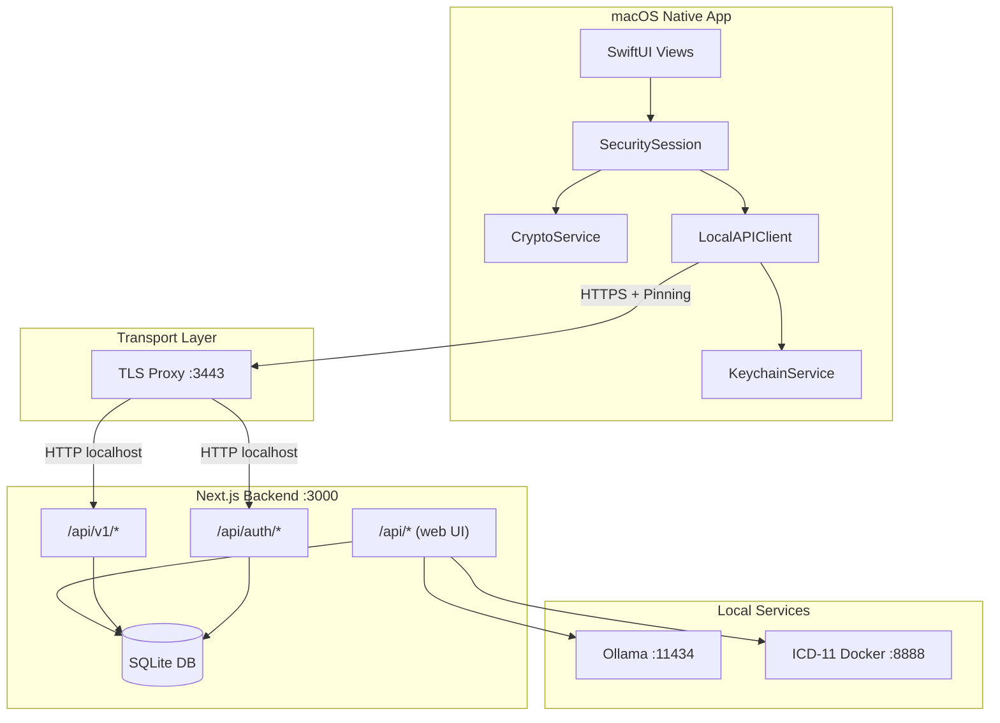
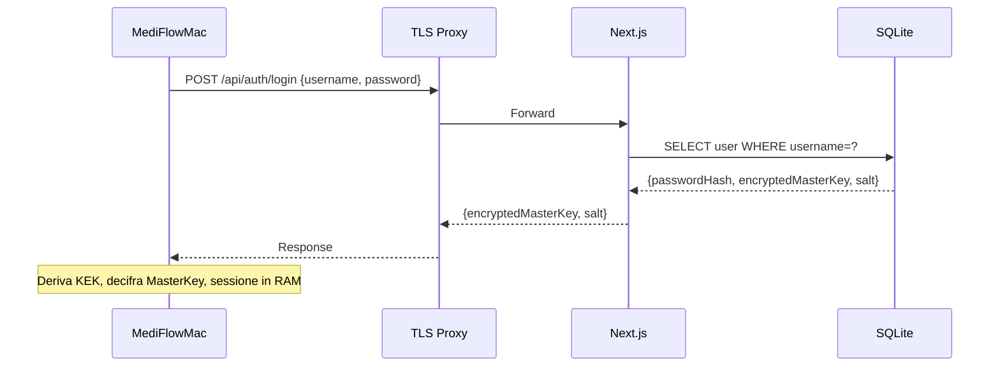
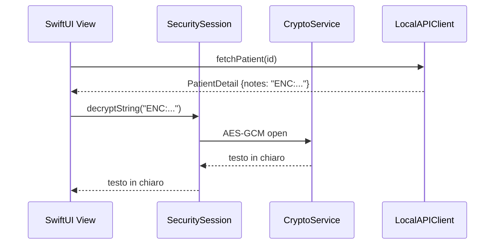
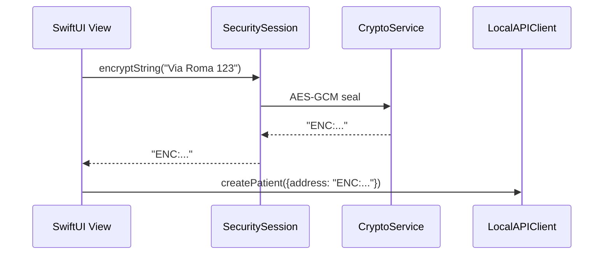

# Walkthrough MediFlow (Web + Native)

> [!IMPORTANT]
> **Stato documento: CANONICAL (walkthrough operativo end-to-end).**
> Se altri documenti tecnici secondari divergono su dettagli di flusso, prevale questo file.

Questo documento offre la vista end-to-end del progetto: web app Next.js, backend locale SQLite, servizi AI/OCR e client nativo macOS.
Serve per onboarding tecnico, manutenzione e verifica rapida dei flussi principali.

> [!IMPORTANT]
> Dopo `v0.4.0` la delivery macOS e congelata per un rebuild controllato della shell nativa.
> Le sezioni native qui sotto descrivono lo snapshot corrente e i confini da preservare (`/api/v1`, TLS locale, security/sessione), non una roadmap di estensione del client storico.

---

## Scopo e obiettivi

- Dare una mappa unica dell'architettura e dei flussi principali.
- Chiarire file chiave e responsabilità dei moduli.
- Esplicitare il contratto API tra web e client macOS.
- Riassumere sicurezza, cifratura e trasporto locale.

Se serve il dettaglio di singoli moduli, consulta anche:
- [docs/topologia-dati-flussi.md](./topologia-dati-flussi.md)
- [docs/system_architecture.md](./system_architecture.md)
- [docs/native-setup.md](./native-setup.md)
- [docs/native-launch.md](./native-launch.md)
- [docs/README.md](./README.md) e [docs/markdown-index.md](./markdown-index.md)

---

## Topologia del sistema



---

## Porte e servizi locali

| Servizio | Porta | Scopo |
| --- | --- | --- |
| Next.js | `3000` | UI web + API locali |
| TLS Proxy | `3443` | HTTPS locale per il client macOS |
| Ollama | `11434` | AI clinica + OCR |
| ICD-11 (Docker) | `8888` | Diagnosi ICD-11 |

---

## Stack web (Next.js)

- **Frontend**: Next.js App Router, React, Tailwind.
- **API**: Route handlers in `app/api/*`.
- **DB**: SQLite locale (`medical.db`) con Drizzle (`lib/schema.ts`, `lib/db-server.ts`).
- **Client DB**: `lib/db.ts` è la facciata (fetch REST + cifratura per campo).

### Directory principali

| Path | Contenuto |
| --- | --- |
| `app/` | pagine Next.js e route API |
| `components/` | componenti UI e logica client |
| `lib/` | servizi, DB, cifratura, AI/OCR |
| `drizzle/` | migrazioni DB |
| `native/` | app macOS SwiftUI |
| `scripts/` | avvio, TLS proxy, build native |

---

## Data layer e cifratura

### DB locale

- File: `medical.db`
- Schema: `lib/schema.ts`
- Accesso server: `lib/db-server.ts`

### Cifratura lato client (web)

Il server non vede i dati in chiaro. La cifratura avviene nel browser prima della scrittura:

```
Dato originale -> AES-256-GCM -> "ENC:<iv_b64>:<cipher_b64>" -> DB
```

I campi cifrati sono definiti in `lib/db.ts` (ENCRYPTED_FIELDS). Lo schema reale va verificato in `lib/schema.ts`.

### Chiavi

| Chiave | Derivazione | Storage | Scopo |
| --- | --- | --- | --- |
| PIN | input utente | mai salvato | deriva KEK |
| Salt | random 16 bytes | DB `users.salt` | PBKDF2 |
| KEK | PBKDF2(PIN, salt, 100k) | memoria | decifra master key |
| MasterKey | random 256 bit | DB (cifrata) + RAM (chiaro) | cifra/decifra dati |

Implementazioni:
- Web: `lib/security.ts`
- macOS: `native/MediFlowMac/.../CryptoService.swift`

---

## Autenticazione e sessione

### Web (setup e login)

- Setup iniziale in `app/api/auth/setup/route.ts`
- Login in `app/api/auth/login/route.ts`
- Sessione client gestita in `components/security-provider.tsx`

### Native (login con PIN)

Flusso identico al web, ma interamente lato app macOS.



---

## API layer: Web vs Native

### API per web UI

Percorso: `app/api/*`  
Usata dal client web tramite `lib/db.ts`.
Include pre-check FSE per export paziente: `app/api/fse/validate-patient/route.ts`.

### API v1 per client nativo

Percorso: `app/api/v1/*`  
Usata da `LocalAPIClient` nel client nativo macOS. Richiede token:

```
Authorization: Bearer <MEDIFLOW_LOCAL_API_TOKEN>
```

Bootstrap token lato macOS:
- ordine canonico `Keychain -> native-config.json -> local-api-token`
- fallback secondari ammessi solo se il token nel Portachiavi non esiste; errori Keychain restano espliciti
- `LocalAPIClient` prefligge il bootstrap secure-first prima della rete sugli endpoint autenticati; vedi ADR 0014

Endpoint principali:
- `app/api/v1/ambulatories/route.ts`
- `app/api/v1/patients/route.ts`
- `app/api/v1/patients/[id]/route.ts`
- `app/api/v1/patients/[id]/entries/route.ts`
- `app/api/v1/patients/[id]/entries/[entryId]/route.ts`
- `app/api/v1/patients/[id]/therapies/route.ts`
- `app/api/v1/patients/[id]/therapies/[therapyId]/route.ts`
- `app/api/v1/patients/[id]/checkups/route.ts`
- `app/api/v1/patients/[id]/checkups/[checkupId]/route.ts`
- `app/api/v1/patients/[id]/observations/route.ts`
- `app/api/v1/patients/[id]/observations/[observationId]/route.ts`
- `app/api/v1/drugs/route.ts`
- `app/api/v1/exemptions/route.ts`

Tipi condivisi:
- `lib/api/v1/types.ts`

### Backup e restore artifact v1

La voce `Backup` in `app/settings/page.tsx` usa `components/backup-restore-ui.tsx`
per esportare un artifact JSON `.mediflow` v1 con manifest e checksum.

La thin slice `WUL-30` aggiunge anche `components/backup-scheduler-ui.tsx`, che
permette di configurare un backup automatico notturno macOS via `launchd`
utente. Il job usa `scripts/run-scheduled-backup.mjs`, scrive un artifact `.mediflow`
v1 nella cartella destinazione e aggiorna in `settings` lo stato dell'ultimo run.
La thin slice `WUL-31` completa il lifecycle minimo con retention `keep-last-N`
solo sui file `mediflow-backup-v1-*` generati dallo scheduler, piu anteprima
dry-run e apply manuale dalla stessa UI.

Flusso:

1) il client web richiama `GET /api/system/backup-restore`
2) il server legge direttamente SQLite, costruisce lo snapshot canonico e
   arricchisce `patients` con `assignedAmbulatoryIds` quando esistono link
   many-to-many aggiuntivi
3) il server serializza l'artifact con manifest, counts e checksum `sha256`
4) il restore invia il file alla stessa route server-side
5) il server valida format, versione, scope, checksum e riferimenti interni
6) il server svuota le tabelle supportate e reinserisce i record direttamente in SQLite

Per il backup automatico:

1) la UI salva `enabled`, orario e cartella destinazione in `settings`
2) `app/api/system/backup-scheduler/route.ts` installa o rimuove il `LaunchAgent`
3) `launchd` esegue il runner headless locale all'orario scelto
4) il runner legge `medical.db`, genera l'artifact v1, applica la retention sui
   soli file scheduler-owned e salva esito/path ultimo run

Nota: `patients.ambulatoryId` e gli eventuali `assignedAmbulatoryIds` vengono
re-materializzati in `patients_to_ambulatories`; le preferenze non esportabili
restano follow-up. Vedi anche [docs/adr/0016-backup-artifact-v1-manifest-preflight.md](./adr/0016-backup-artifact-v1-manifest-preflight.md).

---

## AI e OCR

### Servizi

- `lib/ai-service.ts`: wrapper LLM (Ollama / MLX)
- `app/api/proxy/ai/chat/route.ts`: proxy locale verso provider
- `lib/ocr-service.ts`: OCR multimodale
- `lib/pdf-service.ts`: estrazione testo PDF (fallback regex)
- `lib/document-synthesis-service.ts`: sintesi clinica + salvataggio

### Flusso OCR + Sintesi

1) Utente carica PDF/immagine  
2) OCR via DeepSeek-OCR (Ollama)  
3) Analisi testuale e sintesi via Qwen (`qwen3.5:35b-a3b` di default)  
4) Estrazione prudente di eventuali diagnosi con codice ICD esplicito  
5) Salvataggio in `patients.documentInsights` (ultimi 3) e autofill deduplicato su `patients.diagnoses`

### Smart Import reviewable nel profilo paziente

Nel profilo paziente il web client espone anche una CTA persistente di smart import
quando esistono fonti utili (`patient.notes`, diario clinico, `documentInsights`,
summary di allegati).

Il flusso:

1) raccoglie le fonti cliniche locali gia presenti  
2) le invia al modello clinico locale piu capace configurato  
3) produce suggerimenti reviewable per:
   - diagnosi candidate con match ICD-11 locale
   - terapie candidate con match catalogo AIFA/ATC o fallback manuale
4) applica solo gli elementi confermati dall'operatore su `patients.diagnoses`
   e `therapies`, con dedupe esplicito

Vincolo: l'autofill automatico dei documenti non cambia e resta limitato ai soli
ICD espliciti previsti da ADR 0011; patologie free-text e terapie richiedono sempre
review umana in questa slice.

---

## Integrazione nativa macOS

### TLS Proxy locale

Script: `scripts/native-setup.sh`  
Proxy: `scripts/local-api-tls-proxy.mjs`

Flusso:
1) Genera certificato self-signed  
2) Avvia proxy HTTPS su `:3443`  
3) Scrive `~/Library/Application Support/MediFlow/native-config.json`

La app macOS usa TLS pinning in `LocalAPIClient`.

### Avvio rapido

- Web + servizi: `./Start_MediFlow.command`
- Native: `./scripts/Launch_MediFlowMac.command`

---

## Flusso dati cifrati (native)



Scrittura:



---

## Mappa file (rapida)

| Area | File chiave |
| --- | --- |
| Schema DB | `lib/schema.ts` |
| DB server | `lib/db-server.ts` |
| Client DB web | `lib/db.ts` |
| Sicurezza web | `lib/security.ts`, `components/security-provider.tsx` |
| API auth | `app/api/auth/*` |
| API web | `app/api/*` |
| API v1 | `app/api/v1/*` |
| AI/OCR | `lib/ai-service.ts`, `lib/ocr-service.ts`, `lib/pdf-service.ts` |
| Proxy AI | `app/api/proxy/ai/chat/route.ts` |
| ICD | `app/api/icd/proxy/route.ts` |
| Native app | `native/MediFlowMac/Sources/MediFlowMac/*` |
| TLS proxy | `scripts/local-api-tls-proxy.mjs` |

---

## Checklist operativa

1) Avvia `npm run dev` (o `Start_MediFlow.command`)  
2) Avvia ICD-11 Docker (`docker compose up -d icd-api`)  
3) Avvia TLS proxy (`scripts/native-setup.sh` o `Launch_MediFlowMac.command`)  
4) Apri web app e completa il setup PIN  
5) Avvia app macOS e fai login con PIN  

---

## Limitazioni attuali

- Editing pazienti via native non completo (solo creazione).  
- Offline sync non presente.  
- Bonjour discovery non presente.  
- Multi-user limitato (admin singolo).

---

## Prossimi passi suggeriti

1) PATCH/PUT per editing da native  
2) Autodiscovery locale (Bonjour)  
3) Cache locale offline in Swift  
4) Target iOS/iPadOS
