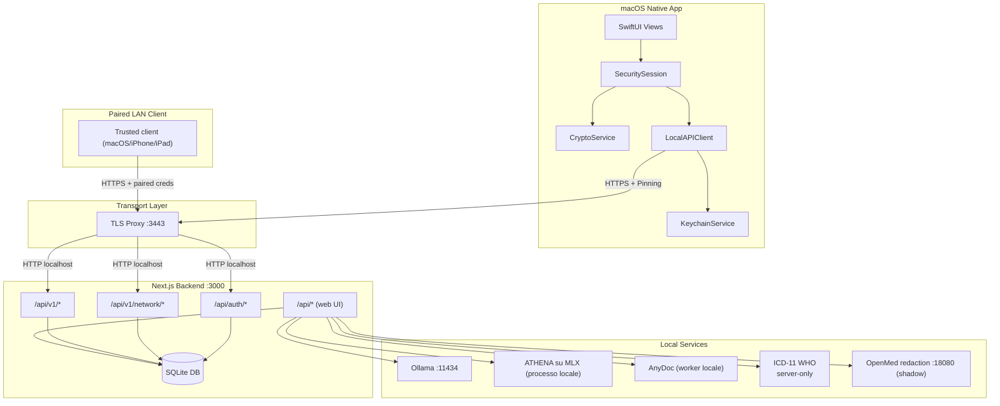
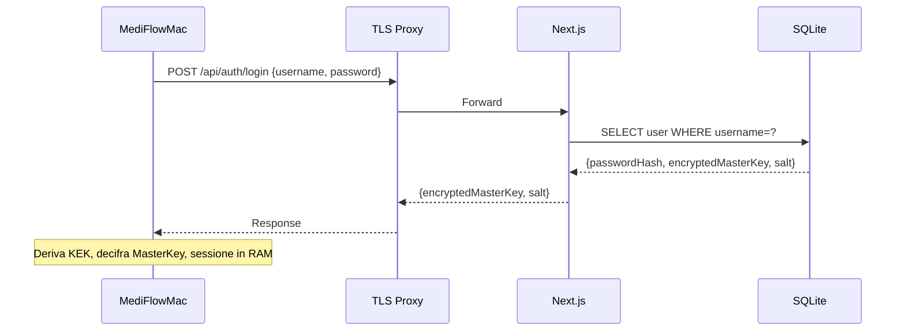
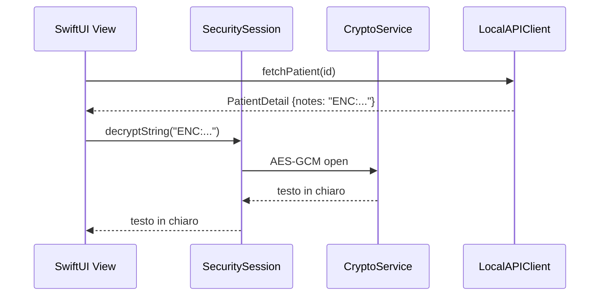
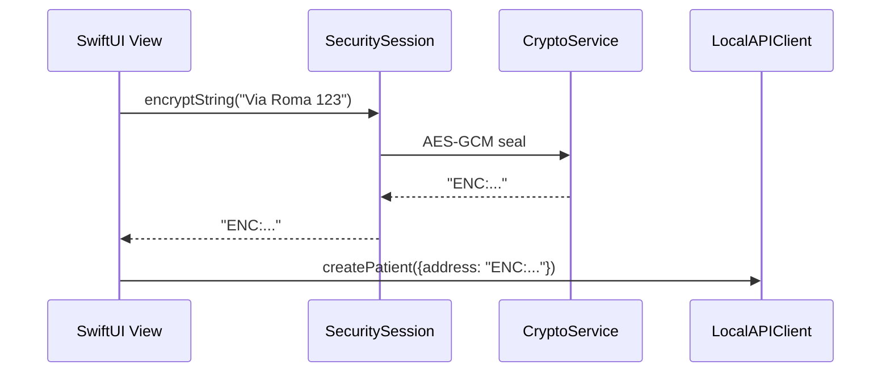

# Walkthrough MediFlow (Web + Native)

> [!IMPORTANT]
> **Stato documento: CANONICAL (walkthrough operativo end-to-end).**
> Se altri documenti tecnici secondari divergono su dettagli di flusso, prevale questo file.

Questo documento offre la vista end-to-end del progetto: web app Next.js,
backend locale SQLite, estrazione documentale AnyDoc, Intelligence Fabric e
client nativo macOS.
Serve per onboarding tecnico, manutenzione e verifica rapida dei flussi principali.

> [!IMPORTANT]
> Dopo `v0.7.0` il client macOS da estendere e il bundle Apple/home-base.
> La vecchia shell clinica resta snapshot/parity; le sezioni native qui sotto
> descrivono il contratto da preservare (`/api/v1`, TLS locale,
> security/sessione) e la direzione home-base packaged.

> [!IMPORTANT]
> Su `main` esistono gia slice `v0.7.0` che cambiano il quadro operativo:
> `network home-base` paired su `/api/v1/network/*` con read pazienti e write
> limitati su profilo/status, diario, terapie, checkup e osservazioni, il bundle
> macOS home-base packaged, client iPhone/iPad paired non-AI, e il primo artifact
> `parse/evidence` per documento allegato, consumato in priorita da `AI Patient Insight`.

> [!IMPORTANT]
> Nel candidato sorgente locale `0.8.5`, il percorso documentale corrente e
> `attachment host-owned -> AnyDoc -> provenienza -> proposta/review`. Le route
> OCR storiche sono ritirate con risposta auth-first `410`. I quattro percorsi
> generativi attraversano il Fabric e non espongono apply o scritture.

---

## 🎯 Scopo e obiettivi

- Dare una mappa unica dell'architettura e dei flussi principali.
- Chiarire file chiave e responsabilità dei moduli.
- Esplicitare il contratto API tra web e client macOS.
- Riassumere sicurezza, cifratura e trasporto locale.

Se serve il dettaglio di singoli moduli, consulta anche:
- [docs/STATE_OF_THE_SYSTEM.md](./STATE_OF_THE_SYSTEM.md)
- [docs/topologia-dati-flussi.md](./topologia-dati-flussi.md)
- [docs/system_architecture.md](./system_architecture.md)
- [docs/native-setup.md](./native-setup.md)
- [docs/native-launch.md](./native-launch.md)
- [docs/README.md](./README.md) e [docs/markdown-index.md](./markdown-index.md)

---

## 🧱 Topologia del sistema



---

## ⚙️ Porte e servizi locali

| Servizio | Porta | Scopo |
| --- | --- | --- |
| Next.js | `3000` | UI web + API locali |
| TLS Proxy | `3443` | HTTPS locale per il client macOS |
| Ollama | `11434` | Provider locale per Patient Insight, Smart Import e Document Synthesis |
| ATHENA su MLX | n/a | Provider locale dedicato a Treatment Reasoning, se configurato |
| AnyDoc | n/a | Worker locale senza porta di rete per allegati con testo estraibile |
| ICD-11 WHO | HTTPS ufficiale | Diagnosi ICD-11, egress opt-in server-only |
| OpenMed redaction (shadow) | `18080` | Sidecar locale benchmark/shadow per `redaction.v1` |

---

## 🖥️ Stack web (Next.js)

- **Frontend**: Next.js App Router, React, Tailwind.
- **API**: Route handlers in `app/api/*`.
- **DB**: SQLite locale (`medical.db`) con Drizzle (`lib/schema.ts`, `lib/db-server.ts`).
- **Client DB**: `lib/db.ts` è la facciata (fetch REST + cifratura per campo).

### Directory principali

| Path | Contenuto |
| --- | --- |
| `app/` | pagine Next.js e route API |
| `components/` | componenti UI e logica client |
| `lib/` | servizi, DB, cifratura, Intelligence Fabric ed estrazione documentale |
| `drizzle/` | migrazioni DB |
| `native/` | app macOS SwiftUI |
| `scripts/` | avvio, TLS proxy, build native |

## 🖥️ Shell ufficiale e superfici integrate

Nel checkout web esiste oggi una sola shell ufficiale del prodotto: la root web
`/` apre direttamente il `Kree8 cockpit` (ADR 0060), senza selector di shell ne
preview profile persistiti. Kree8 e accreditato come ispirazione visuale esterna
e grammatica di riferimento, non come implementazione o prodotto MediFlow.

Le superfici AI, Smart Import e contesto paziente SISS non vivono piu dietro un
selector locale di preview (ADR 0050): quando sono considerate mature per
`main`, vengono integrate direttamente nel runtime ufficiale.

In pratica:

- `AI`: resta parte della shell ufficiale come stack locale governato;
- `Smart Import`: resta reviewable dentro i flussi normali del paziente;
- `SISS`: il pannello contestuale paziente e parte stabile della scheda
  clinica, mantenendo il boundary `webapp-assisted` verso i moduli regionali.
- `Protesica`: la scheda paziente include un diario locale delle prescrizioni
  protesiche e un handoff `Protesica-RL` con codice fiscale pronto da incollare.

Implementazione principale:

- `app/page.tsx`
- `components/kree8/kree8-clinical-cockpit.tsx`
- `app/patients/[id]/page.tsx`
- `components/siss-patient-context-panel.tsx`
- `components/prosthetic-prescription-manager.tsx`
- `app/settings/page.tsx`

Questo non cambia i boundary canonici: AI, import e contesto SISS sono presenti
nel runtime ufficiale, ma non dichiarano scorciatoie architetturali oltre quelle
gia formalizzate nelle ADR e nei documenti SISS. Il diario protesico resta un
registro locale document-backed: non invia prescrizioni al sistema regionale e
non dichiara un canale certificato.

### Navigazione un-clic e Impostazioni

La passata UI 2026-06 porta verso la Scheda paziente con un solo clic: azione
primaria `Apri scheda paziente`, riga lista con azione diretta, `Quadro` come
vista in-cockpit senza rimontare la rotta, e ritorni che convergono su
`/patients/[id]/modules`. Le Impostazioni (WUL-297) sono ridisegnate a sezioni
in sidebar (Generale, Sicurezza e Dati, Intelligenza Artificiale, Avanzate), con
`/settings` come dashboard Stato sistema, ricerca CMD+K, toggle Privacy Mode in
header e conferme digitate (`RIPRISTINA` / `RESET`).

### Estrazione AnyDoc e confine OCR

La lettura automatica corrente parte sempre da un allegato gia salvato e
selezionato dal nodo autorevole:

1. la sessione web autenticata seleziona l'allegato corrente;
2. `POST /api/attachments/{id}/local-extraction` acquisisce byte e currentness
   dal boundary host-owned;
3. il worker AnyDoc locale produce Markdown normalizzato;
4. il contratto lega risultato, hash della sorgente, hash del Markdown e
   provenienza all'allegato corrente;
5. Document Synthesis puo usare l'evidenza soltanto per una proposta Fabric da
   rivedere.

AnyDoc non esegue OCR. Immagini, scansioni, documenti cifrati, malformati o
privi di testo utile falliscono chiusi verso revisione manuale. Le route
storiche `/api/ocr/extract` e `/api/pdf-extract` verificano prima la sessione e
poi restituiscono `410`; non invocano Apple Vision, DeepSeek-OCR o altri
fallback.

Il fallback selettivo DeepSeek-OCR 2 e un requisito deciso ma
`RELEASE_SCOPE_EXCLUDED` dalla 0.8.5. Un packet futuro potra inviarvi soltanto
le pagine `needsOcr` e dovra ricomporre provenienza, hash e qualita per pagina.
Prima dell'abilitazione richiedera benchmark sintetico italiano, soglie fissate,
E2E e misure prestazionali. Dovra restare locale, fail-closed, proposal-only e
zero-write. Vedi [ADR 0109](./adr/0109-confini-programma-intelligence-fabric-headless-085.md).

### Diario protesico da documenti Assistente RL

Quando l'operatore produce un pacchetto documentale `Protesica-RL`, MediFlow lo
tratta come fonte documentale per una bozza revisionabile del diario protesico,
non come scrittura automatica certificata verso il sistema regionale.

Fonti attese:

- `PRESCRIZIONE DI PROTESICA`: analisi funzionale, diagnosi/razionale, tabella
  dei presidi ISO prescritti, significato terapeutico-riabilitativo e tempi
  d'impiego.
- `MODELLO 03`: numero pratica/domanda, data presentazione, diritto, area
  fornitore/prezzi, requisito di collaudo e sezione consegna.
- `SchedaTecnica`: conferma tecnica della fornitura, data prescrizione, codice
  ISO, quantita, descrizione del presidio, prescrittore e struttura.

Regole di import reviewable:

- una voce `prosthetic_prescriptions` per ogni presidio ISO documentato;
- `regionalPrescriptionId` da `NUMERO PRESCRIZIONE` / `NUMERO PRATICA`;
- `prescribedAt` da `DATA PRESCRIZIONE`, conservando eventuale data domanda
  nelle note se diversa;
- `status=prescribed` quando esiste solo la prescrizione clinica,
  `status=submitted` quando il modello regionale documenta la domanda
  presentata, e stati `authorized`, `delivered`, `tested` solo con evidenza
  esplicita;
- `collaudoAt` solo con data di collaudo effettiva; `Prescrizione soggetta a
  collaudo: NO` e una informazione di requisito, non un collaudo completato;
- `measures` solo per misure, configurazioni, quantita o tempi d'impiego
  espliciti, senza inventare dettagli tecnici dalla narrativa;
- `clinicalReason` solo da diagnosi, analisi funzionale e significato
  terapeutico-riabilitativo documentati.

Il matching resta paziente-scoped: codice fiscale prima, poi nome/data di
nascita come controllo secondario. Se i documenti del pacchetto divergono su
identita, numero pratica o data, l'import deve fermarsi e lasciare una bozza da
revisione operatore.

---

## 🔒 Data layer e cifratura

### DB locale

- File: `medical.db`
- Schema: `lib/schema.ts`
- Accesso server: `lib/db-server.ts`
- `patients.documentInsights` resta la projection compatibile dei documenti analizzati
- `attachments.summarySnapshot` e `attachments.parseEvidenceArtifactSnapshot`
  sono snapshot clinici cifrati associati al singolo allegato
- la cancellazione paziente e un soft-delete reversibile (ADR 0066): scrive un
  tombstone (`deletedAt` / `deletionReason`) con version guard, non orfana i
  figli clinici e lascia invariato il contratto API. L'erasure GDPR esplicita
  resta un'azione admin separata (`purge-patient` con dry-run, `restore-patient`);
  la purge agisce sul database live e non raggiunge backup gia esportati

### Cifratura lato client (web)

I campi elencati in `lib/db.ts` (`ENCRYPTED_FIELDS`) vengono cifrati nel browser
prima della scrittura e arrivano al server come ciphertext. Identificativi e
alcuni metadati restano fuori da quel mapping: il file SQLite non è cifrato
integralmente e il PIN non abilita un claim zero-knowledge whole-database.

```
Dato originale -> AES-256-GCM -> "ENC:<iv_b64>:<cipher_b64>" -> DB
```

I campi cifrati sono definiti in `lib/db.ts` (ENCRYPTED_FIELDS). Lo schema reale va verificato in `lib/schema.ts`.

### Chiavi

| Chiave | Derivazione | Storage | Scopo |
| --- | --- | --- | --- |
| PIN | input utente | mai salvato | deriva KEK |
| Salt | random 16 bytes | DB `users.salt` | PBKDF2 |
| KEK | PBKDF2(PIN, salt, 100k) | memoria | decifra master key |
| MasterKey | random 256 bit | DB (cifrata) + RAM (chiaro) | cifra/decifra dati |

Implementazioni:
- Web: `lib/security.ts`
- macOS: `native/MediFlowMac/.../CryptoService.swift`

---

## 🔑 Autenticazione e sessione

### Web (setup e login)

- Setup iniziale in `app/api/auth/setup/route.ts`
- Login in `app/api/auth/login/route.ts`
- Sessione client gestita in `components/security-provider.tsx`

### Native (login con PIN)

Flusso identico al web, ma interamente lato app macOS.



---

## 🔌 API layer: Web vs Native

### API per web UI

Percorso: `app/api/*`  
Usata dal client web tramite `lib/db.ts`.
Include pre-check FSE per export paziente: `app/api/fse/validate-patient/route.ts`.

### API v1 per client nativo

Percorso: `app/api/v1/*`  
Usata da `LocalAPIClient` nel client nativo macOS. Richiede token:

```
Authorization: Bearer <MEDIFLOW_LOCAL_API_TOKEN>
```

Bootstrap token lato macOS:
- ordine canonico `Keychain -> native-config.json -> local-api-token`
- fallback secondari ammessi solo se il token nel Portachiavi non esiste; errori Keychain restano espliciti
- `LocalAPIClient` prefligge il bootstrap secure-first prima della rete sugli endpoint autenticati; vedi ADR 0014

Endpoint principali:
- `app/api/v1/ambulatories/route.ts`
- `app/api/v1/patients/route.ts`
- `app/api/v1/patients/[id]/route.ts`
- `app/api/v1/patients/[id]/entries/route.ts`
- `app/api/v1/patients/[id]/entries/[entryId]/route.ts`
- `app/api/v1/patients/[id]/therapies/route.ts`
- `app/api/v1/patients/[id]/therapies/[therapyId]/route.ts`
- `app/api/v1/patients/[id]/checkups/route.ts`
- `app/api/v1/patients/[id]/checkups/[checkupId]/route.ts`
- `app/api/v1/patients/[id]/observations/route.ts`
- `app/api/v1/patients/[id]/observations/[observationId]/route.ts`
- `app/api/v1/drugs/route.ts`
- `app/api/v1/exemptions/route.ts`

Il catalogo farmaci AIFA viene caricato dalla web UI in
`Impostazioni -> Sicurezza e Dati -> Repertori` a partire da un CSV locale.
L'import salva nello stesso database SQLite le righe indicizzate e un manifest
di provenienza con fonte, URL, data di scarico, versione, nome file, conteggio e
hash SHA-256. Il file sorgente non viene copiato nel repository. La ricerca web
e il canale Apple interrogano il server per prefisso con un limite, senza
scaricare il catalogo completo nel client.

Tipi condivisi:
- `lib/api/v1/types.ts`

### API v1/network per `home-base` paired

La first thin slice `network home-base` si attiva solo in modalita
`network-home-base` dal pannello Settings.

Surface attuale:

- summary PHI-safe di nodo, sessione, capability, identita e AI runtime;
  `/api/v1/network/ai-runtime` include la proiezione Fabric
  `mediflow.ai.network-fabric-status.v1`
- pairing bootstrap/confirm
- primo data plane remoto read-only su pazienti (`/api/v1/network/patients*`)
- primo write remoto limitato a `PUT /api/v1/network/patients/{id}` per profilo/status paziente
- diario clinico paired su `/api/v1/network/patients/{id}/entries*`
- terapie paired su `/api/v1/network/patients/{id}/therapies*`
- checkup paired su `/api/v1/network/patients/{id}/checkups*`
- osservazioni paired su `/api/v1/network/patients/{id}/observations*`

Boundary attuale:

- `POST /api/v1/network/pairing-intents` e bootstrap PHI-safe
- read e write remoto richiedono `paired client` + sessione operatore valida
- il write paziente richiede capability `network.replica.write-patient-profile` e `version`
- il diario paired usa capability `network.replica.readonly-clinical-diary` /
  `network.replica.write-clinical-diary` e `entries.version`
- il diario locale condiviso `/api/v1/patients/{id}/entries*` usa soft-delete
  reversibile per i client native: lista attiva di default, `includeDeleted=true`
  per i tombstone, motivo di eliminazione e restore esplicito
- le terapie paired usano capability `network.replica.readonly-therapies` /
  `network.replica.write-therapies` e `therapies.version`
- i checkup paired usano capability `network.replica.readonly-checkups` /
  `network.replica.write-checkups` e `checkups.version`
- le osservazioni paired usano capability `network.replica.readonly-observations` /
  `network.replica.write-observations` e `observations.version`
- la proiezione Fabric paired e `status_only`: mostra stato host e venue, ma
  `executionAuthorized` resta `false`
- hard delete remoto, PUT/DELETE paired degli allegati, sync record-level,
  invocazione AI, campi document-derived e fallback automatico restano fuori;
  cataloghi read-only e create manuale allegati sono disponibili

### Backup e restore artifact v1

La voce `Backup` in `app/settings/page.tsx` usa `components/backup-restore-ui.tsx`
per esportare un artifact JSON `.mediflow` v1 con manifest e checksum.

La thin slice `WUL-30` aggiunge anche `components/backup-scheduler-ui.tsx`, che
permette di configurare un backup automatico notturno macOS via `launchd`
utente. Il job usa `scripts/run-scheduled-backup.mjs`, scrive un artifact `.mediflow`
v1 nella cartella destinazione e aggiorna in `settings` lo stato dell'ultimo run.
La thin slice `WUL-31` completa il lifecycle minimo con retention `keep-last-N`
solo sui file `mediflow-backup-v1-*` generati dallo scheduler, piu anteprima
dry-run e apply manuale dalla stessa UI.

Flusso:

1) il client web richiama `GET /api/system/backup-restore`
2) il server legge direttamente SQLite, costruisce lo snapshot canonico e
   arricchisce `patients` con `assignedAmbulatoryIds` quando esistono link
   many-to-many aggiuntivi
3) il server serializza l'artifact con manifest, counts e checksum `sha256`
4) il restore invia il file alla stessa route server-side
5) il server valida format, versione, scope, checksum e riferimenti interni
6) il server svuota le tabelle supportate e reinserisce i record direttamente in SQLite

Per il backup automatico:

1) la UI salva `enabled`, orario e cartella destinazione in `settings`
2) `app/api/system/backup-scheduler/route.ts` installa o rimuove il `LaunchAgent`
3) `launchd` esegue il runner headless locale all'orario scelto
4) il runner legge `medical.db`, genera l'artifact v1, applica la retention sui
   soli file scheduler-owned e salva esito/path ultimo run

Nota: `patients.ambulatoryId` e gli eventuali `assignedAmbulatoryIds` vengono
re-materializzati in `patients_to_ambulatories`; le preferenze non esportabili
restano follow-up. Vedi anche [docs/adr/0016-backup-artifact-v1-manifest-preflight.md](./adr/0016-backup-artifact-v1-manifest-preflight.md).

---

## 🤖 Intelligence Fabric ed estrazione documentale

### Componenti correnti

- `lib/domain/documents/anydoc-current-source-composition.ts`: acquisisce
  l'allegato corrente dal boundary host-owned e compone l'estrazione AnyDoc.
- `lib/domain/documents/anydoc-local-extraction-runner.ts`: esegue il worker
  locale con limiti di input, output, tempo e risorse.
- `lib/ai-providers/fabric/generative-catalog.ts`: catalogo delle capability e
  dello stadio massimo.
- `lib/ai-providers/fabric/*production*`: production root e operazioni
  host-owned dei quattro percorsi generativi.
- `lib/ai-providers/fabric/provider-disclosure.ts`: disclosure read-only dei
  provider, distinta dall'osservazione di una singola operazione.
- `docs/capability-mapping/fabric-generative-runtime-crosswalk.v1.json`:
  crosswalk verificabile tra UI, route, production root e publication.

OpenAI e Anthropic compaiono soltanto come righe informative disabilitate.
Configurazione credenziali, OAuth, esecuzione cloud ed egress sono
`RELEASE_SCOPE_EXCLUDED` dalla 0.8.5. Un abbonamento consumer o host non concede
accesso API o inference. I runtime inclusi sono Ollama locale e ATHENA su MLX
dove configurati; il chiamante non sceglie provider, modello o fallback.

### Quattro percorsi generativi Fabric

| Capability | Percorso autenticato | Provider locale | Risultato massimo |
| --- | --- | --- | --- |
| Patient Insight | UI -> `/api/ai/patient-insight/preview` -> production root host-owned | Ollama | Preview con receipt, provenienza e currentness |
| Smart Import | controller -> `/api/ai/smart-import/ingest` -> `/api/ai/smart-import/preview` | Ollama | Proposta review-only legata alla selezione corrente |
| Document Synthesis | controller -> `capture` -> AnyDoc -> `ingest` -> `preview` sotto `/api/ai/document-synthesis/*` | Ollama | Publication da allegato corrente con source binding |
| Treatment Reasoning | controller -> `/api/ai/treatment-reasoning/ingest` -> `/api/ai/treatment-reasoning/preview` | ATHENA su MLX | Anteprima review-only con source binding |

Ogni route acquisisce la sessione prima del payload clinico. Il nodo costruisce
projection, selezione e currentness; il provider non accede a SQLite. Le
publication includono receipt e provenienza PHI-safe, dichiarano
`writesPerformed=0` e `applyPolicy=none` e non espongono prompt o risposta grezza.
Una receipt descrive la risoluzione eseguita; non concede authority.

I quattro percorsi non eseguono apply. Una successiva modifica clinica, se
prevista da un Application Service distinto, richiede selezione esplicita,
authority, currentness, idempotenza e audit propri. Non eredita permessi dalla
proposta Fabric.

### Allegato -> AnyDoc -> proposta Document Synthesis

```text
allegato persistito e corrente
  -> capture autenticata host-owned
  -> AnyDoc locale
  -> Markdown + hash + provenienza
  -> ingest con handle opaco
  -> preview Fabric Document Synthesis
  -> proposta da rivedere, senza persistenza clinica
```

Il percorso accetta soltanto l'allegato risolto dal nodo. L'estrazione non
applica dati e la sintesi non aggiorna `patients.diagnoses`, terapie,
`summarySnapshot`, `parseEvidenceArtifactSnapshot` o `documentInsights`.
Immagini e scansioni tornano a revisione manuale senza fallback invisibile.

### Import documento nella nuova anagrafica

Il vecchio percorso diretto `file -> OCR -> compilazione anagrafica` non e un
percorso automatico corrente della 0.8.5. Un documento deve prima diventare un
allegato host-owned; soltanto allora AnyDoc puo estrarre il testo e Document
Synthesis puo produrre una proposta.

Le decisioni storiche di [ADR 0042](./adr/0042-document-driven-new-patient-review-and-prudent-therapy-persistence.md)
e [ADR 0051](./adr/0051-patient-import-decision-contract-between-review-and-persistence.md)
restano registrate, ma non autorizzano un bridge dalla proposal al writer. La
creazione o modifica dell'anagrafica resta un'azione applicativa distinta e
confermata dall'operatore.

### Smart Import review-only nel profilo paziente

Il controller lega la richiesta alla selezione paziente e alle fonti correnti,
poi esegue ingest e preview tramite handle opaco. La publication contiene
suggerimenti con evidenze, receipt e provenienza. Replay, selezione cambiata,
lease scaduta o projection stantia negano prima dell'uso del provider.

La preview Smart Import non modifica diagnosi o terapie. Un eventuale apply
successivo non fa parte del percorso Fabric e deve restare una operazione
applicativa separata, esplicita e auditabile. ADR 0084 continua a vietare la
scrittura diagnostica dalla sintesi documentale.

### Guard revisione shell web

La shell web espone un fingerprint stabile della sorgente locale tramite
`lib/app-revision.ts` e `/api/system/revision`.

Comportamento:

- `AppRevisionGuard` controlla il fingerprint quando la tab torna visibile e a
  intervalli regolari
- se branch/revision/worktree cambiano, la tab fa un reload soft una sola volta
- `Start_MediFlow.command` resetta `.next` quando la sorgente cambia e rifiuta
  di riusare la porta `3000` se occupata da un worktree diverso

---

## 🍎 Integrazione nativa macOS

### TLS Proxy locale

Script: `scripts/native-setup.sh`  
Proxy: `scripts/local-api-tls-proxy.mjs`

Flusso:
1) Genera certificato self-signed  
2) Avvia proxy HTTPS su `:3443`  
3) Scrive `~/Library/Application Support/MediFlow/native-config.json`
4) Scrive `runtime-status.json` nella stessa cartella con timestamp,
   `baseURL`, fingerprint TLS, modalita rete e metadati proxy PHI-free

La app macOS usa TLS pinning in `LocalAPIClient`. La finestra primaria del
bundle compilato e ora la shell Apple/home-base: il pannello `Runtime` legge
`native-config.json` e `runtime-status.json` per mostrare readiness locale senza
esporre token, certificati, chiavi o dati paziente. Il pannello puo avviare e
arrestare esplicitamente il backend web production standalone e il proxy TLS
inclusi nel bundle con stop bounded/escalation locale. Ollama e MLX compaiono
solo come health diagnostico read-only; non vengono installati, avviati o
arrestati dalla app. ICD-11 WHO usa invece la readiness autenticata della web
app e non viene sondato dalla shell nativa.

La scheda `Impostazioni -> Cataloghi` della shell macOS espone la minima
operabilita amministrativa dei dataset condivisi: count/stato, import JSON
compatibile e clear per farmaci ed esenzioni. Ogni import farmaci da questo
percorso legacy sostituisce atomicamente l'intero catalogo, non dispone
dell'artifact sorgente e invalida quindi il manifest AIFA, mostrando il catalogo
come non verificato. L'import AIFA con provenienza avviene dalla web UI. Le
operazioni non creano storage cataloghi parallelo nell'app nativa.

I form terapia Apple interrogano gia
`GET /api/v1/network/drugs?q=<prefisso>&limit=<N>` tramite la capability
`network.catalogs.readonly`. Il contratto restituisce al massimo 50 righe con
la shape `DrugSummary`; non trasferisce il dataset e non abilita import o clear
dal client paired.

I form terapia nativi usano lo stesso contratto `/api/v1/patients/{id}/therapies*`
della web UI: farmaco AIFA o manuale/galenico, AIC/ATC quando disponibili,
principio attivo, posologia, motivazione, indicazione ICD o sentinelle
`PREV`/`NONE`, stato e date. La modifica mantiene la semantica patch nullable
per svuotare esplicitamente campi opzionali senza lasciare valori clinici
stale.

I form appuntamento/checkup nativi restano volutamente semplici ma allineati
al contratto `/api/v1/patients/{id}/checkups*`: data, titolo, note operative,
stato e source `manual` in creazione. Le note sono visibili nella scheda
paziente e modificabili con clear esplicito, mentre `version`, `updatedAt` e
tombstone metadata restano disponibili come metadata di contratto per i client
nativi.

### Avvio rapido

- Web + servizi: `./Start_MediFlow.command`
- Native: `./scripts/Launch_MediFlowMac.command`

---

## 🗄️ Flusso dati cifrati (native)



Scrittura:



---

## 📚 Mappa file (rapida)

| Area | File chiave |
| --- | --- |
| Schema DB | `lib/schema.ts` |
| DB server | `lib/db-server.ts` |
| Client DB web | `lib/db.ts` |
| Sicurezza web | `lib/security.ts`, `components/security-provider.tsx` |
| API auth | `app/api/auth/*` |
| API web | `app/api/*` |
| API v1 | `app/api/v1/*` |
| Intelligence Fabric | `lib/ai-providers/fabric/generative-catalog.ts`, `lib/ai-providers/fabric/*production*` |
| AnyDoc | `lib/domain/documents/anydoc-current-source-composition.ts`, `lib/domain/documents/anydoc-local-extraction-runner.ts` |
| ICD | `app/api/icd/proxy/route.ts` |
| Native app | `native/MediFlowMac/Sources/MediFlowMac/*` |
| TLS proxy | `scripts/local-api-tls-proxy.mjs` |

---

## 🧪 Checklist operativa

1) Avvia `npm run dev` (o `Start_MediFlow.command`)  
2) Configura ICD-11 WHO solo se autorizzato, seguendo `docs/icd-who-setup.md`
3) Avvia TLS proxy (`scripts/native-setup.sh` o `Launch_MediFlowMac.command`)  
4) Apri web app e completa il setup PIN  
5) Avvia app macOS e fai login con PIN  

---

## ⚠️ Limitazioni attuali

- `home-base` resta read-only-first come autorita, ma include write versionati
  su lifecycle paziente, moduli clinici, prestazioni/protesica e create manuale
  degli allegati. Hard delete, curation document-derived, invocazione AI,
  write offline e sync record-level restano fuori.
- `documentInsights` resta un compat layer: il `document evidence ledger` ha
  ora una base runtime con artifact e prime ancore sezionali, ma i decision
  layer completi restano incrementali.
- Il vecchio shell macOS resta congelato e non va rilanciato come base di
  delivery: i thin slice parity legacy sono code-satisfied, mentre il bundle
  `MediFlowMac` compilato ora apre la shell Apple/home-base come entrypoint.
  Il prototipo oncologico resta separato e non va confuso con MediFlow prodotto
  o con OncoBackboneMac.
- `WUL-26` chiude la track parity legacy come closeout documentale: strict
  smoke web+native `PASS`, gap modulo-specifici chiusi, nessuna dichiarazione
  di UI parity piena della vecchia shell clinica. La prossima click-map
  capability-by-capability appartiene al filone Apple-native/home-base.
- Il closeout parity e tracciato da `WUL-479`: `WUL-401`/PR #21 hanno
  consegnato il tooling P6 di base, mentre `WUL-481` governa prerequisiti
  operativi e verbale manuale residuo sul Mac sbloccato. Offline degradato
  (`WUL-403`) e decisione documentale condizionata da ADR 0076 restano separati.
- Il candidato sorgente locale 0.8.5 collega i quattro percorsi generativi al
  Fabric, ma il client paired resta `status_only` e non esegue AI. Nessun
  percorso Fabric applica o scrive dati clinici.
- Il fallback selettivo DeepSeek-OCR 2 e l'esecuzione OpenAI/Anthropic sono
  requisiti futuri `RELEASE_SCOPE_EXCLUDED`: non hanno adapter, E2E o authority
  nel candidato. Cloud, egress, credenziali provider e fallback invisibile
  restano fuori.

Claim ceiling per i flussi descritti: candidato sorgente locale 0.8.5. Il
walkthrough non prova release, pubblicazione, certificazione, deployment cloud,
AI paired, MCP operativo o authority agentica generale.

---

## 🧭 Prossimi passi suggeriti

1) Chiudere sotto `WUL-481` i prerequisiti operativi e poi il verbale manuale P6
   definiti in `docs/parity-matrix.md`, partendo dal tooling di `WUL-401`/PR #21
2) Portare altri consumer sul `parse/evidence artifact` prima di cambiare i
   contratti persistiti piu ampi
3) Riavviare il filone native sul nuovo shell, non su quello storico; quando
   serve un riferimento visuale esterno, confrontarlo esplicitamente con
   OncoBackboneMac senza confonderlo con MediFlow
4) Rendere visibile TTL/freschezza della cache mobile senza introdurre write
   offline o sync multi-master
