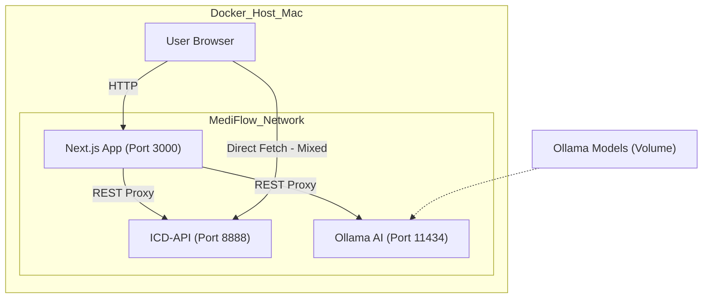
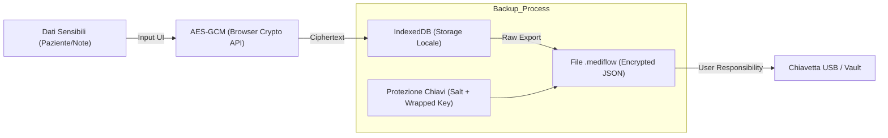

# MediFlow (Presentation)

Hello there! My name is Leo, I am a physician from Italy and I work in the Community Care setting. The idea of managing patient data, therapies, and clinical notes without relying on internet connectivity or third-party cloud services is what led me to create MediFlow.

MediFlow is a comprehensive, local-first medical record management system designed for **reliability**, **privacy**, and **speed**. It empowers medical professionals and allows to shift the focus from managing IT issues to patient care.

The software "base" is in Italian but feel free to branch, modify, suggest and so much more. I am a newbie in the development world and I am always open to learning and improving. Don't forget that this application is made from the Italian point of view (AIFA for medication references, etc.) and many features and upcoming changes are tied to my everyday clinical practice. Yet this product is made with modularity in mind. Feel free to reach out for any suggestions! Open Source for the win!

## Core Philosophy

* **🔒 Privacy First**: Your patient data never leaves your device unless you explicitly export it. We use IndexedDB for robust, encrypted-at-rest local storage.
* **⚡ Speed & Fluidity**: Built with a "Zero-Lag" philosophy. Every interaction is immediate, thanks to the local-first architecture.
* **🏥 Clinical Effectiveness**: Tools designed by doctors, for doctors. From smart ICD-11 coding to automatic PDF therapy printing.

---

## ⚖️ Compliance & GDPR (Work in Progress)

**Primum non nocere (First, do no harm) applies to data too.**

This application is designed following the principles of **Privacy by Design** and **Data Minimization**, implementing state-of-the-art technical best practices for data protection:

* **Local-First Architecture**: Data resides *exclusively* in the user's browser (IndexedDB).
* **AES-GCM Encryption**: Sensitive data (notes, diary) is encrypted at rest using a Master Key derived from your PIN.
* **Zero-Knowledge**: Keys never leave the device.

However, full compliance with **GDPR** (EU Regulation 2016/679) is a complex process involving legal and organizational aspects beyond just technology.

* **Best Effort**: Adherence to GDPR standards is currently a "Best Effort" goal.
* **Professional Use**: requires specific legal validation by the Data Controller (the Doctor/Clinic).
* **Tools Provided**: The app provides tools (Audit Log, Export, Secure Deletion) to facilitate compliance, but does not substitute specialized legal advice.

---

## 🚀 Key Features (v0.3.0)

### 1. Onboarding & Security

A new **Onboarding Wizard** guides you through the initial setup:

* **Privacy Acceptance**: Explicit disclaimer about the local-hosted nature of the data.
* **Profile Setup**: Dynamic configuration of Doctor and Clinic names for printouts and UI.
* **Secure PIN**: Mandatory setup of a PIN to encrypt the Master Key.

### 2. Data Integrity (Backup & Restore)

* **Export**: Full encrypted backup to `.mediflow` JSON file (includes security salt/keys).
* **Import**: Restore capability to migrate data between devices (Destructive operation).

### 3. AI & ICD Integration

* **ICD-11 & ICD-9**: Dual coding support.
* **Local AI (Ollama)**: Integration with local LLMs for clinical summaries without data leaks.

---

## 📐 Process Architecture

### System Orchestration (Docker)

How the containers interact in the "All-in-One" deployment:

### Security & Privacy Cycle

The "Local-First" data flow ensuring privacy:

---

## 🛠 Technical Overview

* **Stack**: Next.js 15, Tailwind CSS v4, Dexie.js.
* **Architecture**: "All-in-One" Docker orchestration (App + ICD-API + Ollama) for easy deployment.

## 🚀 Getting Started (Developers)

1. **Clone**: `git clone https://github.com/Wulfgardr/mediflow.git`
2. **Install**: `npm install`
3. **Run**: `npm run dev`
4. **Setup Drugs**: Go to Settings -> Upload `confezioni.csv` (available from AIFA).

## License

MIT License.
