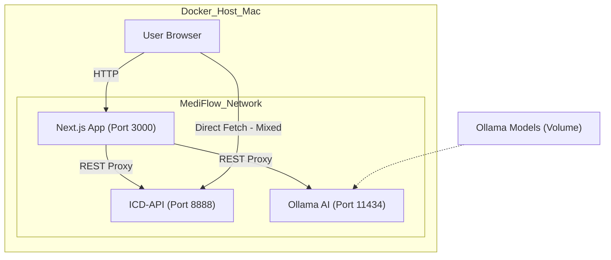
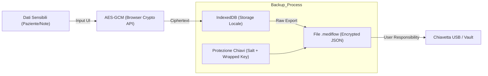

# MediFlow (Presentation)

Hi, I am Leo, a community care physician from Italy.
MediFlow started from a practical need: manage clinical data, therapies and notes with full local control, without cloud dependency by default.

MediFlow is a local-first medical record system focused on **privacy**, **speed** and **clinical usability**.
The base product is in Italian (AIFA references, local workflows), but the architecture is modular and open to adaptation.

MediFlow also draws inspiration from mature open-source healthcare projects (including OpenHospital), adapted to its own local-first and zero-knowledge direction.

## Core Philosophy

* **Privacy First**: patient data stays on device unless explicitly exported.
* **Speed by Design**: local-first architecture keeps interactions immediate.
* **Clinical Focus**: tools built around real daily workflows.

---

## Compliance & GDPR (Work in Progress)

The project follows **Privacy by Design** and **Data Minimization** principles:

* **Local-first architecture**
* **Encryption at rest**
* **Zero-knowledge key handling**

Full GDPR compliance also depends on legal and organizational processes outside software scope.
MediFlow provides technical controls and workflows, but does not replace legal validation by the Data Controller.

---

## Key Features (v0.3.x)

### 1. Onboarding and Security

A new **Onboarding Wizard** guides you through the initial setup:

* **Privacy acceptance** flow
* **Doctor/clinic profile setup**
* **Mandatory secure PIN** for key protection

### 2. Data Integrity (Backup and Restore)

* **Export**: encrypted backup to `.mediflow` JSON.
* **Import**: restore flow for device migration (destructive operation).

### 3. AI and ICD Integration

* **ICD-11 and ICD-9** support.
* **Local AI (Ollama)** for summaries/OCR without cloud egress by default.

---

## Process Architecture

### System Orchestration (Docker)

Container interactions in the all-in-one deployment:

```mermaid
graph TD
    subgraph Docker_Host_Mac
        subgraph MediFlow_Network
            App["Next.js App (Port 3000)"]
            ICD["ICD-API (Port 8888)"]
            Ollama["Ollama AI (Port 11434)"]

            App -->|REST Proxy| ICD
            App -->|REST Proxy| Ollama
        end
        
        Browser["User Browser"] -->|HTTP| App
        Browser -->|Direct Fetch - Mixed| ICD
    end

    Volume["Ollama Models (Volume)"] -.-> Ollama
```

### Security and Privacy Cycle

Local-first flow used for data protection:

```mermaid
graph LR
    Input["Dati Sensibili (Paziente/Note)"] -->|Input UI| Encrypt["AES-GCM (Browser Crypto API)"]
    Encrypt -->|Ciphertext| Store["IndexedDB (Storage Locale)"]
    
    subgraph Backup_Process
        Store -->|Raw Export| JSON["File .mediflow (Encrypted JSON)"]
        Keys["Protezione Chiavi (Salt + Wrapped Key)"] --> JSON
    end

    JSON -->|User Responsibility| Safe["Chiavetta USB / Vault"]
```

---

## Technical Overview

* **Stack**: Next.js, Tailwind CSS, local services.
* **Architecture**: local hybrid model (app + local APIs/services).

## Getting Started (Developers)

1. **Clone**: `git clone https://github.com/Wulfgardr/mediflow.git`
2. **Install**: `npm install`
3. **Run**: `npm run dev`
4. **Setup Drugs**: Go to Settings -> Upload `confezioni.csv` (available from AIFA).

## License

MIT License.
